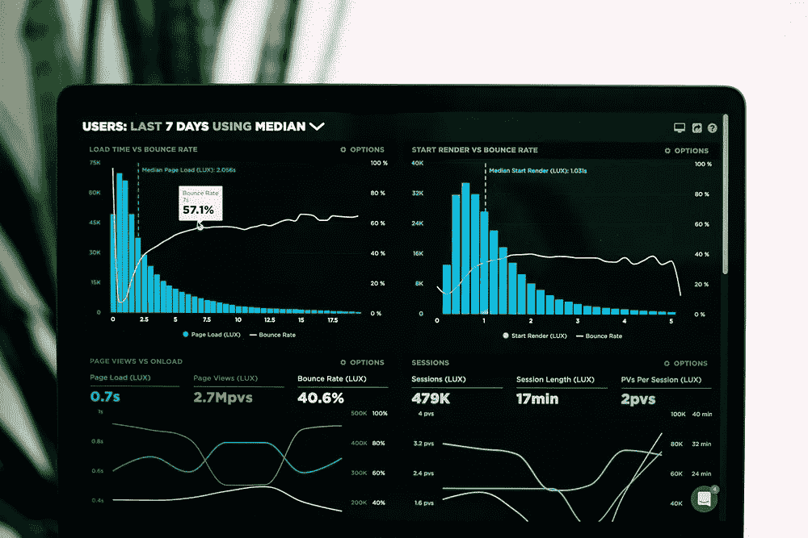

# 我如何让数据影响选择

> 原文：<https://towardsdatascience.com/how-i-let-data-influence-choices-a7a257bfa825?source=collection_archive---------69----------------------->

## [动手数据](http://www.medium.com/tag/hands-on-data/)

## 利用数据和常识做出决策。

由[拍摄的照片](https://unsplash.com/@garri?utm_source=unsplash&utm_medium=referral&utm_content=creditCopyText)在 [Unsplash](https://unsplash.com/s/photos/data-decision?utm_source=unsplash&utm_medium=referral&utm_content=creditCopyText)

几年前，我一头扎进了“数据即服务”( data as-a-service，DaaS)领域——就像“软件即服务”,但交付的是原始或半丰富的数据。那时，我在执行深入的数据分析方面经验很少，也不太了解我们的客户角色。我带来的是解决客户问题的愿望和倾听的意愿。

我将在本文中解释的内容并不特定于 DaaS。然而，我要说的是，我专注于数据的经历促使我比其他情况下更快地理解了这些细微差别的重要性。

这是我以产品为导向的尝试，来解释我是如何看待数据并利用数据做决策的。

由 [Celpax](https://unsplash.com/@celpax?utm_source=unsplash&utm_medium=referral&utm_content=creditCopyText) 在 [Unsplash](https://unsplash.com/s/photos/data?utm_source=unsplash&utm_medium=referral&utm_content=creditCopyText) 上拍摄/由 [Luke Chesser](https://unsplash.com/@lukechesser?utm_source=unsplash&utm_medium=referral&utm_content=creditCopyText) 在 [Unsplash](https://unsplash.com/s/photos/data?utm_source=unsplash&utm_medium=referral&utm_content=creditCopyText) 上拍摄

# 做决定

人脑对这部分的理解可能比我们意识到的要好。每天，你都会根据一天中发生的外部刺激——“数据”——做出许多决定。不幸的是，在记录、证明和验证您的决策的企业环境中，您需要理解并向您的利益相关者阐明这个过程。

近年来，数据的重要性和丰富性变得更加明显，以至于数据被称为“新石油”。数据是一种原始资源，如果利用得当，可以帮助您生产出更好的成品。为了实现这一结果，我将介绍两个版本的数据影响决策(我相信还有更多，请随意分享)。

## 基于数据的决策

基于数据的决策为您提供了灵活性，不仅包括定量分析，还鼓励您包括定性分析。我经常发现自己处于产品开发的十字路口，在这种情况下，选择追求哪种功能/增强功能/新产品时，我所拥有的帮助我做出决定的硬数字和洞察力并不支持。

然而，每枚硬币都有两面，重要的是不要只见树木不见森林——我敢说，也许我们已经采访了愿意承诺购买这种新产品的客户或愿意续订的现有客户。如果我们增加了一项新功能，增加了他们对我们产品的投资回报，就要坚持追加销售。

## 数据驱动的决策

简而言之，数据驱动决策是指让数据为您驱动决策。在做出数据驱动的决策时，您依赖定量结果来确定手头问题的最佳解决方案。在这种情况下，假设我已经推出了一个新的特性版本，并将其推广到我们 20%的用户群。在我们运行和测试这一功能的过程中，我们看到了每用户平均收入的显著增长。数字不会说谎，证明这种增强似乎是显而易见的。

亚历山大·辛恩在 [Unsplash](https://unsplash.com/s/photos/data-compare?utm_source=unsplash&utm_medium=referral&utm_content=creditCopyText) 上的照片

# 你如何决定？

事实证明，数据有利于决策，因为它是有效的！通常最好不要用心去决定。

## 这很难。

根据我在这里给出的基本定义和例子，你可能会认为调用基于数据的决策方法成为你想要做出的不一定与数字一致的任何决策的理由。需要记住的重要一点是，即使你选择执行决策并调整结果，决策也应该基于数据。以数据为基础至少会帮助你克服你自己的偏见，这种偏见有时是不可避免的。

关于比我聪明的人如何做决定，还有很多更深入的讨论——就在媒体上，比如[凯西·科济尔科夫](https://medium.com/u/2fccb851bb5e?source=post_page-----a7a257bfa825--------------------------------) ( [决策智能介绍](/introduction-to-decision-intelligence-5d147ddab767))的这篇关于决策智能的文章。

> [决策智能](http://bit.ly/quaesita_gcpp)是一门[的新学科](http://bit.ly/di_wiki)与选项选择的所有方面有关。它将最好的应用[数据科学](http://bit.ly/quaesita_datasci)、社会科学和管理科学汇集到一个统一的领域，帮助人们使用[数据](http://bit.ly/quaesita_hist)改善他们的生活、业务和周围的世界。

决策智能通过认识到数据驱动的决策的局限性，确保您在利用数据为您的业务做出最佳决策时不遗余力，从而帮助照亮了基于数据的决策等方法。

这篇文章并不全面，我很乐意听到您对未来主题的意见或建议。欢迎在评论中分享。

# 关于我

我致力于解决问题、推动卓越运营和推出产品。作为一名专注于 DaaS 的产品经理，我还为致力于通过专注于产品的增长和数据价值实现价值最大化的组织提供咨询。[伸出手来继续对话或一起工作。](https://www.hornetsnest.io/contact/)