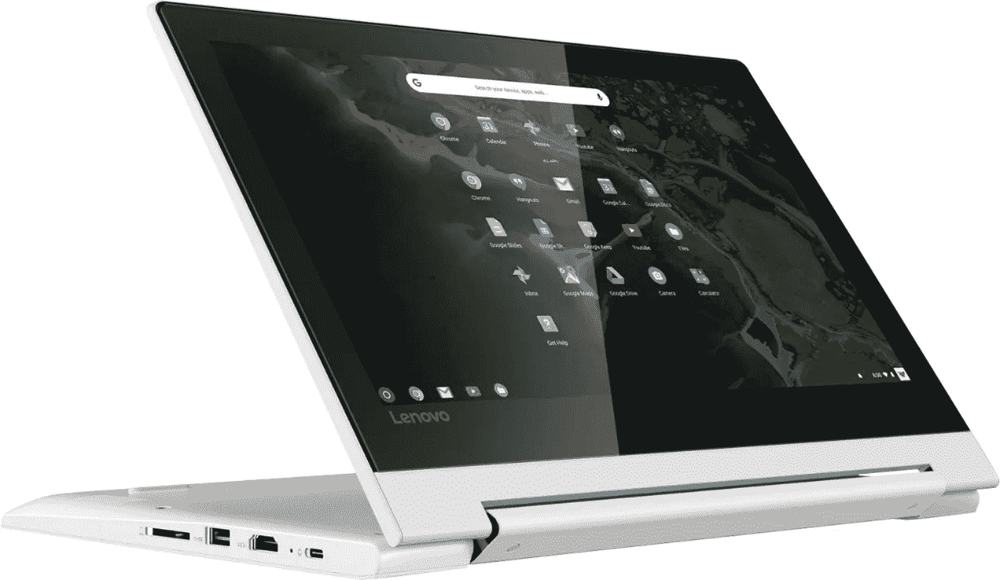
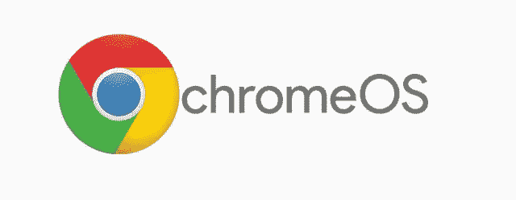
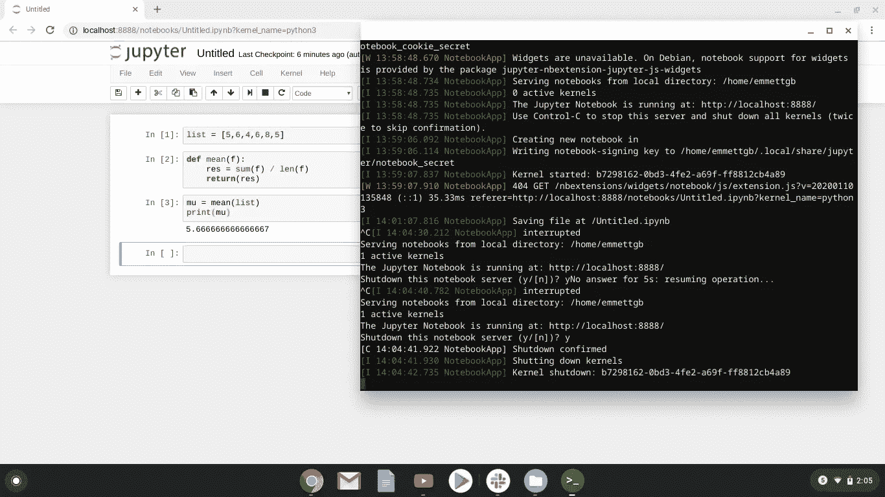
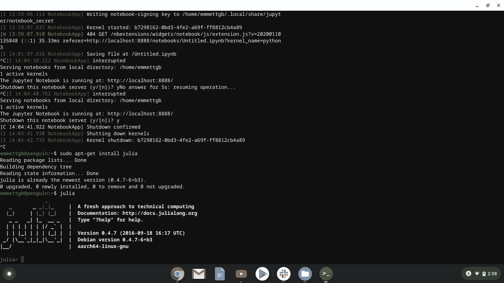
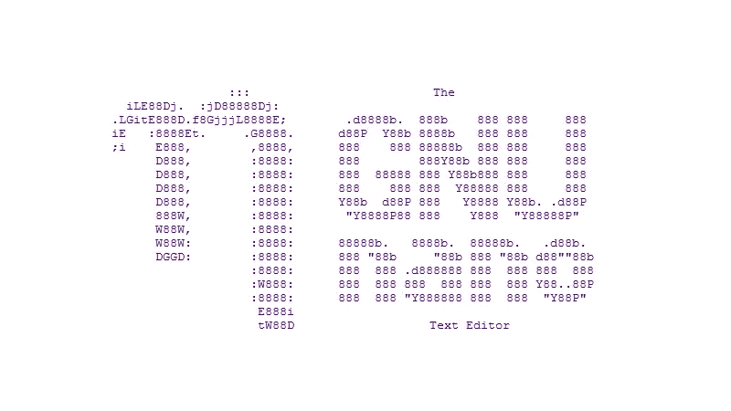

# 我如何让 ChromeBook 成为我的数据科学日常驱动程序

> 原文：<https://towardsdatascience.com/how-i-made-a-chromebook-my-data-science-daily-driver-af273ee47828?source=collection_archive---------13----------------------->

## 在 ChromeOS 中利用 Linux 和 android 应用


# 获得 Chromebook

近年来，hromeOS 已经取得了长足的进步，已经成为购买运行 Windows 10 的传统、笨重、昂贵的笔记本电脑的更可行的选择。最近，Chromebooks 获得了从谷歌 Play 商店安装和使用安卓应用的权限。对于充分优化的应用程序来说，这可能非常棒；获得全屏、完全正常的 android 应用程序体验，就好像你在使用一个带有专用键盘的苹果 IPad 一样。正如你可能想象的那样，这些应用程序运行得相当好。Chromebook 处理器在很大程度上是标准 Android 手机处理器的强大竞争者，并且具有相同的基础架构 ARM64。

但是有了笔记本电脑，有很多需要做的事情是 app 做不到的。幸运的是，谷歌偏离 Linux 太远的问题已经在某种程度上得到解决，现在允许从基于 Debian 的仓库安装 Linux 应用程序。所以现在在 ChromeOS 中，我们可以兼容 Debian 仓库中的 ARM64 应用程序，以及 android 应用程序。

所以在寻找我的 Chromebook 时，这两个是我的大要求。笔记本电脑需要有 aptitude 包管理器(我每天使用的包管理器)，可能还需要能够运行 Android 应用程序。这两大功能只是 ChromeOS 最初自带的功能之外的功能。ChromeOS 的用户界面不是我最喜欢的，但绝对干净、漂亮、可用。



我的衣柜里放着大约 20 台不同时代的 Lenovo，Thinkpads，Yogas，所以显然当我在网上看到一台标价 30 美元的联想 C330 Chromebook 时，我抓住了这个机会。我不仅可以摆弄 Chromebook，还可以增加我的联想收藏！

联想 C330 是一款很棒的预算 Chromebook，虽然是 ABS 塑料，但是手感比较扎实。键盘还好，有点黏糊糊的，触控板很适合这个系统。这是一款敞篷车，就像我的 Yoga 910 一样，但可能是由于边框、尺寸和 Android 应用程序兼容性的原因，我实际上最终会在平板模式下使用笔记本电脑，而我的 Yoga 910 就不是这样了。此外，我讨厌这样说，但 USB-C/Thunderbolt-3 充电对我来说绝对是一个巨大的优势，因为我喜欢使用

> 一根电缆代表一切

## 我为什么想要 Chromebook

首先，应该指出的是，我是一个电脑收藏家和电脑狂热者。增加我的收藏总是一件很棒的事情。除此之外，我还是一个超级 Unix 迷和发行版迷。简而言之，我想要一个新的玩具来玩，但使用 Chromebook 也有一些关键的好处，这些好处是 Chromebook 名称中的主要部分。

电池寿命是许多 Chromebook 的重点，谷歌经常在 chrome book 广告中专门针对电池寿命。我选择的 Chromebook 充电速度很快，平均续航时间约为 10 小时。当然，这有一点不同，但与我目前的日常驱动程序相比，它通常会加倍运行时间。

此外，我使用很多 Google Play 服务，因为我也是安卓用户。Google Play 音乐，Google Play 电影，便利是肯定存在的，因为在我的日常驱动程序上，我无法从 Google Play 下载任何东西。

# 设置



开箱即用，谷歌已经在吹嘘他们的低级 API 和兼容层，要求你在谷歌账户上安装的 Android 应用程序安装到你的 Chromebook 上。在这些应用中，我选择了 Slack 和 Zoom，这两个应用是我每天经常使用的。这两个应用程序都可以在 Chromebook 上完美使用，所以幸运的是，看起来我们不需要更换它们中的任何一个。除了这些推荐的应用程序之外，第一个设置会将一个名为“Linux 应用程序”的小文件夹放入您的应用程序抽屉中，里面有一个终端应用程序。当然，这是我在 Chromebook 上做的第一件事，甚至是在打开谷歌 Chrome 之前。

快速设置会让您进入 Linux 终端，在那里您可以执行 bash 命令。在古典自然中，我输入的第一件事是

> 限位开关（Limit Switch）

这没有产生任何结果。好的，接下来我决定看看我们会有多有限，然后开始 CD。当我运行 cd 时..我可以访问整个/目录，尽管所有的文件都被 Google 隐藏了，所以你必须使用 ls -a 而不是 ls。此外，我们可以访问 apt，所以我继续进行了经典测试

```
sudo apt-get update && sudo apt-get full-upgrade
```

接下来，如你所料，我决定开始安装一些软件。我的第一个测试是 gedit

```
sudo apt-get install gedit
```

幸运的是，gedit 工作正常，甚至出现在 ChromeOS 的应用程序菜单中。不可否认的是，ChromeOS 的 GTK 主题让它与操作系统融合得非常好。

## 朱皮特

在我确定 apt 运行良好后，我决定继续追求 Jupyter 笔记本。它非常流畅，使用简单的

```
sudo apt-get install jupyter-notebook
```



运行笔记本服务器就像在您的终端上运行 jupyter-notebook 一样简单。显然，我喜欢 Python，但要成为我的日常驱动程序，这台电脑将需要朱莉娅。为了得到朱莉娅，这是同样的事情:

```
sudo apt-get install julia
```



而现在我们有了 Julia，但是有一个很大的问题…Julia 的最新版本是 1.2，而 ARM64 可用的 apt 中的最新版本是 0.4。因此，有一个非常严重的 Pkg bug，没有 Pkg REPL，很多包包括用于机器学习的车床都不能与这个版本的 Julia 兼容。

# 下一步:多建筑

幸运的是，我们在一个虚拟的 Debian 机器上，这意味着 GNU 自由软件的辛勤贡献者们将直接迎合我们。Debian Stretch 预装了 MultiArch，它很容易配置。不幸的是，我们将不得不从 aptitude 快速获取 nano 来编辑一些文本文件(或者你可以使用 gedit 或 vi，如果那更适合你的速度的话)。)



幸运的是，我们可以很容易地在 ChromeOS 上纳米到我们的资质来源列表中，因为第一步正是如此。

```
sudo nano /etc/apt/sources.list
```

对于 Apt 来说，在这里添加 Ubuntu 源代码可能不会有问题，但是我决定继续使用 Debian Stretch，将这一行添加到源代码文件的底部:

```
deb-src [http://deb.debian.org/debian](http://deb.debian.org/debian) stretch main
```

现在我们可以添加我们的新架构，我认为 i386 (32 位)比 AMD64 (64 位)更容易工作。我们可以很容易地添加它

```
sudo dpkg --add-architecture i386
```

然后我们需要更新和全面升级:

```
sudo apt-get update && sudo apt-get full-upgrade
```

但是当试图为 i386 安装 julia 时，我们遇到了一个新问题:

> 属国

虽然许多应用程序可以很好地安装在我们现有的应用程序上，而且我们可以用它们来修复依赖性错误

```
sudo apt-get build-dep julia
```

这在这里是行不通的，因为对于 arm64 兼容性来说，不存在依赖兼容性文件。无论如何，我仍然决定构建我们已经可用的依赖项。经过一段荒谬的时间后，我们会遇到一个仍然没有解决的依赖问题。在这种情况下，你唯一需要考虑的是把我们的软件包更新到最新版本，也就是 Debian 10/buster。当然，出于稳定性考虑，不建议这样做，也不能保证这样做一定会奏效，但这可能是安装应用程序的最后一次尝试。因此，我们将再次编辑我们的源文件，但这一次我们将把所有提到“stretch”的地方都改为“buster”。写出来，关闭 nano，更新你的资源。

现在我们应该避免通过 apt 得到一个 HTTP 错误，所以我们将升级我们的发行版。环境似乎是虚拟的，所以幸运的是，我们可以完全独立于 ChromeOS 升级我们的发行版，而不需要内核或 grub 更新:

```
sudo apt-get dist-upgradenano /etc/apt/sources.list
sudo apt-get update && sudo apt
```

这将是我们最后一次尝试使用 MultiArch 运行我们的应用程序，所以在一个完美的世界里，这将是让您的应用程序工作的事情。对于 Julia，我能够使用 Debian 10 Buster 库让 amd64 Julia 与 MultiArch 一起运行。所以现在我可以正式把我的 Chromebook 命名为我的

> JuliaBook

# 结论

ChromeOS 真的已经从上网本的历史中走了很长一段路。这是一件伟大的事情，因为它使 Chromebooks 成为一个可行的替代品，而以前它不是。现在，您有可能使用 Kdenlive、Gimp 和开放广播软件等应用程序进行多媒体应用，几乎可以使用每种编程语言、libre-office，甚至 Gparted 等系统管理器。我看到了很多关于安装的讨论。deb 文件从网上安装的，还有用 arm64 给的简写，但是从来没有人试过用 MultiArch！所以我希望 Chromebook 的用户能够从他们的 Chromebook 中获得更多！