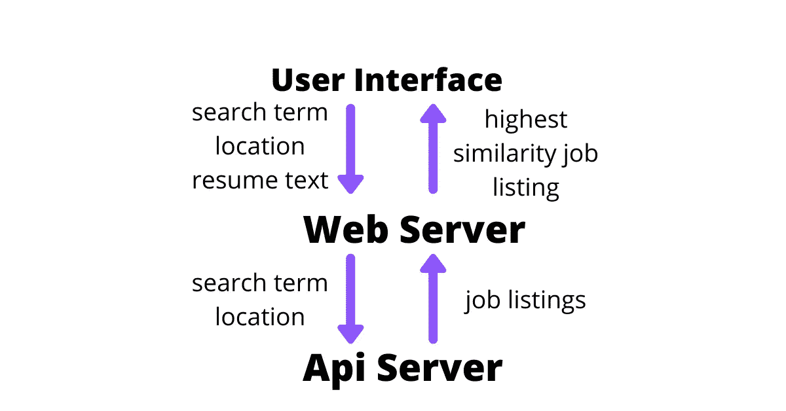
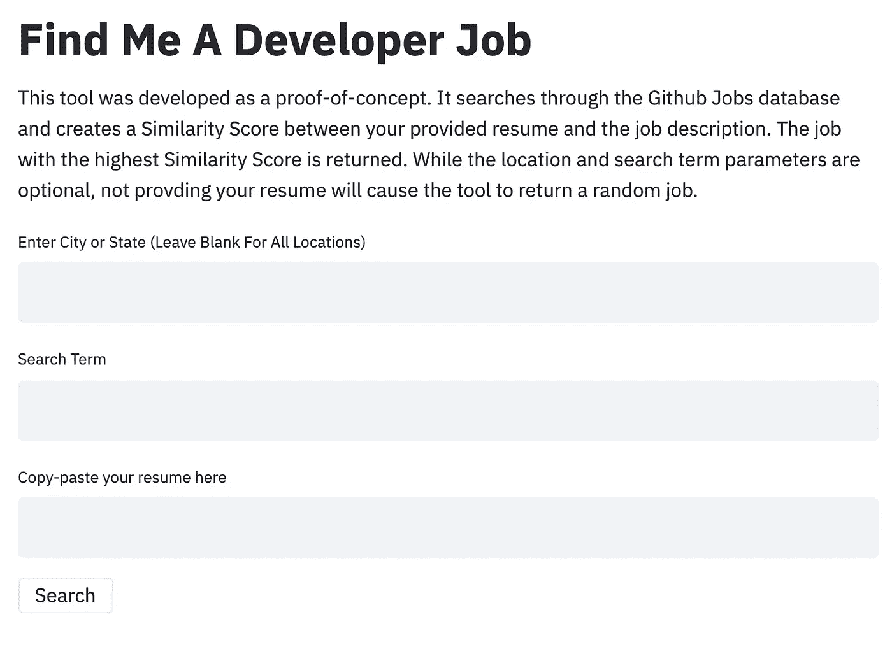
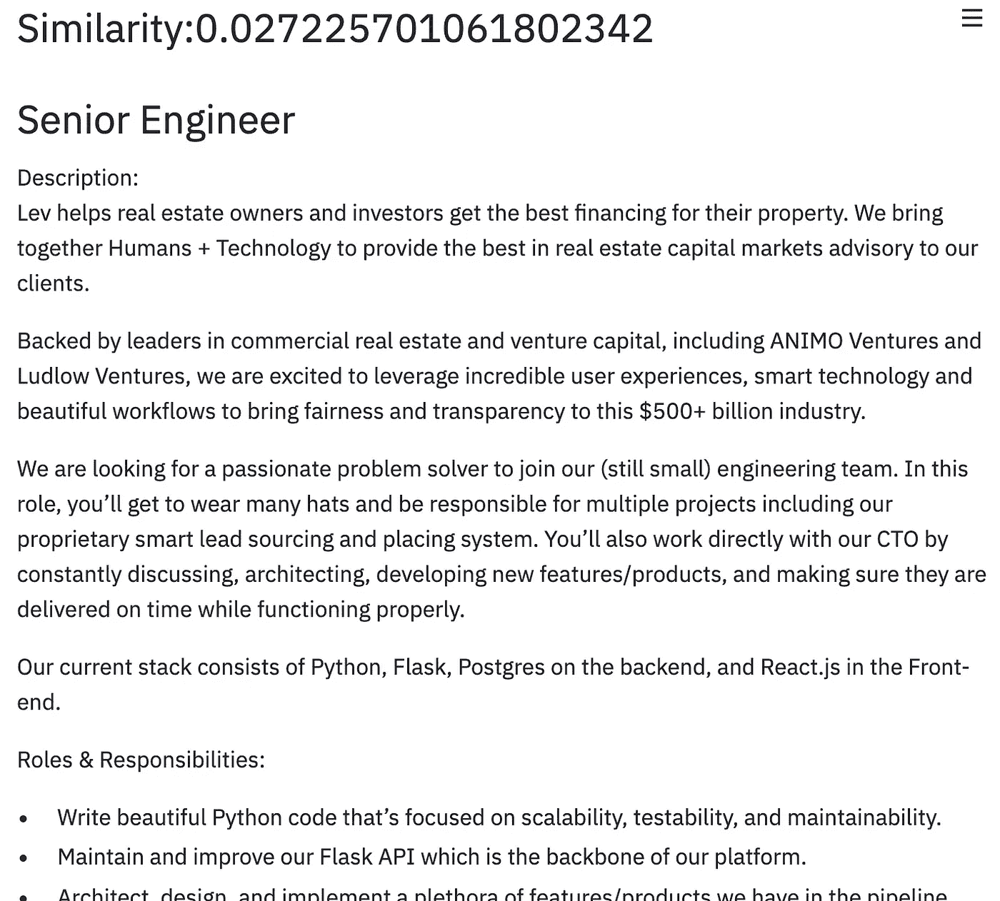

# 我如何制作智能求职网络应用程序

> 原文：<https://towardsdatascience.com/how-i-made-an-intelligent-job-search-web-app-8676edc74eb5?source=collection_archive---------71----------------------->

## 使用简历寻找相关的工作信息


作者图片

# 找工作糟透了

任何找工作的人都可以告诉你，这是一项艰苦的工作。搜索相关职位，更新你的简历和 Linkedin，申请工作，写求职信，面试需要大量的时间和精力来完成。我经常听到的一句话是:“求职是一份全职工作。”

找工作最费时费力的一个方面就是寻找相关的工作职位。这通常需要经常浏览网上的招聘信息，浏览相关的职位名称，阅读职位描述，并确定这份招聘信息是否与你的资历相关。因为这些数据大部分都可以在网上获得，所以这项任务实现自动化的时机已经成熟。

# 应用概述

[*给我找一份开发者工作*](https://mitchelltelatnik.com/find-me-a-developer-job/) 是一款网络应用程序，旨在搜索在线职位公告板，并根据特定申请人提供的简历确定哪些职位发布与他们最相关。相关性是通过相似性得分来确定的，相似性得分表明简历与职位发布的相似程度。

这个应用程序是一个简单的，准系统的概念验证，将不断增加和改变。目前，该应用程序仅通过 Github 求职板进行搜索，是为搜索开发人员职位的申请人量身定制的。

由于 Github 上发布的职位数量很少，这个工具对于详尽的职位搜索不是很有用。但是，随着更多职务公告板的添加，该值将会增加。

这个应用程序目前还使用一个简单的相似性算法。这个算法有很大的改进空间，并且将成为未来改进的一个关键特性。

# 体系结构

[*给我找个开发者工作*](https://mitchelltelatnik.com/find-me-a-developer-job/) 是用 Python 和 Streamlit 包*开发的。* Streamlit 是一个令人惊叹的 python 包，允许您快速轻松地创建 web 应用程序——尤其是机器学习工具。如果你本质上是一个数据科学家，而不是像我一样的网页设计师，我强烈推荐你点击这里查看 Streamlit。

除了 Streamlit，pandas 和 numpy 还用于数据处理、api 调用请求、JSON 用于解析 API 返回，difflib 用于相似性算法。

# 数据管道



作者图片

web 应用程序有三个主要组件:用户界面(即前端)、web 服务器(即后端)和 API 服务器。

## 用户界面(前端)

用户界面(如下所示)提示用户输入位置、搜索项和简历文本。这三个输入将被传递到服务器后端。位置和搜索词都是可选参数，但是，不提供简历将导致应用程序选择随机工作，因为它没有任何相似性得分来排名。



作者图片

## Web 服务器(后端)和 API 服务器

在接收到位置、搜索词和简历之后，服务器将构造一个对 Github job board API 的 HTTP 调用。该调用由位置和搜索项参数构成。然后，API 将返回一个 JSON 字符串，其中包含符合参数的作业。使用 JSON 库读入 JSON 字符串，并将其转换为 pandas 数据帧进行处理。然后，服务器将每个职位的描述与简历进行比较，并计算相似性得分。然后，具有最大相似性得分的职务被传递到用户界面，显示职务名称、描述和申请方法(如下所示)。



作者图片

# 云托管

在 Streamlit 中创建一个本地 web 应用程序是很棒的，但是，允许其他人轻松访问该应用程序也很重要。为了让人们通过我的[网站](https://mitchelltelatnik.com/find-me-a-developer-job/)访问这个工具，我把这个应用程序部署到一个免费的 Heroku 服务器上。为此，需要四个文件:应用程序本身、设置文件、Procfile 和需求文件。

## 安装文件

安装文件是一个 sh 文件，包含 web 服务器的说明。我使用的安装文件如下所示。

```
mkdir -p ~/.streamlitecho "[server]
headless = true
port = $PORT
enableCORS = false
" > ~/.streamlit/config.toml
```

## Procfile

Procfile 声明应该运行哪些进程。我的 Procfile 如下所示。

```
web: sh create_config.sh && streamlit run app.py
```

## 需求文件

需求文件是一个文本文件，声明在服务器上运行应用程序需要哪些 python 包。我的需求文件如下所示。

```
streamlit==0.61.0
numpy==1.17.2
requests==2.22.0
```

# 讨论

[](https://mitchelltelatnik.com/find-me-a-developer-job/)*给我找一份开发人员的工作是一个基本的概念验证。虽然我希望这个项目更进一步，并开始用这个工具提供更多的价值，但 Python 和 Streamlit 是不可或缺的，它们让我能够快速建立并运行一个原型，以收集反馈并进行迭代改进。如果你想测试一下[应用程序](https://mitchelltelatnik.com/find-me-a-developer-job/)，我会欣然接受你的任何反馈！*