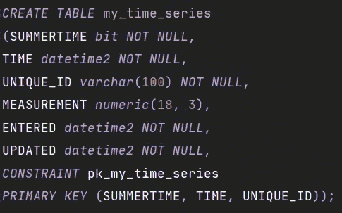
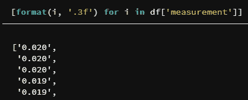

# 如何使用 Pyodbc 将 SQL Server 的插入速度提高 100 倍

> 原文：<https://towardsdatascience.com/how-i-made-inserts-into-sql-server-100x-faster-with-pyodbc-5a0b5afdba5?source=collection_archive---------2----------------------->

## 如何修复向 SQL Server 加载数据时与“fast_executemany”相关的问题


照片由 [Nextvoyage](https://www.pexels.com/@nextvoyage?utm_content=attributionCopyText&utm_medium=referral&utm_source=pexels) 从 [Pexels](https://www.pexels.com/photo/twisted-building-during-nighttime-1470405/?utm_content=attributionCopyText&utm_medium=referral&utm_source=pexels) 拍摄

我最近一直在尝试用 Python 将大型数据集加载到 SQL Server 数据库中。通常，为了用`pyodbc`加速插入，我倾向于使用显著加速插入的特性`cursor.fast_executemany = True`。然而，今天我经历了一个奇怪的错误，并开始深入研究`fast_executemany`到底是如何工作的。

# 我的数据框架和 SQL Server 表的架构

当我试图将我的数据加载到 SQL Server 中时，我得到了错误:*“将数据类型 varchar 转换为 numeric 时出错。”*

这个错误让我非常困惑，因为我的 Pandas 数据帧的数据类型与 SQL Server 表中定义的数据类型完全匹配。特别是，我试图加载的数据是一个带有时间戳和度量列+一些元数据列的时间序列。

```
*My dataframe schema:
summertime     bool
time           datetime64[ns]
unique_id      object
measurement    float64
entered        datetime64[ns]
updated        datetime64[ns]*
```

**SQL Server 表**有一个与此类似的模式:



SQL server 表的架构

如果你看看数据类型，它们完全匹配。

# "将数据类型 varchar 转换为数字时出错"

为了将这些数据快速加载到 SQL Server 数据库中，我使用`df.values.tolist()`将 Pandas 数据帧转换为一个列表列表。为了将我的数据接收到数据库实例中，我创建了:

*   SQL Server 数据库实例的连接对象
*   光标对象(*来自连接对象*
*   和`INSERT INTO`声明。

注意，在第 14 行，我们使用了`cursor.fast_executemany = True`特性。执行脚本时，我得到了以下错误(*带版本:* `*pyodbc==4.0.23*`):

```
ProgrammingError: [Microsoft][ODBC Driver 17 for SQL Server][SQL Server] Error converting data type varchar to numeric. (SQLExecute)
```

**为什么** `**pyodbc**` **要把** `**varchar**` **的东西转换成** `**numeric**` **？！当我注释掉第 14 行以便在没有`fast_executemany`特性的情况下使用`cursor.executemany()`时，脚本运行得很好！我能够毫无问题地插入我的数据。**

唯一的问题是没有`fast_executemany`，很慢。

# `fast_executemany"`深入挖掘

根据 Pyodbc Wiki [1]:

> `fast_executemany`可以通过大大减少到服务器的往返次数来提高`executemany`操作的性能。

这是我想解决这个问题的主要原因。根据来自`pyodbc`库[2]的 Github 问题，`pyodbc`内部**将所有十进制值作为字符串**传递，因为一些**差异和与各种数据库驱动程序**使用的小数点相关的错误。这意味着当我的数据具有值`0.021527`或`0.02`时，这两个值可能都不被接受，因为我的 SQL Server 数据类型被指定为`NUMERIC(18,3)`。另外，`pyodbc`需要字符串而不是浮点，所以正确的值应该是`'0.021'`，也就是说，字符串(*不是浮点！*)逗号后面正好有三个数字。

所以我的解决方案可以归结为增加这一行:

这一行只是将浮点数转换成字符串，用三个小数点表示数字:



对我来说，使用“fast_executemany”和 floats 是一个“奇怪”的解决方案

# 修复“fast_executemany”的好处

在修复了这个问题之后，该脚本的运行速度比不使用第 14 行(`cursor.fast_executemany = True`)时快了 100 倍。请注意，它之所以如此之快，是因为它在将数据加载到 SQL Server 之前将整个数据加载到内存中，所以如果您遇到内存不足错误，请考虑分块加载*。*

# 结论

总之，通过将我的 float 列转换为与 SQL Server 表中定义的小数点数字完全相同的 string，我能够修复*“将数据类型 varchar 转换为 numeric”*的错误。令我颇感意外的是，`pyodbc`并没有在引擎盖下处理这个问题(*，或者可能在最近的 Pyodbc 版本中已经解决了？*)。

如果你觉得有用，请关注我，不要错过我的下一篇文章。

**资源:**

[1][https://github . com/mkleehammer/pyo DBC/wiki/Features-beyond-the-d b-API](https://github.com/mkleehammer/pyodbc/wiki/Features-beyond-the-DB-API)

[https://github.com/mkleehammer/pyodbc/issues/388](https://github.com/mkleehammer/pyodbc/issues/388)