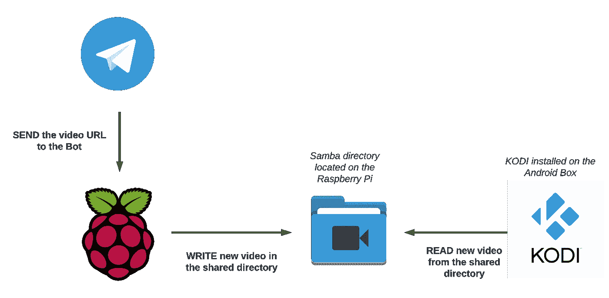

# 我如何用电报机器人让我的女朋友开心

> 原文：<https://towardsdatascience.com/how-i-made-my-girlfriend-happy-with-a-simple-telegram-bot-2be8e4b150e7?source=collection_archive---------17----------------------->

## 在我的树莓 Pi 上构建电报机器人的短暂旅程


[JESHOOTS.COM](https://unsplash.com/@jeshoots?utm_source=medium&utm_medium=referral)在 [Unsplash](https://unsplash.com?utm_source=medium&utm_medium=referral) 上拍照

在这篇文章中，我将解释我设计的电报机器人的实现细节:**家庭下载器**。

家庭下载器允许用户轻松地从互联网上下载视频，然后在他们喜欢的任何设备上观看。它是由用户的简单请求触发的，用户将请求发送到所选的 URL。收到文本后， **home-downloader** 会检查不需要的用户。然后，它将相关视频下载到一个目录中，该目录存储在 Raspberry Pi 上，可通过本地网络访问。最后，Pi 会将视频播放到用户选择的屏幕上，而用户则可以尽情享用一些受之无愧的爆米花。

# 问题是

我家里有两台电视，一台是*智能*的，第二台……没那么多。为了帮助第二个(主要由我的女朋友使用)跟上新的花哨技术，我买了一个小米 Mi Box S。然而，仍然缺少一些东西:我的女朋友不为所动，尽管她可以访问任何发明的媒体服务。问题:她想播放她在网上找到的视频，但有些视频太重，无法通过 Mi Box 打开。Chromecast 也不是一个可行的选择，因为它不允许她从这样的网站上播放视频！

> 废话！这让我陷入了困境…当我的全新 PS5 到来时，我该怎么办？谁会宣称智能电视的所有权？！

所以我决定解决这个问题，并告诉她

# 解决方案

好了，让我们建立一些约束/要求:

*   我不想在这上面花钱，我想用家里现有的东西。
*   任何一种**用户交互**都应该尽可能流畅，我女朋友不是计算机科学家，也不是科技爱好者:)
*   **Python** ！

我向工程师提出的解决方案必须解决以下问题:

*   给我一个网址，我能下载视频吗？
*   Android 盒子将如何访问下载的视频？
*   以上两点如何实现自动化？
*   最好的用户界面是什么？

原来下载网络视频最简单的方法是 youtube-dl。这款软件的优势之一是它不仅适用于 YouTube:)

> tbh，不是每个网站都能用的，不过好在兼容的网站列表还挺大的。是啊。

我决定从我的 Raspberry Pi (RPI)运行 *youtube-dl* 并将视频保存在 RPI 上托管的文件夹中，并与 [**桑巴**](https://www.samba.org/samba/what_is_samba.html) 共享。这个文件夹对于位于同一个本地网络的 Android Box (AB)是可见的。

现在仍然缺少一个重要的部分:从 AB 读取视频。在这一点上，我很确定 VLC 会成功。从 AB 访问 Samba 目录是非常简单的……除非你使用的是 VLC 桌面！因此，试图将 AB 和 VLC 合并是一个巨大的混乱…事实上，我发现这是一个非常著名的，仍然没有解决的问题。但是后来 [**KODI**](https://kodi.tv/) 出来帮我:易如反掌:)

至此，我才明白 **home-downloader** 应该是一个**电报机器人**。我懒得实现任何接口/API，但也不想把工作外包给:D 电报公司！因此，我决定让用户与电报机器人互动，也就是通过简单的聊天。毕竟，Telegram 已经提供了实现这一点所需的所有 API。

你可以在下面看到完整的建筑图:



由作者创建

# 履行

我选择的语言是 Python 3.8。

该项目由两个*组成。py* 脚本和一个*。json* 配置文件:

*   它存储了 Bot 令牌和其他一些我们不想硬编码到 python 脚本中的信息。
*   **modules.py** 它包含三个函数。
*   **home _ downloader . py**main。

在深入了解代码的本质之前，这里是我的设置:

*   我使用了一个名为 [python-telegram-bot](https://github.com/python-telegram-bot/python-telegram-bot) 的不错的库，它为原始的电报 API 提供了友好的接口。
*   我在我的 [Raspberry Pi 2 Model B](https://www.raspberrypi.org/products/raspberry-pi-2-model-b/?resellerType=home) 上运行[拱臂](https://archlinuxarm.org/)，并且我按照这个[拱臂](https://wiki.archlinux.org/index.php/samba)提供的指导方针设置桑巴。
*   我之前用*机器人父亲机器人*注册了一个电报机器人，目的是引导用户完成注册。[官方指南](https://core.telegram.org/bots)会给你一个相当透彻的介绍。

## 配置文件

在这里，我们保存:**a)**home-downloader Bot 的秘密令牌； **b)** 可以与机器人交互的用户列表， **c)** 主人(这里是我)与机器人聊天的 ID。

关于 **c)** ，出于隐私考虑，我不想让任何未经授权的用户进入！因此，当新用户开始与 **home-downloader** 聊天时，它会检查该用户是否属于预先确定的白名单。

**备注**:在部署机器人之前，所有者必须读取他和机器人之间的聊天 ID 并保存到配置文件中。这是每次新用户开始与机器人聊天时，从机器人向主人发送直接消息的唯一方式:**电报机器人不能在给定用户名的情况下发送直接消息。**

要找出聊天 ID，只需与机器人开始一个新的对话，并在我们将要看到的一个函数中打印这个属性:

```
update.message.chat_id
```

## 模块

该项目包括三个主要功能。

首先，我们设置了一个日志记录器:当你在后台运行几天时，检索关于脚本执行的信息是很有用的！其次，我们打开*。json* 配置，这样项目的所有功能都可以看到它。

下面的函数是 *youtube-dl* 的包装器，由*子进程*执行。*子进程*库允许您从 Python 运行 bash 命令并返回输出。执行的结果用于确定视频是否被正确下载。

现在我们必须绑定聊天动作和触发电报机器人的命令。正如我上面提到的，每当一个新用户开始一个对话时，以及当一条新消息被发送时，这个机器人应该被触发。

**欢迎**功能在每次用户开始聊天时打印一条欢迎消息(即通过习惯的 */start* 命令)。而且，当前聊天的用户的用户名随后被发送给主人(我！)，在 *config.json* 文件中定义。

最后，**incoming _ message _ action**函数对新消息的处理进行编码。对每条消息进行解析，以发现 URL(第 8–11 行)。

如果 URL 被批准，该函数将检查网站域(第 14 行):事实上，我可能希望只允许某些网站被用作来源。原因很简单:我不想让我的 RPI 在没有我的允许下下载数十亿字节的资料！

你可能已经注意到函数 **incoming_message_action** 和 **welcome** 有一些共同点。首先，它们接受两个名为*更新*和*上下文*的参数，这两个参数包含触发机器人的用户的信息和聊天消息。其次，它们都共享这段代码:

```
if update.message.chat.username not in config["valid_users"]:
    return False
```

上面代码片段的目的是检查与聊天交互的用户是否被允许这样做。

> 这是将 bot 的使用限制在特定用户范围内的唯一方法。希望 Telegram 能添加一个合适的特性来做到这一点。

## 家庭下载器

**home_downloader.py** 把我们目前看到的内容汇总在一起。

机器人被初始化，处理程序基于我们到目前为止看到的函数被创建。

最后，通过调用函数 **start_polling** 来启动 bot。

# 结论

在本文中，我想展示我如何处理现实生活中的问题以及我实现的解决方案。我试图强调每个决定背后的创造过程。

这是项目的 GitHub 链接。由于这是一项正在进行的工作，一些代码可能与本文中的略有不同:我已经在开发一些新的特性和改进。无论如何，上面的代码是你构建自己的 Bot 并根据你的需要定制它所需要的全部。

## 特别感谢阅读和评论这篇文章草稿的人们:

加布里埃尔·约马佐和克里斯蒂安·孔特雷拉斯·坎帕纳