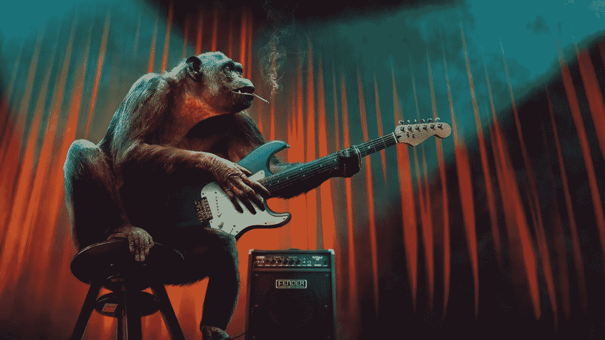

# 我是如何制作出世界上第一首 100%人工智能歌曲的

> 原文：<https://towardsdatascience.com/how-i-made-one-of-the-worlds-first-100-ai-songs-45da7297075c?source=collection_archive---------36----------------------->

## 歌词、音乐和人声都是在没有人工参与的情况下创作出来的



图片来自[皮克斯拜](https://pixabay.com/photos/music-concert-monkey-guitar-stage-3507317/) (CC0)

你可能听说过“人工智能音乐”这个术语，但你可能从未真正想过它的含义。以下是大多数人的期望:

Aiva 的一首摇滚歌曲

这首令人惊叹的人工智能音乐是由一家名为 Aiva 的公司创建的，该公司使用尖端的机器学习技术来创建这样的曲调。也有人工智能乐队使用类似的机器学习程序在网上发布伟大的音乐。但是，你可能没有意识到，这首歌的原始版本听起来一点也不像你听到的。他们通常使用音乐编辑软件来极大地改善人工智能提出的东西。

AI 的主要输出是旋律，通常是 MIDI 钢琴音轨的形式。当你开始尝试让电脑自动添加其他乐器时，问题就来了。它对节拍没有很好的感觉，也不知道如何混合各种乐器来跟随钢琴的旋律。更糟糕的是，MIDI 文件大部分时间都有非常计算机化/虚假的声音，就像旧的视频游戏音乐。你绝不会把它和你可能在收音机里听到的一首真正的歌混淆。

因为所有这些，人工智能音乐公司和人工智能乐队通常混合使用人类输入和人工智能输入(参见这个[谷歌博客帖子](https://artsandculture.google.com/theme/12-songs-created-by-ai-barbican-centre/FwJibAD7QslgLA?hl=en)中的一些好例子)。到目前为止，我所谈论的甚至没有涉及到让人工智能写歌词和唱歌的所有问题。

为了便于比较，这是我的人工智能杰作，电脑创造了一切(歌名、歌词、旋律、音乐和人声):

我的一首人工智能创作的歌曲

是的，太糟糕了。不过，我没想到会进入前 40 名。重要的是，这是我所知道的为数不多的从头到尾 100%使用人工智能制作的歌曲之一。你可以在我的[人工智能音乐网站](https://boredhumans.com/music.php)上听其中的 10 首歌，还可以查看歌词。

我是这样做的:

音乐是用谷歌的开源软件自动生成的。具体来说，我使用了预先训练的“三重奏”模型，正如他们在 [MusicVAE 博客帖子](https://magenta.tensorflow.org/music-vae)中所描述的。

歌词是使用开源的 [GPT-2 简单的](https://github.com/minimaxir/gpt-2-simple)自然语言程序编写的，我在我的文章[如何创建一个关于这个](/how-i-created-a-lyrics-generator-b62bde13badb)[歌词网站](https://boredhumans.com/lyrics_generator.php)的歌词生成器中描述了我对诗歌和歌词的训练。歌名的选择是基于各种非人工智能的规则，大多与歌词中使用最多的台词有关。

人声是最难的部分之一。它必须检测音乐中旋律的音高，将文本转换为语音，并调整语音以匹配旋律的音符。最重要的是，它必须努力找出虚拟歌手应该在哪里说出每个单词，以保持节拍。

还有一个问题是，我不能简单地将 MIDI 音乐文件直接输入到声乐合成程序中。首先，我必须将原始的 MIDI 文件转换成新的 MIDI 文件，其中只有一个通道包含钢琴部分，因为这通常是歌手需要遵循的旋律。我使用了一个叫做[香蕉分裂](https://github.com/timwedde/banana-split)的开源程序来完成这个任务。

接下来，我使用一个名为 [midi2voice](https://github.com/mathigatti/midi2voice) 的开源虚拟歌手程序来创建人声(一个 WAV 文件)，使用歌词和音乐作为输入。最后一步是将声音文件与原始 MIDI 音乐文件结合起来，以产生歌曲。我这样做是通过将 MIDI 文件转换成 WAV，然后像这样使用 [ffmpeg](https://github.com/FFmpeg/FFmpeg) 的 amerge 命令:

```
ffmpeg -i imabandoned.wav -i imabandoned_singer.wav -filter_complex amerge=inputs=2 -ac 2 imabandoned_final.mp3
```

最终，我实现了我的目标，那就是建立一个自动化的框架来创作一首不需要人工干预的人工智能歌曲。不只是像其他人一样关注音乐，而是用歌词和唱腔把它变成一首真正的歌。我事先知道这听起来不太好，但这只是一个开始。现在我有了一个演示版本，我可以对它进行改进了。也许甚至有一天推出一个人工智能摇滚明星，有 CD，merch 和虚拟音乐会。但是我还有很长的路要走。

一些额外的人工智能音乐资源:

流行音乐制作人:这篇文章有很多关于这个话题的信息，还有一个他的开源程序的链接。

[达达机器人](http://dadabots.com)——他们使用原始音频而不是 MIDI 制作人工智能音乐，因此结果听起来更真实。但是，大部分输出听起来并不好，所以他们需要手动将许多音乐片段整理成一首歌。

[EDM 音乐制作人](https://github.com/silvernine209/edm_generator)——你可以在他的 [YouTube 视频](https://www.youtube.com/watch?v=gTKVusBObZc&feature=youtu.be)中听到这个开源程序的演示。

[神经故事讲述者](http://www.cs.toronto.edu/songfrompi/)(见页面底部)——来自 Pi project 的部分歌曲。他们和我做同样的事情，但是使用非常不同的方法，并在学术论文中解释他们是如何做到的。

[Mellotron](https://nv-adlr.github.io/Mellotron) —来自 NVIDIA 的高品质语音合成，用于演唱。

[经过对抗训练的端到端韩语歌唱语音合成系统](https://github.com/juheo/Adversarially-Trained-End-to-end-Korean-Singing-Voice-Synthesis-System)——这听起来太真实了，但他们没有发布代码，所以我很难复制。