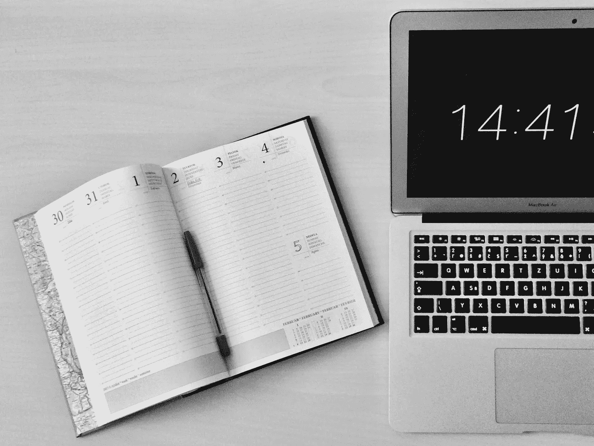

# 作为一名数据科学家，我如何管理我的时间并保持有序

> 原文：<https://towardsdatascience.com/how-i-manage-my-time-and-stay-organised-as-a-data-scientist-e3e78871b7b5?source=collection_archive---------42----------------------->

## 我遵循的快速提示和简单规则

照片由 [**米凯拉**](https://www.pexels.com/@michaela-87369?utm_content=attributionCopyText&utm_medium=referral&utm_source=pexels) 发自 [**像素**](http://pexels.com/)

作为一名数据科学家，我的工作有很多层面。我需要跟踪项目需求、利益相关者的要求、代码开发和我想尝试的新想法。除此之外，我还想掌握我想学习的新知识。

很容易理解为什么如果你没有一个适合你的计划，事情可能会失控。很幸运，我男朋友是[生产力老师](https://peterakkies.net/)。在建立符合我需求的工作结构时，他给了我很多建议和支持。

起初，我认为设置这些东西会很麻烦。虽然我不得不承认，现在它节省了我很多时间，不用花几个小时去想我下一步应该做什么，或者在开发中期痛苦地感到失落和困惑。我建议你建立一个适合自己的系统，并坚持下去。希望能启发你，并向你展示一些选择，以下是我如何组织和管理我的时间。

我确保可以在一个日历上看到所有即将发生的事件。这包括我的工作事件、个人约会和电话，所以你想成为一名数据科学家？开会，预约医生。基本上，任何让我身心俱疲的事情。在一个地方看到所有这些帮助我了解我一天中有多少时间来做专注的工作。这有助于设定我每天的期望。

这也有助于我将一天划分为不同的情境，因为我会用情境切换来解释更多。

我使用任务管理器来记录我想做的每件事和我生活中不同部分的所有项目。我使用的任务管理器叫做 Things。

当然，这可能是非常私人的事情。正如我所说，我的男朋友是一名生产力教师，所以我能够得到他的帮助，为我建立最好的系统。你可以在他的 [YouTube 频道](https://www.youtube.com/user/PeterAkkies)上找到他的建议。

在任务管理器上，我写下了我的项目。这些不一定只是工作项目。报税，申请居留许可或者为我的新课程创建销售页面都是项目。我写下为了完成这个项目我需要做的每一件事，如果必要的话指定一个截止日期，这样我需要做的每一件事都记录在一个地方。

这样我总是知道我突出的任务和责任是什么。

我偶尔(最好是每周)回顾一下我的任务，看看我进步了多少，我还没有解决什么，我已经完成了什么。我用这段时间来思考和计划未来的日子。这样，当我开始新的一天时，我或多或少已经知道需要做什么。

我会花几个小时来集中注意力。因为与其他人一起工作时，会议或闲聊可能会被打断。我想现在大家都在家里工作，这种情况会少一些，但还是有被你的手机吸进去的危险。

为此，我会确保在我的日历上留出时间，在这段时间里我会离线并处理我的主要任务。这包括将我的电脑设置为“请勿打扰”,退出所有可能弹出任何通知的应用程序，把我的手机放好，戴上降噪耳机。

你会惊讶地发现，每天只需 2 小时不间断的工作，你就能完成多少事情。

**我尽量避免让自己负担过重。**我们都有梦想和抱负，我们都想尽快实现它们。但我认为，明智地规划我的时间比试图耗尽自己的最后一点生产力要好。这些年来，我意识到把自己逼得太紧是有后果的。首先，我在追逐我为自己设定的最后期限时变得压力太大，其次，我开始怨恨我的工作占用了我所有的时间，没有任何时间花在自己身上或只是放松。然后，我开始错过最后期限，事情变得不可收拾，这只是时间问题。

我发现的一个解决办法是给自己放松的时间表。如果我知道一项任务至少需要 2 小时，我不会把它分配到 2 小时的时间段。我把它分配到一个 3 小时甚至 4 小时的时间段。如果在一天结束的时候，我还有时间或精力去做别的事情，我总是可以接受的。这就引出了我的下一个观点。

**我意识到这不仅是时间的问题，也是精力的问题。仅仅因为你一天中有更多的时间，并不意味着你应该用这些时间去工作。有时候事情可能会太混乱，可能会有个人的麻烦，比如爱人需要你，或者有开心的事情要处理，比如你坠入爱河。无论大小，我意识到我周围的一切都需要我一整天的能量。我确保意识到我能抽出多少精力来完成一天的任务。这帮助我决定如何计划我的日子；我认为更紧凑或更灵活…**

我计划我的每一天都需要尽可能少的环境转换。这是让我在最繁忙的工作日保持高效的关键因素之一。上下文切换正在改变你工作的领域。这可能是工作中的项目 A 或项目 B。这也可能是做与工作相关的事情和处理个人行政事务之间的区别。

我意识到对我来说这需要大量的时间和精力。我经常发现自己在两种不同的环境下工作时需要休息一下。这就是为什么在我计划一天的时候，我会尽量限制一天中需要切换上下文的次数。

看看我的日历，如果我早上有一个与项目 A 相关的会议，只要我需要/可以，我就会把早上的时间花在思考和做与项目 A 相关的任务上。如果下午我需要交付一些东西，我会确保把那段时间花在某个项目上。

**我把我的想法记录下来并保持有序。**正如我在本文开头所说，一个数据科学项目有很多层。我需要关注的不仅仅是我的代码和编码任务。我还需要跟踪我在开发过程中提出的新想法、项目要求和许多其他事情。

为此，如果项目规模较小，我会确保在我的笔记应用程序上创建名字容易找到的笔记。如果是一个更大的项目，有多个客户会议和各种利益相关者，我会创建一个专门的文件夹，保存我所有的相关文档。偶尔，我会确保花时间来整理这个文件夹。停止你整理笔记和文件的动力感觉是违反直觉的，但我认为从长远来看，它帮助我更有效率，进步更快。

我还会在手边放一个记事本或笔记应用程序，记下我的任何新想法。尽管在编码的时候停下来做笔记很难，所以我找到的一个解决方法是在我正在做的笔记本上做笔记。我用自己想出的关键词，比如#ATTENTION 或#TODO，来记下我现在不能做或想做但下一步想做的事情。

保持组织性和高效性并不一定具有挑战性。我追求的主要目标是善待自己，意识到自己的极限，花时间仔细思考我的计划。希望我在这篇文章中提到的事情能给你一些关于如何应对生产力挑战的想法。

🐼*想更多地了解熊猫吗？* [*获取我的免费熊猫小抄。*](https://www.soyouwanttobeadatascientist.com/pandas-cheat-sheet)