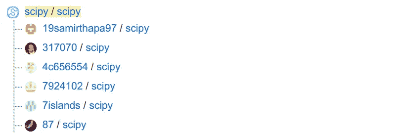

# 我如何将一个库从 Python 2 迁移到 Python 3

> 原文：<https://towardsdatascience.com/how-i-moved-a-library-from-python-2-to-3-60fc2b2a21a1?source=collection_archive---------35----------------------->

## Python 2 已经死了——让我们继续吧！


图片来自 needpix.com 的[天空电视台](https://www.needpix.com/photo/download/1179523/phoenix-photoshop-adler-fire-eagle-digital-art-feuervogel-photoshop-composition-free-pictures)

去年，我举办了一个关于打包 Python 项目的研讨会。其中一名参与者是生物信息学研究者。她需要建议，因为她想从 Python 2 切换到 Python 3，但是她需要的库只适用于 Python 2。将库迁移到 Python 3 非常有趣，我将在这里分享我是如何做到的——或者更确切地说，如果我再次遇到同样的情况，我会如何做。

# 本地设置

确保可以在本地执行 Python 2 和 Python 3。我喜欢 [pyenv](https://github.com/pyenv/pyenv) 这一点:

```
$ pyenv install 2.7.18
$ pyenv install 3.8.5
$ pyenv local 3.8.5
$ pip --version
```

或者，您可以[使用 conda 在 Python 2 和 3](https://docs.conda.io/projects/conda/en/latest/user-guide/tasks/manage-python.html#installing-a-different-version-of-python) 之间切换。

# 常规项目设置

项目应该在**版本控制**下，你需要确保人们在需要时可以返回。您需要**锁定直接和可传递的依赖关系**。你应该有一个**可复制的环境**，比如一个 [Docker 容器](https://makeitnew.io/docker-ab1a6bddf389)带有类似`2.7.18-slim-buster`的固定 Python 版本。为当前版本添加一个 **git 标签**，将最新版本部署到 pypi，并支持您的用户锁定该版本。

确保您记录了迁移到 Python 3 的当前状态。通常这是通过问题跟踪器来完成的，例如 Github 或吉拉的内置跟踪器。

首先确保你可以执行测试，测试覆盖率是好的(参见[单元测试系列](https://medium.com/swlh/unit-testing-in-python-basics-21a9a57418a0))并且总体风格是好的(参见清单 todo)。建立一个 [CI / CD 管道](https://levelup.gitconnected.com/ci-pipelines-for-python-projects-9ac2830d2e38)。

# 打印报表

在 Python 2 中，您可以编写打印语句:

```
print "hello world"
```

在 Python 3 中，您必须编写打印函数:

```
print("hello world")
```

幸运的是，在 Python 2 中还可以有打印功能。令人困惑的是，它的行为方式并不相同:

```
py2>>> print(1, 2, 3)
(1, 2, 3)
py3>>> print(1, 2, 3)
1 2 3
```

您需要导入后端口打印函数，以使 Python 2 函数的行为类似于 Python 3 函数:

```
py2>>> from __future__ import print_function
py2>>> print(1, 2, 3)
1 2 3
```

注意，我没有使用`print_function`——我只是导入了它。

应用这个小变化很繁琐，但是您可以使用 [2to3](https://docs.python.org/3.8/library/2to3.html) 来完成:

```
$ pip install 2to3
$ 2to3 --fix=print .
```

# 保持 Python 2 的兼容性

你应该有一个在一段时间内以完全相同的方式适用于 Python 2 和 Python 3 的版本。对于有很多依赖项的更大的项目，如果它们能够逐步向前推进，那将是一个很大的帮助。

Python 3 移动/重命名了标准库的一部分。这破坏了与 Python 2 的兼容性。但是，解决方法很简单:

```
try:
    from urllib.parse import urlparse, urlencode
    from urllib.request import urlopen
except ImportError:
    from urlparse import urlparse
    from urllib import urlencode
    from urllib2 import urlopen
```

更好的是兼容性库 6:

```
$ pip install six
```

`six`在 Python 2 和 Python 3 中都可以这样使用:

```
from six.moves.urllib.parse import urlparse, urlencode
from six.moves.urllib.request import urlopen
```

当您编写代码只是为了保持对旧版本的支持时，请确保添加一个容易找到的字符串。类似于“对 Python 2 的支持”

# 迭代器

当您调用`range(10)`时，Python 2 创建一个列表，而 Python 3 为相同的代码创建一个 range 对象。在一些罕见的情况下，您实际上需要这个列表，因此需要将它改为`list(range(10))`。

# 输入和原始输入

Python 2 有`[input](https://docs.python.org/2/library/functions.html#input)`和`[raw_input](https://docs.python.org/2/library/functions.html#raw_input)`，而 Python 3 只有`[input](https://docs.python.org/3/library/functions.html#input)`。Python 2 的 raw_input 类似于 Python 3 的输入。

# 除法和舍入

如果将`/`应用于两个整数，Python 2 会给你一个整数除法。Python 3 的结果是给你一个浮点数。您仍然可以使用在 Python 2 和 3 中都有效的`//`进行整数除法:

```
>>> 1 / 2
# Python 2: 0 vs Python 3: 0.5
```

`x.5`处的舍入行为也发生了变化:

*   [Python 2](https://docs.python.org/2/library/functions.html#round) :如果两个倍数同样接近，则从 0 开始舍入
*   [Python 3](https://docs.python.org/3/library/functions.html#round) :如果两个倍数相等，则向偶数方向舍入

```
>>> round(2.4)
# Python 2: 2.0 vs Python 3: 2>>> round(2.5)
# Python 2: 3.0 vs Python 3: 2>>> round(2.6)
# Python 2: 3.0 vs Python 3: 3
```

在 Python 2 和 3 中有方法获得[相同的舍入行为。](https://stackoverflow.com/q/21839140/562769)

# Unicode 和字符串

Unicode 在 Python 2 中是个大麻烦，在 Python 3 中变得简单多了。Unicode 支持是后来才添加到 Python 2 中的。在 Python 2 中，Unicode 字符串和字符串是有区别的。本质上，字符串是包含 ASCII 的字节对象:

```
>>> a = u"abc"
>>> type(a)
<type 'unicode'>>>> b = "abc"
>>> type(b)
<type 'str'>>>> c = b"abc"
>>> type(c)
<type 'str'>>>> ord('ö')
Traceback (most recent call last):
  File "<stdin>", line 1, in <module>
TypeError: ord() expected a character, but string of length 2 found>>> 'ü'[0]
'\xc3'
>>> 'ü'[1]
'\xbc'
```

在 Python 3 中，情况是一样的:

```
>>> a = u"abc"
>>> type(a)
<class 'str'>>>> b = "abc"
>>> type(b)
<class 'str'>>>> c = b"abc"
>>> type(c)
<class 'bytes'>>>> ord('ö')
246>>> 'ü'[0]
'ü'
```

我可以写很多关于 Unicode 和字符串表示的内容，但为了保持简洁:

*   Python 2 `u"somethin"`与 Python 3 `"something"`或`u"something"`相同
*   我不会用`from __future__ import unicode_literals`。你可能想[阅读更多关于 unicode_literals](https://python-future.org/unicode_literals.html) 的内容。

[](https://stackoverflow.com/q/26079392/562769) [## unicode 在 Python 内部是如何表示的？

### 感谢贡献一个堆栈溢出的答案！请务必回答问题。提供详细信息并分享…

stackoverflow.com](https://stackoverflow.com/q/26079392/562769) 

# 纯 Python 和万向轮

wheel 文件是分发 Python 代码的一种形式。如果 Python 代码没有 C 扩展，它就被认为是纯的。如果纯 Python 代码兼容 Python 2 和 Python 3，并通过 wheel 文件分发，那么这个文件就叫做[*universal*](https://packaging.python.org/guides/distributing-packages-using-setuptools/#universal-wheels)*。*它应该可以在每台装有 Python 版本的机器上运行。

你应该总是以源代码分发和轮分发的形式分发你的代码。如果可以，试着创作并发布一个万向轮。

# 创建版本支持策略


塞巴斯蒂安·赫尔曼在 [Unsplash](https://unsplash.com?utm_source=medium&utm_medium=referral) 上拍摄的照片

库创建者需要决定他们想要支持哪些 Python 版本。较新版本的 Python 拥有您想要的杀手级特性，支持所有版本需要大量时间。使你想要支持的版本和你何时想要停止支持变得透明。最好将它与更大的项目联系起来，例如最近 3 个主要的 Python 版本。

你也应该知道 Python 的发布周期在 [PEP-602](https://www.python.org/dev/peps/pep-0602/) 中被改变了。

[NEP-29](https://numpy.org/neps/nep-0029-deprecation_policy.html) 是 NumPy 的版本支持政策，希望所有的科学 Python 包也能遵循它。

# 移除 Python 2 兼容性


[JESHOOTS.COM](https://unsplash.com/@jeshoots?utm_source=medium&utm_medium=referral)在 [Unsplash](https://unsplash.com?utm_source=medium&utm_medium=referral) 上拍照

支持 Python 2 意味着您需要添加额外的代码，并且可能无法使用新 Python 版本的一些致命特性。

当您删除对 Python 版本的支持时，在一次 git 提交中完成，这样更改就很清楚了。搜索该字符串:

```
$ grep -rnI "support for Python 2"
```

# 用新东西！

Python 3 有一些非常酷的特性，你应该尽可能地使用它们。迁移到 Python 3 打开了一个全新的世界:

[](https://medium.com/python-in-plain-english/killer-features-by-python-version-c84ca12dba8) [## Python 版本的黑仔要素

### 了解当您支持旧的 Python 版本时，您错过了什么:Python 2.7 到 3.5、3.6、3.7、3.8 和 3.9

medium.com](https://medium.com/python-in-plain-english/killer-features-by-python-version-c84ca12dba8) 

`[pyupgrade](https://github.com/asottile/pyupgrade)`可以帮助你使用新型语法，例如:

```
dict((a, b) for a, b in y)    # -> {a: b for a, b in y}
'%s %s' % (a, b)              # -> '{} {}'.format(a, b)
```

这样做并不是绝对必要的，但它使您的代码更现代、更易读。

# 分叉项目

我很幸运，propy 的维护者欢迎这些变化。然而，有了自由软件，你就不会被维护者的支持所束缚。您可以简单地创建一个所谓的 *fork:* 您控制的原始项目的副本。



Scipy 有 3000 多把叉子。马丁·托马斯 Github 截图

对于自由软件来说，分叉一直都在发生。这也是一种开发模式，独立开发人员在他们的副本(他们的分支)中进行更改，并创建一个合并请求(Github 称之为 pull request (PR))。

您也可以将您的 fork 上传到 pypi，但是请只在您想要维护该 fork 并继续独立开发时才这样做。

# 元类

还有一些主题，比如元类和异常范围，我还没有涉及到。如果你需要的话，我推荐这个由麦克·米勒写的教程:

Anders hov mller 也写了一篇关于这个话题的有趣文章。查看他的“生产中的惊喜”部分！

 [## 将大量旧代码转移到 Python3

### **我已不再使用介质。新地址是 kodare.net * *

medium.com](https://medium.com/@boxed/moving-a-large-and-old-codebase-to-python3-33a5a13f8c99) 

# TL；DR:我如何从 Python 2 迁移到 Python 3？

1.  获得专业的 Python 2 设置
2.  转到您的代码库支持 Python 2 和 Python 3 的状态
3.  让它运行一段时间，确保它的工作
4.  移除 Python 2 支持

# 相关资源

*   Mike Müller: [从 Python 2 迁移到 3](https://www.youtube.com/watch?v=JgIgEjASOlk) ，PyCon US2020。
*   [protpy](https://code.google.com/archive/p/protpy/downloads) 是我搬的图书馆。我创造了 [propy3](https://github.com/MartinThoma/propy3) 。