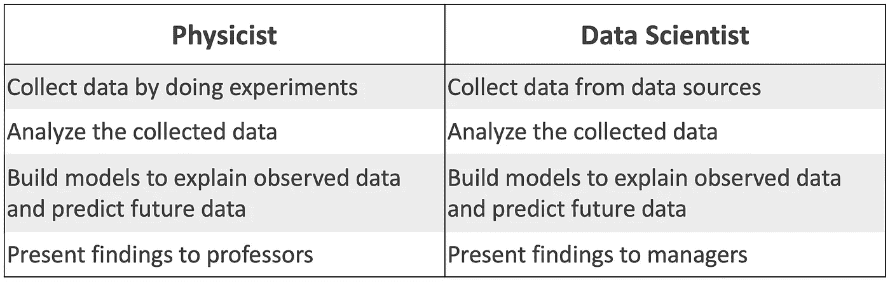

# 我如何从物理学转向数据科学

> 原文：<https://towardsdatascience.com/how-i-moved-from-physics-to-data-science-457340e39902?source=collection_archive---------4----------------------->

## 我一年从物理到数据科学的一步一步。

照片由 [**卢卡斯**](https://www.pexels.com/@goumbik?utm_content=attributionCopyText&utm_medium=referral&utm_source=pexels) 发自 [**Pexels**](https://www.pexels.com/photo/person-writing-on-notebook-669615/?utm_content=attributionCopyText&utm_medium=referral&utm_source=pexels)

# 介绍

在我之前的[帖子](https://medium.com/@dmnguyen92/career-options-for-a-physics-degree-8260ee07e152)中，我分享了物理学毕业生可能的职业道路，其中之一是成为一名数据科学家。来自学术界和其他工业领域的许多人都有同样的想法。为了满足这种需求，开设了数百门课程，互联网上充斥着帮助你进入数据科学世界的学习材料(就像[这里](https://github.com/ZuzooVn/machine-learning-for-software-engineers)或者[这里](https://github.com/Avik-Jain/100-Days-Of-ML-Code))。问题是:这可能太多了。

让我们假设我们很忙，很懒，很笨，所以我们没有时间和精力去消耗所有的在线学习材料。**对于想在一年内找到一份数据科学工作的人来说，查看这些资源以找到从哪里开始以及何时停止可能会令人不知所措**。因此，在这篇博客中，我将分享我从一名物理学博士生转变为一名数据科学家的具体步骤。

> **免责声明**:我现在的职称其实是机器学习工程师，工作范围非常类似于数据科学家。机器学习和数据科学之间的差异将是另一个故事。

# 物理学和数据科学之间的兼容性

在采取任何行动之前，第一步是准备好心态。

数据科学是一个涉及数学、编程和领域知识的多学科领域，而*被认为*最适合计算机科学专业的学生。那么，物理学出身的人可以兼容吗？答案是大大的**是的**。不信，我们来看看一个物理学家典型的日常工作，和一个数据科学家比较一下。

物理学家和数据科学家的工作范围

你没看出来吗？**这两个家伙做** **一模一样的事情**。**唯一的区别是它们使用不同的数据集**。因此，如果你的物理研究做得不错，很可能你已经具备了成为数据科学家所需的技能。但是在你解决某些问题之前，你还不能成为一个人:

*   **你的数据科学技能不够犀利**。一个物理学家，既要做实验又要做数据分析，往往在电子/机械工程、数据科学、数学等方面比较擅长..但是没有一个是优秀的。你需要停止做一个万事通，把注意力放在真正重要的技能上。
*   **你有技能，但缺乏领域知识**，你需要这两者来成为一名优秀的数据科学家。这里的知识是指对不同机器学习/统计算法的理解，以及如何使用它们。
*   **别人不知道你拥有这样的技能**。在许多招聘经理看来，数据科学仍然更适合计算机科学专业的学生，而物理专业的学生应该坚持学物理。你需要一些东西来证明你的技能，让他们改变主意。

我的准备过程集中在解决这些问题上。

# 我成为数据科学家的一步一步

在距离我博士论文的截止日期还有 1.5 年的时候，我决定追求成为一名数据科学家的道路。减去 0.5 年找工作的时间，我只有整整一年的时间做准备。以下是我在那段时间里做过的事情:

## 1.加速博士进程

在我决定我的未来不会在学术界的那一刻，我开始加速我的博士工作。我把毕业所必需的现有项目打包，放弃了其他所有项目。我也和我的主管分享了我的计划，并请求他的支持。这一行动带来了两大好处:

*   确保了我的毕业能够顺利进行，没有拖延，没有挣扎，这样我就有时间在博士毕业的时候找工作了。
*   消除了所有关于留在学术界的第二个想法，没有回头看，所以我可以全力以赴争取一份数据科学的工作。

## 2.大量练习编码

数据科学，说到底，涉及到很多编程，是计算机专业的强项。因此，我需要升级这个技能来赢得与他们对抗的机会。

我通过使用 Python 来完成我的研究任务，而不是依赖第三方软件来练习编码。从控制设备、处理数据、建筑模拟到图形绘制，都是通过编码来完成的。用竞争性编程练习算法是很好的，但是我就是没有时间。

## 3.获取机器学习方面的知识

照片由 [**Pixabay**](https://www.pexels.com/@pixabay?utm_content=attributionCopyText&utm_medium=referral&utm_source=pexels) 发自 [**Pexels**](https://www.pexels.com/photo/adult-blur-books-close-up-261909/?utm_content=attributionCopyText&utm_medium=referral&utm_source=pexels)

有许多在线资料支持这一目的。然而，知道我的时间有限，我没有在书本和课程上花太多时间。总体来说，我上了 2 门课:Udemy 上的 [" *机器学习 A-Z"*](https://www.udemy.com/course/machinelearning/) ，Coursera 上的 [" *深度学习专业化"*](https://www.coursera.org/specializations/deep-learning) ，看了 2 本书: [*《统计学习导论》*](https://www.goodreads.com/book/show/17397466-an-introduction-to-statistical-learning?from_search=true&from_srp=true&qid=xwcBAQFIOH&rank=1) 和 [*《用 Python 进行深度学习》*](https://www.goodreads.com/book/show/33986067-deep-learning-with-python) 。

我自己的建议是:**不要在数学上陷得太深，也不要试图从头开始编写算法**。这将花费很长时间，而且没有任何实际意义。相反，我专注于理解直觉，每个算法的优缺点，以及可以使用哪个库来实现它们。获取知识的过程花了我前 5 个月的时间。

## 4.参与 Kaggle

对于初学者来说，Kaggle 是一个很好的平台，可以让他们找到如何解决机器学习问题的例子，并在学习的过程中进行实践。我开始了我的第一次比赛，从别人的作品中分支和调整。这对我掌握标准工作流程和流行库帮助很大。到第三次比赛的时候，我已经可以从头开始做所有的东西了(这里看我的代码**)。**

**我在 Kaggle 的学习经历非常棒。不过，**我是来 Kaggle 学习的，不是来爬排名的**。经过 3 个月和 3 场比赛，我已经对数据处理、特征工程和模型构建有了足够的了解。呆得更久可以让我学到更多的技巧来提高我的排名，但这与我最初的目的不符。因此，在第四届比赛结束时，我离开了 Kaggle，开始从事我自己的数据科学项目。**

## **5.做个人数据科学项目**

****

**照片由 [**明锐丹**](https://unsplash.com/@octadan?utm_source=unsplash&utm_medium=referral&utm_content=creditCopyText) 上 [**下**](/s/photos/project?utm_source=unsplash&utm_medium=referral&utm_content=creditCopyText)**

**“项目”这个词听起来可能有点花哨，但实际工作非常类似于 Kaggle 竞赛。不同的是，你自己决定做什么，在哪里找到数据，以及如何得到解决方案，没有太多参考他人的作品，也没有比较的排名。**

**在申请数据科学工作时，做自己发起的项目并将它们上传到你的博客或 Github 有很多好处:**

*   **如今，每个人都参加在线课程，所以**在简历上列出那些课程或学位不会给任何人留下印象**。相反，个人项目会帮助你脱颖而出，向雇主证明你确实拥有他们需要的技能。**
*   **在许多公司，申请人被要求完成一项带回家的任务，这类似于一个迷你数据科学项目。在你自己的意志中工作过**会让你有经验和信心**轻松通过这一轮。**
*   **在很多面试中，重点会放在你简历上写的东西上。一个项目会成为你讨论的好话题，并以你的技能和知识给面试官留下深刻印象。**

**总的来说，我做了 3 个数据科学项目:一个是经典机器学习(这里见代码**)，另一个是计算机视觉(这里见代码**)，然后一个是自然语言处理(NLP)(这里见代码**)。回顾过去，我认为我应该只关注一个特定的领域，比如 NLP。这样做有助于我更深入地了解那个领域，并使我的个人资料更加一致。无论如何，数据科学家的角色可能只关注这三个领域中的一个。********

******我完成第三个项目的时间正好是我开始学习数据科学的一年。平均来说，我每天花 2 个小时，加上周末来学习。我的知识还不扎实，离完整还很远，但这足以让我自信地写我的简历并发出申请。******

# ******结论******

******简而言之，以下是我为从物理学转向数据科学所做的准备工作:******

*   ******有正确的心态******
*   ******无论我在做什么，都很快很好地完成了******
*   ******练习编码******
*   ******通过书籍和 MOOCs 获得机器学习知识，但不要停留在那里超过 6 个月******
*   ******通过 Kaggle 和自我启动的项目实践我所学到的东西******

******学习新事物从来都不容易，但数据科学不是火箭科学。我希望从我的故事中，你能对成为一名数据科学家的道路有一个实际的看法。我相信，有信心，有激情，有努力，你一定能做到。******