# 我如何优化我的数据分析实践——您应该开始使用的技巧和库

> 原文：<https://towardsdatascience.com/how-i-optimized-my-data-analysis-practices-hacks-libraries-you-should-start-using-3a7308b668da?source=collection_archive---------18----------------------->

## 有用的黑客和库的汇编，以加快您的分析


当我在写这篇文章时，我的显示器的一个镜头

所以，我最近一直在从事许多机器学习和数据科学项目。从我的经验中，我可以分享的一件事是，每次你接一个项目，在你到达项目中最吸引人的部分(至少对我来说)模型工程之前，你必须穿过这个不可避免的数据清理和争论的泥沼。

现在，为了让我的生活更容易，我开始寻找黑客、库、配置等。更有效地执行探索性分析。

在这篇博文中，我将分享一些我的发现/配置，它们可能会对你有用和有趣。

因此，我打算分两部分来讨论这个问题:

*   Jupyter hacks 和
*   用于数据分析的有用库

# Jupyter Hacks

既然要长时间使用 jupyter 笔记本，那就让[成为你的工作空间](/the-complete-guide-to-jupyter-notebooks-for-data-science-8ff3591f69a4?source=---------13------------------)吧，让它看起来更酷一点，这样你就能集中注意力，享受使用笔记本工作的乐趣。稍后，我们将看到一些技巧，可以帮助您加快分析速度。相信我，你会开始喜欢花时间在你的 jupyter 笔记本上。

如果你是 jupyter 笔记本的新手，这里有一个完整的指南，告诉你如何为数据科学建立一个完美的 python 设置:

[](/ideal-python-environment-setup-for-data-science-cdb03a447de8) [## 数据科学的理想 Python 环境设置

### 设置 python 环境以开始数据科学项目的指南。

towardsdatascience.com](/ideal-python-environment-setup-for-data-science-cdb03a447de8) [](/the-complete-guide-to-jupyter-notebooks-for-data-science-8ff3591f69a4) [## 面向数据科学的 Jupyter 笔记本完全指南

### Ipython 笔记本初学者指南

towardsdatascience.com](/the-complete-guide-to-jupyter-notebooks-for-data-science-8ff3591f69a4) 

这里有一些你可能不知道的 Jupyter 笔记本黑客:

## 1. [Jupyterthemes](https://github.com/dunovank/jupyter-themes)

已经厌倦了 Jupyter 笔记本单调的白色和灰色默认主题？好吧，让我们用 [Jupyterthemes](https://github.com/dunovank/jupyter-themes) 给你的笔记本一个新的外观。一旦安装了 jupyter，您需要做的就是在您的环境中安装 jupyterthemes，使用主题:

```
pip install jupyterthemes
```

然后根据你想要的笔记本的氛围设置任何主题，这是我喜欢的深色主题和所有其他格式选项，感觉就像我在一个崇高的文本编辑器中工作。

在您环境中的终端中，键入:

```
jt -t monokai -f fira -fs 12 -nf ptsans -nfs 12 -N -kl -cursw 2 -cursc r -cellw 90% -T
```

`-t`为主题

`monokai` —主题的名称

所有其他描述在此给出[。](https://github.com/dunovank/jupyter-themes)

重新启动您的 jupyter 笔记本电脑服务器，准备好迎接惊喜吧:

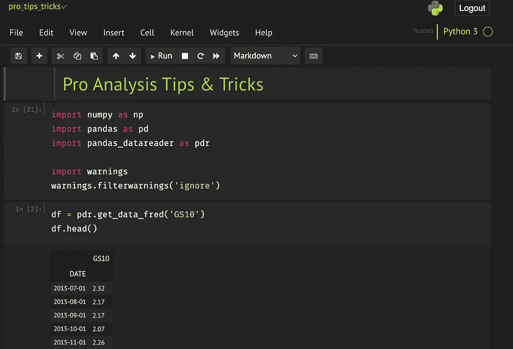

另外，如果您想回到最初的 jupyter 主题，请使用:

```
jt -r
```

## 2.注释掉代码(非常有名)

注释掉代码是每个开发人员/分析师都使用的最重要和最有用的实践之一，如果你不知道，有一个非常快捷的键盘快捷键。

如果你在 Mac 上点击`cmd` + `/`或者在 windows 上点击`ctrl` + `/`，选中的代码行将被注释掉。

就这么简单！

> 专业提示:在完成分析之前，总是注释掉代码块，而不是删除它们。

## 3.恢复已删除的单元格

我们都知道我们对恢复单元格内容的`cmd/ctrl + z`有多感激，但是如果你删除单元格本身呢？

假设您遵循了上述注释代码的规则，但是错误地删除了整个单元格，并且想要恢复它。我们也有一个捷径:

`esc + z`或转到`Edit > Undo Deleted Cell`

这将恢复你的细胞。

不客气！:)

## 4.%魔法命令(运行、存储、latex)

顾名思义，有一组命令拥有超自然的力量，这种力量可以拯救你，使你的头不会撞到墙上。

*   **%run** —当你不得不在 jupyter 笔记本里面使用 python 脚本`example.py`的时候，你会怎么做？复制粘贴全部代码？
    这里有一个更智能的方法，您可以使用`**%run**` magic command 在笔记本中运行您的 python 脚本:

```
%run example.py
```

*   **%**

```
%load example.py
```

*   **%%writefile —** 要将单元格的内容写入文件并保存在当前工作目录中，可以像这样使用该命令:

```
%%writefile example.pydef delete_null_values(df):
    df.dropna()
```

*   **%time —** 这是一个非常有用的神奇命令，它返回运行该单元所花费的 CPU 执行时间。你可以这样使用它:

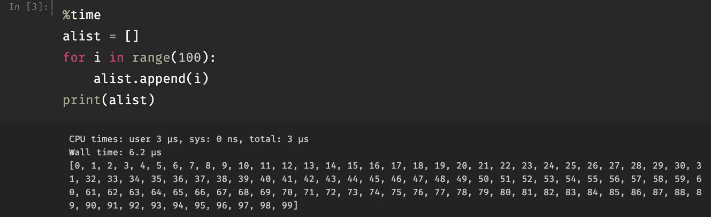

*   **%% script false —** 有时候，您只想再次运行笔记本中的所有单元格，例如，除了一些单元格之外，您可能不想再次训练模型。使用此命令跳过单元运行:

```
%%script false
model.fit(x_train, y_train)
```

*   **%%latex —** 这是我的救命稻草，因为我必须为我的[数据科学线性代数系列编写大量的数学符号和公式。](/practical-reasons-to-learn-mathematics-for-data-science-1f6caec161ea?source=---------10------------------)对于微分方程，可以如下使用:

```
%%latex
This is a differential equation: $\frac{du}{dt}  and  \frac{d^2 u}{dx^2}$
```

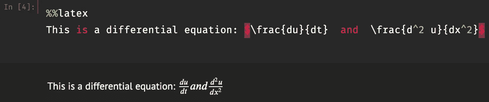

*   以下是 latex 的备忘单:

[](https://wch.github.io/latexsheet/) [## 乳胶纸

### 这是一张乳胶参考纸，适合写科学论文。请将建议发送至…

wch.github.io](https://wch.github.io/latexsheet/) 

*   **%debug —** 这是一个交互式调试器，可让您即时查看错误:

```
%debug
a = []
b = 50
a_len = len(a)
result = b/ a_len
```

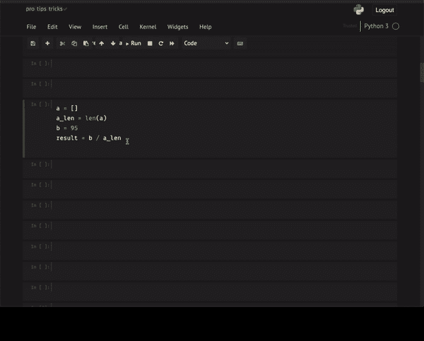

*   **%lsmagic —** 这是一些非常有趣的魔法“把戏”，所以你会想看看整个宝藏。`%lsmagic`返回所有神奇命令的列表。到处玩！

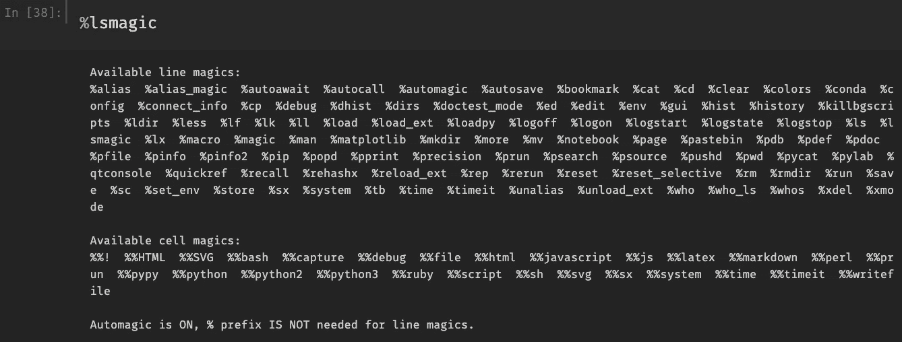

# 有用的库

## [1。Dabl](https://amueller.github.io/dabl/dev/)

Dabl 是一个受 sklearn 启发的数据分析基线库，它试图通过减少常见任务的样板代码来为初学者普及 ML。这是由[Andreas Mueller](https://twitter.com/amuellerml?lang=en)sci kit-learn 开发人员开发的项目，该库包含几个工具，可以轻松清理和检查您的数据，然后创建强大的基线模型。

让我们读取一个非常常见的 titanic 数据集，并尝试对其进行探索性分析。

让我们先用 dabl 清理数据:

```
import dabl# read a dataset
df = pd.read_csv("[https://gist.githubusercontent.com/michhar/2dfd2de0d4f8727f873422c5d959fff5/raw/23da2b7680e0c9e1fd831f05f53de3958f0d75fe/titanic.csv](https://gist.githubusercontent.com/michhar/2dfd2de0d4f8727f873422c5d959fff5/raw/23da2b7680e0c9e1fd831f05f53de3958f0d75fe/titanic.csv))# call the clean method and pass the dataframe to itdabl.clean(df, verbose=1)
```

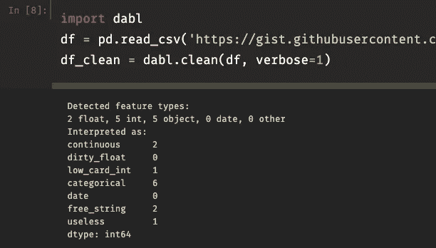

检查类型现在，让我们尝试使用已清理的数据帧中的 detect_types 来检测类型:

```
data_types = dabl.detect_types(df_clean)
print(data_types)
```

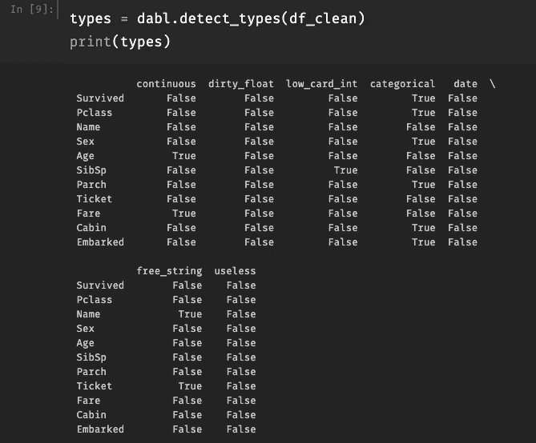

使用 dabl 的绘图功能可以查看模式和高级绘图:

```
dabl.plot(df_clean, target_col="Survived")
```

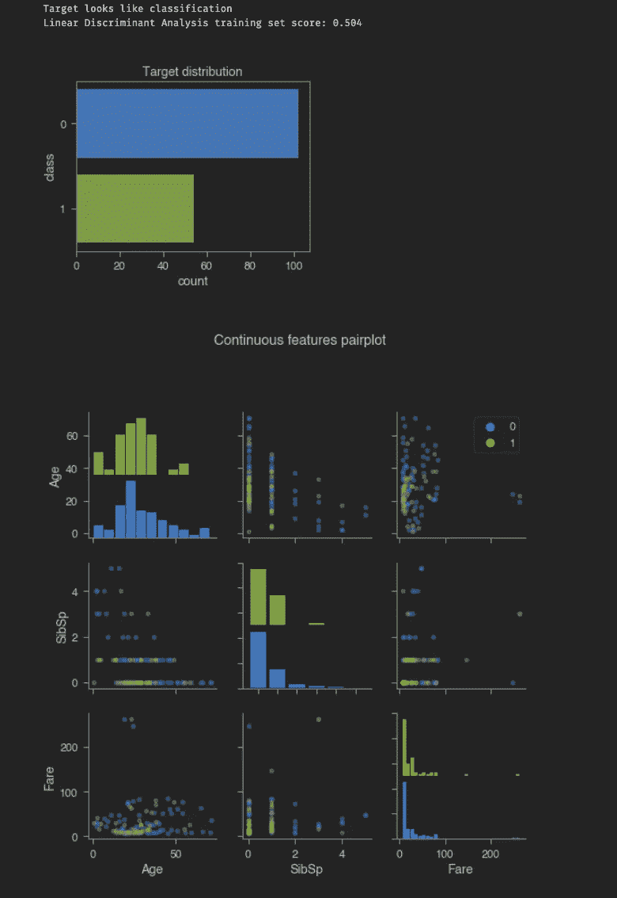

很神奇，对吧？

您还可以创建一个简单的分类器基线模型:

```
survivor_classifier = dabl.SimpleClassifier(random_state=0).fit(df_clean, target_col="Survived")
```

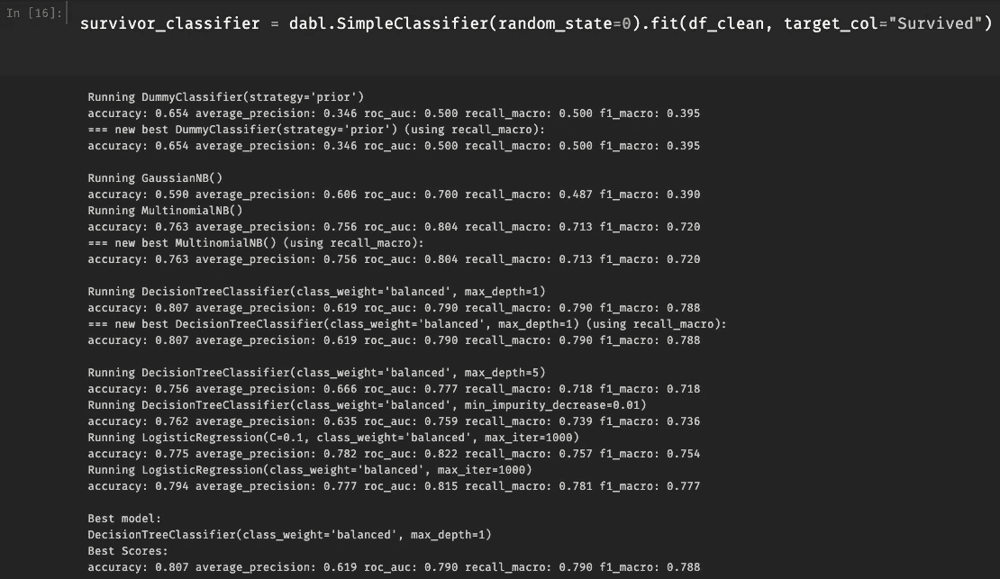

花一些时间在 dabl 上，你会喜欢用它来完成你所有的探索任务。

## [2。表情](https://github.com/NeelShah18/emot)

你在处理文本数据集的时候遇到过表情符号吗？情感分析需要理解这些表情符号，因此需要对数据中的表情符号进行预处理。你可能知道，表情符号是人类面部表情的一种表现。

假设你有一个如下的句子:

```
sentence = “it's a sunny day ☀️, let's go fishing! 🐟”
```

现在，为了从句子中提取表情符号，您可以使用表情库，如下所示:

```
sentence = "it's a sunny day ☀️, let's go fishing! 🐟"
emot.emoji(sentence)
```

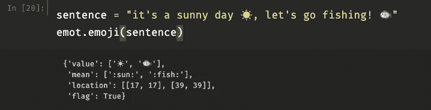

## [3。缺失编号](https://github.com/ResidentMario/missingno)

这些数据去了哪里？！！缺少的值总是一件棘手的事情。在使用其中一种输入方法之前，了解缺失值的类型总是很重要的。

Missingno 提供了一种快速而有用的方法来可视化这些值。

使用相同的 titanic 数据，您可以首先通过检查空值来可视化这些值:

```
df.isnull().sum()
```

然后您可以导入`missingno`并使用 bar 和 matrix 函数来可视化那些丢失的值。

```
! pip install missingno
import missingno as mi # pass the dataframe to the 
mi.bar(df, figsize=(12,8))
```

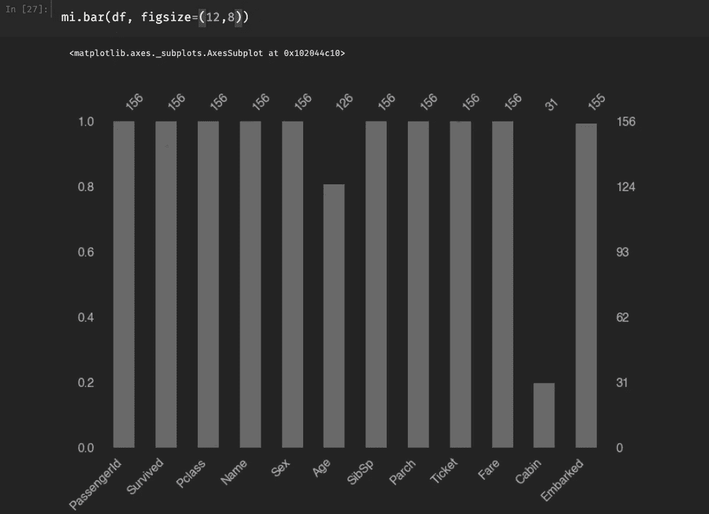

矩阵函数:

```
mi.matrix(df, figsize=(12,8))
```

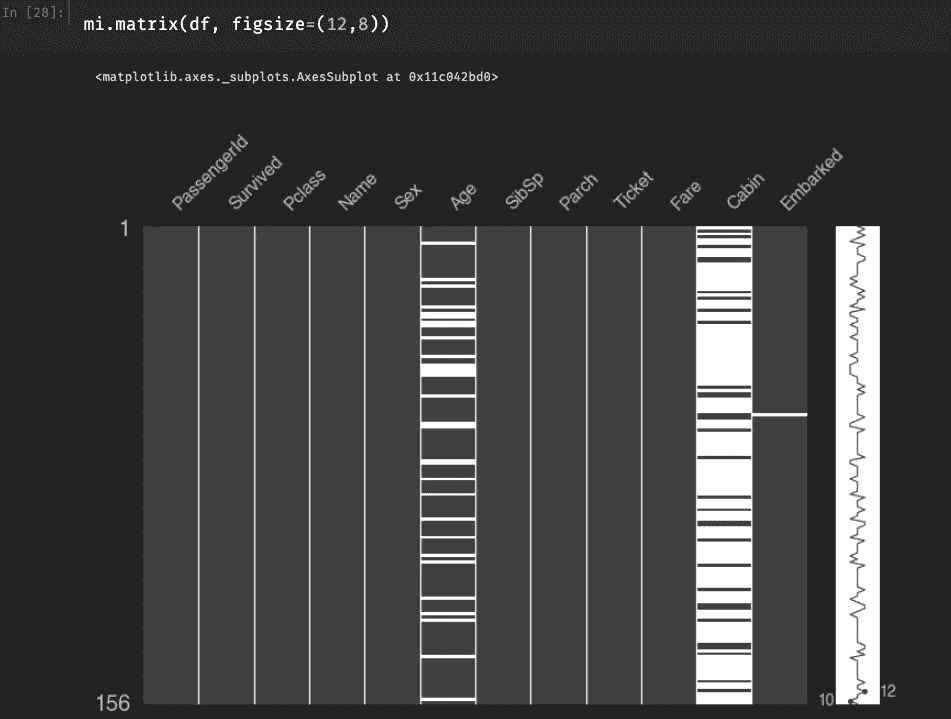

你可以自己看到在性别，客舱和登船栏中缺失的价值。

## [4。骗子](https://faker.readthedocs.io/en/master/)

就像 web 开发和 UI/UX 中的 Lipsum 文本一样，我们有这个 Faker 库，它可以创建假数据供您使用。你可以创建假用户，电子邮件地址，家庭地址，地理坐标，网址，个人资料等。你可以创建不同类别的数据集，点击[这里](https://faker.readthedocs.io/en/latest/providers/faker.providers.geo.html)。

安装并导入 faker:

```
! pip install Faker
from faker import Faker
```

创建一个实例并检查假名称:

```
fake = Faker()
fake.name()
```

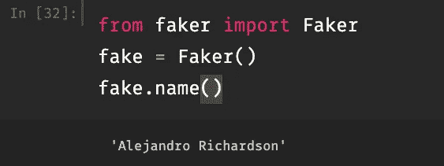

```
fake.text()
```

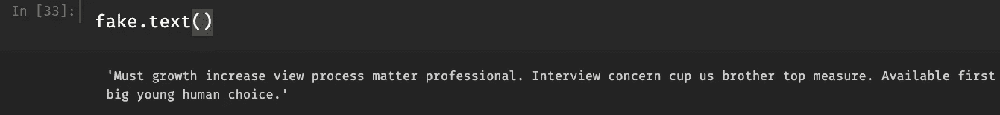

创建尽可能多的假地址或 URL:

```
for _ in range(10):
    print(fake.address())
```

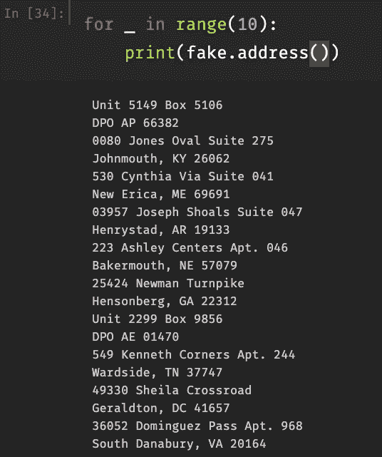

继续玩下去，并在前进的过程中创建一些有用的数据集。查看[的文件](https://faker.readthedocs.io/en/master/)。

## [5。数字器](https://pypi.org/project/numerizer/)

我偶然发现了一个当地银行的数据集，其中有一个单独的文件，里面有文本数字形式的金额。我偶然发现了这个将自然语言数字转换成整数和浮点数的库。这原本是一颗红宝石[的编号器](https://github.com/jduff/numerizer.git)。

从 numerizer 安装并导入 numerize:

```
!pip install numerizer
from numerizer import numerize
```

通过对一些文本数字进行编号来尝试:

```
numerize('forty two')
numerize('twenty one thousand four hundred and seventy three')
'21473'
```

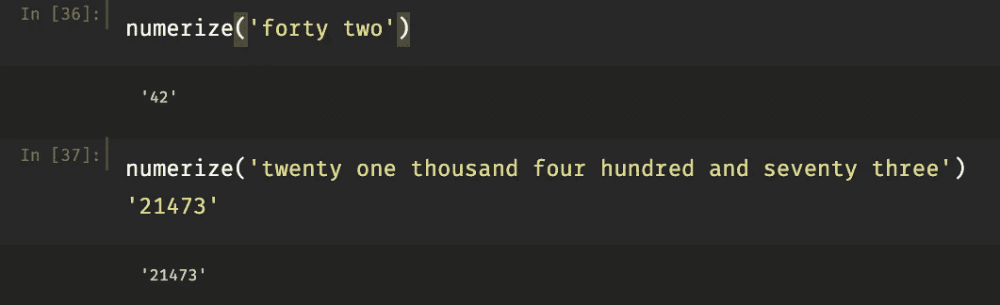

很有趣，对吧？不是这个。在接下来的部分中，我还会继续介绍许多其他的技巧和库，但是现在，这里有一个到资源库的链接，您可以使用它:

[](https://github.com/dswh/pro_data_analysis) [## dswh/pro _ 数据 _ 分析

### 汇编技巧、提示和库以加速您的数据分析任务——dswh/pro _ data _ analysis

github.com](https://github.com/dswh/pro_data_analysis) 

如果你喜欢看我在我的系统上尝试这些库和工具:

有了这些库和工具的解释，从现在开始我把它留给你的想象力。制作一些有趣的东西，并在下面的评论中分享链接，如果我觉得有趣，我会在我的频道上的下一个视频中喊出你的名字。

# [数据科学与 Harshit](https://www.youtube.com/c/DataSciencewithHarshit?sub_confirmation=1)

查看我如何通过 TensorFlow 开发人员考试，以及您如何也能通过考试！

通过这个渠道，我计划推出几个涵盖整个数据科学领域的[系列](/hitchhikers-guide-to-learning-data-science-2cc3d963b1a2?source=---------8------------------)。以下是你应该订阅[频道](https://www.youtube.com/channel/UCH-xwLTKQaABNs2QmGxK2bQ)的原因:

*   这些系列将涵盖每个主题和子主题的所有必需/要求的高质量教程，如 [Python 数据科学基础](/python-fundamentals-for-data-science-6c7f9901e1c8?source=---------5------------------)。
*   解释了[数学和推导](/practical-reasons-to-learn-mathematics-for-data-science-1f6caec161ea?source=---------9------------------)为什么我们在 ML 和深度学习中这样做。
*   [与谷歌、微软、亚马逊等公司的数据科学家和工程师](https://www.youtube.com/watch?v=a2pkZCleJwM&t=2s)以及大数据驱动型公司的首席执行官的播客。
*   [项目和说明](/building-covid-19-analysis-dashboard-using-python-and-voila-ee091f65dcbb?source=---------2------------------)实施到目前为止所学的主题。