# 我是如何通过 2020 年谷歌专业数据工程师考试的

> 原文：<https://towardsdatascience.com/how-i-passed-google-professional-data-engineer-exam-in-2020-2830e10658b6?source=collection_archive---------1----------------------->

## 八天后。给那些没有时间阅读手册的人的快速学习指南。2020 年 8 月。

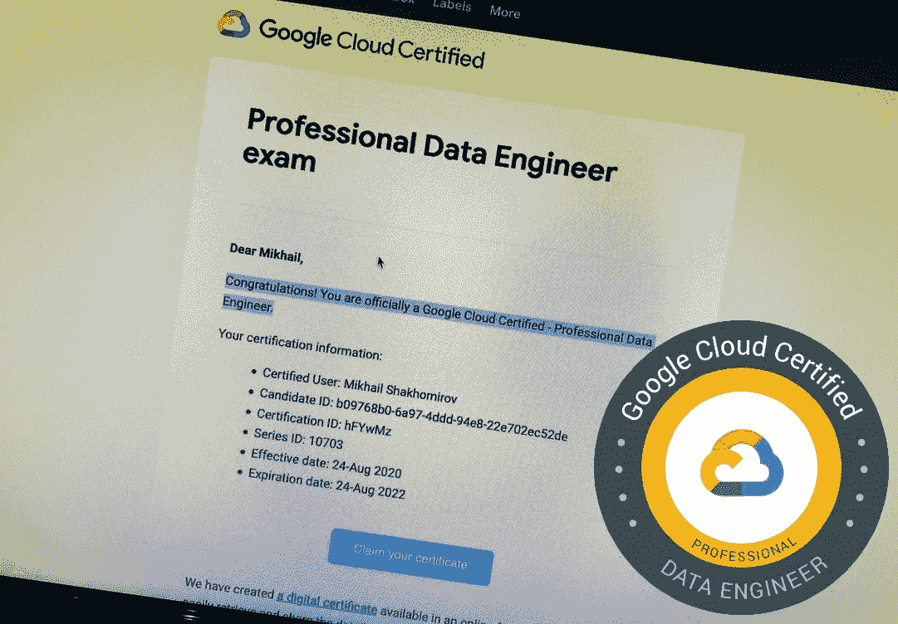

谷歌云认证专业数据工程师

想获得该认证吗？这并不容易。你需要做作业。据我在网上读到的，人们通常花 2-3 个月来准备。

众所周知，我们中的许多人不会每天都使用谷歌的每一款产品，但我们需要了解它们，对吗？这篇文章是写给那些没有时间阅读所有手册的人的。我将描述我在 8 天内为准备这次考试做了什么。

**首先**我需要说的是，我不知道那场考试到底有多严肃。考试问题比我所知道的任何在线课程问题都要复杂和不同。因此，如果你没有任何开发背景，请慢慢来，阅读书籍，做教程。

通过测试用了 1 小时 35 分钟。尽管每个考试问题都完全一样。

> “为什么我选择这样对自己？”

在第三个问题之后，我有一种强烈的感觉，我什么都不知道。当我告诉每个人我要参加这次考试时，我真的很害怕。给你一点建议——不要给自己太大压力。不要告诉你的老板或女朋友。如果你失败了，你可以在两周内再次参加考试。我想我通过了，只是因为我是一个幸运的家伙，那天穿着我的幸运 t 恤。在我提交了最终答案后，我马上看到了考试结果。这是一个“通行证”。我的证书和一件帽衫的促销代码下周就要到了。

# 推荐阅读

有一本【2020 年 5 月的书，一本[官方 Google Cloud 认证专业数据工程师学习指南](https://www.wiley.com/en-us/Official+Google+Cloud+Certified+Professional+Data+Engineer+Study+Guide-p-9781119618454)作者 Willey。这是 40 美元，它有一个目录，给出了对考试题型的基本理解。买不买由你决定。你可能只是想熟悉一下内容，这就足够了。

# 准备

## 第一天

我从模拟测试开始。对于这项任务，有大量的在线课程。我在下面给出了一些帮助我做好准备的概述。长话短说，如果你不想浪费时间，就从测试开始吧。

谷歌有一个[模拟考试，我做了，但没有通过，但我知道问题看起来到底是什么样的。它为您提供了认证考试中可能遇到的问题的**格式、级别和范围**。](https://cloud.google.com/certification/practice-exam/data-engineer)

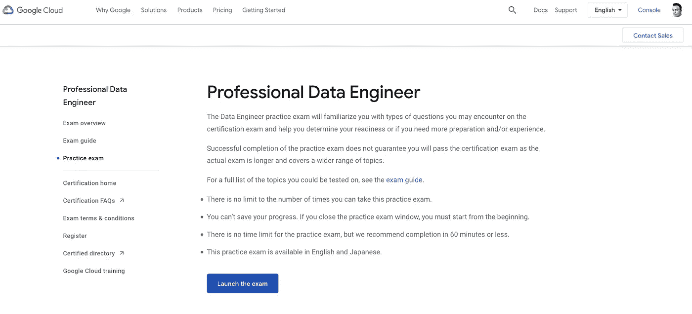

模拟考试—谷歌专业数据工程师

然后就是 Linux 学院实践考试。

最近，他们确实从一位云专家那里移植了一些课程，其中包括[谷歌专业数据工程师](https://linuxacademy.com/cp/modules/view/id/637)课程！这个课程本身会比他们平台上的课程更新，但你仍然可以在这里查看他们的数据工程师课程[谷歌云认证专业数据工程师(LA)](https://linuxacademy.com/cp/modules/view/id/208) 。更新为最新的 2019 年 7 月考试目标。

***第一个是免费的！*** 所以去解锁挑战吧。第二次注册后，你将有两次免费练习的机会。

而且他们有一本随手可得的课程书(免费):[*Linux Academy 编写的 Google Cloud 专业数据工程师考试手册*](https://www.lucidchart.com/documents/view/0ca44a63-4ea4-4d78-8367-2465512d21be/fB.lPxz788ce) :范围内主要概念汇总。

## 第二天

第二天，我开始构思如何处理案例研究，考试结构和问题是什么。我开始关注像经济实惠、性价比高、尽快等词。这些类型的关键词通常定义了正确的答案，因为在考试中，你可以找到多个在技术上满足要求的答案。

## 第 3-5 天

我一天做两次模拟考试，偶尔阅读与我不知道的主题相关的谷歌文档。我骑自行车的时候在健身房做早操。30-40 分钟足够做模拟考试了。还有一项研究表明适度的有氧运动可以改善认知功能。我发现它非常有用，有氧运动听起来不再痛苦了。我在学习。

## **第 6–8 天**

我一天做了两次模拟考试，但现在我打开了两个浏览器标签，上面都是以前通过的模拟考试。每一个我不确定的问题，我都会马上检查并阅读文档。我认为这种策略有助于完善我的知识。此外，我开始记下一些特定产品的笔记，并将它们与我之前提到的关键词联系起来。

到了第七天，我的练习通过率至少达到了 90%。

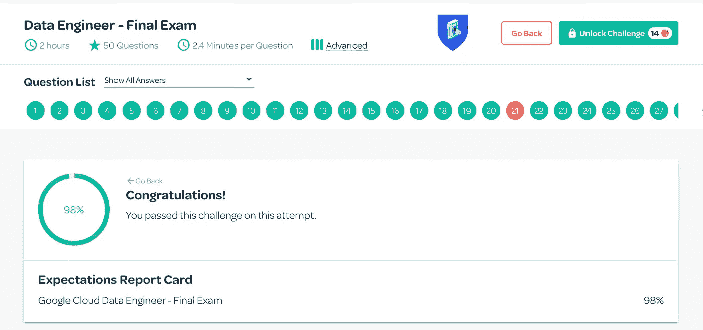

谷歌认证数据工程师考试

# 如何通过考试？

这个问题没有通用的答案。在真正的考试中，我觉得我什么都不知道，问题似乎很难。然而，下面的策略对我很有效:

1.  做模拟测试，了解问题的类型和结构。
2.  了解产品特性
3.  请注意问题关键词，因为它们通常定义了正确答案。

> 穿上你的幸运 t 恤或者任何你拥有的幸运物品。你需要这个。

4.阅读手册。这是可选的，但是非常有用。

阅读谷歌官方文档。至少有概述和案例研究。这些指南很棒，有你通过考试所需的所有信息。我从威利的[专业数据工程师学习指南](https://www.wiley.com/en-us/Official+Google+Cloud+Certified+Professional+Data+Engineer+Study+Guide-p-9781119618454)中查找了一个主题，然后在谷歌文档中搜索了这个主题。

> 大部分考题都是 ***案例分析*** ， ***如何修复某物，设计一个流程，最佳实践或者关于机器学习*** 。

真正的考试是非常机器学习重。

# 典型问题。

## 确保解决方案质量。

案例研究和最佳实践问题。会有很多。

**示例 1** : *您正在监视 GCP 操作(以前称为 Stackdriver)指标，这些指标显示您的 Bigtable 实例的存储利用率接近每个节点 70%。你是做什么的？*

> **答** : **向群集中添加额外的节点，以增加存储处理能力。**尽管云 Bigtable 表数据存储在 Google Colossus 中，但是集群需要适当地调整大小，以便节点有足够的资源来处理使用中的总存储。当每个节点的实例存储利用率达到 70%时，应添加额外的节点。

阅读:[配额&限制|云 Bigtable 文档|谷歌云](https://cloud.google.com/bigtable/quotas#storage-per-node)

**示例 2:** 您的组织最近刚刚开始使用 Google Cloud。公司中的每个人都可以访问 BigQuery 中的所有数据集，在他们认为合适的时候使用它，而无需记录他们的用例。您需要实现一个正式的安全策略，但是需要首先确定每个人在 BigQuery 中都做了什么。你这样做的第一步是什么？

> **答**:使用 **Stackdriver Logging** 查看数据访问。Stackdriver 日志记录将记录每个用户操作的作业和查询的审计日志。查询槽不起作用，因为它们测量 BigQuery 性能和资源使用情况，但是不提供对单个用户活动的可见性。您将无法通过计费记录查看用户活动。IAM 策略应用于数据集，而不是每个数据集中的单个表。此外，IAM 策略显示谁有权访问资源，但不显示他们的活动。

阅读: [BigQuery 文档|谷歌云](https://cloud.google.com/bigquery/docs)

**例 3** :您的安全团队已经决定您的 Dataproc 集群必须与公共互联网隔离，并且没有任何公共 IP 地址。你如何实现这一点？

> **回答**:使用-no-address 标志将会阻止公共 IP 被分配给云 Dataproc 集群中的节点。但是，子网仍然需要私有的 Google 访问权限来访问某些 GCP API。

**阅读** : [Dataproc 集群网络配置| Dataproc 文档](https://cloud.google.com/dataproc/docs/concepts/configuring-clusters/network#create_a_cloud_dataproc_cluster_with_internal_ip_address_only)

> 探索谷歌推荐的最佳实践

*   大查询:[https://cloud.google.com/bigquery/docs/best-practices](https://cloud.google.com/bigquery/docs/best-practices)
*   堆栈驱动和记录:[https://cloud.google.com/products/operations](https://cloud.google.com/products/operations)
*   BigTable:[https://cloud.google.com/bigtable/docs/performance](https://cloud.google.com/bigtable/docs/performance)
*   IAM 和安全:[https://cloud.google.com/iam/docs/concepts](https://cloud.google.com/iam/docs/concepts)
*   云存储:[https://cloud.google.com/storage/docs/best-practices](https://cloud.google.com/storage/docs/best-practices)

毕竟，我建议阅读所有数据库产品的概述，因为会有很多关于它们的问题:[https://cloud.google.com/products/databases](https://cloud.google.com/products/databases)

## 设计数据处理系统

**示例:** *一位客户在数据中心运行一个 400GB 的 MySQL 数据库。将该数据库迁移到 GCP 的最佳方法是什么？*

> **回答** : *为 MySQL 二代实例创建云 SQL，并迁移数据。对于这种规模的 MySQL 数据库，推荐使用云 SQL for MySQL 实例。使用计算引擎会增加额外的运营开销。Postgres 和 Spanner 不适合作为 MySQL 数据库的迁移主机。*

**推荐阅读:** [从 MySQL 迁移到云 SQL | Solutions | Google Cloud](https://cloud.google.com/solutions/migrating-mysql-to-cloudsql-concept)

## **选择谷歌数据库产品**

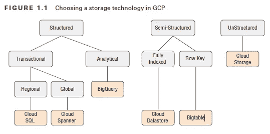

选择谷歌数据库产品

> **例子**:你的数据库大小是 500 GB。数据是半结构化的，不需要完全原子性。你需要在谷歌云平台上的销售点应用程序中处理交易？您需要考虑用户的指数级增长，但又不想管理基础设施开销？
> 
> 使用**数据存储**
> 
> **示例**:数据超过 1 Tb，要求低延迟(您可能也不关心成本):
> 
> 使用 **BigTable**
> 
> 低延迟**不需要**和/或需要运行 **ANSI SQL** 分析并经济地执行**？需要方便地从 **CSV 和 JSON** 加载数据，以便以后用 SQL 检查？**
> 
> **使用 **BigQuery** 。云数据存储支持 JSON 和类似 SQL 的查询，但不能轻松接收 CSV 文件。云 SQL 可以从 CSV 读取，但不容易从 JSON 转换。云 Bigtable 不支持类似 SQL 的查询。**
> 
> **你正在 Google Cloud 上设计一个**关系型**数据仓库，以便按需增长。数据将在**事务上保持一致**，并从**世界上的任何位置**添加。您希望监控和调整输入流量的节点数，输入流量可能会出现不可预测的峰值。**
> 
> **使用**云扳手****
> 
> **你需要**强一致性事务**？数据小于 500 Gb？数据**不需要流**或实时？**
> 
> **使用**云 SQL****

## **请注意:**

****高可用性和高性能**以及类似**故障转移和读取副本**的功能。**

# **毕竟有很多重大问题。**

## **请注意:**

**开发和生产实例、磁盘类型(HDD 与 SSD)。**

****BigTable 性能示例**:您的组织将部署一批新的物联网设备，预计写入 BigTable 实例的峰值为每秒 50，000 次查询。您已经优化了行键设计，需要设计一个能够满足这一需求的集群。你是做什么的？**

> ****回答**:一个优化的 Bigtable 实例，一个设计良好的行键模式，理论上可以支持每个节点每秒 10000 个写查询，所以需要 5 个节点。**

****阅读** : [了解云 Bigtable 性能](https://cloud.google.com/bigtable/docs/performance)**

****BigTable 性能示例:**您被要求调查一个性能很差的 BigTable 实例。表中的每一行代表来自物联网设备的一条记录，并在各自的列中包含 128 个不同的指标，每个指标包含一个 32 位整数。如何修改设计以提高性能？**

> ****回答**:大量单元格排成一行会导致云 Bigtable 性能下降。当数据本身很小时，就像在这个场景中，简单地从一个单元格中检索所有指标，并在单元格中使用分隔符来分隔数据会更有效。行版本控制会沿着表中效率最低的维度创建最多的新条目，从而使问题复杂化，而 HDD 磁盘总是会减慢速度。**

****阅读** : [了解云大表性能](https://cloud.google.com/bigtable/docs/performance)**

****BigTable 性能示例:**您的生产 BigTable 实例当前使用四个节点。由于表的大小增加，您需要添加额外的节点来提供更好的性能。您应该如何在没有数据丢失风险的情况下实现这一点？**

> ****回答**:编辑实例细节，增加节点数。保存您的更改。数据将在不停机的情况下重新分发。您可以在 Bigtable 中添加/删除节点，而无需停机。**

****阅读** : [云大表概述|云大表文档](https://cloud.google.com/bigtable/docs/overview)**

****BigTable 性能示例:**您当前有一个 BigTable 实例，一直用于运行开发实例类型的开发，使用 HDD 进行存储。您已经准备好将开发实例升级到生产实例，以提高性能。您还希望将存储升级到 SSD，因为您需要实例的最高性能。你该怎么办？**

> ****答**:您不能更改现有 Bigtable 实例上的磁盘类型，您需要将您的 Bigtable 数据导出/导入到具有不同存储类型的新实例中。您需要导出到云存储，然后再次返回到 Bigtable。**

****BigTable 性能示例:**您的客户使用了一个 BigTable 实例，其中包含两个用于区域灾难恢复的复制集群。来自应用程序的表事务需要高度一致。对于这种配置，您如何保证这一点？**

> ****答**:确定一个集群为主集群，使用指定单集群路由的应用配置文件。默认情况下，云 Bigtable 最终是一致的。为了保证强一致性，您必须使用应用程序配置文件将查询限制到实例中的单个集群。**

**阅读:[复制概述|云 Bigtable 文档|谷歌云](https://cloud.google.com/bigtable/docs/replication-overview#consistency-model)**

****阅读** : [云大表概述|云大表文档](https://cloud.google.com/bigtable/docs/overview)**

****BigTable 性能示例:**如果一个节点宕机，BigTable 实例中的数据会发生什么变化？**

> ****答**:没有，因为存储与节点计算是分开的。从 RAID 重建不是有效的 Bigtable 函数。存储和计算是分开的，因此一个节点宕机可能会影响性能，但不会影响数据完整性；节点仅将指向存储的指针存储为元数据。**

****阅读** : [云大表概述|云大表文档](https://cloud.google.com/bigtable/docs/overview)**

****BigTable 性能示例:**您正在监视 GCP 操作(以前称为 Stackdriver)指标，这些指标显示您的 BigTable 实例的存储利用率接近每个节点 70%。你是做什么的？**

> ****答**:向群集中添加额外的节点，增加存储处理能力。尽管云 Bigtable tablet 数据存储在 Google Colossus 中，但是集群需要适当地调整大小，以便节点有足够的资源来处理使用中的总存储。当每个节点的实例存储利用率达到 70%时，应添加额外的节点。**

**阅读:[配额&限制|云 Bigtable 文档|谷歌云](https://cloud.google.com/bigtable/quotas#storage-per-node)**

****BigTable 性能示例:**在 BigTable 实例中，以下哪一项不是选择 HDD 存储类型而不是 SSD 的有效理由？**

> ****回答** : Bigtable 可以与云存储集成，而不考虑实例使用的磁盘类型。选择 HDD 作为例外情况的其他原因是有效的，但一般来说，SSD 磁盘是首选，因为 HDD 磁盘将导致性能显著下降。**

****阅读** : [云大表概述|云大表文档](https://cloud.google.com/bigtable/docs/overview)**

# **关系数据库问题**

## **请注意:**

**副本、可用性和迁移指南。**

****示例**:您正在 Google Cloud 上设计一个关系型数据仓库，以便根据需要进行扩展。这些数据在事务上是一致的，可以从世界上的任何地方添加。您希望监控和调整输入流量的节点数，输入流量可能会出现不可预测的峰值。你该怎么办？**

> ****回答**:使用云扳手存放。监控 CPU 利用率，如果在您的时间跨度内利用率超过 70%,则增加节点数。**

****例子**:您的客户希望将一个 2TB 的 MySQL 数据库迁移到 GCP。他们的业务要求正常运行时间 SLA 超过 99.95%。你如何实现这一点？**

> ****答**:将数据库迁移到 Cloud SQL for MySQL 高可用性配置，在二级区域有一个备用实例。云 SQL 的标准 SLA 是 99.95%。通过在辅助可用性区域中使用具有故障转移实例的高可用性配置，可以实现超过这一时间的正常运行时间。故障切换副本不是一项功能，读取副本才是。冷备盘效率低下，因为它们不会自动切换，这与正确的高可用性配置不同。实现所需的 SLA 不需要计算引擎选项。**

****阅读** : [云 SQL 服务级别协议(SLA) |云 SQL 文档](https://cloud.google.com/sql/sla) [高可用性配置概述|云 SQL for MySQL](https://cloud.google.com/sql/docs/mysql/high-availability)**

# **很多关于 Pub/Sub，卡夫卡，开窗的问题。**

## **请注意:**

**卡夫卡镜像，这两者的区别。**

## **发布/订阅**

**Pub/Sub 处理来自全球的流量呈指数级增长的需求。Apache Kafka 将无法像 Pub/Sub 一样处理全球用户的指数增长。**

**云发布/订阅保证向每个用户至少发送一次消息。因为每个订单都需要通知多个系统，所以您应该创建一个主题并使用多个订阅者。发布/订阅不保证交付顺序，因此如果可能，请在发布系统中附上时间戳。**

****改为**:[https://cloud.google.com/pubsub/architecture](https://cloud.google.com/pubsub/architecture)**

****示例**:贵公司的 Kafka 服务器集群无法根据数据接收需求进行扩展。流式数据接收来自世界各地。他们如何将这一功能迁移到 Google Cloud，以便能够为未来的增长进行扩展？**

> ****回答**:创建一个单独的发布/订阅主题。将端点配置为发布到发布/订阅主题，并将云数据流配置为订阅相同的主题，以便在消息到达时对其进行处理。**

 **[## 阿帕奇卡夫卡和谷歌云发布/订阅

### 大数据消息系统的一些竞争者是 Apache Kafka、Google Cloud Pub/Sub 和 Amazon Kinesis(不是……

www.jesse-anderson.com](https://www.jesse-anderson.com/2016/07/apache-kafka-and-google-cloud-pubsub/)** 

# ****安全、加密和密钥管理****

****示例**:您的组织有一个安全策略，要求安全部门必须拥有和管理存储在云存储桶中的数据的加密密钥。分析师和开发人员需要存储用这些密钥加密的数据，而不需要访问密钥本身。如何实现这一点？**

> ****答**:使用云 KMS 让安全团队在一个专门的项目中管理他们自己的加密密钥。授予云 KMS 加密密钥加密器/解密器角色，用于其他项目中云存储服务帐户的密钥。云 KMS 允许您创建和管理自己的加密密钥，这些密钥可由其他项目中的服务帐户使用。然后，这些项目中的开发人员可以访问服务，而无需访问底层密钥。不需要临时区域，也不需要安全团队进行任何其他手动干预。**

****阅读** : [使用客户管理的加密密钥|云存储|谷歌云](https://cloud.google.com/storage/docs/encryption/using-customer-managed-keys)**

**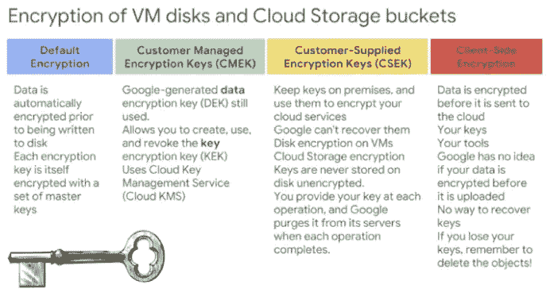**

**加密方法的比较。来源:Coursera**

# **建立和运行数据处理系统**

## **Dataproc**

## ****注意:****

**针对 Dataproc 工作负载的 HDFS 与谷歌云存储。**

****最佳实践** : Dataproc 集群最好是特定于工作的。如果您需要扩展，请使用云存储，因为 HDFS 不会很好地扩展，并且需要自定义设置。此外，谷歌建议使用云存储而不是 HDFS，因为它更具成本效益，尤其是在工作不运行的时候。**

****阅读**:[https://cloud . Google . com/solutions/migration/Hadoop/Hadoop-GCP-migration-jobs](https://cloud.google.com/solutions/migration/hadoop/hadoop-gcp-migration-jobs)**

## **数据流**

## **请注意:**

**`PCollection`分支、展平和连接、变换和滑动窗口。**

*   ****展平**——可以使用 Beam SDKs 中的`Flatten`变换来合并**同类型**的多个`PCollection`。**
*   ****Join** —您可以使用 Beam SDK 中的`CoGroupByKey`转换来执行两个`PCollection`之间的关系连接。`PCollection`必须是键控的(即它们必须是键/值对的集合)，并且它们必须使用相同的键类型。**

**阅读:[https://beam . Apache . org/documentation/pipelines/design-your-pipeline/](https://beam.apache.org/documentation/pipelines/design-your-pipeline/)**

****开窗**:**

** [## 波束编程指南

### Apache Beam 是一个开源、统一的模型和一组特定于语言的 SDK，用于定义和执行数据…

beam.apache.org](https://beam.apache.org/documentation/programming-guide/#windowing) 

**示例**:你正在编写一个流云数据流管道，在将用户活动更新写入时序数据库之前，对其进行转换。当每个元素到达时不断地进行转换，您还需要在运行时依靠一些额外的数据来创建转换。你如何实现这一点？

> **回答**:如果 ParDo 在处理 input PCollection 中的每个元素时需要注入额外的数据，那么 Side inputs 就很有用，但是额外的数据需要在运行时确定(而不是硬编码)。合并不会获得相同的结果，使用外部 shell 脚本是不必要的，也是低效的。

**阅读** : [光束编程指南](https://beam.apache.org/documentation/programming-guide/#side-inputs)

示例:您需要设计一个管道，它可以从您的组织的应用程序指标以及您的用户数据库中接收批量数据，然后在输出到 BigQuery 之前使用一个公共键连接数据。最有效的方法是什么？

> **回答**:创建一个云数据流管道，并在公共键上使用 CoGroupByKey 转换连接两个 PCollections。CoGroupByKey 对具有相同键类型的两个或多个键/值 p 集合执行关系联接；“常用钥匙”是这个问题中的神奇线索。

**阅读** : [光束编程指南](https://beam.apache.org/documentation/programming-guide/#core-beam-transforms)

**示例:** *您正在计算引擎上设置多个 MySQL 数据库。出于审计目的，您需要从 MySQL 应用程序中收集日志。您应该如何处理这个问题？*

> **回答**:在您的数据库实例上安装 Stackdriver 日志代理，并配置 fluentd 插件，以读取您的 MySQL 日志并将其导出到 Stackdriver 日志中。 **Stackdriver Logging** 代理需要配置 fluentd 插件来从数据库应用程序中读取日志。不是 Stackdriver 监控，不是 Cloud Composer。Cloud Composer 用于管理工作流，而不是日志记录。Stackdriver 监控对于测量性能指标和警报非常有用，但对于日志则没有用处。

**阅读** : [关于日志代理|云日志|谷歌云](https://cloud.google.com/logging/docs/agent)

**示例**:您想要对当前生产中的云数据流管道进行更改，该管道从云存储中读取数据，并将输出写回到云存储中。在开发过程中测试变更的最简单和最安全的方法是什么？

> **答**:使用 DirectRunner，利用本地计算能力，和一个分段存储桶，对流水线进行试运行。使用带有临时存储桶的 DirectRunner 配置是测试新管道的最快捷、最简单的方式，不会有更改当前生产中的管道的风险。

**改为** : [直接流道](https://beam.apache.org/documentation/runners/direct/)

**示例**:您被要求调查一个性能很差的 Bigtable 实例。表中的每一行代表来自物联网设备的一条记录，并在各自的列中包含 128 个不同的指标，每个指标包含一个 32 位整数。如何修改设计以提高性能？

> **回答**:使用分隔符将指标存储在一列中。确保群集正在使用 SSD 磁盘。一行中的大量单元格会导致云 Bigtable 的性能下降。当数据本身很小时，就像在这个场景中，简单地从一个单元格中检索所有指标，并在单元格中使用分隔符来分隔数据会更有效。行版本控制会沿着表中效率最低的维度创建最多的新条目，从而使问题复杂化，而 HDD 磁盘总是会减慢速度。

**阅读** : [了解云大表性能](https://cloud.google.com/bigtable/docs/performance)

# 操作化机器学习模型

我从谷歌文档开始，因为我已经熟悉了 ML 的基本概念，但我认为官方的谷歌 ML 速成课程对考试非常有用。100%我应该先从这个开始。它有很多阅读内容和视频。

 [## 机器学习入门|机器学习速成班

### 本模块介绍机器学习(ML)。预计时间:3 分钟学习目标识别实用…

developers.google.com](https://developers.google.com/machine-learning/crash-course/ml-intro) 

每一部分都有一个小测验，这样你可以检查你的理解程度:

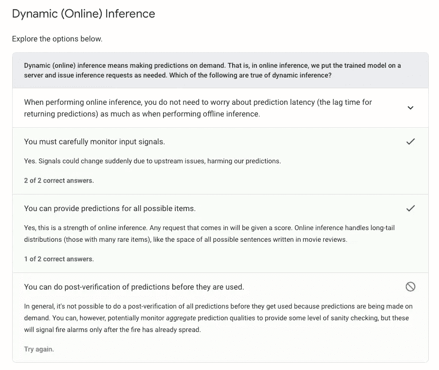

动态(在线)推理

> 这个考试真的是机器学习重。

***例题:***

[**示例 L1/L2 正则化**](/l1-and-l2-regularization-methods-ce25e7fc831c?gi=b89612114f53) **:** 您正试图训练一个张量流模型，但您意识到您的一些输入特征对预测没有显著影响。您可以采用什么技术来降低模型的复杂性？

> **回答:** **L2 正则化**在所有特征具有相对相等的权重/影响时更相关，这里不是这种情况。超参数处理学习率，与这个问题无关。 **L1 正则化**能够将不太重要的特征的权重降低到零或接近零。

**阅读** : [为了简单而正规化|机器学习速成班](https://developers.google.com/machine-learning/crash-course/regularization-for-simplicity/video-lecture)

**举例:** [**什么是过/欠拟合**](https://www.tensorflow.org/tutorials/keras/overfit_and_underfit) **以及如何修复。**你正在训练一个面部检测机器学习模型。您的模型因过度拟合您的训练数据而受到影响。你能采取什么步骤来解决这个问题？

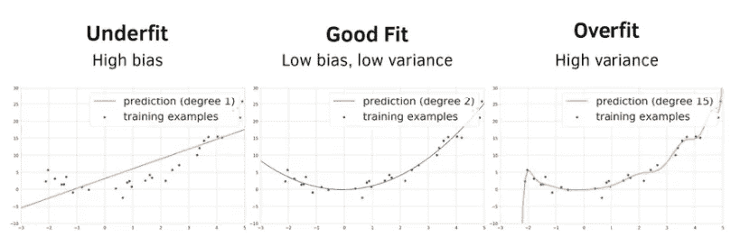

> **简单回答:**修复**欠拟合**(例如，当你的模型在训练集上的均方根误差(RMSE)是在测试集上的两倍时。)增加模型的复杂性(引入一个额外的层或者增加词汇表的大小)。
> 模型**过拟合**时，预测训练数据很好，但在验证集上表现不佳。要修复**过度拟合:减少特征的数量** ( **正则化**)，**添加更多数据**以增加样本的多样性并更好地概括您的模型**，**使用**丢弃层**或**通过移除层或减少隐藏层中的元素数量来降低**网络的容量。**增加您的正则化参数**也允许您减少模型中的“噪声”以减少过度拟合。

**阅读:**[https://developers . Google . com/Machine-learning/crash-course/generalization/peril-of-over fitting](https://developers.google.com/machine-learning/crash-course/generalization/peril-of-overfitting)还有这里:[机器学习工作流程| AI 平台|谷歌云](https://cloud.google.com/ai-platform/docs/ml-solutions-overview)

*   [**合成特征**](https://developers.google.com/machine-learning/crash-course/feature-crosses/video-lecture)

**简单回答:**

> 一个 [**特征**](https://developers.google.com/machine-learning/glossary#feature) 不存在于输入特征中，而是从一个或多个输入特征中创建的。合成特征的种类包括:——**将一个连续的特征存储到范围仓中。-将一个特征值乘以(或除以)其他特征值或自身。—创建一个 [**特征交叉**](https://developers.google.com/machine-learning/glossary#feature_cross) **:** 一个 [**合成特征**](https://developers.google.com/machine-learning/glossary#synthetic_feature) 通过交叉(取一个[笛卡尔积](https://wikipedia.org/wiki/Cartesian_product))单个二元特征形成。特征交叉有助于表示非线性关系。**

****示例** [**Google 机器学习 API**](https://cloud.google.com/pricing/list)**:**您正在开发一个应用程序，该应用程序只能识别并标记图像中特定的 B2B 产品徽标。您没有使用机器学习模型的广泛背景，但需要让您的应用程序正常工作。目前完成这项任务的最佳方法是什么？**

> ****答**:使用 AutoML 视觉服务，通过视觉 API 训练定制模型。Cloud Vision API 可以识别常见的徽标，但自己很难找到特定的业务徽标。最好的选择是 AutoML，它允许您采用预先训练的 Vision API，并将其应用于自定义图像。从头开始创建一个定制的 ML 模型是非常耗时的，当您可以在现有的模型上构建时，这是没有必要的。**

****阅读** : [云自动 ML 视觉](https://cloud.google.com/vision/automl/docs)**

****示例**:您需要快速为您的应用程序添加功能，使其能够处理上传的用户图像，提取图像中包含的任何文本，并对文本执行情感分析。你该怎么办？**

> ****回答**:调用云视觉 API 进行光学字符识别(OCR)然后调用自然语言 API 进行情感分析。用于 OCR 的云视觉 API 是从用户上传的图像中提取的最快方法。自然语言 API 已经有了一个内置的情感分析模型。**

****阅读** : [检测图像中的文本|云视觉 API |谷歌云](https://cloud.google.com/vision/docs/ocr) [分析情感|云自然语言 API |谷歌云](https://cloud.google.com/natural-language/docs/analyzing-sentiment)**

****示例**:您正在开发一个移动应用程序，它允许食品加工企业检测出变质的水果。仓库的工作人员将使用移动设备对水果进行拍照，以确定是否应该丢弃。您可以使用哪些 GCP 服务来实现这一目标？**

> ****答**:用已经变质的水果的标签图像训练一个自动视觉模型。使用 ML 套件中的 AutoML Vision Edge 将定制模型部署到使用 ML 套件客户端库的移动设备。AutoML 视觉服务是使用图像数据训练自定义分类模型的最快方法，ML 工具包中的视觉边缘将允许模型部署到 Android 和 IOS 设备。为了训练模型，必须对图像进行标记。不需要使用 Kubernetes 引擎或 App 引擎。**

**阅读: [AutoML Vision API 教程|云 AutoML Vision |谷歌云](https://cloud.google.com/vision/automl/docs/tutorial)**

****示例**:您有大量图像希望通过自定义自动视觉模型进行处理。时间不是因素，成本才是。你应该采取哪种方法？**

> ****回答**:使用 batchPredict 方法对整批图像进行异步预测请求。批量预测通常比同步(在线)预测提供更低的每次推理成本和更高的吞吐量。但是，批量预测会产生一个长时间运行的操作(LRO)，这意味着只有在 LRO 完成后结果才可用。**

****阅读** : [批量预测|云自动视觉|谷歌云](https://cloud.google.com/vision/automl/docs/predict-batch)**

## **ML 产品**

**[这个](https://cloud.google.com/pricing/list)是一个完整的列表，很容易找到所有文档。只需浏览概述和用例部分。**

**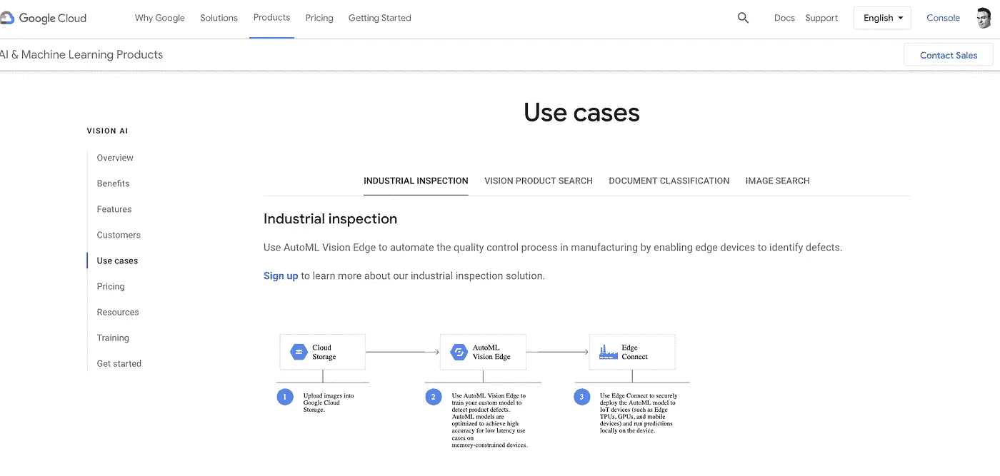**

**视觉人工智能用例**

****语音转文本 API 最佳实践**:【https://cloud.google.com/speech-to-text/docs/best-practices **

**https://cloud.google.com/vision/docs/labels**云视觉 API**:**

**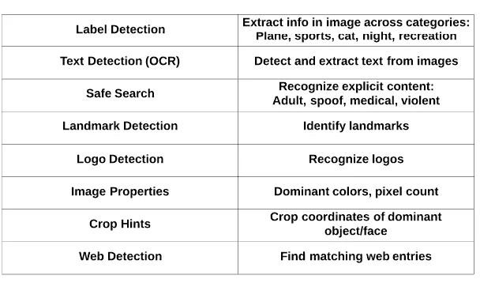**

**来源:Linux 学院**

## **自然语言 API**

****例题**:你希望建立一个 AutoML 自然语言模型，对一些带有自定义标签的文档进行分类。如何确保为模型提供高质量的训练数据？**

> ****回答**:确保每个标签至少提供 10 份培训文档，但最常见标签的文档最好是最不常见标签的 100 倍。为了在为 AutoML 自然语言分类模型准备训练数据时获得最佳结果，每个标签的最小文档数为 10，理想情况下，最常见标签的文档数应该至少是最不常见标签的 100 倍。**

****阅读** : [准备你的训练数据| AutoML 自然语言|谷歌云](https://cloud.google.com/natural-language/automl/docs/prepare#classification)**

*   **[谷歌云 AI 平台](https://cloud.google.com/ai-platform)**
*   **[谷歌云 TPUs](https://cloud.google.com/tpu/)**
*   **[谷歌 ML 术语表](https://developers.google.com/machine-learning/glossary/)**

**此外，我推荐以下最佳实践指南:**

** [## 机器学习的规则:| ML 通用指南|谷歌开发者

### 本文档旨在帮助那些具有机器学习基础知识的人从谷歌的最佳…

developers.google.com](https://developers.google.com/machine-learning/guides/rules-of-ml/) 

# 在线模拟考试

## 来自 Linux 学院的谷歌认证专业数据工程师

***排名:4/5——可能是最好的一个。仍然不能涵盖你在考试中可能面临的所有方面。***

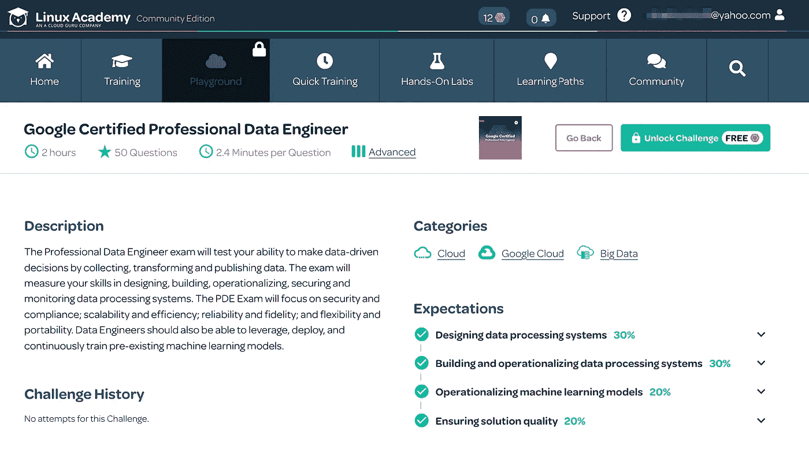

来自 Linux 学院的谷歌认证专业数据工程师

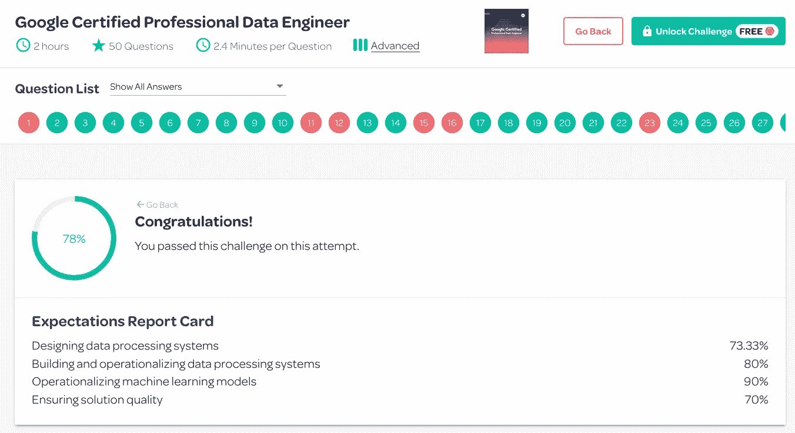

谷歌认证专业数据工程师结果

## Coursera **谷歌云专业数据工程师课程**

 [## 准备谷歌云专业数据工程师考试

### 由谷歌云提供。来自课程:“备考最好的方法是在技能上胜任…

www.coursera.org](https://www.coursera.org/learn/preparing-cloud-professional-data-engineer-exam) 

它有一个很好的资源部分，里面有**pdf 文件**，你可以用来准备考试。它也有 7 天的免费试用期。最终实践考试包括 25 道题，其中只有 4 道我发现与 **Linux Academy** 有些不同。

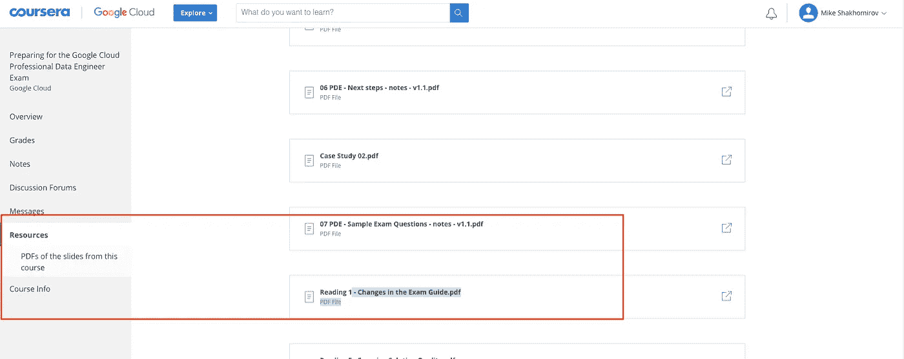

Coursera GCP 专业数据工程师-考试 pdf 和资源

## 云学院课程

最近一次更新是在**2020 年 7 月 10 日。**不幸的是，你不能在这里免费参加模拟考试，但他们有一个很好的移动应用程序和讲稿。所以我在体育馆骑车的时候做了这个。

 [## 数据工程师-谷歌云学院专业认证准备

### 本学习路径旨在帮助您准备 Google 认证专业数据工程师考试。即使…

cloudacademy.com](https://cloudacademy.com/learning-paths/data-engineer-professional-certification-preparation-for-google-83/) 

只需点击注册 7 天免费试用。

云学院— GCP 数据工程师考试(不提供免费版本)

# 最终提示

1.  决定你是否真的需要这个认证。备考是一个巨大的承诺。
2.  不要告诉任何人。
3.  了解更多关于机器学习的信息。会有很多。
4.  关注 ML 产品特性
5.  真正的考试问题比你在模拟考试中面临的问题更复杂。

# 推荐阅读:

[Ivam Luz](https://medium.com/u/8f3c967e1c89?source=post_page-----663b2dfac492----------------------):[https://docs . Google . com/spreadsheets/d/1 lutqhoejumyscfn 3 ZJ 8 arhzcmazr 3 VRP zy 7 vzj wishe/edit？usp =分享&source = post _ page-bb 6a 0812 a1 b 1-](https://docs.google.com/spreadsheets/d/1LUtqhOEjUMySCfn3zj8Arhzcmazr3vrPzy7VzJwIshE/edit?usp=sharing&source=post_page-----bb6a0812a1b1----------------------)

 [## 修正欠拟合和过拟合模型的黑客指南

### TL；DR 了解如何使用 TensorFlow 2、Keras 和 scikit-learn 处理欠拟合和过拟合模型。理解…

www.curiousily.com](https://www.curiousily.com/posts/hackers-guide-to-fixing-underfitting-and-overfitting-models/)  [## 我是如何通过谷歌云专业数据工程师认证考试的

### 没有推荐的 3 年实践经验

towardsdatascience.com](/passing-the-google-cloud-professional-data-engineer-certification-87da9908b333)  [## ml 874/GCP 河畔数据工程

### 这份备忘单目前是谷歌云平台上的 9 页参考数据工程。它涵盖了数据…

github.com](https://github.com/ml874/Data-Engineering-on-GCP-Cheatsheet)  [## 谷歌云专业数据工程师认证— 2020 年迷你指南

### 将此作为 2020 年参加考试的人的迷你指南。很难在上找到最新的指南…

medium.com](https://medium.com/@paulmacovei/google-cloud-professional-data-engineer-certification-2020-mini-guide-724244989403)  [## 机器学习速成班|谷歌开发者

### 学习和应用基本的机器学习概念的速成课程，获得现实世界的经验与…

developers.google.com](https://developers.google.com/machine-learning/crash-course)  [## 官方谷歌云认证专业数据工程师学习指南

### 经过验证的学习指南，为您准备新的谷歌云考试谷歌云认证专家数据…

www.wiley.com](https://www.wiley.com/en-us/Official+Google+Cloud+Certified+Professional+Data+Engineer+Study+Guide-p-9781119618454)  [## 2020 年考取谷歌云专业数据工程师认证

### 谷歌云专业数据工程师认证是一个技术认证，证明了知识和能力…

medium.com](https://medium.com/@alessandro.marrandino/taking-google-cloud-professional-data-engineer-certification-in-2020-7b698174af69)  [## 如何通过谷歌云专业数据工程师考试

### 没有推荐的 3 年行业经验

towardsdatascience.com](/how-to-pass-the-google-cloud-professional-data-engineer-exam-f241d7191e47)  [## 我的谷歌云专业数据工程师考试笔记

### 考试结束后，我立即做了一个记忆转储作为笔记。因此它也是非常无序的。这是一份经过清理的列表…

medium.com](https://medium.com/@sathishvj/notes-from-my-google-cloud-professional-data-engineer-exam-530d11966aa0)  [## 通过谷歌云专业数据工程师认证考试的终极秘诀(2019 年 10 月)

### 那么，为什么要考谷歌云专业数据工程师认证考试呢？

medium.com](https://medium.com/@sodiumsun/the-ultimate-hack-to-passing-google-cloud-professional-data-engineer-certification-exam-2019-oct-663b2dfac492)  [## 谷歌云——数据工程师考试学习指南

### 这是一份 12 页的考试学习指南，希望涵盖 GCP 数据工程师认证考试的所有要点

medium.com](https://medium.com/weareservian/google-cloud-data-engineer-exam-study-guide-9afc80be2ee3)  [## 如何准备谷歌云认证专业数据工程师考试，并通过你的…

### 在想新年计划吗？把谷歌云证书加入你的职业组合怎么样？数据…

medium.com](https://medium.com/datadriveninvestor/how-to-prepare-for-google-cloud-certified-professional-data-engineer-exam-and-pass-it-on-your-a7bdef8aa8d0)  [## 谷歌云认证:准备和先决条件

### 谷歌云平台(GCP)已经从一个小众玩家发展成为亚马逊网络服务的有力竞争者

cloudacademy.com](https://cloudacademy.com/blog/google-cloud-certification/)  [## 专业数据工程师实践考试|谷歌认证专家

### 数据工程师实践考试将使您熟悉认证中可能遇到的问题类型…

cloud.google.com](https://cloud.google.com/certification/practice-exam/data-engineer)****