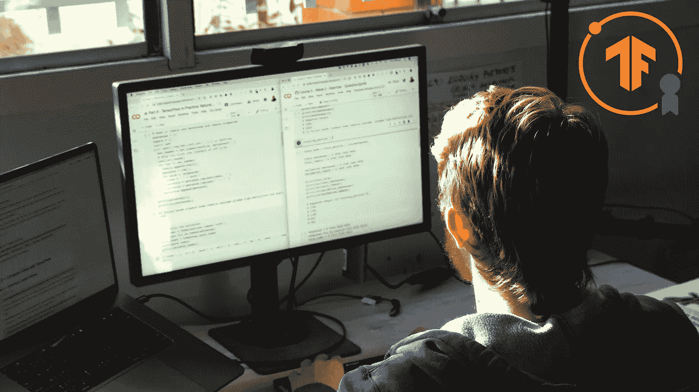
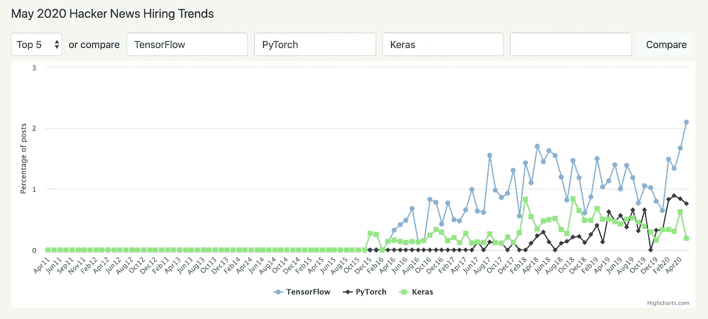
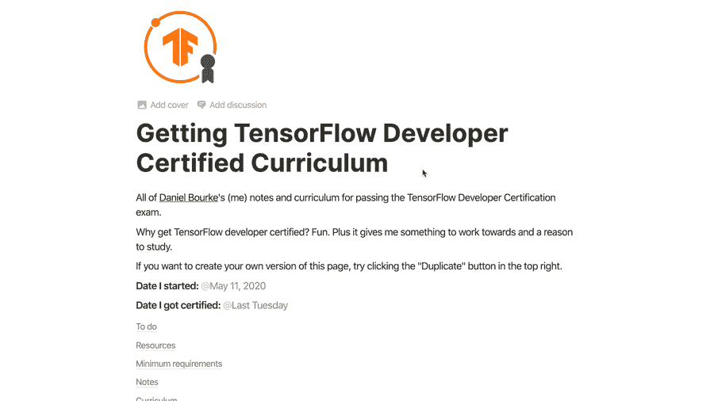
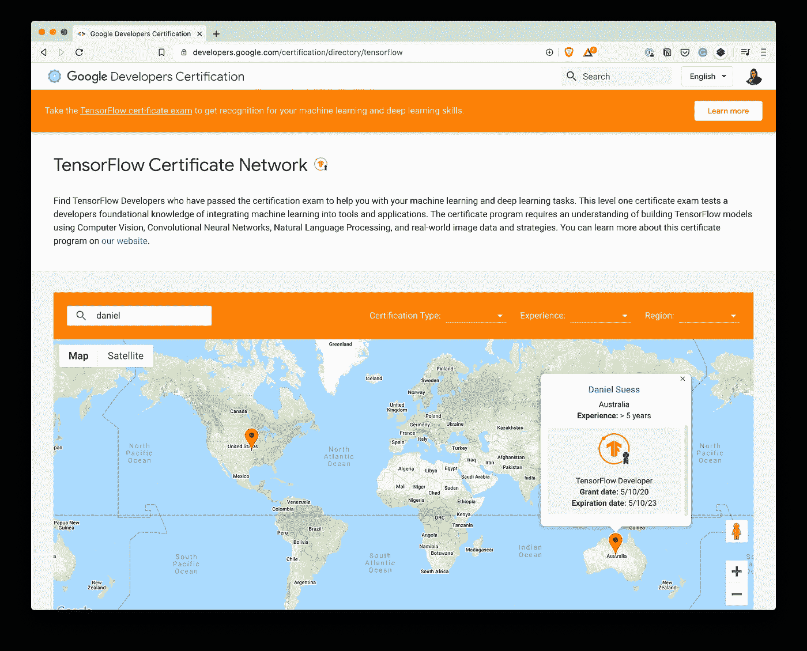

# 我如何通过 TensorFlow 开发人员认证考试

> 原文：<https://towardsdatascience.com/how-i-passed-the-tensorflow-developer-certification-exam-f5672a1eb641?source=collection_archive---------1----------------------->

## 你也可以



一个高技能开发人员的所有迹象:胡子拉碴的胡子，正在开发的鲻鱼，到处都是电缆，帽衫(必须的)。Sam Bourke 的照片，谢谢兄弟。

**更新(2021 年 2 月 26 日):**在收到一堆关于学习 TensorFlow 和如何通过认证考试的问题后，我制作了一个教授下面提到的技能的课程。 [**报名学习 TensorFlow**](https://dbourke.link/ZTMTFcourse) 的基础知识，以及如何通过 TensorFlow 开发者认证考试。

2020 年 5 月初，我决定获得 TensorFlow 开发者认证。所以我给自己设置了一个课程来提高我的技能，并在几天前(6 月 3 日)参加了认证考试。结果，我通过了。

让我告诉你我是怎么做到的，你也可以。

坚持住。张量流到底是什么？

TensorFlow 是一个开源的数值计算框架，它允许您预处理数据，对数据建模(在其中找到模式，通常通过深度学习)并将您的解决方案部署到世界各地。

这是谷歌用来支持其所有机器学习服务的。很有可能，你阅读这篇文章的设备之前已经运行过某种张量流。

通常，你会用非常容易理解的 Python(考试内容)或 JavaScript (tensorflow.js)编写 TensorFlow 代码，它会触发一系列用 C 编写的底层函数，执行你告诉它做的事情(大量的数值计算)。

好了，现在我们知道了什么是 TensorFlow，什么是 TensorFlow 开发者认证？你为什么会对它感兴趣？

# 什么是 TensorFlow 开发者认证？

[正如你可能已经猜到的，TensorFlow 开发者认证](https://www.tensorflow.org/certificate)是展示你使用 TensorFlow 能力的一种方式。

更具体地说，你使用 tensor flow(Python 版本)为一系列任务建立深度学习模型的能力，如回归、计算机视觉(在图像中寻找模式)、自然语言处理(在文本中寻找模式)和时间序列预测(在给定一系列过去事件的情况下预测未来趋势)。

# 为什么您可能希望获得 TensorFlow 开发者认证？

我的第一个理由是好玩。我想给自己一个小小的挑战去努力，给自己一个理由去读一本我买的新书(后面会有更多)。

但是另外两个有效的理由是:

1.  获得构建机器学习驱动的应用程序所需的基本技能。
2.  向未来的雇主展示你的技能。

说到未来的雇主，根据 Hacker News 的 Who's Hiring page (一个列出软件开发人员职位月度集合的页面)的[数据，与其他深度学习框架相比，TensorFlow 似乎遥遥领先。](https://www.hntrends.com/2020/may-big-drop-developer-job-postings.html?compare=TensorFlow&compare=PyTorch&compare=Keras)



比较不同的深度学习框架在 Hacker News 的招聘页面上的各种招聘帖子中的提及率。**注:**截至 TensorFlow 2.x，Keras 基本上是 TensorFlow 的一部分。**注 2:** 由于当前的全球环境，所有*软件开发人员职位的整体招聘都在下降。[图片来源](https://www.hntrends.com/2020/may-big-drop-developer-job-postings.html?compare=TensorFlow&compare=PyTorch&compare=Keras)。*

我想明确一点，有偿证书并不能保证找到工作。但是在在线学习的世界里，技能正在商品化，这是展示你能力的另一种方式。

我认为这是一个很好的补充，可以添加到你已经完成的个人项目列表中——课程建立基础知识，项目建立具体知识。

那么你是怎么做到的呢？

# 如何准备考试

当我决定要这么做时，我浏览了[认证网站](https://www.tensorflow.org/certificate)并阅读了 TensorFlow 开发者认证手册。

从这两个资源，我建立了以下课程。

# 课程——我学习了什么来建立通过考试所必需的技能

需要说明的是，在开始备考之前，我已经有了一些用 TensorFlow 构建几个项目的实践经验。

经验丰富的 TensorFlow 和深度学习实践者可能会发现，他们可以以与我相同的速度(总共 3 周)完成以下课程，甚至更快。

初学者需要多少时间就花多少时间。记住:培养任何有价值的技能都需要时间。

我列出了每种资源的时间表、成本(美元)和有用程度(通过考试)。时间线是基于我的经验。

如果你想为自己创建一个课程，我会推荐如下内容。

**注意:**对于付费资源，已经使用了附属链接。这不会改变资源的价格，但是如果你碰巧买了一个，我会收到一部分报酬:我用来创造这样的资源的钱。

## 1.[tensor flow 开发者认证手册](https://www.tensorflow.org/site-assets/downloads/marketing/cert/TF_Certificate_Candidate_Handbook.pdf)

**时间:** 1 小时。

**费用:**免费。

**乐于助人等级:**必选。

这应该是你的第一站。它概述了考试将涉及的主题。看完了再看一遍。

如果你是 TensorFlow 和机器学习的新手，你可能会读到这篇文章，并对所有不同的主题感到害怕。别担心。下面的资源将帮助您熟悉它们。

## 2.[Coursera 上的 TensorFlow 练习专精](https://dbourke.link/tfinpractice)

**时间:** 3 周(高级用户)到 3 个月(初学者)。

**费用:**7 天免费试用后每月 59 美元，可通过申请获得经济援助。如果不能访问 Coursera，可以在 YouTube 上看到[等效的免费版本。](https://www.youtube.com/playlist?list=PLQY2H8rRoyvwLbzbnKJ59NkZvQAW9wLbx)

**助人水平:** 10/10。

这是与考试(以及 TensorFlow 入门)最相关的资源。细心的学生会注意到 TensorFlow 认证手册和这个专业的大纲几乎完全相同。

它是由两位张量流和机器学习的巨头劳伦斯·莫罗尼和吴恩达教授的，如果我只能选择一种资源来准备考试，这将是它。

我欣赏短视频格式，并尽快关注实际操作的例子。每一部分末尾的多个代码笔记本是任何实际学习者的必备。

编程练习的一个技巧是:不要只是填补代码空白，要自己写出全部内容。

## 3.[使用 Scikit-Learn、Keras 和 TensorFlow 第二版进行机器实践学习](https://amzn.to/3aYexF2 )

**时间:** 3 周(从头到尾看完，不做练习)— 3 个月(从头到尾看完，做练习)。

成本:亚马逊上的价格各不相同，但我花了 55 美元买到了一份纸质版。你可以在 GitHub 上免费看到所有的[代码。](https://github.com/ageron/handson-ml2)

**有用程度:** 7/10(只因为有些章节与考试无关)。

这本书有 700 多页，基本上涵盖了所有的机器学习，因此也包括了一些与考试无关的话题。但对于任何有兴趣为未来的机器学习打下坚实基础的人来说，这是一本必读的书，而不仅仅是为了通过考试。

如果你是机器学习的新手，你可能会发现这本书很难读(首先)。同样，不要担心，你不着急，学习有用的技能需要时间。

这么说吧，如果你想了解这本书的质量，我会在早晨上班的路上阅读第一版。我可以告诉你，通常情况下，我会完全按照白天在书上读到的去做。

第二版没有什么不同，只是更新了最新的工具和技术，即 tensor flow 2 . x——考试的基础。

如果你只是在考试的相关章节之后，你会想要阅读:

*   第十章:用 Keras 介绍人工神经网络
*   第十一章:训练深度神经网络
*   第 12 章:使用 TensorFlow 定制模型和训练
*   第 13 章:用 TensorFlow 加载和预处理数据
*   第十四章:使用卷积神经网络的深度计算机视觉
*   第 15 章:使用 RNNs 和 CNN 处理序列
*   第十六章:使用 RNNs 和注意力的自然语言处理

但对于认真的学生，我建议看整本书和练习(也许不是全部，但挑选最适合激发你兴趣的)。

## 4.[麻省理工深度学习简介](http://introtodeeplearning.com/)

**时间:** 3 小时(我只看了 3 节课)— 24 小时(每节课 1 小时，另加 1 小时复习)。

**费用:**免费。

**乐于助人程度:** 8/10。

来自世界一流大学的世界一流深度学习信息，哦，我提到了吗？它是免费的。

前 3 讲，深度学习(一般来说)、卷积神经网络(通常用于计算机视觉)和递归神经网络(通常用于文本处理)与考试最相关。

但是，对于渴望学习的人来说，完成整个课程并不是一个坏主意。

一定要查看他们在 GitHub 上提供的实验室和代码，尤其是 TensorFlow one 的[介绍](https://github.com/aamini/introtodeeplearning/)。同样，我不能强调自己编写代码的重要性。

## 5.【PyCharm 入门

**时间:** 3 小时(取决于你的电脑有多快)。

**费用:**免费。

**乐于助人等级:** 10/10(必须使用 PyCharm)。

考试在 py charm(Python 开发工具)中进行。考试前，我从未用过 PyCharm。建议你在开始之前至少对它有所了解。

为了熟悉 PyCharm，我在 YouTube 上浏览了他们的入门系列，非常简单，“这是这个按钮的功能。”

但主要测试是确保 TensorFlow 2.x 运行没有任何问题，我的电脑可以在相当长的时间内运行深度神经网络(我的 MacBook Pro 没有 Nvidia GPU)。

为了测试这一点，我在本地机器上复制了以下两个 TensorFlow 教程:

1.  [用张量流进行图像分类](https://www.tensorflow.org/tutorials/images/classification)
2.  [用 TensorFlow 进行文本分类](https://www.tensorflow.org/tutorials/text/text_classification_rnn)

这两种方法在本地都运行良好，但是，正如我们将在下面看到的，当我开始测试时，我遇到了一个问题。

## 临时演员

*   [**Coursera/YouTube**](https://www.youtube.com/channel/UCcIXc5mJsHVYTZR1maL5l9w/playlists)上的 deeplearning.ai 视频——考试纯粹是基于代码的(Python 代码)，但如果你想知道你正在编写的代码(线性代数、微积分)背后发生了什么，我会在你认为合适的时候在这里加入和退出视频。比如你不确定什么是小批量梯度下降，搜索“deeplearning.ai 小批量梯度下降”。
*   [**TensorFlow 文档**](https://www.tensorflow.org/api_docs/python/tf)——如果你想成为一名 TensorFlow 实践者，你需要能够阅读这些文档。有不懂的地方，自己写代码，自己注释。
*   [**用 TensorFlow 在 YouTube 上编码(播放列表)**](https://www.youtube.com/playlist?list=PLQY2H8rRoyvwLbzbnKJ59NkZvQAW9wLbx)——大部分 TensorFlow 在实践 Coursera Specialization 在 YouTube 上的视频系列，也是同一个导师教的。

# 我是怎么备考的？

有了上面的资源，我在概念中拼凑了一个[大纲。](https://dbourke.link/tfcertifiedcurriculum)



我的 [TensorFlow 开发者认证课程 in idea](https://dbourke.link/tfcertifiedcurriculum)。我使用看板技术来跟踪需要做的事情，以及各种资源和笔记。如果您访问该链接，您可以通过点击右上角的“复制”按钮制作自己的副本。

整个五月的每个早上，我都会起床、写作、散步、阅读 1 小时的机器学习实践书籍、练习 2-3 小时的 TensorFlow(首先观看讲座，然后完成 Google Colab 中的所有编码练习)，然后在每个模块结束时，我会观看相应的麻省理工学院深度学习简介讲座。

例如，有一次我完成了 TensorFlow 实践专业化的计算机视觉部分，我看了麻省理工学院的卷积神经网络(一种计算机视觉算法)讲座。

这种三结合的方法被证明特别有效。

我在书中读到的一个概念会被 Coursera specialization 中的代码示例巩固，并最终被麻省理工学院的视频总结。

为了一个时间线的概念，5 月 11 日开始备考，6 月 3 日参加。

通过我的跟踪(在观念上)和我手写的书签，我平均每小时 20 页，每 2-3 小时的学习单元大约 1 周的课程内容(没有分心)。

最后，在考试前几天，我下载了 PyCharm，并确保我所经历的一些代码示例能够在我的本地机器上运行。

# 考试细节——实际考试过程中会发生什么？

你已经完成了你的研究？现在怎么办？

好吧，先说两个重要因素。

**考试费用:** $100 美元(每次考试，如果你失败了，你要等 2 周再试一次，以后每次失败要等更长时间)。

**时限:** 5 小时。如果没有考试开始时的错误，我会说我会在 3 小时内轻松完成考试。然而，延长的时间限制是为了给你足够的时间在你的计算机上训练深度学习模型(所以在开始之前确保这是可行的)。

## 考试是如何组织的？

我不会在这里透露太多，因为那会是欺骗。我要说的是阅读 TensorFlow 开发人员手册，你会对考试的主要部分有一个公平的想法。

练习手册中提到的每一种技术(使用上面提到的资源)，你会做得很好。

## 考试花絮

**训练模型** —如果你的计算机不能足够快地训练深度学习模型(评分标准的一部分是提交训练好的模型)，你可以使用免费的 GPU 在 Google Colab 中训练它们，然后下载，放在考试的相关目录中，通过 PyCharm 提交。

**我的破 Python 解释器** —备考资料强调考试需要 Python 3.7。我开始的时候有 Python 3.7.3。由于某种原因，即使 TensorFlow 前一天在我使用 PyCharm 的本地机器上工作，但在开始考试(它会自动为您创建 TensorFlow 环境)后，它就坏了。

也就是说，每次我运行一行 TensorFlow 代码，都会得到错误:

```
RuntimeError: dictionary changed size during iteration
```

现在不确定是考试安装的 TensorFlow 的版本(2.0.0)还是我曾经的 Python 的具体版本(3.7.3)。

尽管如此，在经过一番咒骂和对旧 GitHub 问题线程的深度搜索之后，我发现了一个奇怪的修复，这意味着必须修改我正在使用的 Python 版本的源代码(具体来说，就是 lincache.py 的[第 48 行)。](https://github.com/tensorflow/tensorflow/issues/33183#issuecomment-568262536)

```
# Previous line 48 of lincache.py
for mod in sys.modules.values():# Updated line 48 of linecache.py
for mod in list(sys.modules.values()): # added list()
```

**注意:**这只是权宜之计，因为是在考试期间做的，所以我不确定它是否有任何长期的好处或影响。

在我疯狂搜索的过程中，我还读到了一个替代方法，就是更新/重新安装你在 PyCharm 中使用的 TensorFlow 版本(例如 2.0.0 -> 2.2.x)。我试过了，但是没有用，作为 PyCharm 的新手，我怀疑是用户的错误。

实施修复后，我能够顺利完成考试。

# 考完试之后呢？

如果你通过了考试，你会收到电子邮件通知。除了“恭喜你通过了”或者“很遗憾你这次没通过”之外，不会有任何反馈。

在不破坏太多的情况下，当你参加考试时，你会得到一个非常清楚的指示，如果你有可能通过或不通过(每次你提交一个模型，它会被标记)。

但是如果你通过了，恭喜你！

请务必填写电子邮件中的表格，以确保您被添加到 [TensorFlow 认证开发者网络](https://developers.google.com/certification/directory/tensorflow)。



一旦你通过了考试，并填写了确认邮件中的表格，几周后你就可以进入谷歌的全球认证网络了。**注:**截至发稿，我还没到。需要 1-2 周才能出现。

在此注册意味着任何寻找熟练 TensorFlow 开发人员的人都可以根据您的认证类型、经验和地区找到您。

最后，在几周内(我还没有收到我的)，你会收到一封官方 TensorFlow 开发者证书和徽章的电子邮件。除了你做过的项目，你还可以增加两件事。

# 问题

**我可以只上课程、看书、自己练习吗，我真的需要证书吗？**

当然了。归根结底，你应该追求的是技能，而不是证书。证书是*最好拥有的*而不是*需要拥有的*。

如果你说不需要证书，那你为什么还需要呢？

我喜欢有挑战性的工作。为自己设定一个日期，比如“我将在 6 月 3 日参加考试”，这让我别无选择，只能学习。

我可以用免费资源来做这件事吗？

是的，你当然可以。您可以通过浏览 TensorFlow 文档来学习您需要的所有技能。事实上，当我需要练习一些东西时，我会逐字复制文档示例(每一行代码)，逐行练习理解，然后看看我自己能否做到。

为什么不是 PyTorch？

我爱 PyTorch。但他们不提供认证，如果他们提供，我可能也会这样做(为了好玩)。另外，两个框架(PyTorch 和 TensorFlow)的有经验的用户将开始看到最近的更新意味着这两个框架变得非常相似。如果说有什么不同的话，TensorFlow 在企业领域拥有优势(见上图)。

**我不知道任何机器学习，我能从哪里开始？**

阅读文章[学习机器学习的 5 个初学者友好步骤](https://www.mrdbourke.com/5-beginner-friendly-steps-to-learn-machine-learning/)。

**我已经通过了考试，并注册了谷歌开发者认证网，接下来我该做什么？**

是时候建造了！运用你所学的技能，做出你想在这个世界上看到的东西。别忘了分享你的作品，你永远不知道谁会看到。

一些没有提到的事？欢迎在下面发表评论或通过电子邮件[提问。我会回答的。](mailto:daniel@mrdbourke.com)

PS 如果你比较喜欢看东西，我做了一个[视频版的这篇文章](https://youtu.be/ya5NwvKafDk)。