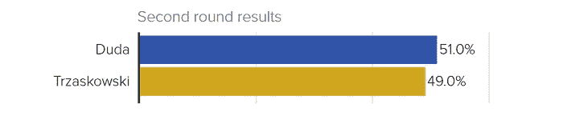
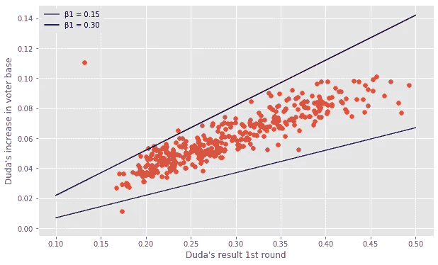
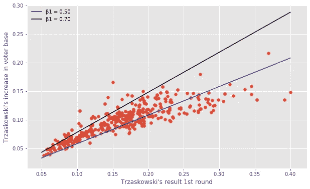

# 我如何用简单的线性回归预测选举结果

> 原文：<https://towardsdatascience.com/how-i-predicted-the-election-result-with-simple-linear-regression-e54c6c196239?source=collection_archive---------25----------------------->

## 这个简单的回归模型轻而易举地击败了所有主要的民调机构和博彩公司。

> 一切都应该尽可能简单，而不是更简单~阿尔伯特·爱因斯坦

长话短说——在我上周发表的 [**文章**](/president-duda-heading-for-a-firm-re-election-according-to-262-144-simulations-3f5f6ceddb04) 中，我预测了波兰总统选举中两位候选人的选举结果。

*预测*
**杜达:50.97%
Trzaskowski:49.03%**

*官方结果*
**杜达:51.03%
Trzaskowski:48.97%**

对我来说，预测的准确性令人瞠目结舌。

在这篇文章中，我提供了一个总结，什么去计划，什么没有，什么见解可以从这些结果中得出。

我对 2005 年以来的历史数据进行了分析。在绘制了无数的图表，调查了不同类型的相关性之后，我决定了最终的模型。

如果你是一个喜欢盯着图表看的数据狂，或者是一个对功能选择持怀疑态度的数据科学家，看看我以前的工作。

# 基本模型

我决定将分析分解成一个个县的数据，以说明当地的差异和偏好。这给了我两个数据集，包括每个县的选举结果。一份包括第一轮投票数据，另一份包括决胜投票数据。

在决胜选举中，一切都归结于说服那些在第一轮选举中没有投票给你的人。选民基础的增加对确保你的竞争优势至关重要。

**注:**需要注意的是，选民基数是按该县合格选民总数*的百分比来衡量的，而不是按*投票数*的百分比来衡量的。*

自 2005 年以来，只有两个主要政党的候选人进入了决胜选举——法律与正义党和公民纲领党。我通过对过去三次选举运行上述回归来研究该模型。结果如下:

根据 2020 年的趋势进行调整后，预测系数为:

与 PiS 的情况类似:

最后，我假设这些系数是均匀分布的，并对选举进行了模拟，其中系数被画出，选举结果的实现被记录下来。

在这些模拟中，杜达总统的平均得分为 50.97%，平均投票率接近 65%。

# 官方结果

资料来源:POLITICO 民意调查

如上所述，杜达总统获得了 51.03%的选票，确保了他的第二个任期。看到这个结果与我的预测非常接近，我进一步查看了实际的回归系数。

比较每个县的选民基数增长，我得到了以下结果:

我们可以立即看到，在这两种情况下，**β0**截距都变大了。这意味着两位候选人能够在全国范围内保持一致的支持率。真实截距和预测截距之间的差异主要出现在投票率中，投票率为 68.18%，而预测投票率为 65.49%。

**β1**系数落在预测范围内，反映了政党动员未使用选民能力的能力。Trzaskowski (PO)的高 beta 1 来自第一轮结果与 Szymon hoownia 的高相关性，实际上将 hoownia 的选民计为 PO。

下面我包括实际增长以及模型的预测范围。

相对于第一轮投票中的候选人结果，针对 b0 和 b2 调整候选人增加

有趣的是， **beta 2** 最终远低于两位候选人的预期。对杜达总统来说，这是因为 Krzysztof Bosak 的选民基础在 PiS 和 PO 之间几乎平分秋色。在 rafatrzaskowski 一案中，原因是 Robert Biedro 和 wad ysaw Kosiniak-kamy SZ 的选民投票率低。然而，这与动员第三方选民的能力下降是一致的，因为两党的β2 系数一直在不断下降。

# 结论

这是一种实验性的方法，与科学界发表的任何具体方法都没有联系。然而，考虑到波兰社会的两极分化，历史趋势似乎在预测选举结果时发挥了重要作用。

请注意，在逐届选举的基础上，对 PiS 和 PO 候选人的支持相对增加。鉴于我在上一篇文章中谈到的政治环境，偏好会适度变化。因此，利用以前的选举可以给我们很多的洞察力。

此外，传统调查容易导致受访者的**行为偏差**！在决胜选举之前，拉法茨扎斯科斯基倾向于在包括未决定选民的投票中领先，而杜达则在没有他们的投票中领先。

因此，我深信传统的调查应该根据政治形势和历史趋势进行调整。目前，他们似乎只是复制粘贴受访者的回答，而没有任何更深入的分析。

# 你怎么想呢?

你认为这个分析遗漏了什么吗？

你认为我的假设是否正确？

也许你想更详细地谈谈这个模型？

**随时联系！**

 [## Cezary Klimczuk —数据科学家|伦敦大学学院毕业生

www.linkedin.com](https://www.linkedin.com/in/cezary-klimczuk-423522129/) 

> 我在 Jupyter Notebook 中使用 Python 进行了所有分析。
> 
> 我下载并清理了 pkw.gov.pl 的选举数据。请访问我的 [**GitHub 页面**](https://github.com/CezaryKlimczuk/PresidentialElection2020) ，深入探索我的项目！