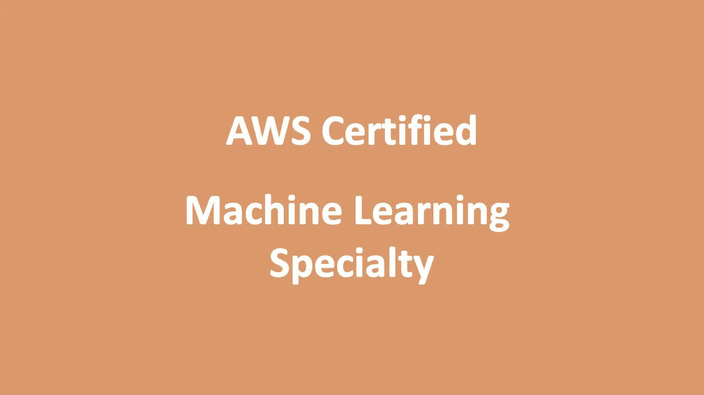
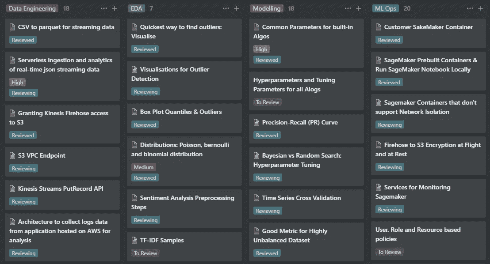
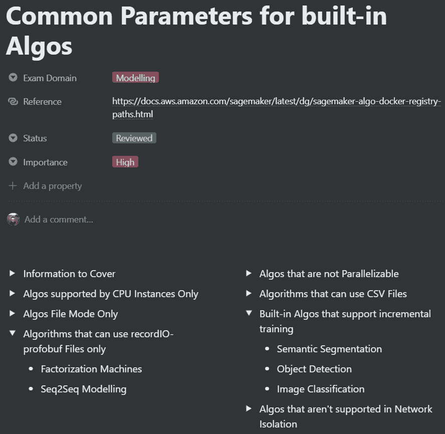

# 我如何准备 AWS 认证机器学习专业

> 原文：<https://towardsdatascience.com/how-i-prepared-for-the-aws-machine-learning-speciality-certification-10834924d192?source=collection_archive---------2----------------------->

## 我如何准备 AWS 认证机器学习-专业，我使用了什么资源，我如何规划我的时间，以及通过考试的技巧

作者图片

# 介绍

我最近刚刚以超过 95%的成绩通过了 AWS 认证机器学习专业考试，进行了大约 4 周的明确准备。

通过这篇文章，我想分享:

*   在开始准备这个考试之前，我对 AWS 和机器学习了解多少？
*   我采取了什么方法来准备这次考试？
*   我用了哪些资源来准备？
*   我用什么工具来帮助我？
*   备考小贴士

# 我的背景

首先，让我给你介绍一下我的背景，包括机器学习和 AWS 方面的知识。我原本是一名流体力学工程师，在英国一家工程咨询公司的石油和天然气团队工作。我选择参加这个考试的原因是为了验证我对端到端机器学习的理解，并发展我在为云上的机器学习系统构建可靠有效的架构方面的知识。虽然我通过在线课程(训练营)、研讨会和黑客马拉松学习数据科学已经有一段时间了(不到两年)，但我在数据科学领域还是一个相当新的人，作为数据科学家的专业经验还不到 1 年。就 AWS 而言，我也是新手，更不用说，我在预订 AWS ML 专业考试之前通过了 AWS 认证云从业者考试。我在这方面没有太多的专业经验，我在一些学习项目中使用过它，作为课程/研讨会和小型自由职业项目的一部分；但是和 AWS 官方推荐的不太接近。

# 首先成为 AWS 认证的云从业者

既然我们正在讨论云从业者考试，我想提一下，在您预订 ML 考试之前准备并通过云从业者考试当然是强烈推荐的，原因有二:

*   云从业者考试，让您很好地理解云概念和各种 AWS 服务，包括 S3、EC2、IAM 用户、角色和策略、云安全性、可扩展性、弹性、容错、共同责任模型、架构良好的框架和其他基础知识，这在准备 AWS ML 专业认证时非常有帮助。
*   云从业者考试费用为 100 美元，ML 专业考试费用为 300 美元，但如果您参加过云从业者考试，则下次 AWS 考试可享受 50%的折扣，总共只需 250 美元(两次考试加在一起)，节省了 50 美元，并且您还可以获得一次免费的实践考试。模拟考试要短得多，只有 20 个问题，而真正的考试有 65 个问题。

# 理解考试内容

考试分为 4 个领域:数据工程(20%)，探索性数据分析(24%)，建模(36%)和 ML 实施与操作(20%)。根据我在准备和考试期间的经验，EDA 和建模方面的内容可以很好地平衡您对主题本身以及 AWS 特定服务的理解，而数据工程和 MLOps 领域则稍微偏重于 AWS。因此，你应该做好两者兼而有之的准备，一个好的 ML 工程师，以及一个好的 AWS 工程师在考试中竭尽全力。

> 提示 1:做好两者兼而有之的准备，一个好的 ML 工程师，以及一个好的 AWS 工程师都要在考试中尽最大努力。

# 准备、资源和规划

我提前一个月开始准备，并在考试前 10 天预定了考试。在我预约考试的时候，我觉得我已经准备好了一半。在文章的这一部分，我将简要讨论我是如何准备考试的，以及我利用了哪些资源来最大化我通过考试的机会。完整的参考资料列表也可以在文章末尾找到。

当我开始准备时，我准备考试的方法并不完全清楚。但事实证明这是一个好主意，帮助我通过考试。最初，我从 AWS 和外部供应商的课程开始准备，后来用大量时间阅读其各种服务(主要是 Sagemaker)的 AWS 开发者文档来支持它，最后用大量的实践测试来支持，更不用说我已经从《用 Scikit-Learn、Keras 和 Tensorflow 实践机器学习》一书中阅读了机器学习和深度学习的基础知识。这些并不是按顺序进行的，但视频课程肯定是第一步。就我用于准备考试的时间而言，我会说大约每天 4 到 6 个小时，持续大约 4 周。这包括课程(以 1.25 倍或 1.5 倍的速度跑)和上面提到的所有其他课程。如果你每天花更少的时间或者更详细地浏览它，你可能想把它延长一段时间。

## 入门:机器学习之路

首先开始的地方是 AWS 建议备考的这条[机器学习路径](https://aws.amazon.com/training/learning-paths/machine-learning/data-scientist/)。在这条道路上，我主要关注两门课程，数据科学的要素和考试准备课程。《数据科学的元素》涵盖了数据科学的基础知识，如果你想参加这个考试，你应该知道很多，但这仍然是一个很好的复习。下一步是考试准备课程，该课程简要介绍了每个领域和子领域中您需要了解的所有内容。它只是概述了主题，你可以用它作为参考来检查你的准备情况。当我浏览课程内容时，我将整个课程内容作为笔记&截图，我后来不时地参考这些内容，以保持自己的进度。两者加起来最多需要 3-4 天。到目前为止，除了课程中的小测验之外，我没有阅读任何文档或练习题。

> 提示 2:多次快进你的学习，而不是一次一次地慢慢复习

## 进入 SageMaker

下一站，我开始从头开始浏览 sagemaker 文档，一个接一个，包括:[什么是亚马逊 SageMaker？](https://docs.aws.amazon.com/sagemaker/latest/dg/whatis.html)、[入门](https://docs.aws.amazon.com/sagemaker/latest/dg/gs.html)、 [SageMaker 工作室](https://docs.aws.amazon.com/sagemaker/latest/dg/studio.html)和[笔记本实例](https://docs.aws.amazon.com/sagemaker/latest/dg/nbi.html)。这些是最入门和初学者友好的部分，我在 SageMaker 控制台上跟随。作为补充，我还开始观看亚马逊 SageMaker 技术深潜系列，在我准备期间，我发现它非常有用。这是一系列 16 个视频，平均每个 15 到 20 分钟，我在接下来的日子里泡茶或吃早餐时不连续地观看。此时，我已经准备了大约一周半。

## 深入潜水:课程 1

在我完成 SageMaker 的最初部分后，我偶然发现了视频课程， [AWS 认证机器学习专业 2020-动手！夏羽·马瑞克和弗兰克·凯恩。为了节省时间，我没有亲自动手做所有的事情，但我确实完成了整个课程，观看了每一个视频，以便对考试内容有一个更全面的了解。这门课程当然会涉及大部分内容，包括一些你应该知道的机器学习的概念，但是这还不足以通过考试。你必须对机器学习和深度学习的基础有更好、更透彻的理解。这让我度过了第二周的周末。](https://www.udemy.com/course/aws-machine-learning/)

## 中途:课程 2 和 SageMaker 文档

接下来我上了 WhizLab 的 [AWS 认证机器学习——专业](https://www.whizlabs.com/aws-certified-machine-learning-specialty/)视频课程。这与之前的课程类似。当我经历这些的时候，我已经开始挑选一些主题每天阅读 AWS 的开发者文档；例如深度的特定算法，或者各种人工智能服务之一。对于我选择阅读的每一个算法，我会从头到尾阅读 sagemaker docs 必须传达的所有内容，通常每篇 3 到 5 页。这将包括诸如底层概念、预期的输入/输出格式、要调优的超参数等细节。对于每一个人工智能服务(例如 AWS 的理解)，我会通读它的功能，常见问题，并简要看看它的开发者指南，只是为了更好地了解它提供了什么。还有 8 天就要考试了。

> 技巧 3:阅读大量 SageMaker 文档，以至于您确切地知道在哪里可以找到什么信息。如果可能的话，多看几遍。

## 最重要的一点:练习测试

到那时，我已经完成了课程并对内容有了很好的理解，我从各种来源收集了大量的练习题和论文，包括 Udemy、EXAMTOPICS、testprep 和 AWS 网站上的样题。即使考试中的问题并不完全相同，但至少模拟测试促使我学习了考试可能需要的各种主题。我开始进行模拟测试，每天至少一次，当测试结束时，我会重新开始。完成每篇论文后，我会查看答案及其描述，并通读所有提供的参考资料。

## 抓住主题并掌握它们

当有如此多的东西需要学习时，很容易被内容淹没，忘记自己已经掌握了什么，还需要在哪些方面更加努力。对于我遇到的每一个难题或我回答错误的问题，我都用一个易于理解的标题、参考资料和链接来捕获这些问题或主题，并按考试领域和复习状态标记到一个[概念](https://www.notion.so)数据库中，这使我能够建立一个看板来掌握我的学习情况。这是它的快照。

修订主题的概念数据库，按作者分类的图像

对于每一个主题，我还会捕捉到我读到的最重要的细节，这样我就不需要重新查阅参考资料了。

修订主题的子页面，按作者排序的图像

对于我捕捉到的每个主题，我都反复查看，直到我有信心为止，每次访问它时都会更新查看状态。这种策略几乎类似于那些助推算法中的一种，其中你递归地训练弱学习者以形成强学习者。我发现这套有条理的笔记非常有用，尤其是在临近考试的时候。

> 技巧 4:练习大量的测试，捕捉要学习的主题和问题，组织它们，并反复复习。

## 规划时间

为了跟上课程、文档阅读和练习测试，我计划了每天的时间，以确保我涵盖了所有三个方面，并跟踪我的时间，例如，2 小时用于论文，1 小时用于阅读，1 小时用于观看课程视频，更不用说，阅读和视频几乎总是针对我决定掌握的专门主题。甚至在我完成了一次课程视频后，当我临近考试时，我又看了一遍建模和数据工程部分。在过去的两天里，我只是反复检查我在概念数据库和练习试卷中标记的考试题目。

> 技巧 5:计划你的时间，记录时间，在阅读、视频和练习题之间合理分配时间，更具体地说，分配到不同考试领域的主题

## 就在考试前和考试后

就在考试前，我必须承认，经过几周的训练和练习，我仍然感到紧张。老实说，我不确定我能不能通过。但是我已经承诺不会改变考试日期，所以别无选择。然而，通过考试是数周强化学习后最愉快的经历。因此，我强烈推荐这个考试给任何对使用 AWS 感兴趣的数据科学家/ML 工程师。AWS 是领先的云服务提供商之一，通过自己在云中的一套强大的算法和人工智能服务，无疑主导了 ML 领域。

> 提示 6:你可能会感到有点紧张，但如果你付出了努力，你肯定会得到回报。

# 资源列表

**课程和视频讲座**

*   [亚马逊 SageMaker 技术深潜系列](https://www.youtube.com/watch?v=uQc8Itd4UTs&list=PLhr1KZpdzukcOr_6j_zmSrvYnLUtgqsZz)【视频系列】
*   [AWS 认证机器学习专业 2020——动手！](https://www.udemy.com/course/aws-machine-learning/)【视频课程】
*   [AWS 认证机器学习—专业](https://www.whizlabs.com/aws-certified-machine-learning-specialty/)【视频课程】

**需要阅读的文件和书籍**

*   [亚马逊 SageMaker 开发者指南](https://docs.aws.amazon.com/sagemaker/latest/dg/whatis.html)【文档】
*   [AWS 文档](https://docs.aws.amazon.com/)与考试相关的其他 AWS 服务【文档】
*   [使用 Scikit-Learn、Keras 和 TensorFlow 进行机器实践学习](https://www.amazon.co.uk/Hands-Machine-Learning-Scikit-Learn-TensorFlow/dp/1492032646) [Book]
*   AWS 服务(理解/确认/等)概述页面、功能页面和常见问题解答[AWS 网站]