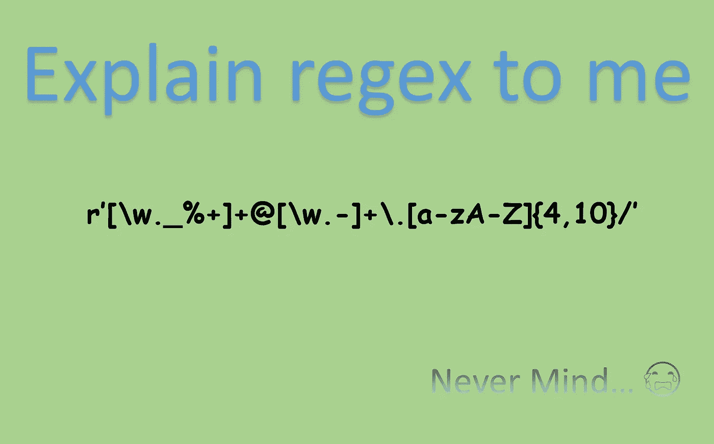
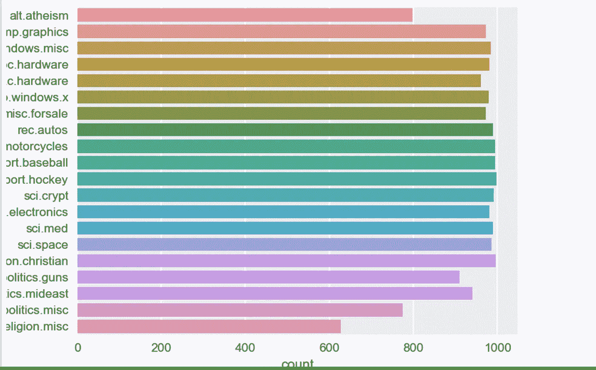
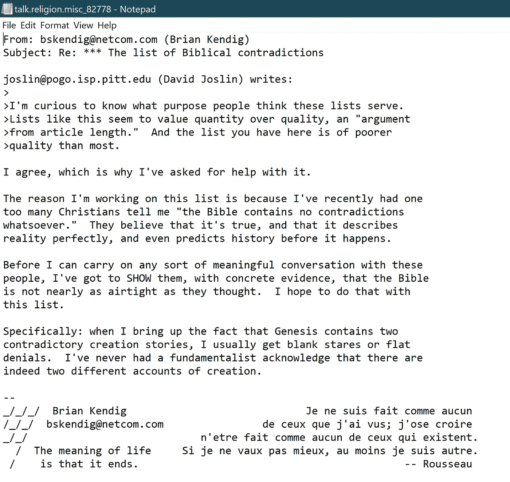
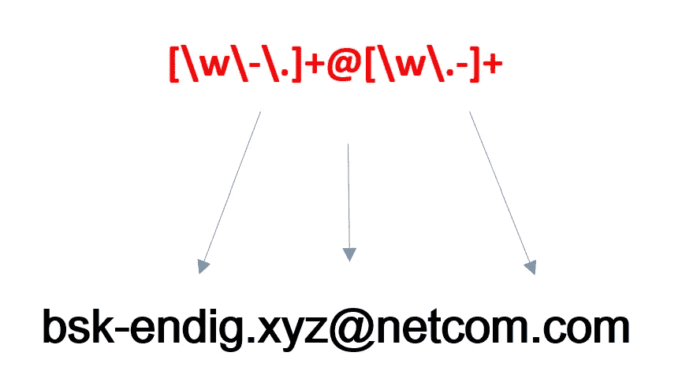
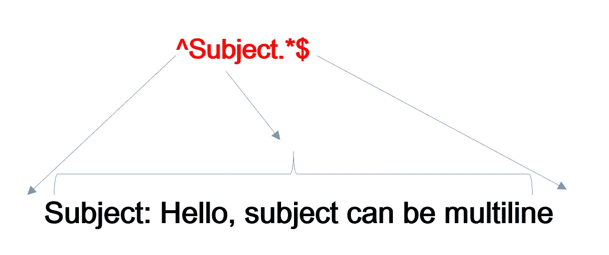
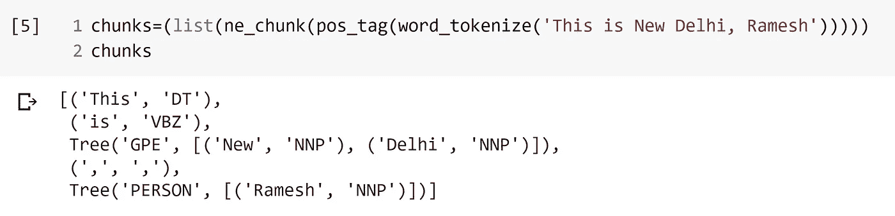
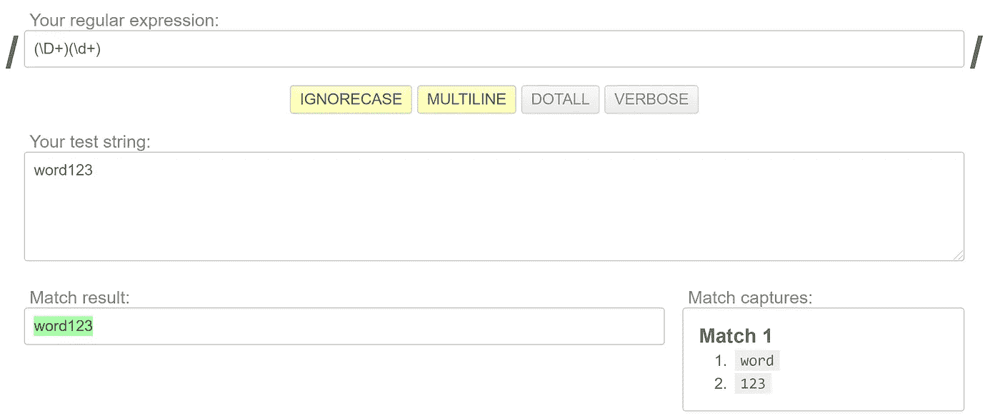
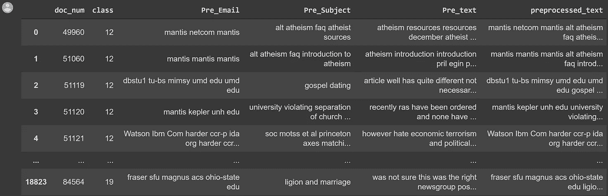
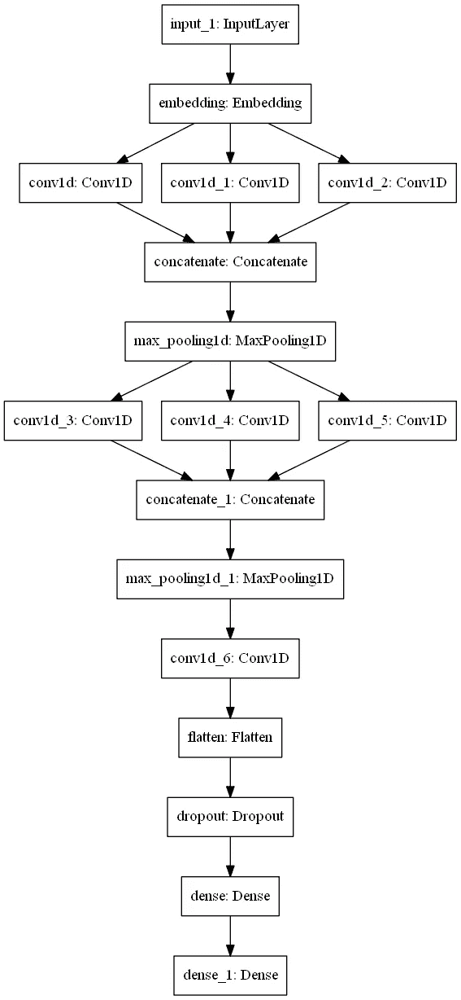

# 我如何使用 CNN 为我的文本分类任务使用正则表达式预处理文本数据

> 原文：<https://towardsdatascience.com/how-i-preprocessed-text-data-using-regular-expressions-for-my-text-classification-task-cnn-cb206e7274ed?source=collection_archive---------17----------------------->

# 使用正则表达式进行预处理的步骤

1.  从文件名中提取标签和文件编号
2.  提取电子邮件
3.  提取主题
4.  去收缩
5.  正在从以下位置删除写入:
6.  删除括号<>、()中的数据
7.  删除换行符、制表符
8.  用**分块**预处理人名和城市名
9.  移除数字
10.  使用**匹配将“_word_”、“_word”、“word_”替换为 word 会捕获**
11.  多方面的



# 介绍

自然语言处理是人工智能中处理语言数据的一个分支。它基本上是一个研究人和机器之间互动的分支。机器翻译、文本到语音、文本分类——这些是自然语言处理的一些应用。

> 在本文中，我将使用 1D 卷积神经网络对文本数据进行分类，广泛使用正则表达式进行字符串预处理和过滤。

> **本文的重点是如何使用正则表达式进行文本数据预处理**

# 问题陈述

数据是**新闻组 20** 数据集。我们的数据中总共有 20 种类型的文档。文档的名称包含标签和标签中的编号。格式为**' class label _ DocumentNumberInThatLabel '。**数据可以从[这里](https://drive.google.com/file/d/1rxD15nyeIPIAZ-J2VYPrDRZI66-TBWvM/view)下载。

我们的任务是对文本数据进行预处理，并将其分类到正确的标签中。



类别标签的计数图



示例数据(我们将在整篇文章中跟踪这些数据)

# 使用正则表达式预处理

我们已经创建了一个函数，它将原始数据作为输入，并将经过预处理的过滤数据作为输出。

## I .从文件名中提取标签和文件编号

我们将使用适用于字符串的拆分方法。

```
1   for filename in os.listdir(path):
2       i,j = filename.split('_')
3       j = int(j.split('.')[0])
4       label.append(i) 
5       doc_num.append(j)
```

对于路径中的所有文件名，我们获取文件名并将其拆分为“_”。**该功能。split()使用 paranthesis 中的元素来拆分字符串。**同样，我们再次使用它来过滤**。文件名中的 txt** 。

```
**Ex.- we get i = talk.religion.misc and j = 82778**
```

## **二。提取电子邮件**

我们的任务是找到一个文档中的所有电子邮件，提取“@”后的文本，并用“.”分割，去掉所有小于 3 的字，去掉”。com”。将所有内容组合成一个字符串。最后，我们将电子邮件从我们的文本中删除。

```
Ex.-
**[bskendig@netcom.com , joslin@pogo.isp.pitt.edu] →** **[netcom, pogo.isp.pitt.edu] → [netcom, pogo, isp, pitt, edu] →****“netcom pogo isp pitt edu”**
```

以下代码执行任务

```
em = [] # for each doc
st = ""  # for each doc#extracting email
for i in re.findall(r'[\w\-\.]+@[\w\.-]+\b', f):  #extracting email 
    temp=[]
    temp = i.split('@')[1]      #taking text after @
    temp = temp.split('.')     #a list containing words split by "." if 'com' in temp:
        temp.remove('com')

   for i in temp:            #removing words less than 3
        if len(i)>2:
            em.append(i)for i in em:            #joining all the words in a string
    st+=i
    st+=' 're.sub(r'[\w\-\.]+@[\w\.-]+\b',' ')    #removing the email
```

**正则表达式解释**



**\w →** 匹配任何字母数字字符

**\-\。→** 匹配“-”和。”(“\ "用于转义特殊字符)

**[]+ →** 匹配括号内的一个或多个字符

**……………………………………………………。@ →** 匹配[\w\-\后的“@”。]

## 三提取主体

在这项任务中，我们将只保留来自主题部分的有用信息。**主题:**将被删除，所有非字母数字字符将被删除。以下代码执行任务-

```
#extracting subject
temp1 = re.findall(r'^Subject.*$',f, re.MULTILINE)sub = temp1[0]
sub = sub[7:]   #Truncate Subjectfor i in string.punctuation:   #remove all the non-alphanumeric
    sub = sub.replace(i," ") sub = re.sub(r"re","",sub, flags=re.IGNORECASE) #removing Re sub = sub.lower()  #lower-casingre.sub(r'Subject.*$'," ", flags=re.MULTILINE)  #removing subject
```

**正则表达式解释**



**^ →** 占了字符串的开头。

**Subject →** 匹配字符串的开头是单词 Subject。

**。*** →匹配主题后的 0 个或多个单词。

**$** →检测字符串的结尾。

**注意:**“**^**”对于确保 Regex 只检测标题的“主题”很重要。它不应该在我们文本的任何其他部分检测到单词“subject”。

## 四。去收缩

用我会代替我会，用不能代替 T21 等等..

```
# specific
f = re.sub(r"won't", "will not", f)
f = re.sub(r"can\'t", "can not", f)# general
f = re.sub(r"n\'t", " not", f)
f = re.sub(r"\'re", " are", f)
f = re.sub(r"\'s", " is", f)
f = re.sub(r"\'d", " would", f)
f = re.sub(r"\'ll", " will", f)
f = re.sub(r"\'t", " not", f)
f = re.sub(r"\'ve", " have", f)
f = re.sub(r"\'m", " am", f)
```

## 动词 （verb 的缩写）正在从以下位置删除写入:

删除写在“写给:”和“发件人:”下的地址等内容。

```
f = re.sub(r"Write to:.*$","",f, flags=re.MULTILINE) f = re.sub(r"From:.*$","",f, flags=re.MULTILINE) f = re.sub(r"or:","",f,flags=re.MULTILINE)
```

**注意- "$"** 匹配字符串的结尾只是为了安全

## **六。删除括号内的数据< >，()**

删除括号内的所有数据。

我的名字是拉梅什(钦图)→我的名字是拉梅什

```
f = re.sub(r"<.*>","",f, flags=re.MULTILINE) f = re.sub(r"\(.*\)","",f,flags=re.MULTILINE) 
```

## VII。移除换行符、制表符

```
#delete /,-,/n,f = re.sub(r"[\n\t\-\\\/]"," ",f, flags=re.MULTILINE)
```

## 八。组块

组块是基于词性标注从句子中提取有价值的短语的过程。它给句子增加了更多的结构，帮助机器更准确地理解句子的意思。你可以阅读尼基塔·巴查尼[的这篇](https://medium.com/u/e44ae4099762?source=post_page-----cb206e7274ed--------------------------------)[文章](/chunking-in-nlp-decoded-b4a71b2b4e24)，她详细解释了分块。



组块的例子

我们的任务是在组块的帮助下删除城市名并给城市名添加下划线。Ex- Ramesh 将被删除，新德里→新德里

```
chunks=[]
chunks=(list(ne_chunk(pos_tag(word_tokenize(f)))))for i in chunks:
    if type(i)==Tree:
        if i.label() == "GPE":
            j = i.leaves()
                if len(j)>1:   #if new_delhi or bigger name
                    gpe = "_".join([term for term,pos in j]) f = re.sub(rf'{j[1][0]}',gpe,f, flags=re.MULTILINE)              #replacing delhi with new_delhi f = re.sub(rf'\b{j[0][0]}\b',"",f, flags=re.MULTILINE)       #deleting new, \b is important if i.label()=="PERSON":           # deleting Ramesh         
            for term,pog in i.leaves():
                f = re.sub(re.escape(term),"",f, flags=re.MULTILINE)
```

正如我们上面看到的，组块有三个部分- **标签，术语，词性。如果类型是树，标签是 GPE，那么它是一个地方。如果这个地方有不止一个单词，我们用“_”将它们连接起来。**

```
f = re.sub(rf'{j[1][0]}',gpe,f, flags=re.MULTILINE)
f = re.sub(rf'\b{j[0][0]}\b',"",f, flags=re.MULTILINE)
```

我们一起使用了格式字符串和正则表达式。“j”包含叶，因此 j[1][0]包含第二项，即**德里**，j[0][0]包含第一项，即**新。所以，我们把德里换成了新德里，删掉了 new。\b 是检测单词的结尾。**

```
f = re.sub(re.escape(term),"",f, flags=re.MULTILINE)
```

为了删除 Person，我们使用了 **re.escape** ,因为这个术语可以包含一个字符，这个字符对于 regex 来说是一个特殊的字符，但是我们想把它仅仅当作一个字符串。

## 九。移除数字

```
f = re.sub(r'\d',"",f, flags=re.MULTILINE) 
```

## X.将“_word_”、“_word”、“word_”替换为 word

```
f = re.sub(r"\b_([a-zA-z]+)_\b",r"\1",f) #replace _word_ to word

f = re.sub(r"\b_([a-zA-z]+)\b",r"\1",f) #replace_word to wordf = re.sub(r"\b([a-zA-z]+)_\b",r"\1",f) #replace word_ to word
```

这里，我们使用一种叫做**的匹配捕获。**

在我们使用“ **\b_([a-zA-z]+)_\b”获得字符串之后，**匹配捕获使我们能够只使用匹配字符串的特定部分。这里我们在下划线之间有一组并列句。因此这里有一组。我们使用 **r '\1'** 来提取特定的组。简单的例子来解释这个概念。



有两个参数，所以有两个匹配捕获

## XI 杂项

{m，n} →这用于匹配 m 和 n 之间的字符数。m 可以是零，n 可以是无穷大。

```
f = re.sub(r"\b[a-zA-Z]{1}_([a-zA-Z]+)",r"\1",f) #d_berlin to berlinf = re.sub(r"\b[a-zA-Z]{2}_([a-zA-Z]+)",r"\1",f) #mr_cat to catf = f.lower()      #lower casef = re.sub(r'\b\w{1,2}\b'," ",f) #remove words <2f = re.sub(r"\b\w{15,}\b"," ",f) #remove words >15f = re.sub(r"[^a-zA-Z_]"," ",f)  #keep only alphabets and _

f = re.sub(r" {2,}", " ", f, flags=re.MULTILINE) # REMOVE THE EXTRA SPACES
```

# 最终数据准备

如前所述，整个预处理被放在一个返回五个值的函数中。将我们的数据传递给这个函数-

```
doc_num, label, email, subject, text = preprocessing(prefix)
```

创建包含预处理的电子邮件、主题和文本的数据帧。类别标签已被整数取代。



预处理文本是这三者的串联

# …向量化…

在将数据分成训练和测试(0.25)之后，我们将数据矢量化成算法可以理解的正确形式。我们已经使用了来自 keras 的 **tokenizer 函数，它将用于嵌入向量。**

> ***最后对文本进行编码并填充，创建统一的数据集。***

# 模型

我们训练该数据集的模型由三个'**一维卷积'**层组成，这些层连接在一起，并通过下面给出的其他各层。



最后一块是我们的最终输出(softmax，categorical _ crossentropy)

# 结论

在训练模型之后，我们得到大约 75% **的准确率**，这可以通过在模型中做一些调整来容易地进一步提高。本文的主要焦点是预处理部分，这是比较棘手的部分。