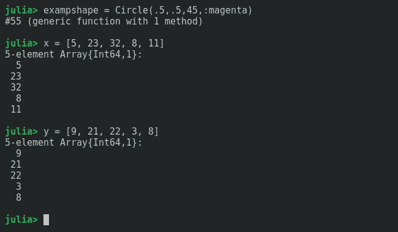
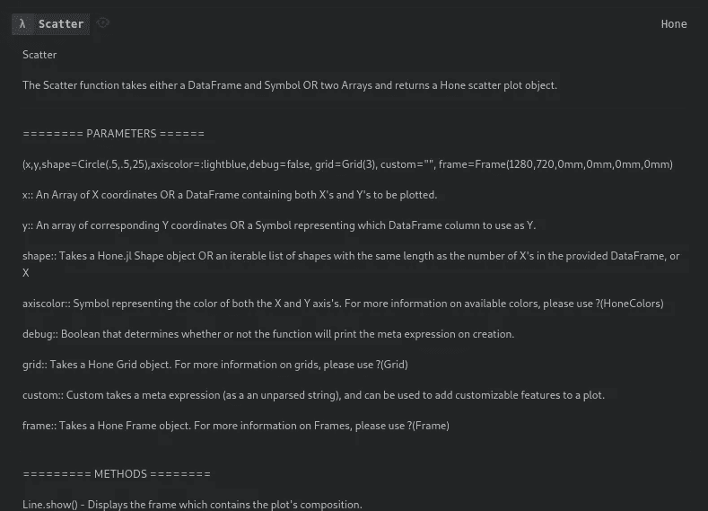
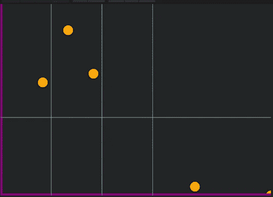
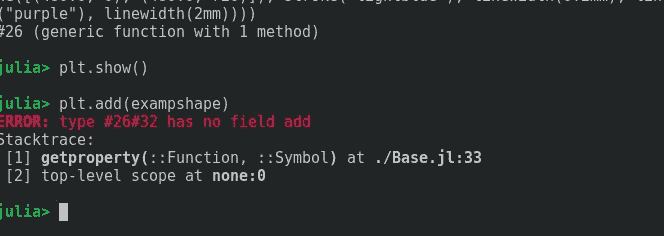
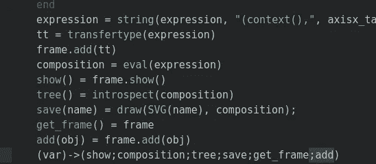
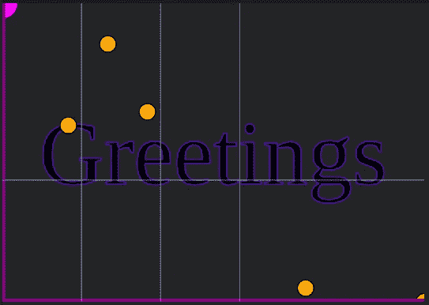
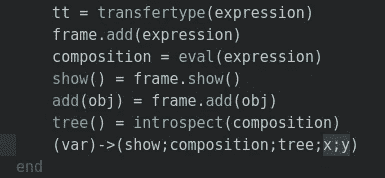
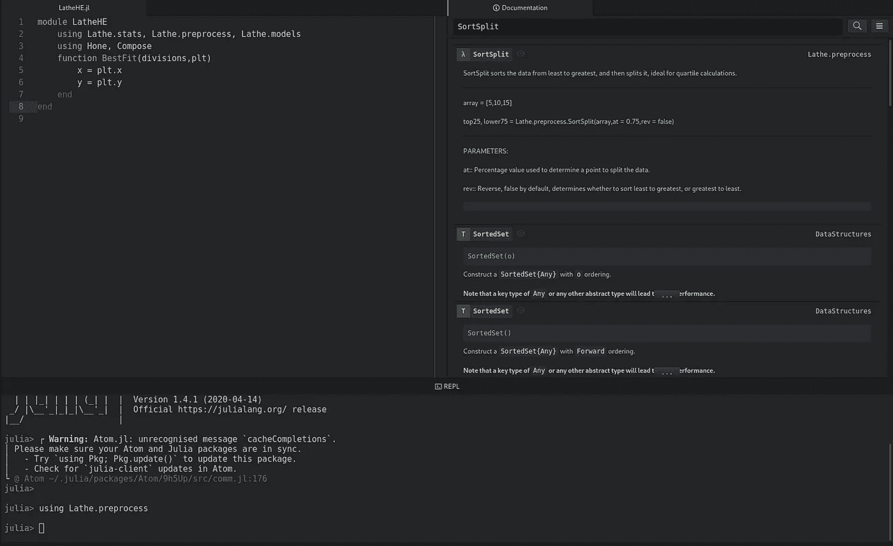
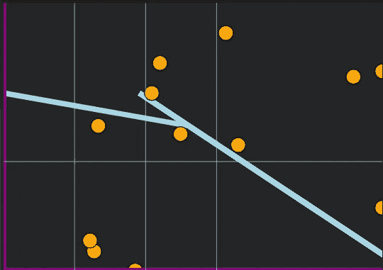

# 我是如何在 Julia 中编写第一个 Hone 扩展的

> 原文：<https://towardsdatascience.com/how-i-programmed-the-first-hone-extension-in-julia-edf7813d0e1b?source=collection_archive---------85----------------------->

## Hone.jl

## 在 Julia 中创建和使用我的绘图库的扩展。


> [Github 回购](https://github.com/emmettgb/LatheHE.jl)

# 介绍

当我最初为 Julia 创建矢量绘图库 Hone.jl 时，我希望有一个模块化的绘图库，可以由任何人扩展。使用这种方法，用户将能够创建包扩展来增加功能，并使它成为一个更好的通用库。

创建一个能够做这样事情的包说起来容易做起来难。然而，这个想法对我很有吸引力，因为据我所知，真的没有其他图形库做这样的事情。对朱莉娅来说尤其如此。不幸的是，在我们开始创建一个 Hone 扩展之前，我们必须增加一些代码。

# 为 Hone 添加扩展

从相对早期的版本开始，Hone 就有了可扩展的能力。然而，这个系统并不是最好的。它使用一个名为 custom 的参数，用户可以在其中输入要作为元表达式计算的串联标记。像这样处理扩展有几个基本问题，会降低 Hone 扩展的可行性。

*   需要有一个自定义条件
*   输入标记需要连接，或者是连接在函数中的数组。
*   对于没有使用扩展的人来说，这将会降低功能的速度，使得 Hone 运行更慢，但没有任何好处。

这里是代码，所以你可以理解我指的是什么。所有提及“自定义”的内容均以粗体显示。

```
function _arrayscatter(x,y,shape=Circle(.5,.5,25),axiscolor=:lightblue,
        debug=false, grid=Grid(3), **custom=""**, frame=Frame(1280,720,0mm,0mm,0mm,0mm))
   topx = maximum(x)
    topy = maximum(y)
    axisx = Line([(0,frame.height), (frame.width,frame.height)],axiscolor)
   axisx_tag = axisx.update([(-1,-1), (-1,1), (1,1)])
    axisy = Line([(0,0), (0,frame.height)],axiscolor)
    axisy_tag = axisy.update([(0,0), (0,1), (0,1)])
    grid_tag = grid.update()
    ######
    ######
 **fullcustom = ""
    if custom != ""
        [custom = string(fullcustom, i) for i in custom]
    end**
    expression = string("")
    # Coordinate parsing -------
    for (i, w) in zip(x, y)
        inputx = (i / topx) * frame.width
        inputy = (w / topy) * frame.height
        exp = shape.update(inputx,inputy)
        expression = string(expression,string(exp))
    end
    expression = string(expression, "(context(),", axisx_tag,grid_tag,**custom**, axisy_tag,"),")
    tt = transfertype(expression)
    frame.add([tt])
    if debug == true println(expression) end
    composition = eval(expression)
    show() = frame.show()
    tree() = introspect(composition)
    save(name) = draw(SVG(name), composition);
    get_frame() = frame
    (var)->(show;composition;tree;save;get_frame)
end
```

量化一下，这段代码总共有 34 行。与 custom 相关的行数总共是 6，这意味着 17%的代码行属于 custom，而大多数时候它根本不会被使用。也许我疯了，但是

> 我不能忍受这个。

此外，每当我创建框架函数时，我都会创建一个名为 add()的方法，您可以在其中向框架添加一个对象。我想到，使用这种方法来添加任何扩展对象都比使用定制标签优越得多，也比让用户获取标签并将它们连接起来以使用旧系统容易得多。因此，在从 _arrayscatter()和 _dfscatter()函数中清除了所有出现的 custom 之后，我决定改进框架，以便能够接受这些对象。

```
add(object) = composition,objects,tag = _frameup(base,objects,object)
```

add 方法只是调用 _frameup 方法，并将为它提供框架的基本标记“base”、对象的迭代列表“objects”和 object。以前，旧的 add()方法是这样的:

```
add(objects) = composition,objects,tag = _frameup(base,objects)
```

这意味着几件事。首先，对象不会被添加到对象列表中，而是替换对象。更糟糕的是，提供的对象需要在一个数组中，函数才能工作(因为不能迭代单一类型。)这只是意味着当调用函数时，您需要使用数组语法:

```
# This is how you would expect it to work:
frame.add(object)
# This is the change you needed to make:
frame.add([object])
```

我不喜欢这样，因为它假设一个数组存在于一个对象中，而这个对象很可能永远是单独的。当然，这个函数只是 _frameup()方法的一个路由器，所以让我们来看看:

```
function _frameup(tag,objects)
    for object in objects
       tag = string(tag,"(context(),",object.tag, ")")
    end
    tag = string(tag,")")
    println(tag)
    exp = Meta.parse(tag)
    composition = eval(exp)
    return(composition,objects,tag)
end
```

对象只是连接到字符串，然后在解析和计算之前添加到表达式中。相反，应该做的是将对象添加到由类型提供的对象数组中。之后，可以将一个字符串与每个对象的标签连接起来。我是这样做的:

```
function _frameup(tag,objects,object)
    push!(objects, object.tag)
    objecttags = ""
    for o in objects
       objecttags = string(objecttags,"(context(),",o, "),")
    end
    println("objects: ",objecttags)
    tag = string(tag,objecttags,")")
    exp = Meta.parse(tag)
    println(exp)
    composition = eval(exp)
    return(composition,objects,tag)
ends
```

最后，我将向 _arrayscatter()和 _dfscatter()函数添加一个方法，该方法将调用框架来添加特性:

```
add(obj) = frame.add(obj)
```

> 现在我们来测试一下！

首先，我们将创建一个圆。这是我们将要添加到散点图顶部框架中的对象。我还创建了两个相同长度的数组来解析并绘制成散点图。



现在我们将创建我们的散点图。幸运的是，如果我们不记得我们的参数，Hone 有很好的文档可以参考。



```
plt = Scatter(x,y,Circle(.5,.5,25,:orange),:purple)
```

现在我们可以使用 show()方法:

```
plt.show()
```



我们可以把之前做的例子加进去，再展示一次。

```
plt.add(exampshape)
plt.show()
```



> 哎呀，

我们忘记将我们的方法添加到我们的类型中:



您可能已经注意到，幸运的是，我们确实有一个 get_frame()函数，我们可以调用它来返回我们的帧，并且我们可以从那里添加它。

```
fr = plt.get_frame()
fr.show()
```

这时我意识到我们把形状的 x 和 y 分别设置为 0.5 和 0.5，所以让我们改变一下…这次我们把它放在图的中心。这次我决定用文字:

```
realshape = Hone.Text("Greetings",(1280 / 2), (720 / 2), :blue, 30)
fr.add(realshape)
fr.show()
```



> 厉害！

# 创建扩展

众所周知，数据可视化和机器学习可以很好地结合在一起。考虑到这一点，我决定基于车床机器学习库对 Hone 进行第一次扩展。这也将是 Hone 的统计图的家，因为他们将使用车床模块。女士们先生们，我向你们介绍

> LatheHE.jl

我决定给这个扩展添加的第一件事是绘制最佳拟合线的能力。这将相对容易，所以不要期望我一开始就做什么疯狂的事情。然而，要做到这一点，我们必须导出散点图方法中使用的所有数据，以便任何人在扩展图时都可以访问这些数据。所以回到 Hone，我只是将数据添加到类型中:



现在回到我们的最佳拟合线示例，我们可以使用 plt.x 和 plt.y 从我们的图中获取数据。为了制作最佳拟合线，我们可以采用几种方法:

*   拟合线性回归模型。
*   分离数据，得到所述数据每一部分的平均值，然后用这些点画一条线。
*   线性绘制四分位数。

我决定选择第二种方法，因为我认为这种方法可以获得最好的结果，同时对性能的要求也最低。车床.预处理有一个名为 SortSplit 的函数。要查看它的文档，我们需要首先将其导入到我们当前的环境中。

```
using Lathe.preprocess
```

然后我们可以在文档窗格中搜索它。



> 朱诺太方便了…

当然，第一步是从参数中获取数据，这是我设置函数的方式:

```
function BestFit(plt, divisions = 5, color = :lightblue, weight = 2)
        frame = plt.get_frame()
        x = plt.x
        y = plt.y
```

我认为像在网格中一样使用分割可能会很酷，这样用户可以确定他们想要分割最佳拟合线的次数，并且它会自动确定这样做的数据百分比。用 1 除以划分的数目将得到一个百分比，我们可以用它来确定我们离创建每个划分还有多远。

```
divisionamount = 1 / divisions
```

接下来，我们使用一个 while 循环，该循环不断地将除法量添加到一个变量中，该变量将处理每个除法的逻辑。

```
lower = 75
        totaldivisions = 0
        arrays = []
        while totaldivisions < 1
            top, lower = SortSplit(y,divisionamount)
            append!(arrays,top)
            totaldivisions += divisionamount
        end
```

我们在这里所做的只是将数组的小分割版本附加到一个数组中。接下来，我们需要对这个数组做一些实际的操作。

```
xmeans = [a = mean(a) for a in arrays]
```

我们将从数组中获取平均值，并将其赋给一个名为 xmeans 的变量。接下来，我们将对 y 值做同样的事情。

```
lower = 75
        totaldivisions = 0
        arrays = []
        while totaldivisions < 1
            top, lower = SortSplit(y,divisionamount)
            append!(arrays,top)
            totaldivisions += divisionamount
        end
        ymeans = [a = mean(a) for a in arrays]
```

接下来，为了执行缩放算法，我们需要 y 的顶部和 x 的顶部。

```
topy = maximum(y)
topx = maximum(x)
```

现在我们基本上要从 Hone 的 Linear()函数中复制从两个数组生成数组对的循环。如果您想了解关于这个函数的更多信息，我在这里写了一篇关于它的文章:

[](/adding-line-graphs-to-my-graphing-library-eb6447a0c726) [## 向我的图形库添加线图

### 继续构建 Hone.jl 中实现的特性，并调试出现的问题。

towardsdatascience.com](/adding-line-graphs-to-my-graphing-library-eb6447a0c726) 

```
pairs = []
        first = true
        for (i,w) in zip(xmeans,ymeans)
            if first == true
                x = 0
                first = false
            else
                x = (i / topx * frame.width)
            end
            y = (w / topy * frame.height)
            pair = Tuple([x,y])
            push!(pairs,pair)
        end
```

在这个循环中唯一不同的是有一个新的变量和条件名为 first，它将决定我们是否在第一个循环中。我这样做的原因是为了让这条线总是从左边来。另一种我们可以在这里做 X 的方法是，将框架高度除以划分的数量，然后将原始数量加到自身，直到我们达到划分的数量。这样做将确保该行始终是一个从零开始并在帧的末尾结束的函数。

最后，我们将把帧作为元组数组进行类型断言，创建一个 line 对象，把它放入一个 transfer 类型，而不是返回一个类型，我们只是把它添加到帧中。

```
pairs = Array{Tuple{Float64,Real},1}(pairs)
        lin = Line(pairs,color,weight)
        expression = string("(context(),",lin.update(:foo),")")
        tt = Hone.transfertype(expression)
        frame.add(tt)
end
```

现在让我们来试试吧！

```
plt = Scatter(x,y,Circle(.5,.5,25,:orange),:purple)
include("src/LatheHE.jl")
using Main.LatheHE
LatheHE.BestFit(plt,2)
plt.show()
```



在未来，我可能会考虑像我之前谈到的那样填充 X，而不是像这样，因为我们确实有很多重叠，因为 X 是我们除法的手段。

# 结论

我对 Hone extensions 的潜力感到非常兴奋！您可以执行任何操作，从创建用于绘制数据的自定义图形，到向绘图添加新要素。最重要的是，一切都变得完全自定义，因为我们使用标签来呈现一切。任何可以适当组合的东西都可以添加到任何框架中。

我看到未来有很多延伸。也许有些很简单，只是添加了一些你可以使用的不同的看起来很酷的图例。也许一些或更复杂，实际上动画你的情节或添加 Javascript 的交互性——可能性是无限的！如果你想开始制作自己的 Hone 扩展，你可以添加#Unstable 分支以获得最新版本(0.0.4)并开始试用它！

[](http://github.com/emmettgb/Hone.jl) [## emmettgb/Hone.jl

### 模块化的形状，网格和线条容易预制快速绘图简单和轻型车床集成(即将推出)…

github.com](http://github.com/emmettgb/Hone.jl)