# 我是如何剔除和分析巴黎人口统计数据的

> 原文：<https://towardsdatascience.com/how-i-scraped-and-analized-paris-demographical-data-7025acf01a09?source=collection_archive---------36----------------------->

## 使用 Python 和 Tableau 处理和分析数据

[https://www.pinterest.fr/pin/614108099163543096/](https://www.pinterest.fr/pin/614108099163543096/)

在过去的 20 年里，作为法国首都的巴黎一直面临着人口的重大转变。因此，分析它会很有趣。

在本文中，我们将从不同的来源收集数据，然后使用基本工具进行分析。

# 数据报废

## 巴黎人口演变

> “启动我的项目最方便的是什么？”

开始一个项目时的经典问题。
我开始在巴黎数据网站上搜索:[https://opendata.paris.fr/pages/home/](https://opendata.paris.fr/pages/home/)。在这里，我只找到当前的人口统计数据，没有关于它的演变。所以这项工作从一些数据废弃开始。

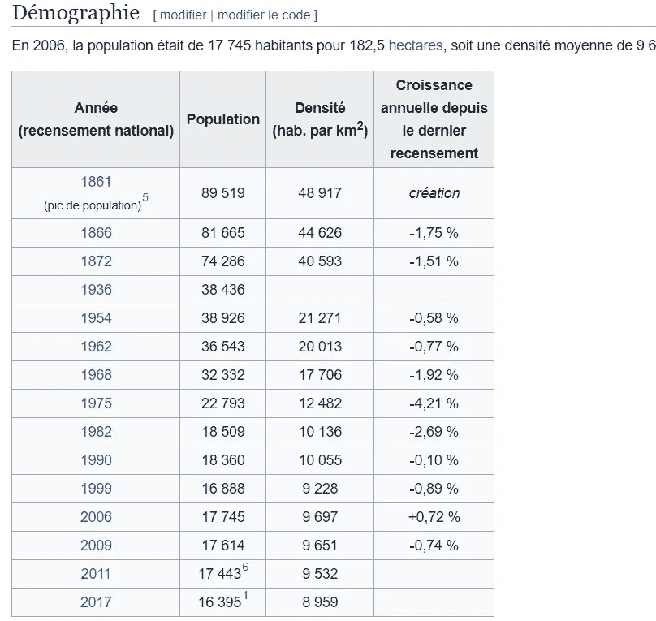

你可能知道，巴黎分为几个区，称为“区”。所以我需要每个地区的人口数量。

我们可以用这种表格为每个地区找到一页。这些维基百科页面有着相同的模式:

[https://fr . Wikipedia . org/wiki/" district number " arressment _ de _ Paris # D % C3 % a9 mographie](https://fr.wikipedia.org/wiki/1er_arrondissement_de_Paris#D%C3%A9mographie)

经过半个小时的报废，我很快获得了这样的东西:

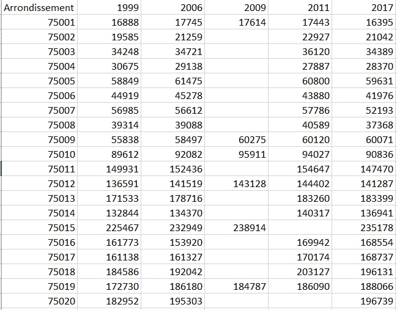

我只收集了 1999 年以后的数据来做分析。

我们可以看到，我们必须在分析之前处理这些数据

我们需要有一个数据框架，其中有区县，年份和人口为特征

我们可以使用融化功能来做到这一点。

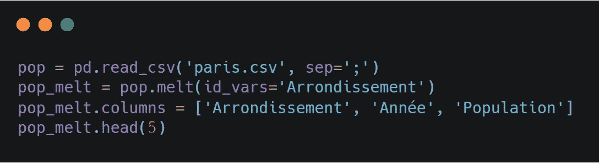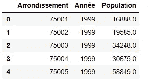

然后，我们将该数据帧保存为 csv 格式，以备将来使用

## 区域价格演变

分析这些地区一年来的价格变化可能很有意思，但我找不到合适的 csv 来分析。

我在巴黎公证处网站上找到了一个 pdf 格式的表格，里面有我想要的所有信息。

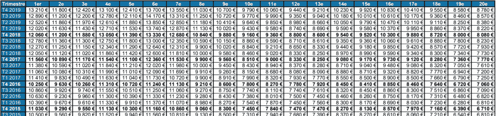

我用一个在线工具把这个 pdf 文件转换成 csv 格式。[https://www.zamzar.com/fr/convert/pdf-to-csv/](https://www.zamzar.com/fr/convert/pdf-to-csv/)

数据帧如下图所示。

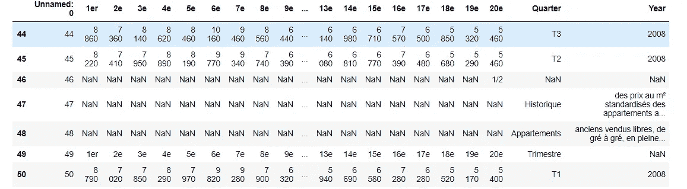

这里我们有很多预处理要做

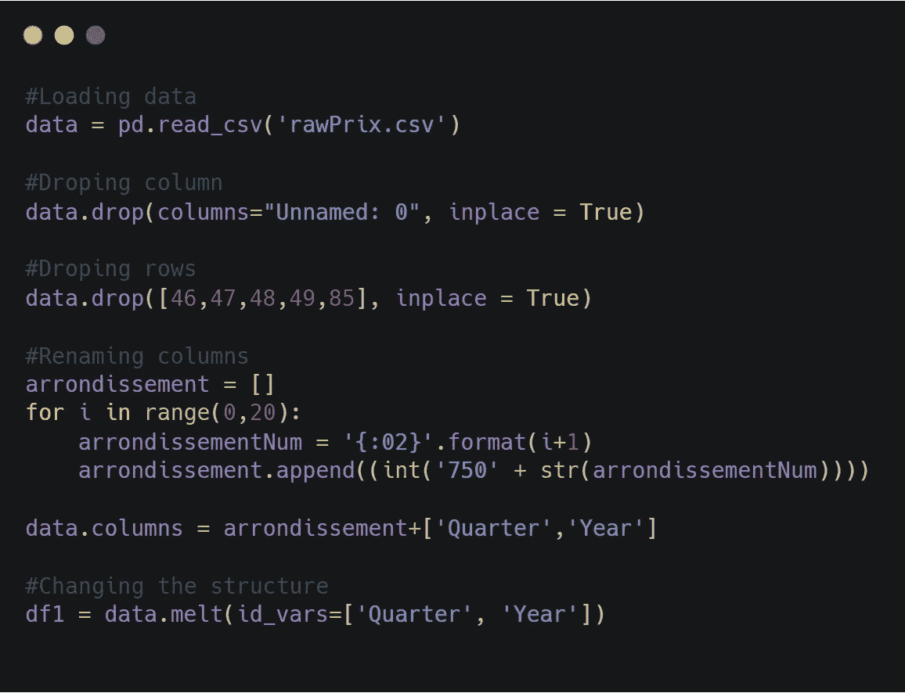

1.  我们要删除“未命名的 0”列
2.  我们在 pdf 版本中有一些只有文本的行，我们必须删除。
3.  我们需要“地区名称”具有邮政编码格式。
4.  最后，我们需要使用 melt 函数，以便我们的数据帧具有与人口数据帧相同的格式。

## 区的面积

为了得到人口密度，你必须将人口除以面积，所以我必须得到每个区的面积
为了得到这些数据，我查阅了这个网站:[https://fr.vikidia.org/wiki/Arrondissements_de_Paris](https://fr.vikidia.org/wiki/Arrondissements_de_Paris)

# 形象化

## 可视化价格演变

数据准备好了吗？我们可以想象！
我打开 Tableau 上的价格数据集，并按地区显示历年的价格

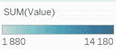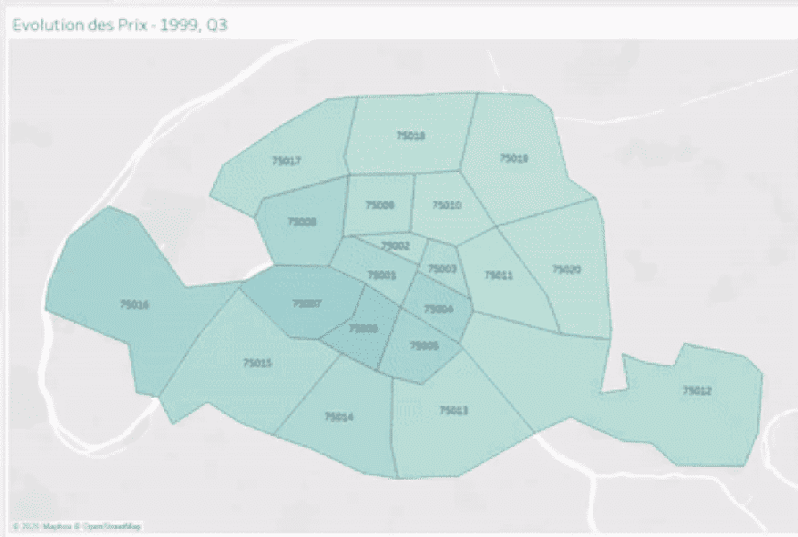

1999 年至 2019 年巴黎各区房价的演变

我们可以很容易地看到，在过去的几年里，价格飞涨。我们可以用熊猫来发现这种进化。

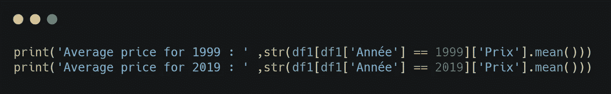

我们获得了 1999 年的 2863.75 英镑和 2019 年的 10618.6 英镑。
价格因此在 20 年间上涨了 4 倍。对投资者来说真是太划算了！

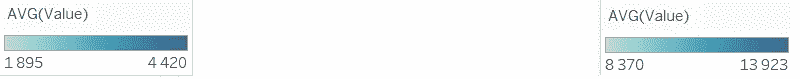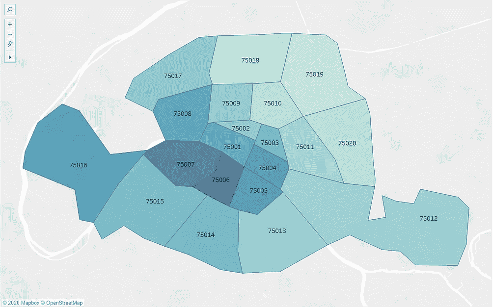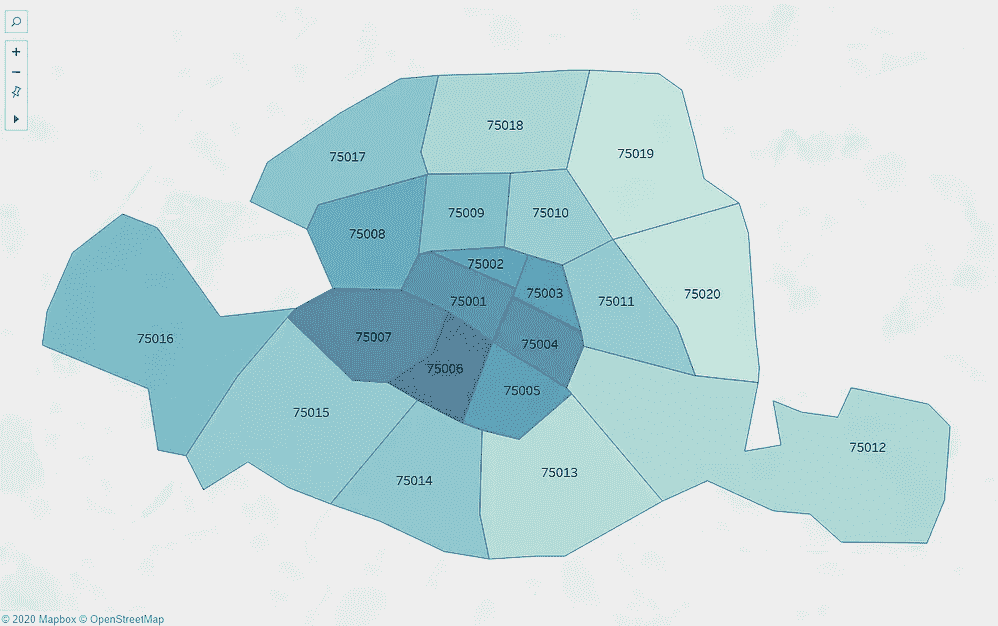

1999 年(左)和 2019 年(右)的价格分布

我们可以看到，第 7 区和第 6 区一直是最贵的，而第 19 区和第 20 区是最便宜的。然而，我们可以在 2019 年看到中心区和其他区之间更严格的划界。

## 可视化密度演变

为了分析密度，我们需要两个不同的数据集，一个是面积数据集，一个是人口数据集。我们将在“行政区”进行左连接以合并这些

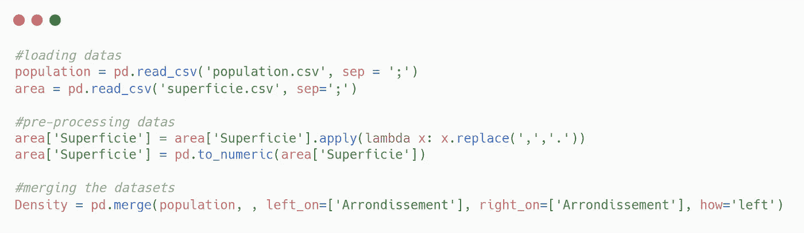

我们还需要删除 2009 年和 2011 年的行，因为我们没有这两年每个地区的数据。然后，我们可以创建我们的密度特征和导出我们的 csv 显示在 Tableau

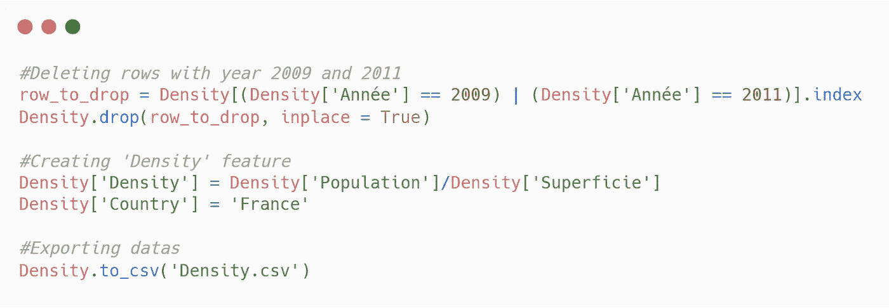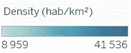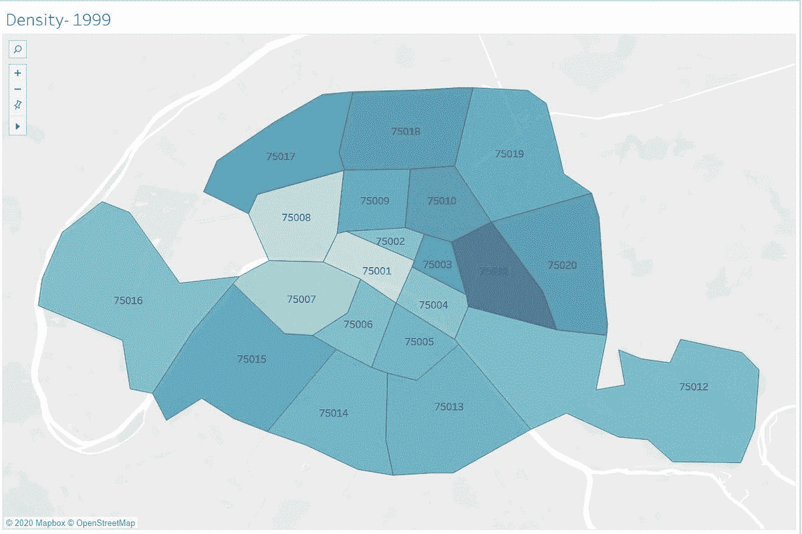

巴黎各区人口密度的演变

嗯，看来巴黎的人口密度在那些年间并没有太大的变化。无论如何，那样是看不到的。

然后，我们将尝试检查各区的价格是否会影响其密度。为了做到这一点，我们将编写一个简单的函数，比较每个地区密度最大的年份与价格最小的年份是否相同。

但首先我们需要合并价格和密度数据集。

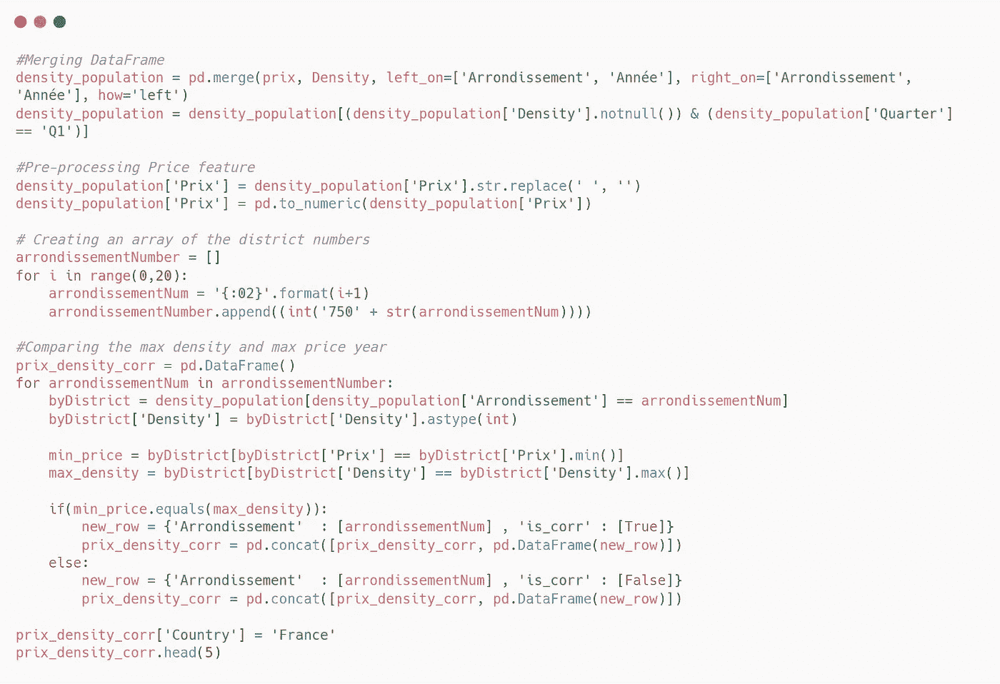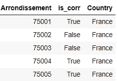

作为输出获得的数据帧

数据已经准备好了，我们可以把它们显示在桌面上

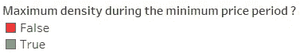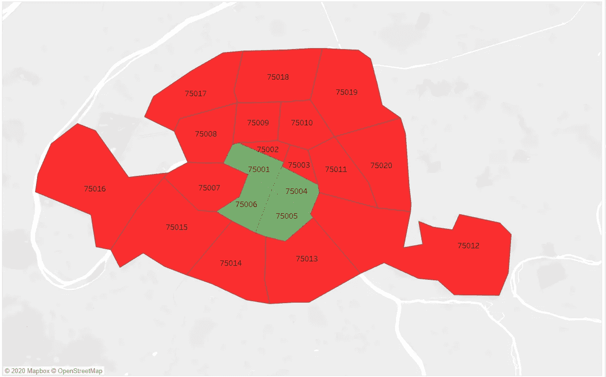

我们取得了什么结果？
一般来说，低价格并不意味着特别高的密度，除了中心的四个区(姑且称之为“四大”)。我们可以问自己:为什么会有如此尖锐的分界？

2006 年，四大的密度处于最佳状态，但在 2017 年，由于某种原因，这些地区的密度有所下降。

总之，我们将通过将四大中的地区与不在四大中的地区分开来比较价格和密度的演变。

我们需要两个数据集，一个包含四大，另一个包含其他

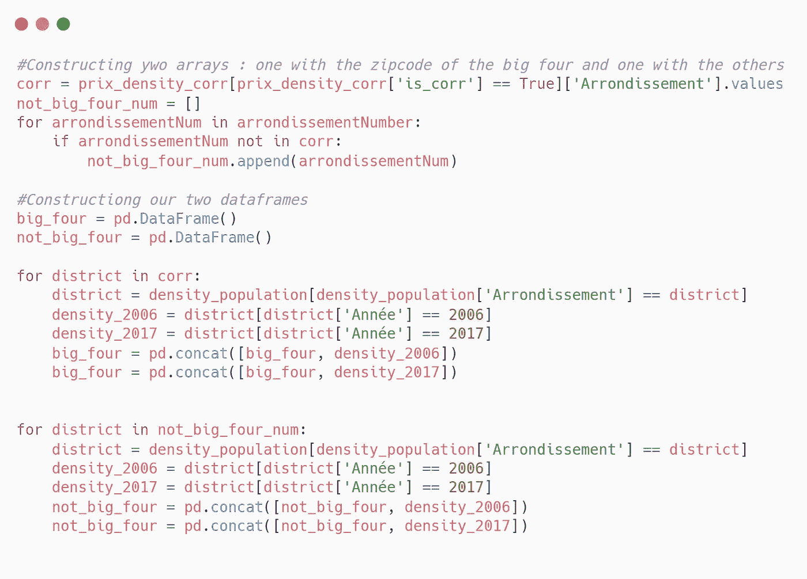

然后用简单的微积分我们可以得到我们的进化

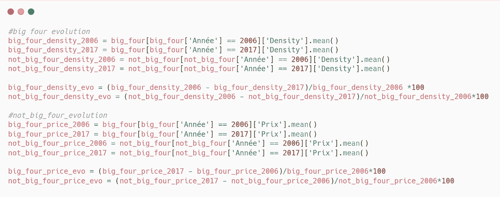

从 2006 年到 2017 年的价格和密度演变

尽管“四大”的房价涨幅与其他地区几乎相同，但我们看到“四大”的人口密度下降了近 5%。

因此，我们可以假设这些地区的价格继续上涨，而 11 452 €的价格上限正在阻止这些地区稳定其人口

总之，我们看到，只要有一点耐心和时间，我们不一定需要现成的数据集来产生强大的分析，我们可以纯粹使用整个互联网作为我们的数据集。