# 人工智能学习飞行(上)|飞机模拟和强化学习

> 原文：<https://towardsdatascience.com/how-i-taught-a-plane-to-fly-using-rl-c170a152b771?source=collection_archive---------19----------------------->

## 了解飞行力学以及如何用 Python 模拟飞机

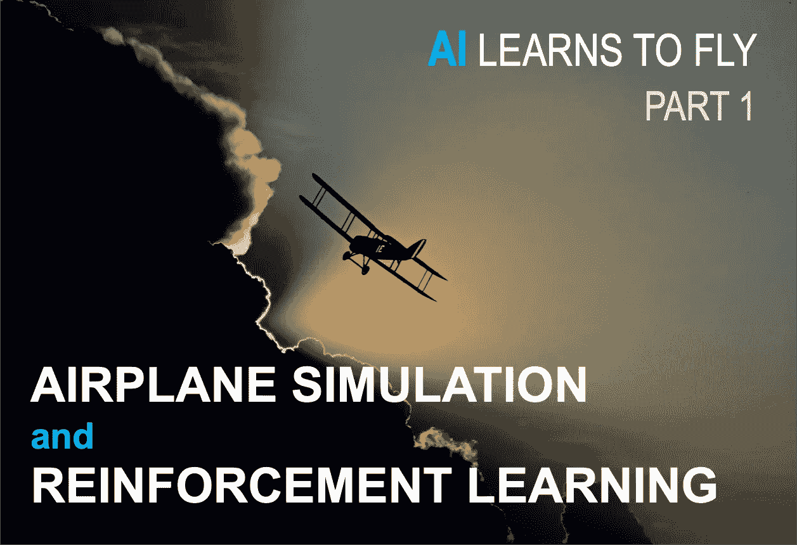

来源。皮沙贝

> 从伊卡洛斯燃烧他的翅膀到莱特兄弟翱翔天际，人类花了几千年才学会飞行，但人工智能要多久才能做到呢？

# 介绍

大家好！

在这一系列文章中，我将讲述我使用人工智能**驾驶飞机的旅程。如今，人工智能被用于从双足机器人到自动驾驶汽车的各种应用中，但迄今为止还没有看到人工智能飞机，让我们改变这一点！**

****强化学习**是**机器学习** *(让算法学习如何做事情，而不是告诉它们如何做)* 的分支，它通过一个行动和奖励过程来处理对**人工智能**的训练。**代理**将与**环境**交互，选择**动作、**并观察其结果(新**状态**和**奖励**)，同时试图优化其回报(其奖励的总和)。**

**在这篇**第一篇文章中，**我们将定义**转换函数**，允许环境根据先前的状态和代理动作计算下一个状态:在我们的例子中，根据飞机的当前位置、速度和加速度以及飞行员的动作(推力值和俯仰角)计算飞机的下一个位置、速度和加速度。我们将基本上创建一个基本的飞机模拟。**

**在**第二篇文章中(** [**这里**](/ai-learns-to-fly-part-2-create-your-custom-rl-environment-and-train-an-agent-b56bbd334c76?source=post_stats_page---------------------------) **)，**我们将讨论**环境的其余部分(状态、动作**和**奖励)**和**强化学习** **代理**(模型选择、超参数优化、代理训练和测试)。**

****

# **飞机是怎么飞的？**

**为了创建一个飞行模型，让我们首先快速回顾一下飞机是如何飞行的。有四个力影响一个平面**

**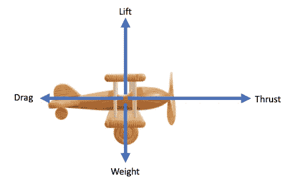**

**影响飞机的四个力**

**这两个水平力是:**

****推力**:推进器或反应堆产生的推动飞机前进的力**

****阻力**:空气阻力产生的力，与飞机的运动方向相反**

**两个垂直力是:**

****重量**:飞机的重量**

****升力**:让飞机飞行的力量**

**为了让飞机在水平方向获得速度，我们必须有推力>阻力，为了让飞机在垂直方向获得速度，我们必须有升力>重量。**

**在这篇文章中，我不会对飞行力学和升力的起源进行过多的技术分析，但是如果你想了解更多关于这个主题的知识(伯努利原理、牛顿定律和纳维尔-斯托克斯方程)，我强烈推荐你观看大卫·卢阿普雷的这个视频(我为此添加了英文字幕，目前正在等待批准) :**

# **一.飞行模型**

**让我们创建我们的飞机模拟，根据飞机的上一个位置、速度和加速度计算飞机的下一个位置、速度和加速度。**

> **我选择模拟空客 A320 是因为它在世界范围内的广泛应用以及该飞机可用的数据数量(插图仍将使用我的木制玩具飞机制作，但数字将基于实际飞机，这些数字可以在[1]中找到)。**

## **I.1)模拟范围**

****我们将建模:****

****推力**(因海拔和空气稀薄而变化)**

****升力****

****阻力**(由于空气密度随高度变化以及由于迎角变化)**

****升力**(襟翼用于增加升力)**

****燃油消耗**(燃油消耗率估算和因燃油消耗引起的飞机质量变化**

**平面模型的目的是根据前一时间步的条件，计算任意给定时间步的平面的加速度、速度和位置(在本文的其余部分，我将称之为动力学)。在整个研究中，我们将使用地面参照系。**

## **I.2)空气动力学建模**

**所以，让我们深入建模。为了计算地面参照系中给定时间步长的飞机动态，我们将使用以下关系式:**

**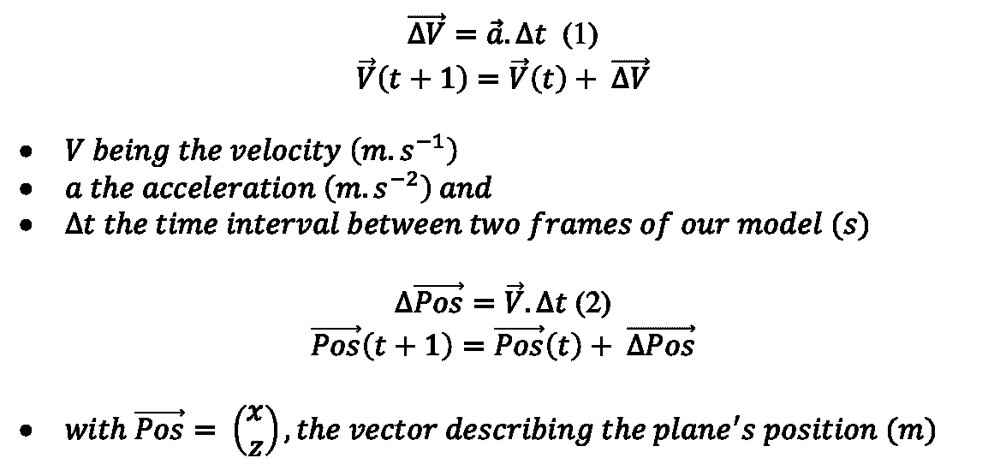**

**我们现在有了一种基于加速度计算速度和位置的方法。现在我们来计算加速度。为此，我们将使用牛顿第二定律:**

**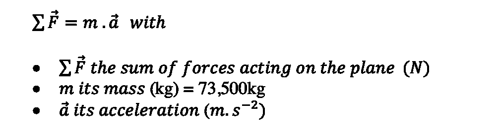**

**换句话说，作用在物体上的力的总和等于它的质量乘以它的加速度。所以，为了计算我们飞机的加速度，我们必须计算施加在它上面的力的总和。如前所述，我们有**重量、推力、阻力和升力。**让我们一个一个来看看。**

## **1.3)重量**

**这是最简单的！这是地球引力对飞机质量的作用力。**

**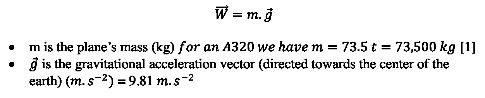**

## **I.4)推力**

**这个有点复杂。这是飞机涡轮喷气发动机产生的力。涡轮喷气发动机基本上吸入飞机前方的空气，并以更大的速度排出，从而推动飞机前进。**

**随着高度的增加，涡轮喷气发动机的效率由于空气稀薄而降低(导致吸入和加速的空气减少)。我们将使用以下关系来解释这种减少(我从网上找到的图表[2]中近似得到)。**

**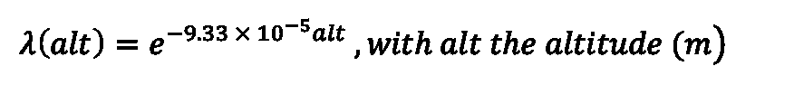****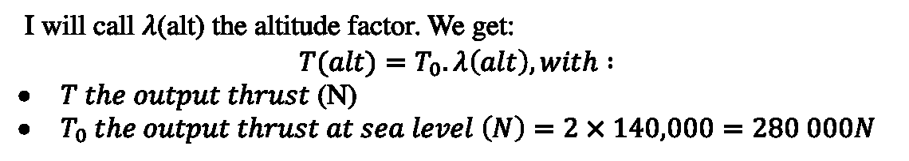**

**我们将忽略温度变化对涡轮风扇效率的影响，因为我们假设空气密度的变化已经说明了这一点。**

## **I.5)拖拉和提升**

**阻力基本上是阻碍飞机运动的空气。升力是由机翼上方和下方的速度差产生的力，用来补偿重量，从而获得高度。尽管它们对飞行的影响完全不同，但它们都是气动力，并通过类似的公式获得:**

**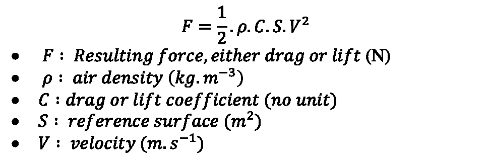**

**正如我们在研究推力时所看到的，空气密度随着高度的增加而减小。因此，我们有:**

**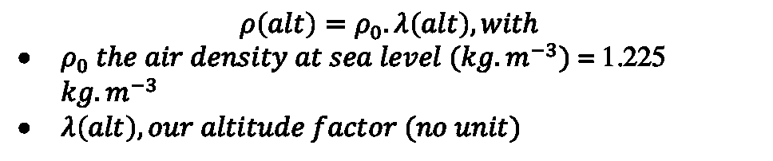**

**在进一步讨论之前，我们需要确定阻力和升力之间的区别。为此，我们必须引入平面的参考，并定义几个角度:**

**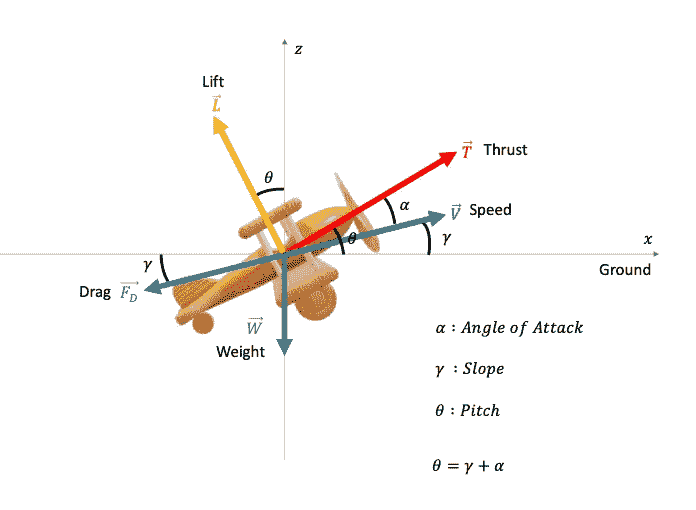**

**作用在平面上的所有力**

**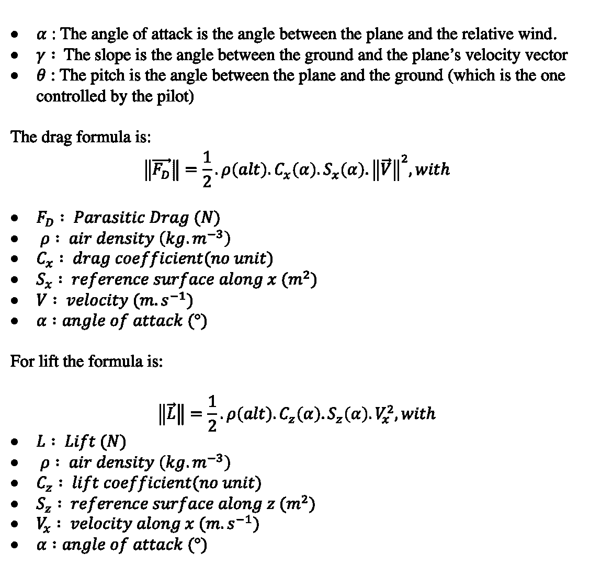**

**我们将在以后计算速度，但现在我们已经解决了空气密度，让我们更仔细地看看升力和阻力系数，参考面，以及它们与迎角的关系。**

## **I.6)升力/阻力系数**

**升力系数和阻力系数，用来描述气流绕过形状的难易程度，与迎角成正比。我们将使用下列近似值(考虑 20°以上的失速)来计算它们:**

**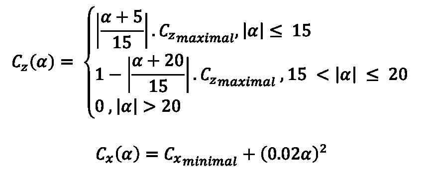****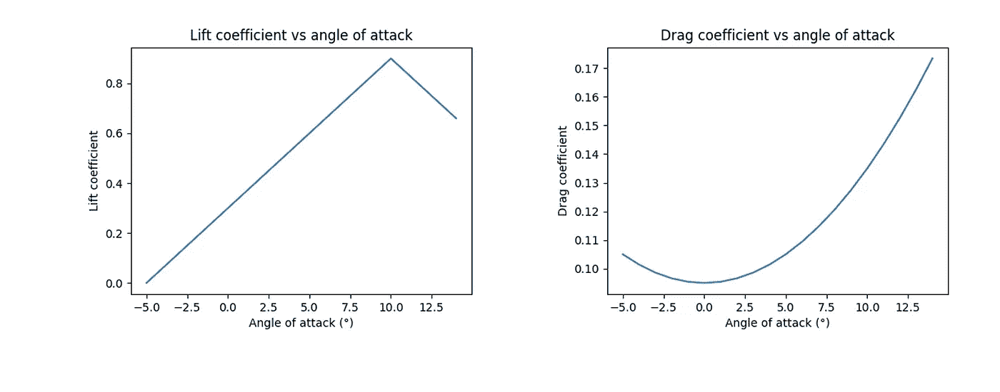**

**相对于α()的近似 Cz 和 Cx**

## **I.7)马赫数影响**

**另一个重要现象是接近音速的速度对阻力和升力系数的影响。随着飞机接近音速，机翼上开始出现湍流，并影响阻力和升力。m，马赫数代表速度与音速之比。我们将再次近似这个关系:**

**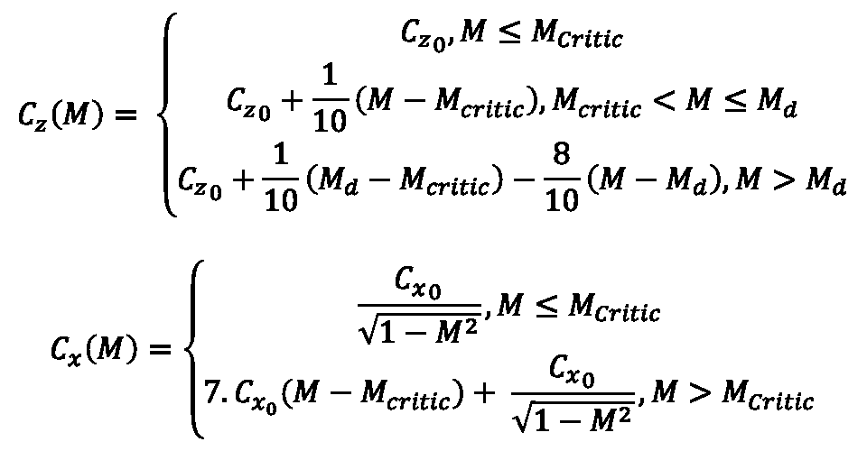****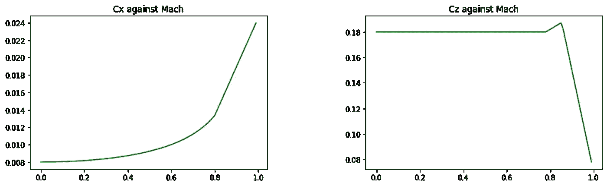**

**相对于马赫数的 Cx 和 Cz 近似值**

## **I.8)参考表面**

**计算阻力和升力所需的**参考面**，是与我们感兴趣的力的方向正交的**面。对于阻力，参考面是与相对风相反的一面，而对于升力，参考面是与相对风平行的一面。我们感兴趣的表面是相对于相对风的表面。因此，我们将使用相对风的参照系(x'z ')。它是通过旋转我们的初始参考系的斜率值得到的。****

**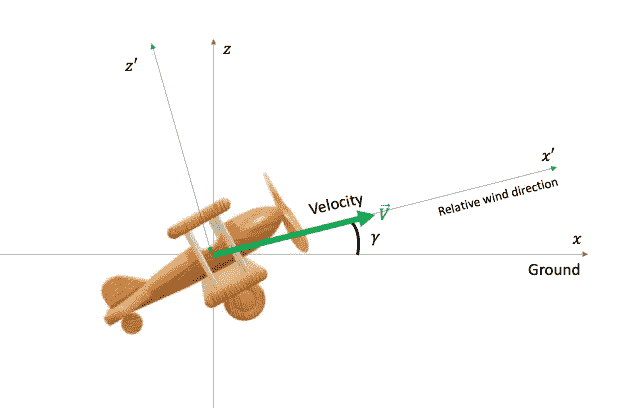**

**绝对(地面)框架和相对风框架**

**我们必须计算前表面和机翼表面相对于相对风参考系的投影。**

**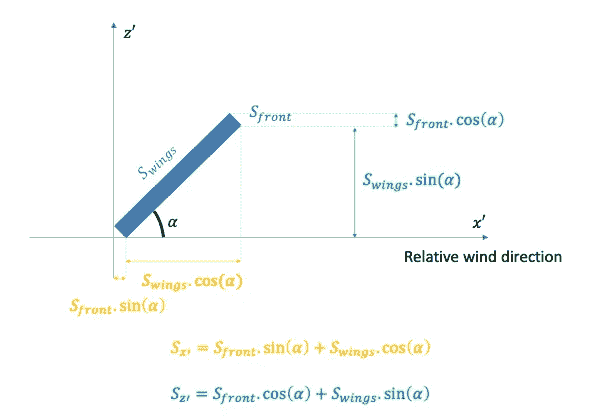**

**表面投影**

**因此，我们得到了沿相对风轴 x’和 z’投影表面的方程:**

**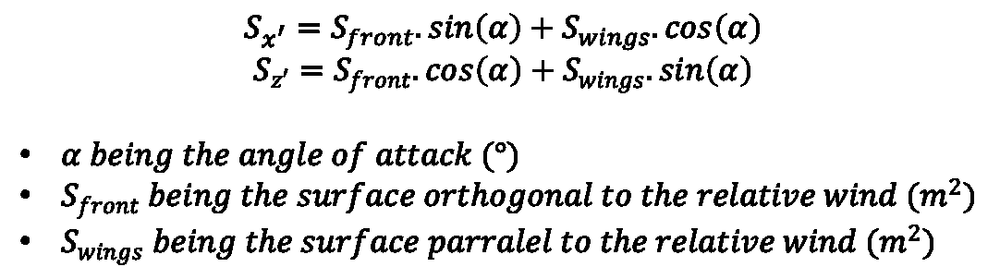**

## **I.9)襟翼**

**(如果您想了解更多关于襟翼的信息，请随意观看此视频)**

**在起飞和着陆期间，**飞机使用襟翼以增加阻力为代价来增加升力**从而缩短起飞和着陆距离。**起飞距离**定义为跑道起点与飞机到达跑道上方 25m 高度点之间的距离。我们将**起飞角**定义为飞机达到起飞速度后所使用的俯仰角(地面与飞机之间的角度)。这是我们的飞机在没有襟翼的情况下的起飞距离(我们将只绘制低于 5 公里的起飞距离值，即最长民用跑道的长度)。**

**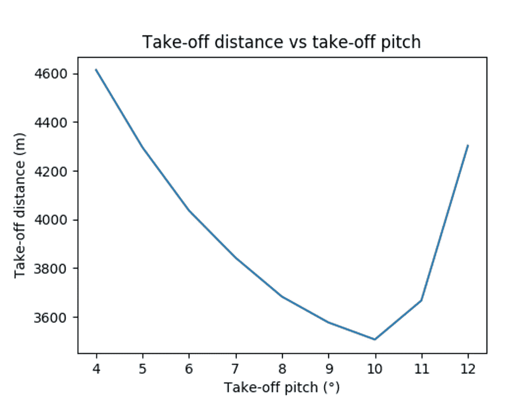**

**起飞距离(m)与不带襟翼的起飞角( )**

**A320 的起飞距离应该在 2 公里左右。在这一点上，飞机没有产生足够的升力，所以我们需要使用襟翼。我们假设襟翼使升力增加 70%。(价值基于文档，并经过调整以实现实际结果)。襟翼将在飞机启动时伸出，并在 400 英尺高度自动返回。去掉襟翼后，我们的起飞距离更接近真正的 A320:**

**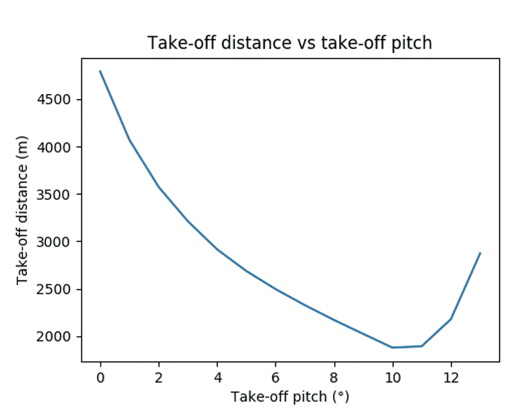**

**襟翼展开时起飞距离(m)与起飞角度的对比( )**

## **I.10)角度冲击**

**现在我们已经有了重量、推力、升力和阻力的基本公式，我们需要讨论它们的方向的影响。让我们再看看我们的角度图。**

****

**所有影响飞机的力量**

**现在让我们把这些力投射到 x 和 z 轴上:**

**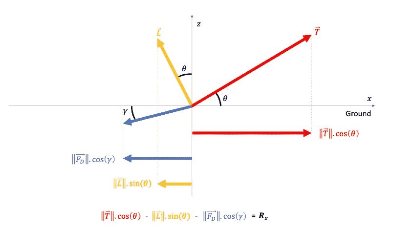**

**x 轴上的投影**

**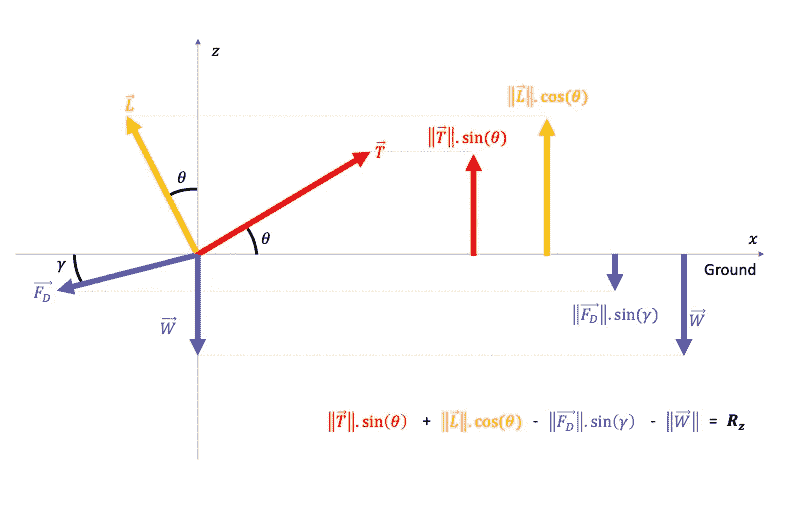**

**z 轴上的投影**

**因此，我们得到要求解的方程，以便得到 x 轴和 z 轴上的力之和。**

****

## **I.11)碰撞**

**为了完成我们的模型，我们需要使它能够阻止飞机穿过地面并检测碰撞。对于这些情况，通过将任何负垂直位置设置回 0 以及将速度设置回 0 来防止这些碰撞。考虑到未来的碰撞检测，如果飞机的垂直位置为负，同时垂直速度为负(设置回 0 之前)，我们将计算飞机的动能，用于检查与地面的碰撞是否导致碰撞。**

****

**如果地面接触的动能低于给定值 E_crash，那么飞机就会坠毁。否则，它将被视为安全着陆。该功能将在以后用于强化学习部分。**

## **I.12)油耗**

**对于燃料消耗，我们将使用基于**推力燃料消耗** (SFC) **的简单模型，该模型将推力和时间与燃料消耗**联系起来。为了简化问题，我们将总是假设巡航水平 SFC，而忽略海平面 SFC(因为我们将在巡航水平花费大部分时间)。**

**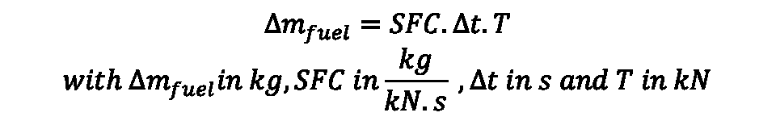**

**为了估算 SFC，我们将假设海平面推力(反应堆的最大可用推力)和巡航 SFC 之间的关系是线性的。根据这一假设，我们可以根据 A320 发动机的数据估算推力和 SFC 之间关系的参数，我们得到 SFC 为 17.5。由于燃料消耗，飞机的质量将会变化，我们将把这种变化考虑到动力学中。此外，如果燃料的变化超过总容量，飞机的反应堆将停止工作。**

# **二。结果分析和验证**

**为了检验我们的模拟，我们将对 A320 的模拟结果与现实进行分析和比较。**

**系好安全带，准备起飞！**

## **二. 1)起飞**

**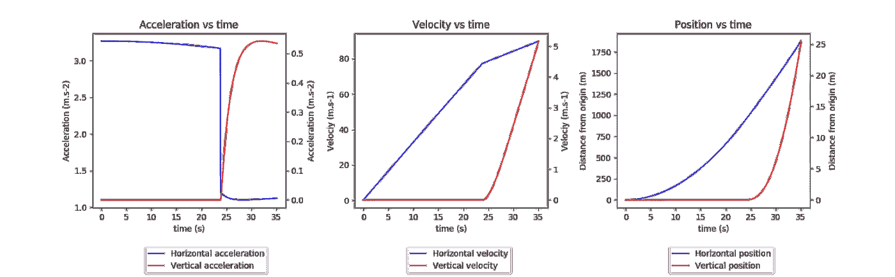**

**起飞时加速度、速度和位置与时间的关系**

**在这三张图中，我们可以看到起飞阶段的加速度、速度和位置随时间的变化。加速度一开始只是水平的，到了 Vr(旋转速度)(~25s)且平面旋转的时候水平和垂直都有。这种现象在速度上也可以看到，垂直速度在 25s 时开始上升，水平速度(水平加速度)的增长率下降。最后，最后一张图允许我们估计大约 1800 米的起飞距离，这接近于我们预期的距离(大约 1900 米)。此外，25s 的起飞时间(离地前的时间)也与现实相符(约 30s)。此外，我们还可以注意到，加速度值保持在令人不愉快的值以下(水平方向达到最大值 0.33g，垂直方向达到最大值 0.06g)。**

## **II.2)最大速度**

**我们希望评估我们的飞机没有超过对其结构完整性危险的速度(过于接近 1 马赫会在飞机结构上产生严重的湍流和应力)。为了测量我们的飞机可以达到的最大速度，我们将推力设置到最大值，并观察飞机稳定的速度。**

**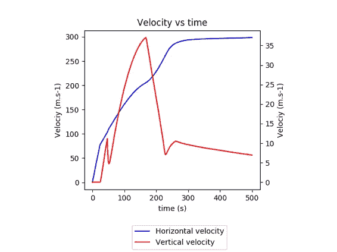**

**全速时速度与时间的关系**

**飞机稳定在 300 米/秒(0.87 马赫)的最大速度，这远远低于音速，对我们的飞机来说是安全的。然而，它高于真正的 A320 的最大速度(0.75 马赫)，但我们假设忽略这一差异是合理的，因为大多数航班根本达不到这一速度。**

## **II.3)巡航速度和高度**

**为了估计我们的巡航速度，我们将不得不把我们的反应堆调到巡航状态，这通常意味着把功率降低到 60%到 70%之间。我们将把我们的涡轮风扇切换到 60%的输出，设置一个给定的θ角(通过试探法获得 2.5°)，观察我们达到的巡航速度和巡航高度。**

**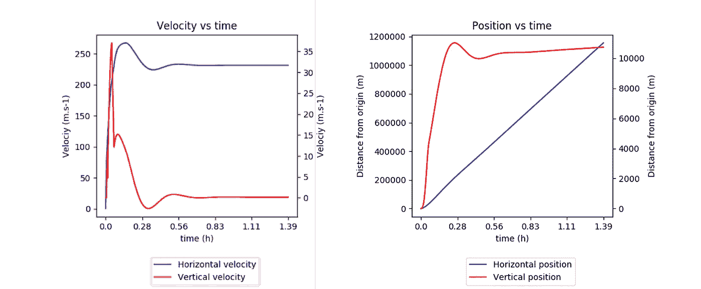**

**速度和位置与时间**

**我们观察到巡航速度为 231 米/秒，平均巡航高度为 10500 米。这两个值与 A320 0.72 马赫(233 米/秒)的经济巡航速度和 37000 英尺的巡航高度相匹配。这种匹配是通过调整模型的一些参数(巡航阶段的推力百分比和θ角)实现的。**

## **II.4)范围**

**一架飞机的**航程**是在给定燃油量和起飞质量的情况下，它可以行驶的**最大**距离。我们将研究我们的飞机在油箱加满和最大起飞质量(总共 73.5 吨)的情况下的航程。航程将通过在给定的巡航推力和巡航角(通过反复试验直到达到接近现实的结果)下飞行飞机直到耗尽燃料来测量。**

**我使用的策略如下:**

**直到 Vr 使用全推力在 0°俯仰角，襟翼放出。**

**在 Vr 旋转到 10。**

**在 400 英尺(122 米)的高度放下襟翼。**

**在 3 千米的高度，推力 65%，俯仰 2.5。**

**继续下去，直到燃料耗尽**

**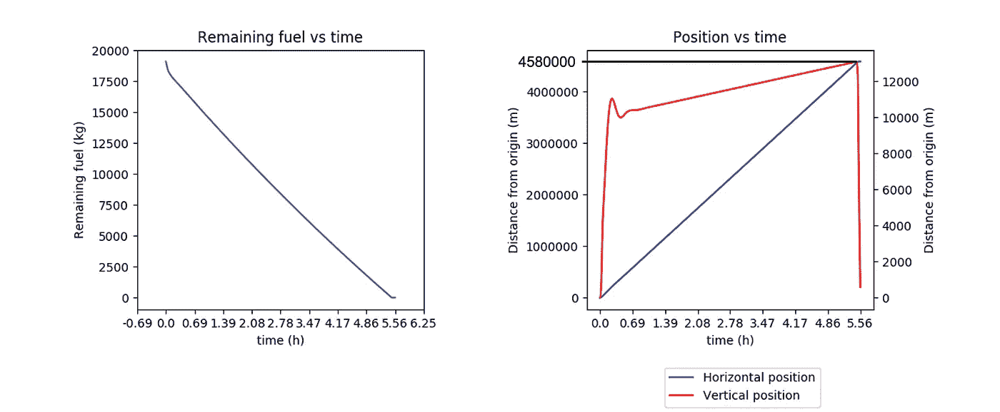**

**全飞行剩余燃油和位置与时间的关系**

**我们观察到航程为 4580 公里(经过 5 小时 30 分的飞行)，这比预期的要小一点(大约 6000 公里)。然而，这主要是由于我们的模型不准确，以及(缺席的)飞行员缺乏飞行优化。我们将接受这个值(我们将在下一部分中尝试改进它)。**

# **结论**

**我们现在已经验证了我们的飞机**模拟**是功能性的并且有点真实。它允许我们根据**当前状态**(当前飞机位置、速度和加速度)计算**代理**(飞行员)**动作**对我们**环境**(飞机)的影响，并返回一个**新状态**(飞机的新位置、速度和加速度)。我们现在可以使用这个模型作为我们的**强化学习环境的**转换函数**。****

**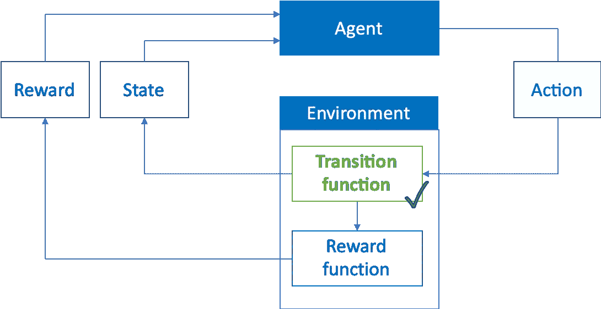**

**在下一篇文章中，我们将定义和编码强化学习的其余部分:动作**、**状态**和**奖励、**，当然还有**代理**本身。有了完整的框架，我们将训练代理人飞行！****

****希望教会一个人工智能飞行将允许我们优化飞行策略(到目前为止我们已经非常基本地近似了)并提高燃料消耗和航程(或者至少我们会很高兴看到一个人工智能努力学习如何飞行)。****

****敬请期待下一部分**机长**(我们的**强化学习** **特工**)将指挥我们的飞机！****

## ******扬恩·贝特洛******

****这里是这个模型的[代码](https://gist.github.com/YannBerthelot/03638dd1049a079796073f845db1bb38)(转换函数和图形工具)。****

****我在这个项目中使用的完整代码(Python)可以在我的 Github 上找到:****

**** [## YannBerthelot/飞机模型

### RL 的 PlaneModel 环境。在 GitHub 上创建一个帐户，为 YannBerthelot/PlaneModel 开发做贡献。

github.com](https://github.com/YannBerthelot/PlaneModel)**** 

******参考文献******

****[1]“空中客车公司的虚拟技术”【在线】。可用:[http://passion-aviation.html.pagesperso-orange.fr/Fiches](http://passion-aviation.html.pagesperso-orange.fr/Fiches)技术空客. htm # A320–200。[访问日期:2020 年 4 月 11 日]。****

****[2]“标准大气计算器中气压、密度和温度与海拔的关系热力学-热量在线单位转换器。”【在线】。可用:[https://www . translators cafe . com/unit-converter/en-US/calculator/altitude/。](https://www.translatorscafe.com/unit-converter/en-US/calculator/altitude/.)【访问时间:2020 年 4 月 12 日】。****

****[3]“我爱上了一个陌生人。”【在线】。可用:[https://www . lavionnaire . fr/aerodynfluxtra . PHP # profilesupercrit。](https://www.lavionnaire.fr/AerodynFluxTrans.php#ProfilSuperCrit.)【访问时间:2020 年 4 月 12 日】。****