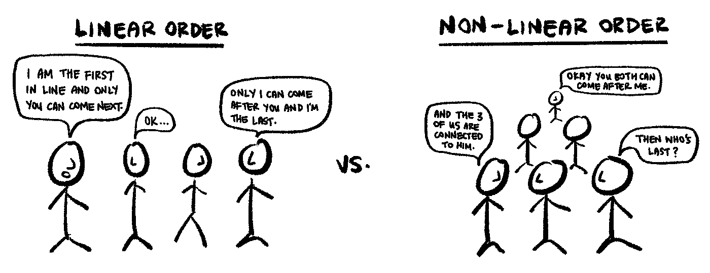
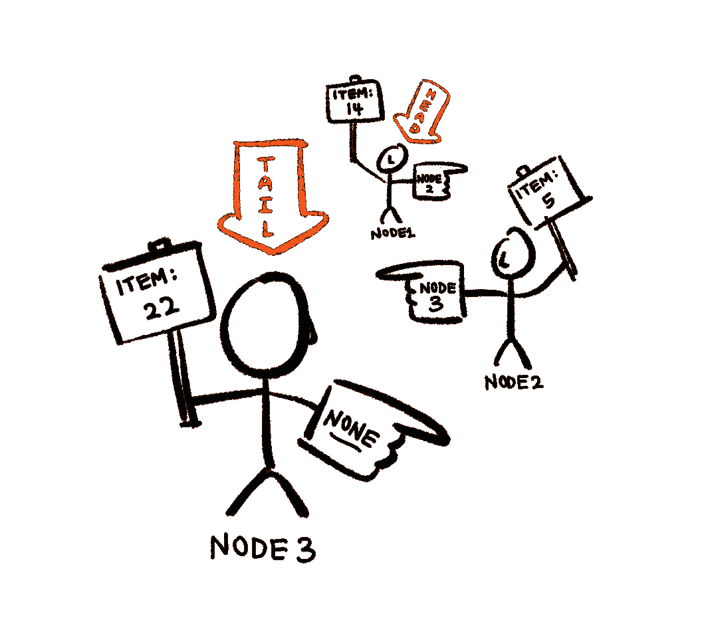
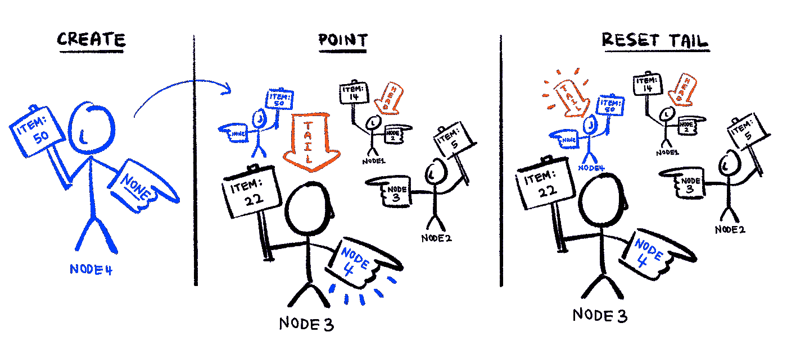
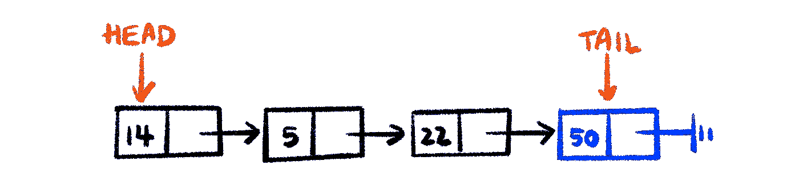

# 我是如何自学链表的

> 原文：<https://towardsdatascience.com/how-i-taught-myself-linked-lists-72c4837ea721?source=collection_archive---------12----------------------->

## 数据结构和算法，但更简单

## 一部分一部分地分解链表的定义。

# 什么是链表？

链表是最简单和最常见的数据结构之一。如果您曾经试图学习更多关于基本数据结构的知识，很可能您已经遇到过链表，并且读过类似下面的定义:

> 链表是一种数据结构，其中对象以线性顺序排列。然而，与数组不同，在数组中，线性顺序由数组索引决定，而链表中的顺序由每个对象中的指针决定。

根据学习数据结构时的个人经验，以上内容对于初学者来说可能毫无意义。因此，这篇文章旨在向你展示链表在概念上是简单的，以一种直观和外行的方式分解它的定义，就像你是一个完全的初学者一样。

我们将离开“那又怎样？”我相信，当我们对链表有了更好的理解后，我们将能够问更有意义的“那又怎样”。请注意，我们将在整篇文章中引用上述定义。

所以让我们开始吧。

# 什么是数据结构？

> 链表是一种数据结构…

因为链表是一种数据结构，所以简单地理解什么是数据结构是有好处的。

简单地说，数据结构就是数据存储和组织的方式。

然后，根据数据的存储和组织方式，可以对数据应用不同的操作。

数据结构之间的区别可能在于数据是如何存储和组织的，可以对数据做什么，或者两者都有。计算机科学中的大量问题都需要某种数据，我们需要根据问题类型从数据中有效地检索信息，这是我们今天创建不同数据结构的动机。

例如，一个链表在*指针*的帮助下以线性顺序存储和组织数据(这就是“数据的组织方式”)，这些指针允许我们轻松地插入和删除元素，而无需重新组织整个数据结构(这就是“能做的”)。这使得一个链表成为一个*线性数据结构*(与非线性相对)。

# **什么是线性顺序？**

> …其中对象以线性顺序排列。

以线性顺序存储元素意味着以连续的顺序组织它们，使得:

*   只有一个第一个元素，并且只有一个下一个元素
*   只有最后一个元素，并且只有前一个元素
*   所有其他元素都有上一个和下一个元素

例如，除了链表，*数组*也是线性数据结构，以线性顺序存储数据。



作者绘制的图像。

同样，线性还是非线性数据结构更好取决于您的用例。像往常一样，这两种类型各有利弊。

# 好吧，但是数组有什么问题？

> …但是，与数组不同的是…

到目前为止，你应该已经注意到链表最常被比作数组。数组的错误(或正确)取决于您的用例。和其他数据结构一样，数组也有自己的优点和缺点。

虽然数组提供非常快速的索引访问和元素赋值，但是它们有固定的、不可变的长度。这意味着它们不能增长或收缩，也不可能追加或插入项目。因此，在创建数组时，我们必须知道我们想要存储多少元素，这可能会导致某些问题，具体取决于手头的问题。

动态数组(例如 Python 的**列表**)具有可变长度，这是通过保留额外的内存空间来实现的。然而，在动态数组的开头插入一个元素比在末尾插入要昂贵得多。这可能会成为一个巨大的障碍，这也取决于你试图解决的问题。

使用 Python 的 list 对象，我们可以运行以下代码来说明这一点:

```
n = 500000
example_list1 = []
example_list2 = []# Slow insertion of at the front of Python lists
for i in range(0, n):
    example_list1.insert(0, i)# Fast insertion of at the end of Python lists
for i in range(0, n):
    example_list2.insert(i, i)
```

记录并打印完全插入 500，000 个元素所需的时间，我们得到:

```
Insertion at start took: 110.1042 seconds
Insertion at end took: 0.1853 seconds
```

对于动态数组，为了在第一个位置(或第一个索引)插入一个元素，您需要将所有其他元素“向右”移动，以便为这个新元素腾出空间。很自然，你可以想象如果你有一个包含大量元素的数组，这将是非常低效的。此外，在移动元素之前，您可能需要为数组分配更多的内存空间。


作者绘制的图像。

这就是链表可以做得更好的地方。

# 好的，那么链表和数组有什么不同呢？

> …链表中的顺序由每个对象中的指针决定。

指针指针指针。

尽管链表和数组都是线性数据结构，但链表使用指针保持其元素的线性顺序(与数组中的索引相比)。与使用数组相比，使用指针可以更有效地在任意位置插入或删除节点。

在其最基本的形式中(即只包含必需的属性)，链表由以下部分组成:

1.  被称为**节点**的对象，其属性为:(a) **项**，它被分配了它存储的数据*(必需)*，(b) **下一个指针**，它指向线性顺序中的下一个节点*(必需)*和(c) **上一个指针**，它指向线性顺序中的上一个节点*(非必需)*。
2.  指向列表头部的指针(必需)
3.  指向列表尾部的指针(不是必需的)

为了了解链表如何允许我们有效地在头部和尾部插入对象，我们将实现一个有 3 个节点的链表，以线性顺序保存整数 14、5 和 22 作为数据。每个节点都有一个指向下一个节点的指针，而链表既有一个指向列表头部的指针，又有一个指向列表尾部的指针。


作者绘制的图像。

由于链表中节点的位置存储在前一个节点的指针中，所以链表中的节点不必在内存中连续组织。事实上，它可以存储在内存中的任何地方。因此，它看起来更像这样:



作者绘制的图像。

## 在尾部插入

为了在链表的尾部插入一个整数为 50 的节点，我们执行以下操作:

1.  创建一个新节点，其**项** = 50
2.  让它的**下一个指针**指向*无*
3.  让当前尾节点指向这个新节点，而不是 *None*
4.  重置链表的**尾指针**指向这个新创建的节点



作者绘制的图像。

## 在头部插入

类似地，为了在链表的头部添加一个条目，我们执行以下操作:

1.  创建新节点
2.  让它的**下一个指针**指向链表的当前头
3.  重置链表的**头指针**指向这个新创建的节点

这本质上是一个最简单形式的链表。

# 那又怎样？

答应了，那又怎样？

我们可以看到，与(动态)数组相比，链表的主要优点是它允许快速插入(和移除)条目。与数组不同，不需要重新构建整个数据结构，也不需要为重新构建而重新分配内存。这源于使用指针来保持数据的线性顺序，这消除了数据项以连续方式存储在存储器中的需要。换句话说，链表允许使用固定数量的操作(如上面步骤中所列)来插入和移除项目，而不管列表的长度。

使用节点的这些基本概念，它如何存储数据并指向它的邻居，我们可以根据我们的需要建立其他(更复杂)类型的链表，例如*双向链表*和*循环链表*。

更令人兴奋的是，理解链表及其节点可以引导我们探索和理解其他数据结构甚至算法。链表是实现其他[抽象数据类型](https://en.wikipedia.org/wiki/Abstract_data_type)的多种方式之一，例如[栈](https://en.wikipedia.org/wiki/Stack_(abstract_data_type))、[队列](https://en.wikipedia.org/wiki/Queue_(abstract_data_type))、[散列表](https://en.wikipedia.org/wiki/Hash_table)和[图形](https://en.wikipedia.org/wiki/Graph_(abstract_data_type))，我们将在以后的某一天再深入讨论。

*这是上面的单链表在传统教科书中的样子，当然没有颜色:*



作者绘制的图像。