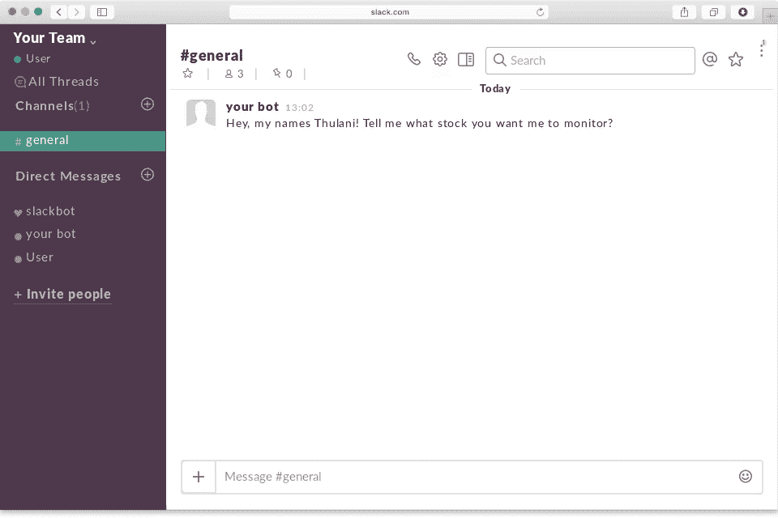
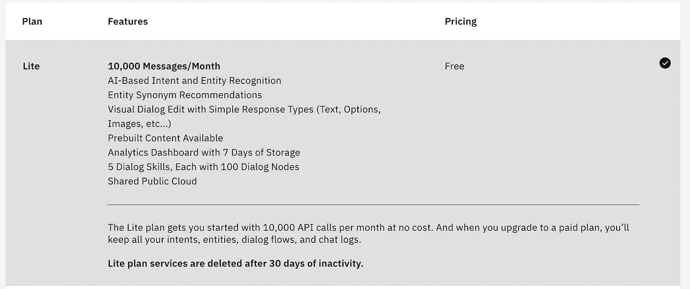
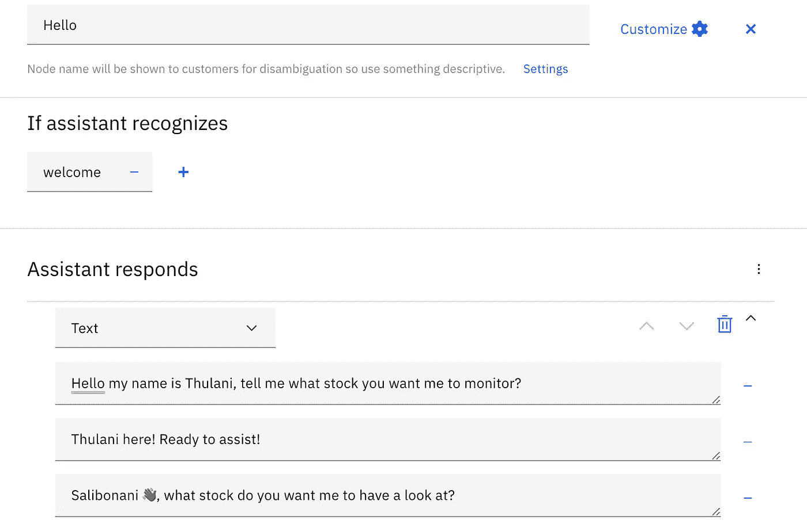
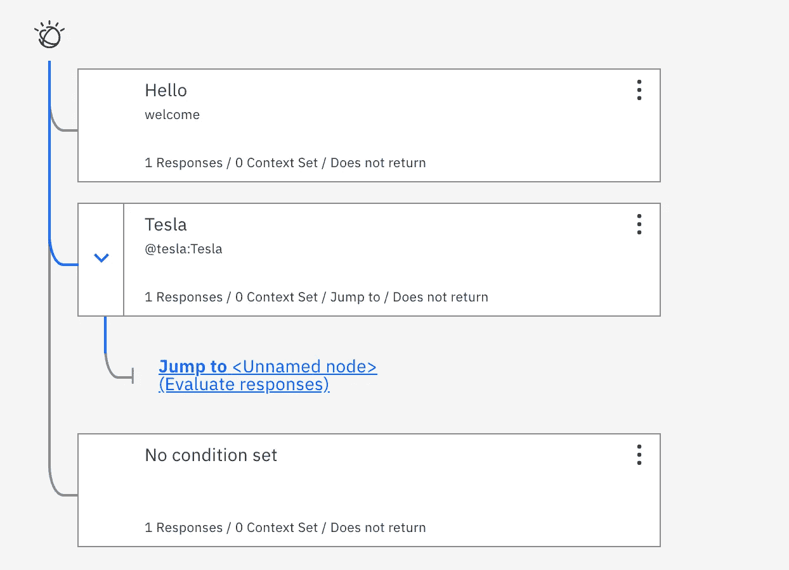

# 我是如何试图建立一个名为 Thulani 的聊天机器人来管理我的投资组合的

> 原文：<https://towardsdatascience.com/how-i-tried-to-build-a-chatbot-named-thulani-to-manage-my-investment-portfolio-359f46b439d4?source=collection_archive---------51----------------------->

## Thulani 项目:ChatOps 会见 LazyOps。

这是 Thulani 的故事，我设计这个聊天机器人是为了让我的生活变得更简单，也让我更了解聊天机器人。我希望能有更多的东西，我真的希望，但这篇文章是一个指南，介绍了我用来更好地理解聊天操作的工具和资源，以及如何使用聊天机器人解决(希望更好)问题。

## 什么是聊天操作？

**ChatOps** 是使用聊天客户端、聊天机器人和实时通讯工具，方便软件开发和运营任务如何沟通和执行。

## 我为什么需要聊天机器人？

我最近开始使用由[自由贸易团队](https://medium.com/u/c727c9d21230?source=post_page-----359f46b439d4--------------------------------)开发的自由贸易平台。我不是一个认真的投资者，最初是出于兴趣，想拥有一些我喜欢的公司的股票，但随着时间的推移，随着越来越多的朋友注册，我们开始讨论和研究股票。但在这次研究中，我发现很难跟上每只股票，尤其是那些我只想密切关注的股票。这意味着有时我可能会错过买入或潜在的退出机会。所以我坐下来思考，我该如何为自己做些什么来确保这种事情不会发生？

> 免责声明:其他应用程序具有可以消除这个问题的功能，但这并没有教会我关于聊天机器人的知识，不是吗🙃

## Thulani 计划诞生了！

第一步是命名我的聊天机器人，并正式开始这个项目。我选择的名字是祖鲁族血统的 Thulani。它的意思是“安静/得到安慰。”我喜欢这个名字，觉得它会让我的聊天机器人更有个性，我们多久会看到有祖鲁语名字的机器人？

确定了我的*问题*和建议的解决方案后，现在是时候想象成功会是什么样子了:



这是我希望我的机器人看起来的样机。这就是成功的样子。使用[僵尸网络](https://medium.com/u/aa701ecc397c?source=post_page-----359f46b439d4--------------------------------)设计

```
A user finds a share → User informs Thulani → Thulani checks API with stock information → User confirms → End. 
```

这是我试图构建的用户故事草案，每次我决定监控一家公司的股票，Thulani 都会记住 ***时间和日期*** ，因为这将是我想要监控的价格点，然后我可以设置 Thulani 在价格低于或高于 **X** 时向我发送消息。由于我实际上并不想为这个功能创建一个完整的应用程序，聊天机器人是最好的解决方案。

## Thulani 遇到了 Watson！

沃森助手是 IBM 的人工智能产品，可以让你在任何应用程序、设备或渠道中构建、训练和部署对话交互。我选择探索 Watson 作为 Thulani 对话技巧的后端，因为与大多数聊天机器人不同，Watson Assistant 并不试图模仿人类互动。它实际上会要求清晰，知道何时从知识数据库(*我们将查询的 API*)中搜索，并且可以部署在 Slack 上。



我有没有提到它是免费的？—由 IBM 提供

我能够部署一个 Watson Assistance 的实例，我实际上可以预加载一些客户服务对话技巧，但没有任何东西真正涵盖我正在寻找的问题，所以我必须从头开始教 Thulani 如何响应。



不同的反应，因为你知道，Thulani 有范围 IBM 沃森助手

“你好”节点是我最初的对话开始。当用户打开聊天机器人时，Thulani 会如何问候他们？当然，他可以和他们打招呼，挥挥手👋🏾同时等待输入，但更有意义的是充分利用交互*(因为这意味着你编写更少的对话节点)*。所以 Thulani 会问候用户，并立即询问他们想要什么股票。但这不是写对话的好方法。因为它限制了我的聊天机器人的功能。如果有增长的空间，我希望第一次交互实际上像一个菜单，所以 Thulani 会让用户直接，“*嘿，这是你的选择！”*

## 然后头痛来了🤯



使用 IBM Watson Assistant 绘制逻辑图。

写完逻辑之后，我意识到现在需要为股票信息集成一个 API。但是一个月只有***10000 个 API*** 调用，我内心的基础设施工程师就踢了进来。我如何优雅地保留 API 调用？Thulani 应该能够在没有我的干预下检查特斯拉的股价，然后向我反馈埃隆是否已经崩溃了市场。但是在周末或者股市关闭的时候会发生什么呢？这意味着我必须想办法为 Thulani 增加逻辑和运营时间。

*   仅在工作日上午 8 点到晚上 9 点期间运行。(这是英国和美国股票市场开放的时间)
*   不要在周末进行 API 调用——除非用户要求。

但是即使有这些问题要回答，我从哪里得到数据呢？

*   数据需要是 live ***ish*** 。
*   如果不是 live ***ish*** ，Thulani 需要让我知道上次检查的时间。
*   Thulani 需要保存我上次询问的日志，并更新我自那时以来股票是涨还是跌。

## API 🕸

感谢[黄慎](https://medium.com/u/56e17c2e870d?source=post_page-----359f46b439d4--------------------------------)发布了[2020 年 5 个最好的免费股票市场 API](/best-5-free-stock-market-apis-in-2019-ad91dddec984)我能够找到一个满足我需要的 API。我选择使用 [yfinance](https://github.com/ranaroussi/yfinance) ，因为它保存的历史数据实际上在未来可能有用，问问 Thulani 石油在 2008 年衰退期间的表现不是很好吗？

但它与 Watson 不兼容，因为目前没有可用的 webhook。当我试图让它成为一个免费资源时，投资运行一个可以与沃森通信的虚拟机是不可行的。我确实在寻找 webhook 版本来获取这些信息，但是它们都是有成本的。

## Thulani 的末日到了吗？🥺

我经常宣扬的一件事是熟能生巧，尝试新事物是跟上计算机科学技术的最好部分。我绝不是软件工程师，甚至不是与聊天机器人打交道的人，但这个周末我能够尝试科技的一个新方面，使用低代码解决方案来尝试和构建一个聊天机器人。我的朋友斯蒂芬·万(Stephen Wond)是一名专注于人工智能的软件工程师，他也接受了这个挑战，并采取了一种完全不同的方法，走微软的路线，使用微软的路易斯(LUIS)。对我们俩来说，这是一个重新思考我们领域中可以用聊天机器人解决的问题的机会。关于网络安全和数据科学，实际上有很多不同的用例，我现在可以期待用聊天机器人来尝试。例如，我目前运行多个蜜罐，如果能建立一个[电报机器人](https://core.telegram.org/bots)就太好了，用户可以在那里询问一个 IP 是否出现在我的蜜罐数据中，或者关于攻击情况的每日统计和数字。沃森可能不是我项目的最佳选择，但这并不意味着这是 Thulani 的终结，因为[斯蒂芬·万](https://www.linkedin.com/in/stephen-wond-96b19560/)和[路易斯](https://www.luis.ai/)取得了更大的成功，我将期待重温我的 Azure 技能(*，并希望获得一些 Azure 学分🤣，嗨* [*微软英国开发者*](https://medium.com/u/e31f0ad8a982?source=post_page-----359f46b439d4--------------------------------) )。这是一种有趣的边做边学的方式，但是尽管这一次，我没有完成我想要的原型，我期待着重新学习和重建 Thulani 2.0🤖


为此，我使用了 Canva 团队。

## 资源

*   Pluralsight — [如何使用 IBM Watson 构建聊天机器人](https://app.pluralsight.com/guides/how-to-build-a-chatbot-using-ibm-watson)
*   YouTube — [什么是聊天机器人，它是如何工作的？](https://www.youtube.com/watch?v=38sL6pADCog)
*   聊天机器人杂志上有数量惊人的聊天机器人指南。
*   [聊天机器人的设计框架](https://chatbotsmagazine.com/design-framework-for-chatbots-aa27060c4ea3)——[杰西·马丁](https://medium.com/u/784ab6818cb0?source=post_page-----359f46b439d4--------------------------------)
*   [我们需要谈谈聊天机器人的可访问性](https://uxdesign.cc/we-need-to-talk-about-accessibility-on-chatbots-98cf93c54963)——[卡伊奥·卡拉多](https://medium.com/u/62ab0a318b47?source=post_page-----359f46b439d4--------------------------------)
*   [如何创建一个 Slack bot](https://slack.com/intl/en-gb/help/articles/115005265703-Create-a-bot-for-your-workspace)

***来自《走向数据科学》编辑的提示:*** *虽然我们允许独立作者根据我们的* [*规则和指导方针*](/questions-96667b06af5) *发表文章，但我们并不认可每个作者的贡献。你不应该在没有寻求专业建议的情况下依赖一个作者的作品。详见我们的* [*读者术语*](/readers-terms-b5d780a700a4) *。*

作者:斯蒂芬·查彭达玛