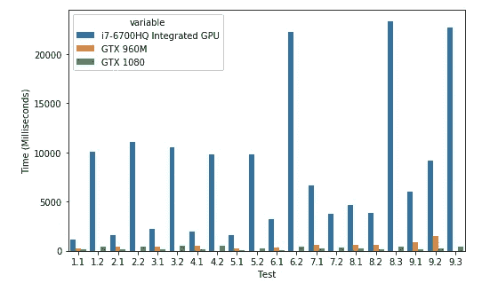
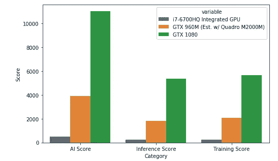
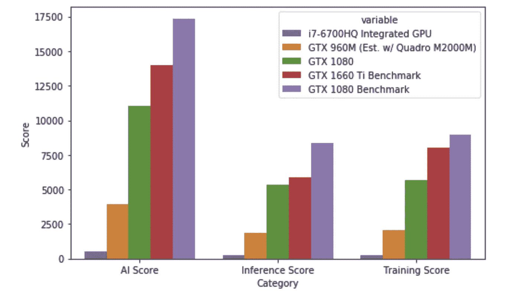

# 我是如何用 eGPU 将我的旧笔记本电脑变成机器学习超级明星的

> 原文：<https://towardsdatascience.com/how-i-turned-my-older-laptop-into-a-machine-learning-superstar-with-an-egpu-66679aa27a7c?source=collection_archive---------6----------------------->

## 以新电脑的零头成本改造超极本的惊人简单之旅

几年前的 2016 年初，在佐治亚理工学院(Georgia Institute of Technology)读本科的过程中，我试图用一台使用了 5 年的笔记本电脑获得计算机科学学位，这台电脑的硬盘出现了故障。我需要升级。新的英特尔 Skylake 处理器和 Dell XPS 15 9550 让我惊叹于超极本的外形和功能，所有这一切，加上专用的 NVIDIA 移动 GPU，我想我会准备好多年。

我准备好了。事实上，我正在同一台笔记本电脑上写这个故事，从我拿到它的那天起，它就没有慢过一点。直到年，我开始攻读人工智能和机器学习的硕士课程。我被分配了一个经典的深度学习任务，这个任务现在已经解决了，但在计算机视觉方面证明是一个很好的学习机会，训练一个 CNN 解决 [CIFAR-10。](https://en.wikipedia.org/wiki/CIFAR-10) CIFAR-10 是由 10 类低分辨率(32×32)图像组成的数据集，任务是训练一个模型，将新图像正确分类到这 10 类中的一类。它被广泛用作教材，因为低分辨率允许快速训练。至少我是这么认为的。一个多层的 CNN 开始需要几个小时甚至一个晚上来训练，而这本来应该是一个简单的任务。突然，可靠的 Skylake I7(现在已经有 3 代以上的历史了)和 2gb 的专用 GPU RAM 开始显示出磨损的迹象。

我知道我需要一个解决方案，所以我头脑风暴从头开始构建一个桌面 PC。要获得一台中高档的当前一代机器学习台式机，至少需要花费 1100 美元(配备 i5 6 内核 CPU 和 RTX 3070)，此外，作为一名喜欢在校园工作的研究生，1100 美元的 PC 将我限制在一个单独的位置，或者需要许多同步措施才能在两个位置工作。我可以买一台当前一代的超极本，它配备的 GPU 有时和 3050-Ti 一样好，但这些型号很容易就超过 2000 美元，并且不具备台式机用于培训的能力。

这促使我对像我这样的人的最佳解决方案进行了大量的研究。我有一台可靠但较旧的计算机，忙碌的生活让我忙个不停，需要更多的处理能力，并且希望在不倾家荡产的情况下将所有这些都放在一个地方。我知道，我的要求很多，但我确实找到了一个解决方案 eGPU。

外部 GPU 是一种允许您使用 thunderbolt 3 端口将显卡连接到现有电脑的设备。如果你有一台超极本 PC 2017 或更高版本(像我一样)，或者 MacBook Pro 2016 或更高版本，你可能已经有了，因此可以使用 eGPU 来彻底改造你的笔记本电脑。一个 eGPU 在设计上也相对简单，在其核心，它所包含的只是一个连接 GPU 的 PCIe 端口，一个连接计算机的 thunderbolt 3 端口，一个电源(GPU 需要的功率远远超过你的计算机所能提供的)，以及为你的 GPU 散热。你可以一起 DIY 所有这些组件，或者你可以像我一样采取更简单的方法，找到一个包含端口和电源的 [GPU 外壳](https://egpu.io/best-egpu-buyers-guide/)，将搜索减少到 2 个部分，一个 GPU 和一个外壳。

一旦我决定了我的行动路线，尝试 eGPU，是时候我去网上搜索，尝试找到最好的交易了。巧合的是，我的两笔交易都来自一个叫做 Letgo 的买家卖家应用。我以 260 美元的价格买到了一台英伟达 GTX 1080 8GB(我能在网上找到的最便宜的价格是 375 美元)，作为一个附件，我能找到有人以 280 美元的价格出售 Razer Core v2(在易贝的售价约为 400 美元)，这使我的总构建成本为 540 美元，从而获得了完全增强的笔记本电脑体验。

不是每个人都像我一样想要交易 hunt，所以我也评估了创建一个 ML eGPU 的最佳选项，价格约为 500 美元，完全在线，订购所有零件不超过 10 分钟。我会推荐一个 NVIDIA 1660-Ti 6GB，给出类似的 GPU 能力(稍微降级)，280 美元，还有一个翻新的 Razer Core X，270 美元就可以从 Razer 那里买到。如果你愿意多花一点钱买一个更好、更新的 GPU，RTX 3060 8GB 会更经得起未来考验，但价格也要 400 美元。如果您正在考虑改造 Macbook，可能值得考虑 AMD 处理器，因为它们在苹果生态系统中的支持水平有所提高。

一旦我造好了机器，我就开始量化我的经验。GTX 1080 比我以前的移动 GPU 有多大的改进？为了解决这个任务，我使用了 [AI-benchmark](https://pypi.org/project/ai-benchmark/) ，这是一个 Python 库，它利用 Tensorflow 在 19 个不同的部分上运行 [42 个测试，为 GPU 提供了一个很好的广义 AI 分数。我将 AI-Benchmark 与 Jupyter 笔记本、pandas 和一个名为 Seaborn 的可视化工具相结合，以量化我的结果。代码可以在 Github](http://ai-benchmark.com/alpha) [这里](https://github.com/jeremydiba/GPU-benchmark)找到。

第一个结果是关于单个测试及其运行时间(毫秒)。我只包括了 19 个测试中的第 1 到第 9 个，因为大量的结果会让人眼花缭乱。我的 GTX 960m GPU(XPS 自带的 GPU)也遇到了一个大问题。因为它只有 2GB 的显卡，它没有通过大量的测试，因为张量太大了，不适合 2GB 的卡。

测试 1 至 9

这个测试的结果非常清楚。集成显卡绝不适合机器学习，即使它比移动 GPU 更稳定。这些测试运行的时间都要长得多，甚至会导致简单的任务运行得非常慢。当谈到任务的速度时，GTX 960M 实际上保持了自己的。然而，它的不足之处在于可靠性。只有 2GB 的内存是一个巨大的障碍，将导致您不得不牺牲模型的大小，以便能够适应这样一个严重的限制。出于这个原因，GTX 960M 远不适合现代深度学习。然而，8GB 内存的 GTX 1080 完美地运行了所有任务，并在实际运行的任务中提供了比 GTX 960M 大约 3 倍的速度升级。

3 项测试的总结

AI-benchmark 还会在测试结束后创建一个综合分数(越高越好)。请注意，GTX 960 米基准是推断出来的。由于测试无法完成，因此无法获得总分。正因为如此，我从 [AI-Benchmark 的结果](http://ai-benchmark.com/ranking_deeplearning.html)测试的类似 GPU 中推断出分数。替代的 GPU 使用相同的架构，在成功运行的测试中，性能相差不到百分之几。显而易见，GTX 1080 击败了所有自动化测试，并在可靠性和速度方面取得了可观的进步。基于这一结果，很明显 eGPU 是其昂贵替代品的绝佳替代品，的确如此，但我对此有一个警告。

尽管与 XPS 本身相比，结果令人震惊，但与集成 GPU 相比，使用 eGPU 可能会带来速度损失。

带有基准的摘要

当将我得到的基准与 AI 基准达到的顶级基准[进行比较时，它还有很多需要改进的地方。我预计雷电 3 端口的带宽会导致 10%到 15%的性能损失，但是这些测试显示分数明显下降了 30%,我有一个关于原因的假设。](http://ai-benchmark.com/ranking_deeplearning.html)

XPS 15 9550 和 9650 型号虽然声称完全支持 thunderbolt 3，但硬件上限为 2 通道，而不是宣传的 4 通道(戴尔后来解决了这一问题)。我的假设是，这是在雷电港造成了瓶颈。在未来的版本中，我可能会用 MacBook(有 4 个通道可用)来运行这些测试，以证实我的怀疑。如果我是正确的，我应该在 MacBook 上看到 AI 得分超过 1400。[这篇文章也印证了我的怀疑！](/why-is-thunderbolt-3-such-a-huge-deal-and-why-apple-loves-them-614542d32dc2)

这让我想到了我的一般建议——这是一个可行且经济的选择吗？

我会说绝对的。即使分数没有达到基准，这台 540 美元的电脑升级到曾经 1500 美元的电脑已经延长了它的生存能力。仅仅是拥有 2GB GPU 和 8GB GPU 之间的差异就足以让这件事值得去做。如果你的笔记本电脑只有集成显卡，如果你想用它进行深度学习，我甚至会说这种升级是必须的。

我不建议这种升级的唯一方式是，如果你的笔记本电脑已经有 4GB 的 GPU RAM 和至少一个 GTX 1050-Ti GPU。如果是这样的话，您不太可能看到性能的巨大提高，并且只有当您发现自己需要更多的 RAM 来处理更重的任务时，eGPU 才真正值得您花钱。

## 结论和后续行动

如果你喜欢这篇文章，我[写了另外一篇文章](https://medium.com/@jeremydibattista_28827/deep-learning-on-a-budget-450-egpu-vs-google-colab-494f9a2ff0db)比较这个 eGPU 和 Google Colab！如果你喜欢这篇文章，它值得一读，在[这篇文章](https://jerdibattista.medium.com/why-is-thunderbolt-3-such-a-huge-deal-and-why-apple-loves-them-614542d32dc2)的另一篇后续文章中，我测试了当连接速度提高到 40 Gbps 时会发生什么。如果你喜欢这个内容，请用我[作为推荐人](https://jerdibattista.medium.com/membership)，这样我就可以继续发布我喜欢的内容。