# 我如何使用 AWS Lambda 让我的女朋友微笑

> 原文：<https://towardsdatascience.com/how-i-used-aws-lambda-to-make-my-girlfriend-smile-61194596f2d?source=collection_archive---------10----------------------->

## 开始这个有趣的小项目来提升你周围人的精神

莱斯莉·华雷斯在 [Unsplash](https://unsplash.com/s/photos/happiness?utm_source=unsplash&utm_medium=referral&utm_content=creditCopyText) 上的照片

我们目前正处于一些前所未有的时代。新冠肺炎已经接管了，我们唯一能做的就是把自己锁在里面。

除非你是一个人隔离，否则有可能你已经对周围的人失去了耐心(或者他们对你失去了耐心)。

也许是我们传播快乐的时候了。

有什么比让一个无生命的物体为你传播快乐更好的方式呢？

我们将编程一个 Alexa 技能，使我们的亚马逊设备说一些定制的有趣的事情。

内向的我喜欢这项运动。它不仅让我大量接触了一些尖端技术，还让我周围的人脸上露出了笑容。在这艰难的时刻，我想我们都需要微笑。

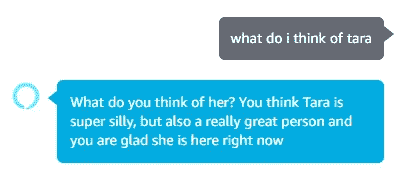

我们在这里使用一种叫做“震惊幽默”的喜剧风格。当一个人在最意想不到的时候听到一个无生命的物体称赞自己的名字时，肯定会让他们在接下来的几分钟里笑得流泪。

本教程不要求你具备编程能力(尽管它确实有所帮助)。你真正需要的只是跟随指示的能力。

让你的女朋友，男朋友，儿子，女儿，丈夫，妻子，姐妹，兄弟，阿姨，叔叔，狗今天笑！

# 目标

创造一个 Alexa 技能来传播积极。

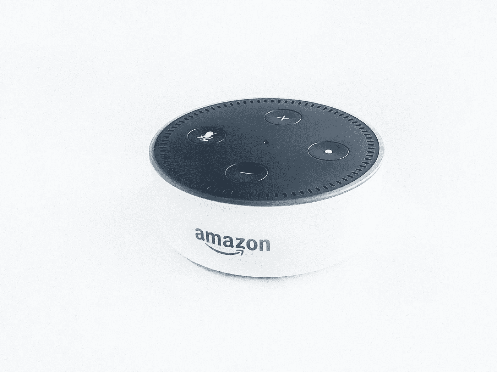

照片由[拉胡尔·查克拉博蒂](https://unsplash.com/@hckmstrrahul?utm_source=unsplash&utm_medium=referral&utm_content=creditCopyText)在 [Unsplash](https://unsplash.com/s/photos/alexa?utm_source=unsplash&utm_medium=referral&utm_content=creditCopyText) 拍摄

# 先决条件

开始学习本教程需要以下物品:

*   安装了 Alexa 的设备——亚马逊 Echo、Echo Dot、FireTV、Fire 平板电脑等。
*   AWS 自由层帐户
*   大约 20 分钟的时间

# 创建 Lambda 函数

我们开始吧！

[登录您的 AWS 帐户](https://aws.amazon.com/marketplace/management/signin)并导航至 AWS Lambda，您可以在计算部分找到它:

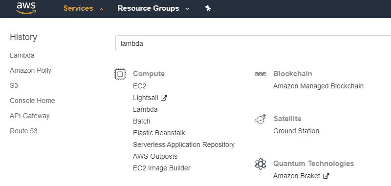

然后，我们将单击 AWS Lambda 仪表板内的**创建功能**按钮:

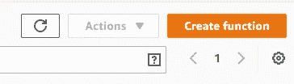

对于这个 Lambda 函数，我们将使用由其他人创建的无服务器应用程序存储库。这些存储库是由 AWS、AWS 合作伙伴和其他开发者创建的，可供我们随时使用。

如果你没有看到任何 Alexa 技能相关的选项，请尝试将您的地区切换到美国东部 1。这就是我正在使用的。

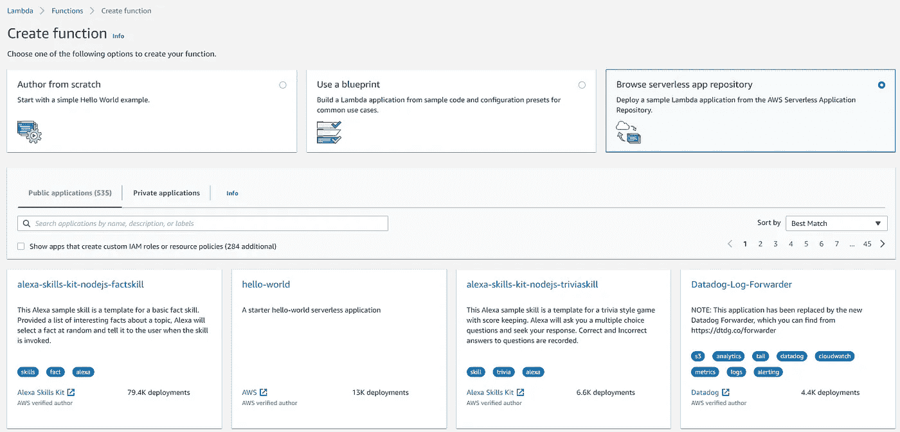

接下来，点击上面的**Alexa-skills-kit-nodejs-factskill**卡片。

单击该链接后，将所有设置保留为默认值。但是，我将把应用程序的名称改为其他名称:

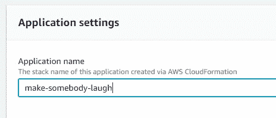

完成该功能的设置配置后，单击右下角的 deploy 按钮。

CloudFormation 会处理这个部署。

几分钟后，您将看到以下内容:

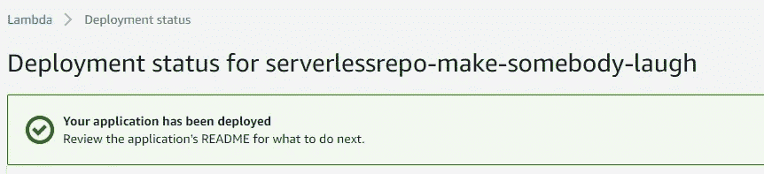

现在，当您到达 AWS Lambda 函数(在左侧的导航栏上)时，您将看到您新创建的函数。

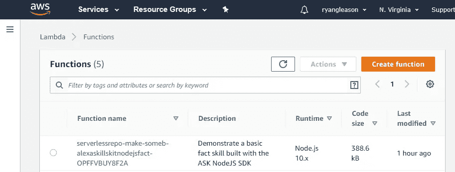

单击您新创建的函数链接。

# 编辑你的 Lambda 函数

现在，这就是有趣的地方。

一旦你进入 Lambda 函数，你可以向下滚动到**函数代码**中的文本编辑器。

搜索这段代码。这是为说英语的人准备的版本。选择您使用的任何语言:

我们必须将`GET_FACT_MESSAGE`字段和`FACTS`数组编辑为绝对最小的值，以使其按照我们想要的方式工作。请随意编辑其他内容:

你会注意到我从`FACTS`数组中取出了所有东西。这是因为这个特定的 Alexa 技能被设计成从数组中随机选择一个元素来说。当数组中只有一个元素时，它只有一个选项可以说:)

把你想要的任何东西放进这些字段。尽情享受吧！

好了，这就是我们从λ方面需要做的。让我们制作它，这样我们就可以在家里使用 Alexa 设备了。

# 创造 Alexa 技能

导航到[https://developer.amazon.com/alexa/console/ask](https://developer.amazon.com/alexa/console/ask)；这是我们要为我们的 Alexa 创造实际技能的地方。我们将创建一个开发人员帐户。

如果您尚未注册，请使用您注册 Amazon Alexa 的同一帐户。这将使这个过程变得容易得多。

如果你没有把你的 Alexa 注册到你的亚马逊账户，很简单。只需在手机上下载 Alexa 应用程序，然后按照步骤操作。

一旦你在[https://developer.amazon.com/alexa/console/ask](https://developer.amazon.com/alexa/console/ask)，点击右手边的**创造技能**按钮:

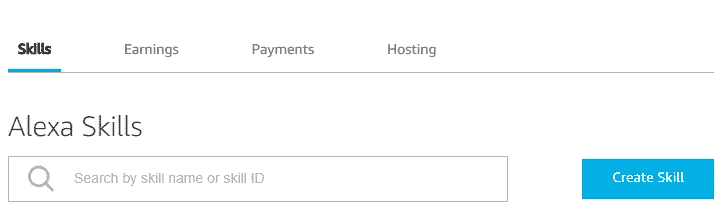

然后给它起一个名字，选择 **Custom** 作为模型来添加我们的技能，**提供您自己的**作为托管我们的技能后端资源的方法:

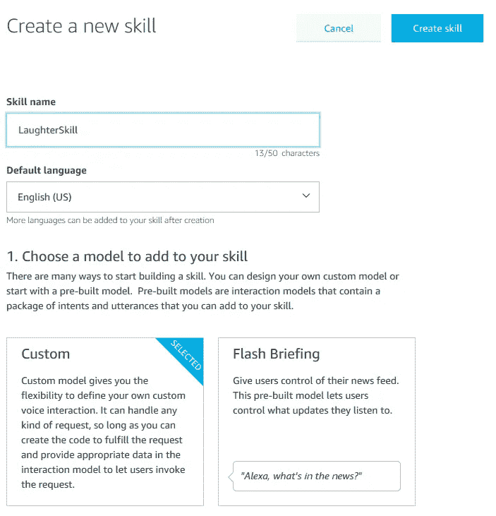

然后，我们将改变我们的模板事实技能，因为这是我们如何生成我们的 Lambda 函数。

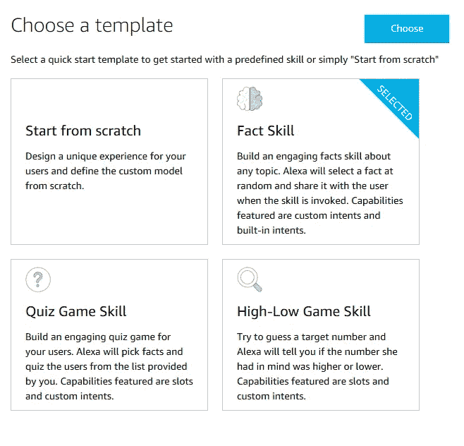

一旦你点击**选择**，我们的 Alexa 应用就创建好了！就这么简单。

现在，**这一步至关重要**。我们必须将端点更改为 AWS Lambda 函数的端点。否则，它怎么知道触发哪个 Lambda 函数呢？

回到 AWS 中的 Lambda 函数，在右上角寻找 ARN:

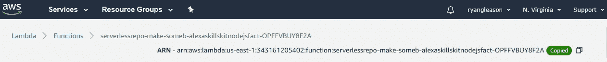

将其复制到剪贴板，并粘贴到**端点**选项卡的**默认区域**字段中:

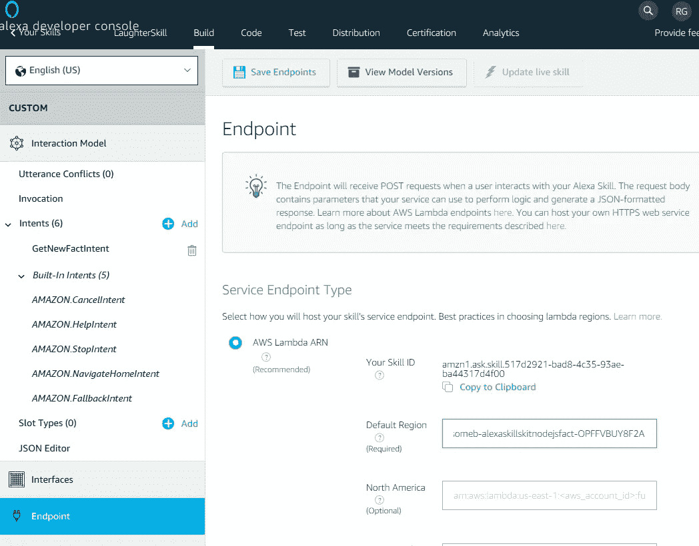

单击顶部的保存端点按钮。

现在我们需要添加一个新的**意图**。这是你需要对你的 Alexa 说的话，让它触发你的 Lambda 功能。所以你会在下面看到我已经输入了，“我对塔拉的看法。”塔拉是我女朋友的名字；你可以把它做成任何东西。

这句话是你需要对你的 Alexa 设备说的话，它会用你在 AWS Lambda 函数代码中写的内容作出响应。

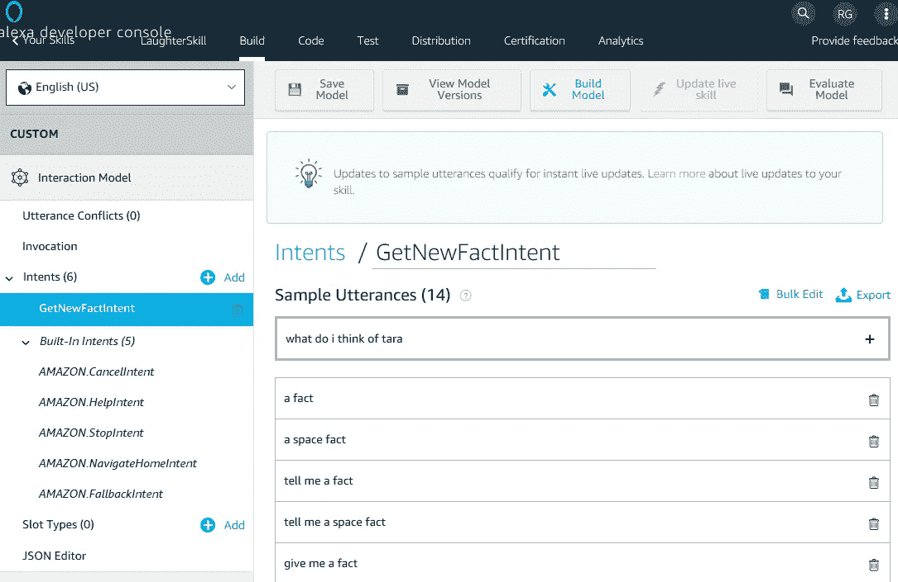

一旦你添加了所有你希望 Alexa 回应的话语，点击**保存模型**和**建立模型**。这应该只需要几秒钟或几分钟的时间来构建。

当构建成功时，您应该会在底部看到以下消息:

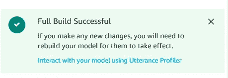

现在导航到顶部导航栏中的**测试**选项卡。

将**技能测试启用**下拉菜单更改为**发展。**

在左边输入你的话语，你的 Lambda 函数就会被触发，你的回答就会被输出。

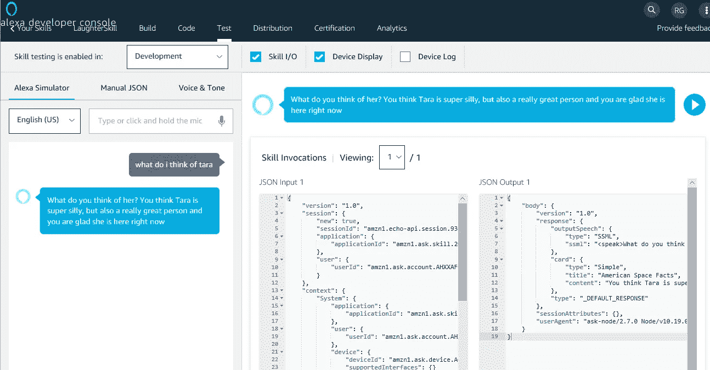

现在，如果你的 Alexa 设备注册到你的帐户，你可以对着你的设备说出话语，同样的响应将会返回，但这次是来自 Alexa。

这就是所有的人。希望你用这个来逗别人笑。有这么多你可以做的这些 Alexa 技能；我们只是浏览了一下表面。

尽情享受吧！