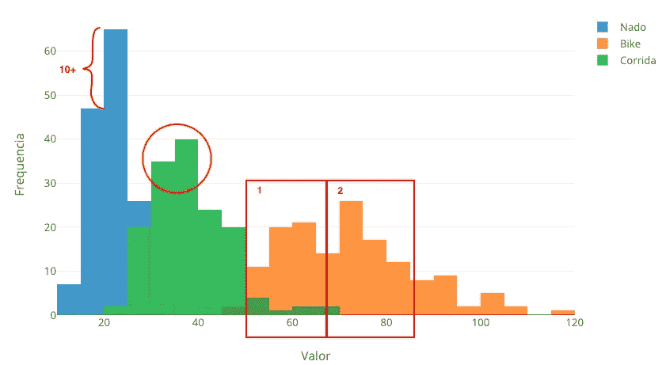
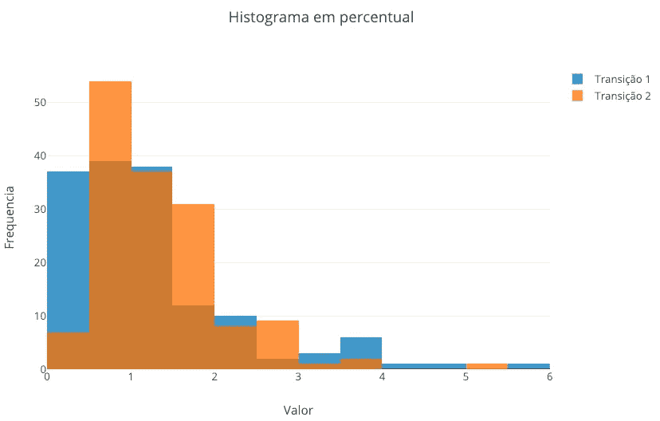
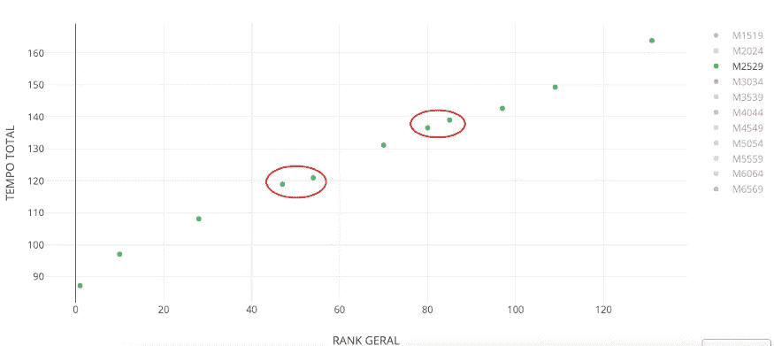
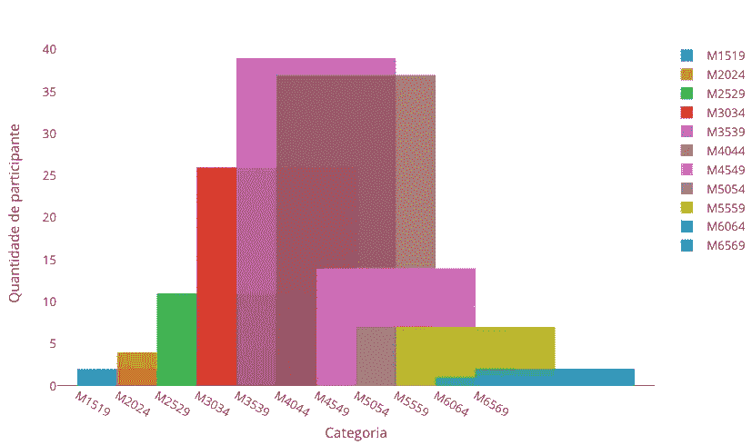
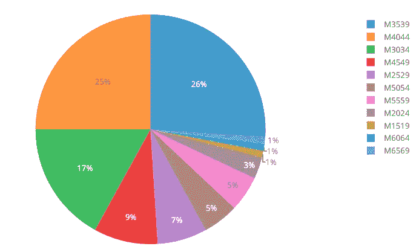
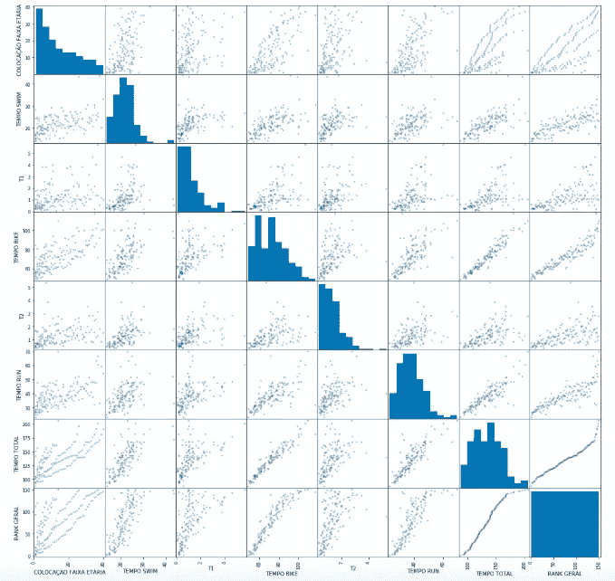
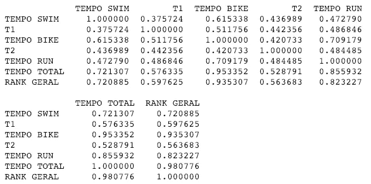
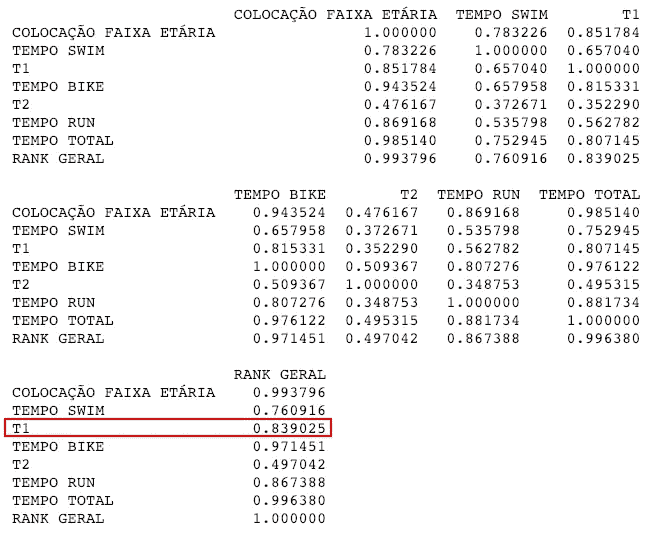

# 我如何利用数据科学技能成为一名铁人三项运动员

> 原文：<https://towardsdatascience.com/how-i-used-data-science-skills-to-become-a-triathlon-athlete-f1628e5cc522?source=collection_archive---------57----------------------->

## 360°分析，用捷径提高你的铁人三项成绩！

我知道这些词永远不会匹配:更少的努力和铁人三项。在这篇文章结束时，你会明白我的意思。

我的第一场比赛=)

我参加[铁人三项](https://en.wikipedia.org/wiki/Triathlon)的全部训练都集中在游泳上，原因有三:

1.  我做了 11 年的冲浪者，这对于想完成铁人三项的人来说是个问题。我必须建立我的策略，在游泳中获得稳定的成绩，因为那些冲浪的人有爆发力和强有力的划水，这与你在铁人三项中需要做的相反。
2.  第二个原因是我以前从未在海上游过 300 米以上。
3.  第三个也是最后一个，小时候在海里游泳有过不好的经历。

由于这些原因，我在比赛前一个月集中精力，每周每天在游泳池里游泳(至少尝试过)40 分钟。我也专注于只用手臂划水。

越野和山地自行车比游泳更容易训练，因为我经常做这两项运动。由于我遵循了健康食品和天然营养，我觉得我已经为比赛做好了准备。

好吧，但是这些和数据科学有什么关系呢？

嗯，这是我的“基线模型”，我知道我不会登上领奖台。但这足以完成、分析和学习。这就是我的目标——观察内在(我的身体表现)和外在(竞争对手和赛道)的一切。

从我所有的超参数(我在这三项运动中的训练)中，我希望只调整一项，即游泳，我知道它会给我一个可接受的最终结果。

当我冲过终点线时，在我看来，我看到了许多细节，我必须为下一场比赛改进。此外，我以为会很难的事情，其实一点也不难。基准测试，以及对其他有经验的竞争对手的分析，最终变得非常重要。

作为一个善于分析的人，我意识到的和认为需要调整的一切都不够。我需要大量的东西来证明我的想法是正确的。

为此，我使用 Python 对我参加的铁人三项赛的数据进行了探索性数据分析(EDA)。

[GitHub](https://github.com/arthurvaz05/Python.Script/blob/master/xterra/xterra_analyses_costaverde.ipynb) 上的全部代码。

基本上，我在[铁人三项网站](http://xterrabrasil.com.br/tour/etapas/)上搜集了所有业余运动员的最终成绩，做了一些图表和简单的推理分析。

第一步:我想了解一下所有参赛者在铁人三项赛中的表现。所以，正如你所看到的，游泳者(蓝色)在 20 分钟内完成了绝大多数。另一方面，骑自行车的人(橙色)分布广泛，我们可以看到两个集群。第一组自行车时间不到 70 分钟，另一组平均超过 70 分钟。最后一个，跑步者，有 30-40 分钟的微小间隙。

游泳、自行车和跑步直方图 python 代码

下一个直方图使用与上面相同的分析技术，但是现在是关于过渡时间。我们可以得出结论，在第一个跃迁(蓝色)中，可以保持一个比第二个跃迁(橙色)大的时间范围(0:00–1:30)。第二个，必须在一分钟内完成。

转换直方图 python 代码

完成对所有业余运动员的分析后，我拍了一张我的类别(M2529)表现的快照。主要目的是了解分布情况，以及是否有机会通过减少几分钟来提高最终排名。

时间 x 按男性类别排名 python 代码

在分类数据中，有两个位置的差距小于 5 分钟。

下一张图是按类别分类的直方图，我们可以很容易地确认，更多的参与者年龄在 30-44 岁之间。

按男性分类的参与者 python 代码

这三类运动员占所有业余运动员的 68%。

男子业余运动员分类饼图 python 代码

综上，我想知道哪项运动对最终结果的影响最大。为此，我选择了一个散点图来理解这种相关性。

所有变量的分布和相关性— python 代码

虽然散点图矩阵足以理解每项运动对最终结果的影响，但下面有两个相关矩阵来进一步探索变量之间的关系。

在这两种情况下，对于通过 M2529 类别过滤的所有运动员，骑自行车的时间对最终结果有很大影响，其次是跑步时间，然后是游泳时间。

真正有趣的是，过渡 1 对 M2529 类别的最终结果产生了强烈的影响。

所有业余运动员—相关矩阵

25-29 岁的男性业余运动员——相关矩阵

这些都是我在第一次参加铁人三项时收集和学到的见解。

我已经用我的基本数据科学技能为我的下一次活动做了更充分的准备，同样的方式，你也可以在你的爱好或日常工作中做同样的事情。只要搜索其中的数据，有用的见解就会出现。

我的 python 脚本很乱，没有评论，但是非常直观，所以我道歉！

数据科学几乎可以应用于所有情况，那么你还在等什么？！

感谢您的阅读。请在下面分享您的意见和反馈。