# 我如何利用数据科学为一个重要事件挑选香槟

> 原文：<https://towardsdatascience.com/how-i-used-data-science-to-select-champagne-for-an-important-event-f54e81bad59?source=collection_archive---------30----------------------->

## 警告:读完这篇文章后，你可能会感到口渴

图片来源—葡萄酒搜索者

我有一个重要的事件即将发生。宾客名单中包括高级香槟的鉴赏家。香槟的选择不容出错。我有两种选择香槟的方法。

1.  通常的方法——去一个香槟洞穴，尝几口，向洞穴主人寻求建议，选择我喜欢的。我要得到的是山洞里能得到的东西。显然，世界上没有一个洞穴拥有世界上所有的 10K+香槟。
2.  数据科学的方式——使用数据和算法来帮助选择。

我之前已经对方法 1 有过不好的体验。要么是我没有好的香槟口味，要么是洞穴主人想推销他们想推销的香槟。

所以我决定采用方法 2。方法 2 的另一个优点是，如果一切顺利，我可以用好的数据故事打动我的客人。边喝香槟边讨论人工智能和数据科学的一些前沿问题听起来非常酷。

这是我用一些很酷的数据科学材料选择香槟的旅程。

在我们开始之前，我要对我使用的所有资源表示感谢:香槟数据库—[https://www.wine-searcher.com](https://www.wine-searcher.com/)

# 从哪里开始

因为苏格兰威士忌总是来自苏格兰，香槟总是法国的。原因是法国有一个叫香槟的地区出产世界上大部分的香槟。香槟的数量远远超过数千。所以第一步是列出所有香槟的清单。幸运的是，有一个每月更新的香槟数据库(可在 https://www.wine-searcher.com[找到)。](https://www.wine-searcher.com/)

我下载了 10000 多瓶香槟。相当长的名单。这里显示了一个数据截图。

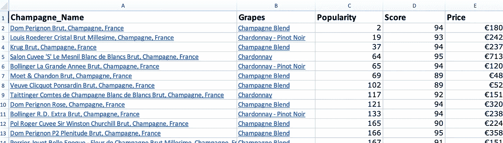

香槟数据库下载快照。

数据库有一些有用的信息，例如

葡萄——葡萄的种类能很好地表明香槟的味道和口感。

受欢迎程度——这个指标是一种销售等级，也表明客户购买它的频率

分数——这是香槟品酒专家对香槟评价的一个指标

价格——一瓶 750 毫升香槟的欧元价格

我认为我已经获得了开始应用数据科学的良好信息。

# 决定选择策略

下一步是建立一个选择策略。品尝所有的 10K 香槟是个好主意，但不可行。这是我想到的两个基本策略

1.  看看数据里有没有**稀有的**——比如高分或者高人气，但是价格低。
2.  根据列将相似的香槟分成**组**，并从每组中选择。这将确保良好的总体选择。

# 策略——寻找稀有品种

我决定看看是否有罕见的使用三个领域-人气，得分，价格。但是首先，重要是看这些字段中是否有任何不相关的。我有过这样的想法，如果低价香槟很受欢迎呢？人气和价格有关联吗？如果是，那么我只需要选择其中一个。

并且它显示了-0.16 的相关值，这意味着没有显著的相关性。

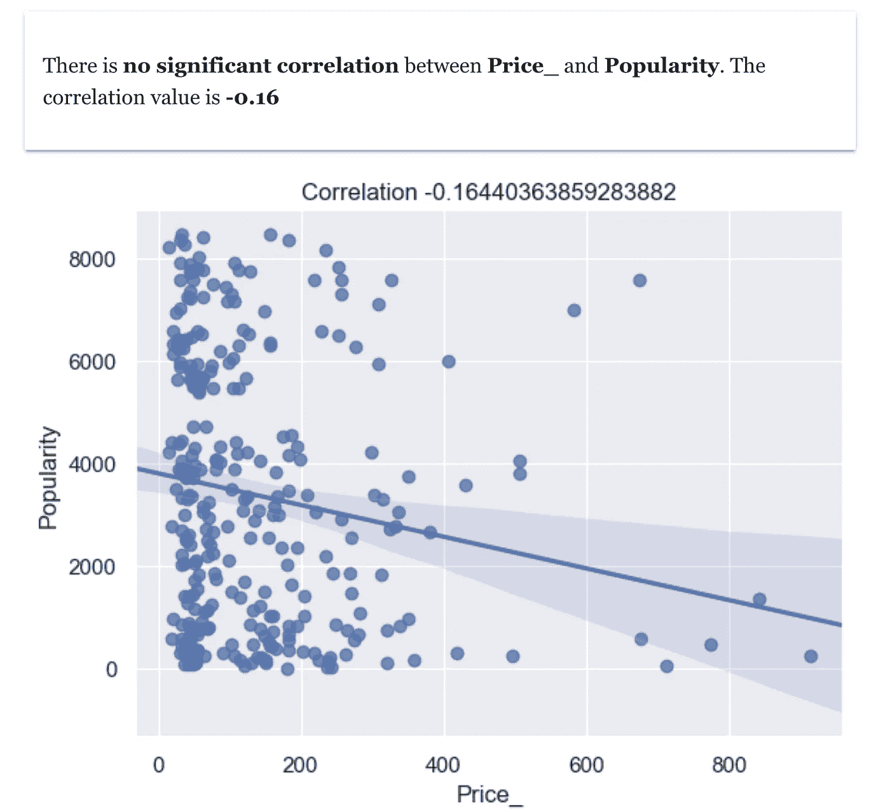

价格与受欢迎程度的相关性

所以现在我可以安全地使用这三个字段，因为它们之间没有重叠。

在数据科学术语中，稀有意味着离群值。发现异常值意味着发现一些不寻常的流行度、分数、价格的组合。找到跨越 10K+行和 3 个字段的非共同组合是一个复杂的问题。幸运的是，借助数据科学的力量，我们可以使用异常值检测算法。

这是异常值检测的结果。

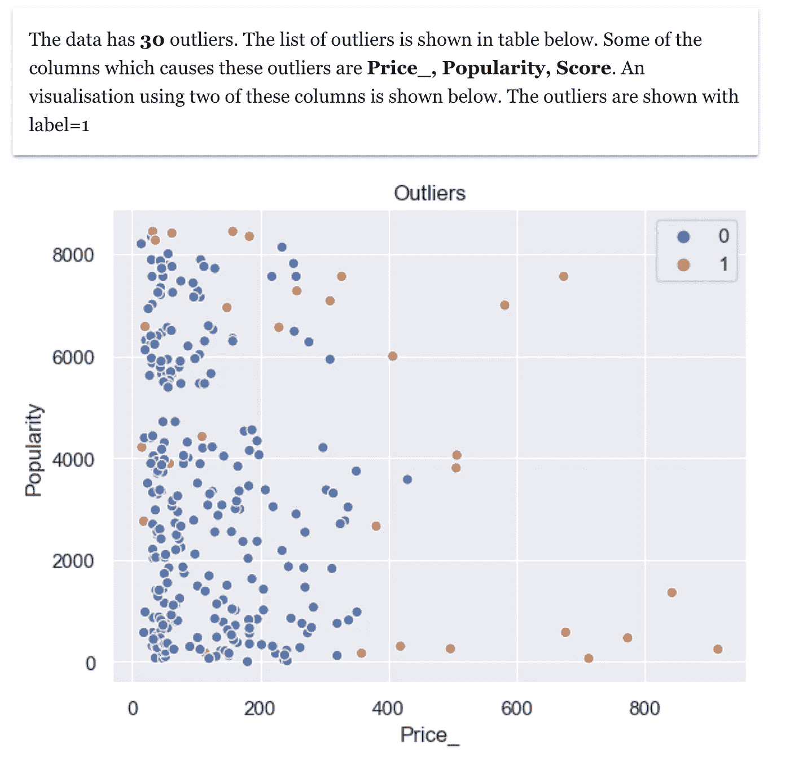

离群点检测

该算法发现了 30 个异常值。这意味着我可以从 10K+香槟名单中挑选出 30 个香槟。哇！这个结果令人震惊。我永远也不会用 excel 手动将 10K 香槟的数量减少到 30 瓶。

我还可以通过查看各个列中的正常范围和异常值来减少列表。这是对各个列进行异常值分析的结果。

对于列分数，高于 94 的值是异常值。

对于列流行度，没有异常值。

对于列价格，超过 400 的值可以被认为是非常高的价格。

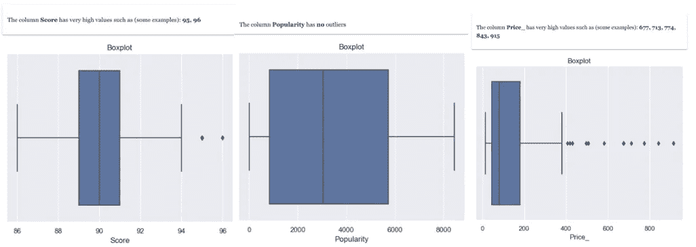

因此，在异常值中，仍然通过分数> 94 和价格< 400 进行过滤，我得到了 2 个香槟。瞧啊。这是我的稀有发现。

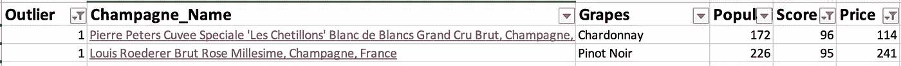

隐藏的金块

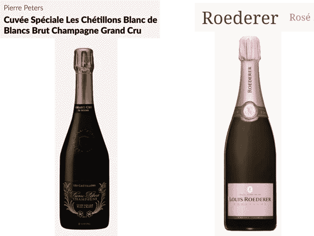

图片来源—葡萄酒搜索者

然后我在网上搜索，我发现了异常的评论。

“世界上 1%的顶级香槟之一”。“以这种质量，价格可能会高出 3 倍”。

我知道我利用数据科学发现了一些罕见的香槟。如果没有数据科学，我会在互联网上花费无数的时间，对我的搜索没有任何信心。

现在来看第二个策略。

# 策略——将相似的香槟分组

在这个策略中，计划是通过分组来减少列表。这也将有助于我看一些团体，而不是 10K+个人线。然后我可以从组里选几个。

这次我决定使用以下字段葡萄，受欢迎程度，得分，价格。

在数据科学中，分组也是聚类或细分。

第一步是确定我应该分成多少组。我用聚类法将香槟分成 2、3、4 和 5 组，然后观察所有香槟在各组中的分布情况。这是对集群数量的分析结果。

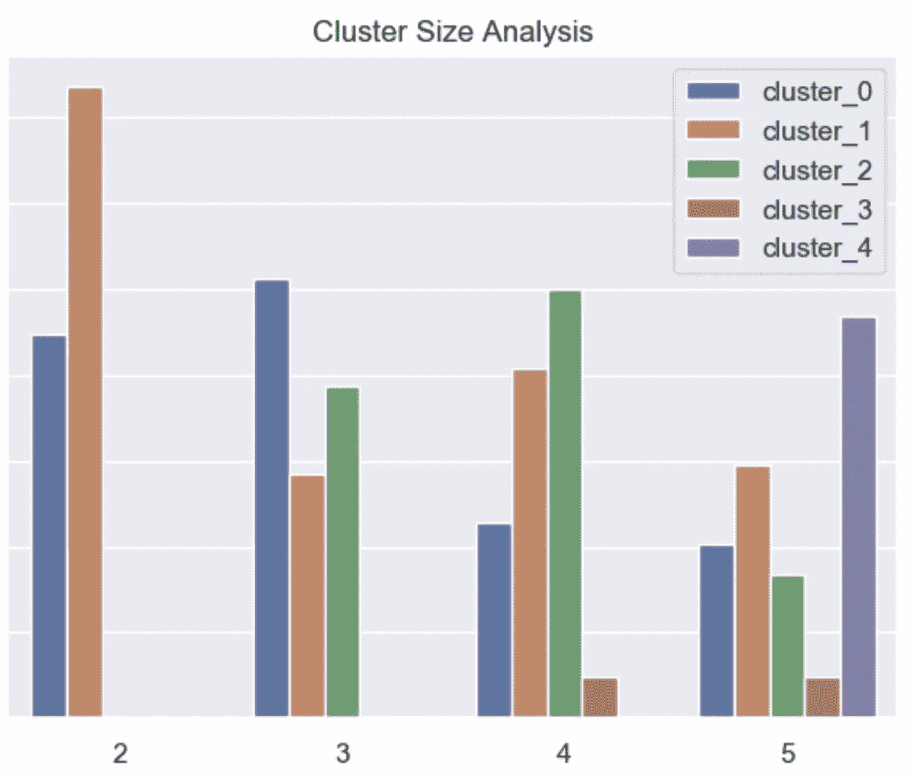

聚类大小分析

我决定选择 3 个组，因为每个组都很重要。这是 3 个集群的聚类结果。

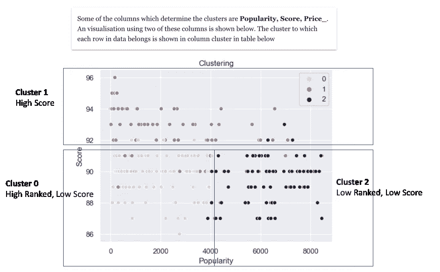

聚类结果

结果很有趣，我来解释一下。首先，输出表明影响集群的列是流行度、得分、价格。这意味着葡萄类型均匀地存在于所有的聚类中，并不真正在数据分组中起作用。

第二，我可以看到三个集群，这意味着

这里需要注意的是，低人气指数意味着高排名。

*   聚类 0-具有低流行数(高等级)和低分数的香槟
*   聚类 2——具有高流行数(低等级)和低分数的香槟
*   聚类 1-高分香槟

然后我决定选择聚类 1(高分),然后根据它的等级和价格进行过滤< 400 (like we did in first strategy). And I reach a short-list of about 12+ champagnes. And the beauty is that rare ones (Pierre Peters Grand Cru and Roederer Rosé) which I found in first strategy also made this list.

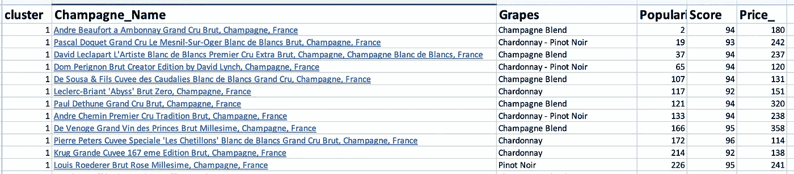

Also I see that I find all Grapes types, which is good, as my guest will have a good variety to choose from

**霞多丽**是世界上最著名的白葡萄酒葡萄。与之搭配的食物有胡桃南瓜烩饭(*烩饭 alla zucca* )、日式五花肉、蜂蜜芝麻胡萝卜烧鸡

**黑比诺**的本质是其红色浆果和樱桃的香气。与之搭配的食物有意大利面配牛肝菌肉片，烤鸭胸配梅子酱，烤鸡肝配吐司

Pinot Meunier (历史上只是 Meunier)是一种黑浆果葡萄品种。搭配食物有金枪鱼、椒盐鱿鱼、香蕉叶蒸虾

**香槟混合**是以上 3 种的混合

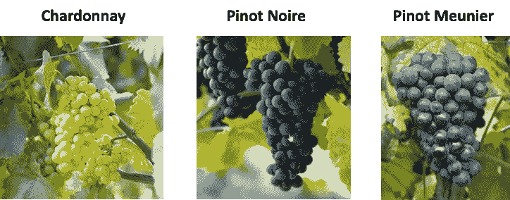

图片来源—葡萄酒搜索者

葡萄种类

我决定每种葡萄都去买几个。

瞧，这是我考虑策略 1 +策略 2 后的最终选择

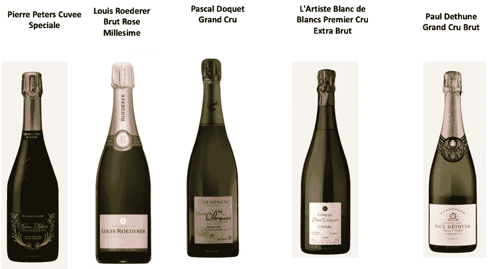

图片来源—葡萄酒搜索者

下一步是去品尝狂欢。幸运的是，我有一个候选名单，我不必根据销售人员提供的东西做一些随机品尝。

活动当天，我把所有通过数据科学挑选出来的香槟都冷藏起来，准备上菜。所有的客人都非常喜欢它！！！他们都很兴奋地知道我是如何使用一些很酷的算法来做出选择的。

图片来源—葡萄酒搜索者

庆祝时间

现在，我已经成为朋友们挑选香槟的首选。我这样做有一个条件——我将使用数据科学，我将进行品尝狂欢！！！

干杯！！！

# 额外资源

# 网站(全球资讯网的主机站)

你可以访问我的网站进行零编码分析。[https://experiencedatascience.com](https://experiencedatascience.com)

请**订阅**每当我发布一个新的故事时，请保持通知。

 [## 每当 Pranay Dave 发表文章时，您都会收到电子邮件。

### 每当 Pranay Dave 发表文章时，您都会收到电子邮件。注册后，如果您还没有，您将创建一个中型帐户…

pranay-dave9.medium.com](https://pranay-dave9.medium.com/subscribe) 

你也可以通过我的推荐链接加入 Medium。

 [## 通过我的推荐链接加入 Medium—Pranay Dave

### 作为一个媒体会员，你的会员费的一部分会给你阅读的作家，你可以完全接触到每一个故事…

pranay-dave9.medium.com](https://pranay-dave9.medium.com/membership) 

**Youtube 频道**
这里是我的 Youtube 频道的链接
【https://www.youtube.com/c/DataScienceDemonstrated 