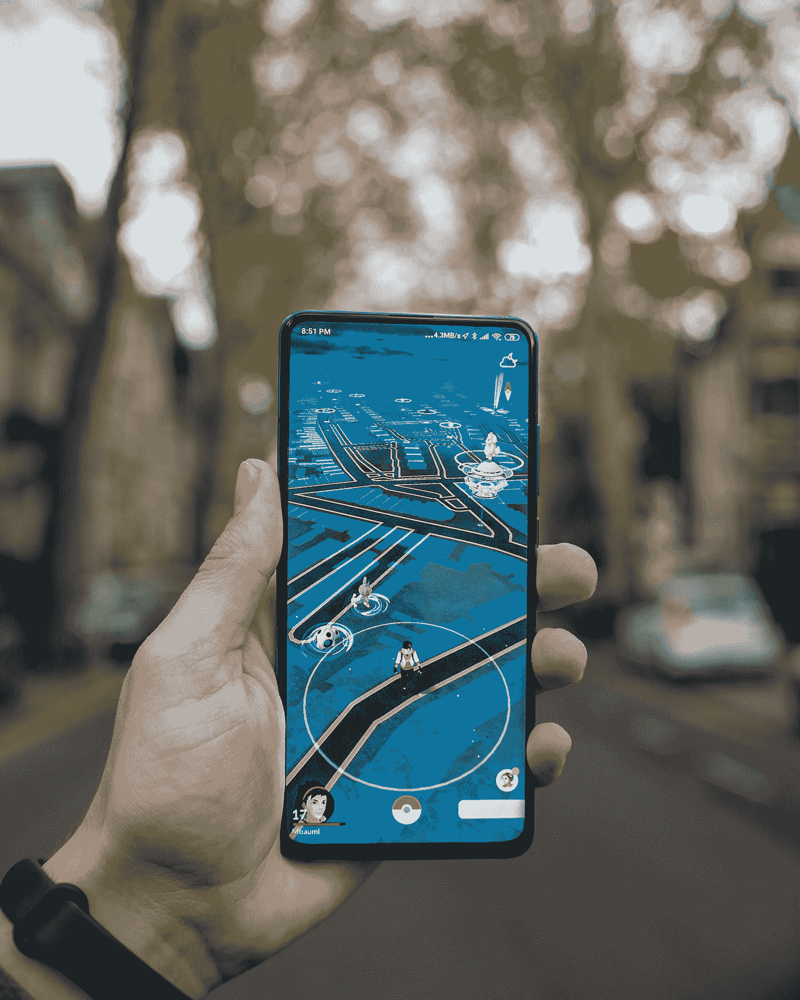
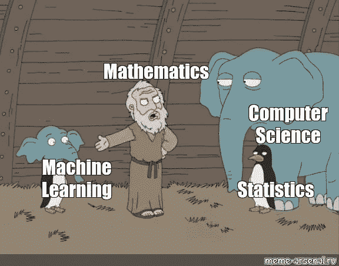

# 我如何在我的博士学位中使用光学/光子学应用中的机器学习

> 原文：<https://towardsdatascience.com/how-i-used-machine-learning-in-optics-photonics-optoelectronics-9452fe332a9f?source=collection_archive---------23----------------------->

## 对于你的光学/光子学问题，没有太多/任何开源数据集…

几年前，我获得了奖学金，攻读光子学建模博士学位。光学/光子学波导的建模和优化对于许多即将到来的应用非常重要，例如在增强现实应用中用于引导光的光学波导。看到这些很酷的应用程序激励我开始我的博士之旅。

米卡·鲍梅斯特在 [Unsplash](https://unsplash.com?utm_source=medium&utm_medium=referral) 上的照片

像任何其他博士研究员一样，我去了一个地方，当每个人都不确定他们在寻找什么以及如何找到他们正在寻找的东西时，他们都会去那里。是的，你猜对了——谷歌！！

幸运的是，我已经知道我在寻找某种开源代码/库或商业软件，来尝试光子建模应用。

# **令我惊讶的是，我发现了…**

*   商业软件 - **Comsol/Lumerical** 当时对我来说很贵，我甚至不确定让我的主管去买，因为我不确定我需要哪一个。
*   **开源库-** 有一些开源库，如 **Meep、**但我认为我们需要更多。谷歌、脸书、微软都采用了这种新趋势，将他们的技术开源给所有人学习。但是光学建模领域的大公司准备好开源了吗？
*   在我的学士学位期间，我从未费心去学习 Fortran，事实上，我可以说我选择不去听或学习 Fortran，因为它是一种如此过时的语言。语法不好，没有内置绘图库，以及其他问题。什么事？人们仍在使用它，因为它速度快，而且许多仍在使用的代码是用 Fortran 编写的。 ***但还是 Fortran…***
*   **没有光学工程师/科学家社区**——这个**对我伤害最大**。我找不到任何博客/网站让光学工程师定期来分享他们的工作和经验。到目前为止，我正在寻找这样的网站，分享人们谈论光子学的常规流量*(如果你知道这样的地方，请告诉我！).*

# 机器学习——时髦的词…

如果你正在读这篇文章，那么你很有可能听说过当今的科技术语-

***人工智能、机器学习、深度学习***

> 每个人都在谈论它。每一个新公司都在使用它或者想要使用它。他们是否需要并不重要，但他们想使用它。或者至少表明他们跟上了新技术的发展，使我们的生活变得更轻松、更美好。**我想这也是很好的营销方式！！**

从马克·扎克伯格、比尔·盖茨、蒂姆·库克那里听了好几次这些时髦的话，我认为寻找机器学习到底是什么没有坏处。

> **机器学习是什么鬼？** **然后我就明白了，机器学习其实就是统计学加上很多其他的东西。**

机器学习是什么鬼？信用:[https://www.meme-arsenal.com/en/create/meme/1868835](https://www.meme-arsenal.com/en/create/meme/1868835)

我从斯坦福大学的吴恩达教授的免费课程开始，并查看了一些 YouTube 视频。我最终花了 1000 多英镑去上 Udacity 和 Udemy 的课程。几个月来，这些课程消耗了我的每个周末。几乎每个周末。为了参加聚会，我甚至不得不几次对朋友说不。你能想象吗！！我知道我很愚蠢。反正现在都过去了…

# 机器学习+光子学…

读博士的第一年，我仍在寻找一个将成为我博士论文的主题。花了几个月时间阅读各种光子学研究论文，在尽可能少的帮助下理解一些最初的光学建模代码，并对几乎不存在的在线光学科学家社区感到恼火。

> 这时候我突然想到- **我应该尝试将机器学习用于光学/光子学应用吗？**

**是啊，为什么不呢！！有一个很大的机器学习在线社区，我有光学工程的背景。我觉得可能会有用。但是请记住，我在机器学习领域仍然是新手，几乎没有触及表面来理解和有效地使用它。那么问题就来了，如果我必须让它工作-**

*   到底有没有可能？有人做过吗？
*   我不确定哪种**光学应用**可以考虑使用机器学习。
*   **数据集-** 没有可用于任何光学应用的开源数据集。再次没有大的在线光学社区。
*   编码帮助- 有没有可以开始的初始代码？还是什么都要我自己写？
*   **最大的问题**——用光学来使用机器学习真的有用吗，还是我只是想在工作中使用一下流行语技术？

# 这个想法消失了将近 6 个月…

带着以上问题，我放弃了在光子学中使用机器学习的想法。我想每个人在寻找博士课题时都会遇到这种情况。每天，他们都有新的想法，然后继续前进。同样的事情也发生在我身上，我忙于典型的光学/光子学应用问题。

这是一个普通的工作日，也许我开始感到无聊，开始查看谷歌新闻。我完全不记得了。我看到一篇发表的研究论文，在一些光子功率分配器问题中使用了机器学习。我记得当时我对自己说- **哦，该死！几个月前你想过这个问题，这是有可能的…这不仅仅是因为我对使用光学应用的术语技术感到兴奋。**

> **我也可以用它，并且会用它…我所有的疑惑/问题都被它自己回答了……**

[陈奕迅](https://unsplash.com/@austinchan?utm_source=medium&utm_medium=referral)在 [Unsplash](https://unsplash.com?utm_source=medium&utm_medium=referral) 上拍照

# 最后一个未解之谜…

> 数据集？

我仍然没有任何网上可用的数据集。然后我想，如果我在网上找到数据集，那么我必须坚持光学问题。**但是如果我可以根据自己感兴趣的问题生成自己的数据集呢？这导致了我自己长达一个月的数据收集过程。这大约是 10000 个数据点，仍然远远低于一般的机器学习问题。**

我想说的是，如果你对使用机器学习的问题感兴趣，**你可以收集自己的数据**。但这同样取决于你感兴趣的问题类型。在我的情况下，它的工作原理是，我可以使用我们内部开发的代码和研究实验室中可用的制造设施来收集它。

# 一个百万美元的问题…

在我最后的 viva 和 2 次工作面试中，我被问了 3 次——如果我们可以使用**方程**来预测或优化特定的光学设备，为什么要使用机器学习来解决光学应用问题？

*当有大量输入参数需要优化时，机器学习大放异彩。首先，如果在我们的光学问题中，例如有超过 10 个输入设备尺寸需要优化，那么我们可以容易地使用机器学习。自己逐一比较和优化 10 个或更多的参数是一项艰巨的工作。第二，如果我们实验收集的数据有一些未知的噪声因子，而这些未知的噪声因子在方程中从来没有被考虑过。* *在这种情况下，可以使用机器学习来预测新值，该新值将考虑实验套件的未知噪声。所以我认为这两个因素/情况使得机器学习在光学问题中的应用非常有用。*

后来，我发表了两篇关于这项工作的期刊论文，其中一篇甚至被选为**编辑推荐。理解机器学习对我来说是一种好奇，但最终却成了我博士论文的主题。所以你永远不知道…**

> 正如史蒂夫·乔布斯所说——你只能回顾过去才能把点点滴滴联系起来。

如何在光学中使用机器学习，查看下面的文章-

 [## 如何用 40 行代码将机器学习用于光学/光子学应用

### 而且你不需要成为机器学习的专家…

medium.com](https://medium.com/@sunnychugh/how-to-use-machine-learning-for-an-optical-photonics-application-in-40-lines-of-code-92cc1c6704f6)