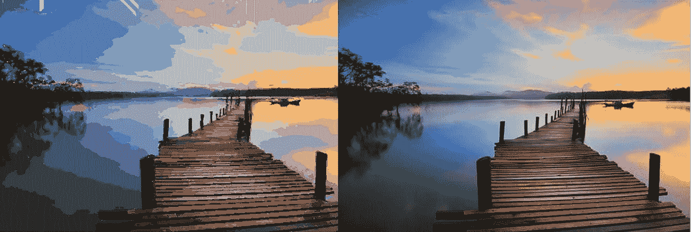
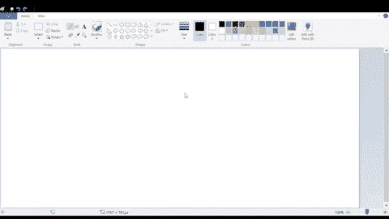
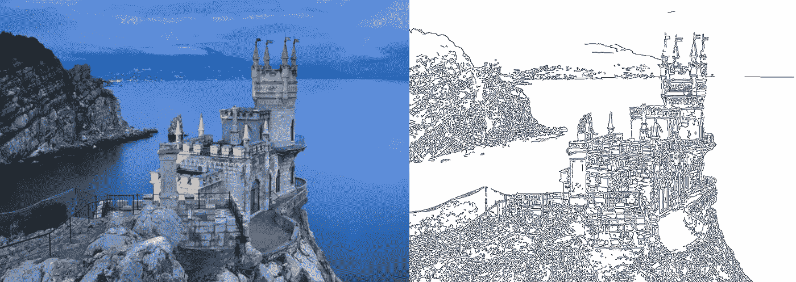
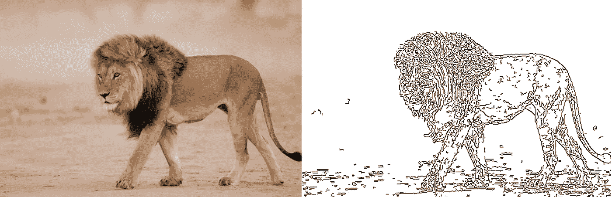
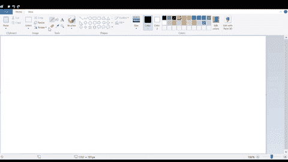
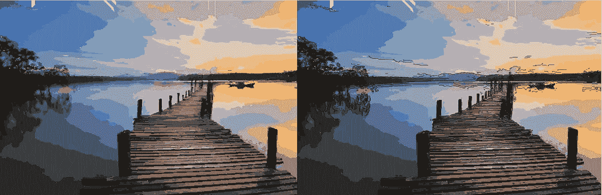
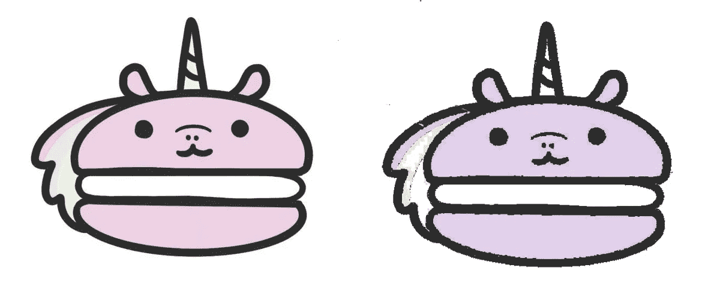
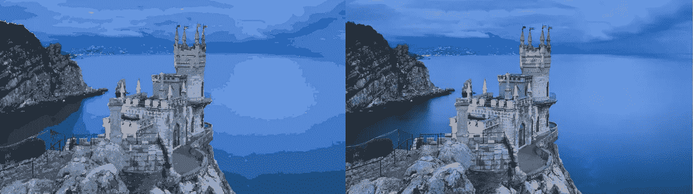

# 我如何使用机器学习来自动手绘任何图片

> 原文：<https://towardsdatascience.com/how-i-used-machine-learning-to-automatically-hand-draw-any-picture-7d024d0de997?source=collection_archive---------16----------------------->

## 监督和非监督学习变得容易！

[左]我的代理人自主绘制的照片。【右图】[来源](https://freerangestock.com/photos/83995/wooden-jetty-at-sunset--dreamy-looks.html) : [杰克·莫雷](https://freerangestock.com/photographer/Jack-Moreh/2728)

# 自动化无用的任务很有趣

没有什么比让机器人做无用的事情更好的了。我对艺术一窍不通，所以我决定发挥自己的优势，训练一个代理人在 MS paint 上为我手绘任何一幅画。

代理绘制不带颜色的马卡龙图片(32 倍速)

然而，说实话。我可以很容易地编辑图像，混合一些像素颜色，瞧！我创造了和你在第一张照片中看到的一样的绘画般的图像。

> 但那很无聊。

是的，在 MS Paint 中绘制它是乏味的，耗时的，并且相当麻烦。**但是，它表明人工智能、机器学习和优化的基础知识可以让我们做出令人惊叹的东西。**在这里，我将概述我是如何设计这个代理来绘制*任何*图片的。

# 处理图像

> TLDR:使用 OpenCV 应用可选的高斯滤波器，使用 Canny 边缘检测提取线条，并使用二进制阈值处理使我们的边缘变黑。有一些超参数控制绘图及其细节的相对大小。

首先，我们需要从图像中提取边缘。这样，代理就知道该画什么线了。使用 OpenCV，我们应用高斯滤波器，并使用 Canny 边缘检测来提取要绘制的大部分相关线条。然后，在使用反向二进制阈值使我们的边缘变黑之后，我们就可以提取出我们的程序要画的轮廓了！

【左】原图。[来源](https://www.wallpaperup.com/348242/Swallowand039s_Nest_Crimea_evening_Coast_castle_ocean.html) : [BelleDeese](https://www.wallpaperup.com/member/profile/1115) 【右图】图像处理后

我提供了三个混合匹配高斯模糊核大小和谨慎边缘检测阈值的选项。通常，增加的高斯模糊与较低的阈值成对出现，反之亦然。我们如何决定使用哪个选项？答:这取决于图像的细节。

有些图片只是有太多的难以辨认的线条(比如狮子的鬃毛)。在这些情况下，最好使用更多的模糊，因为我们会忽略细线，而注意到更强的线。另一方面，一些图片可能自然有足够的、*可辨别的*细节，允许我们使用较少的模糊。

如果不进行过滤，更精细的线条会变得难以辨认

还有两个特定的超参数需要优化。变量 *"scale"* 决定了我们想要用于绘图的屏幕部分。变量*“细节”*决定了我们想要从原始图像中保留多少细节。

在我们的专用部分内适当地拟合照片之后，我们使用细节参数将照片缩小成具有假定的*伪尺寸*的图像。这是我们计划草图路径的维度(我们的程序画线的顺序)。同样，我们通过使用变量 startX 和 startY 来定义我们将要绘制的原点。这有助于我们定义 translate 方法，从物理绘图中抽象出我们的实现。

# 等等，但是我们要怎么画？

> TLDR:使用一个超级方便的鼠标光标控制库 PyAutoGui。构建一个事件列表，包括拖动铅笔的方向、何时提起铅笔以及何时推动铅笔。

好的，但是在我们开始规划草图路径之前，我们需要检查一下我们到底是如何将代码转换成 MS Paint 上的绘图的。我们可以使用一个名为 PyAutoGui 的库来控制鼠标事件。首先，我们构建一个命令列表(在下一节中讨论),其中包含拖动光标的点、何时释放左键以及何时按住左键。然后，我们处理每个命令，看它创造奇迹！

代理在海滩上画城堡(256 倍速度)

下面是将命令列表转换成鼠标事件的简单代码:

# 规划草图路径

> TLDR:将所有的**边缘**像素插入 KD-Tree 和 Hashset。我用一个简单的算法来规划路径:从任何边缘像素开始。第二步，将铅笔拖动到未访问的相邻像素，有利于保持代理当前方向的像素。重复第二步，直到没有未访问的相邻像素。使用 K-最近邻来找到最近的未绘制边缘像素，并重复直到图片被完全绘制。对执行速度进行了其他优化。

是的，我很容易就能拍下这张处理过的照片，然后就此收工，但这一点也不好玩。相反，我们将使用监督学习和一个简单的算法来有效地找到代理绘制的路线。

照片由 [niko photos](https://unsplash.com/@niko_photos?utm_source=medium&utm_medium=referral) 在 [Unsplash](https://unsplash.com?utm_source=medium&utm_medium=referral) 上拍摄(非代理绘制)

## KD 树和 K-最近邻

我们需要一种方法来有效地跟踪我们的边缘像素。因此，我们可以将所有边缘像素坐标放入一个 HashSet 和 KD 树中。这些将跟踪我们的未绘制的边缘像素。这意味着一旦我们画完一个边缘像素，我们就从两个数据结构中删除它。

好的，我们知道如何跟踪我们的边缘像素，但是我们如何决定绘制它们的顺序呢？

## 动量和连续性

当我们人类画画时，我们试图保持方向性。也就是说，我们用平滑、连续的笔触描绘事物，而不是跳动或不稳定的笔触。所以，我们用动量的概念。

我们可以把我们的命令想象成一个元组列表，每个元组告诉我们从哪里拖动光标到哪里。当我们的机器人规划它的路径时，在我们从某个方向输入一个像素后，我们通过偏好与前一个方向最相似的未绘制的边缘像素来决定我们要行进到的下一个像素。换句话说，我们查看像素的八个相邻像素中的每一个，过滤掉那些不是未绘制边缘像素的像素，并选择最大化方向性保留的像素。如果没有相邻的，使用 K-最近邻从一个新的位置开始。

使用规划的路径绘制日落海滩(64 倍速度)

为了快速复习 K-最近邻和 K-D 树，这里有一个来自[莎万·帕特尔](https://medium.com/u/180dbaaffa4e?source=post_page-----7d024d0de997--------------------------------)的很棒的教程:

 [## 第四章:K 近邻分类器

### 监督学习中的第四个也是最后一个基本分类器！k 个最近邻居。在本帖中，我们将讨论…

medium.com](https://medium.com/machine-learning-101/k-nearest-neighbors-classifier-1c1ff404d265) 

所以，我们可以把这个算法总结成几个步骤:

1.  选择任意起点和方向
2.  如果有相邻的未绘制边缘像素，请将铅笔拖动到最大程度保留方向性的像素。然后，重复。
3.  如果没有，使用 K-最近邻移动到一些新的未绘制的边缘像素。回送至步骤 2，直到所有像素都已绘制完毕

这可以用代码表示:

在第 39 行，您会注意到有一点优化。我们告诉代理:如果你正朝着与上一步相同的*确切的*方向移动，将两个命令合并成一个。这样，我们可以画一个简单的笔画，而不是

## 运行时间

散列表的查找和删除需要[分摊的]固定时间。K-D 树对于每个查询花费 O(D*Log(N))。如果我们将 *N* 表示为图像中的像素总数，我们可以通过查看算法的每个部分来找到运行时间:

*   插入 HashSet 和 K-D 树:O(N) + O(2*N*Log(N))
*   总像素查找和 K-NN 查询:O(N(常数+ 2*Log(N))
*   删除总数:O(N(常数+ 2*Log(N)))

通过将所有部分加在一起，我们得到 O(N*Log(N))的总分摊运行时间来确定绘制路径。当然，绘制图片的物理行为比计算花费的时间要长得多，但是我们不要担心这个！

[paweczerwiński](https://unsplash.com/@pawel_czerwinski?utm_source=medium&utm_medium=referral)在 [Unsplash](https://unsplash.com?utm_source=medium&utm_medium=referral) 上拍摄的照片(非代理绘制)

# 添加颜色

> TLDR:将图像上的每个点解释为代表 BGR 值的三维向量。使用 K-均值聚类，将点集分成 K 组，每组对应一种颜色。然后，使用上面的草图算法绘制每种颜色。

有一个选项，我们可以添加颜色到我们的图像。在这里，我们将回顾我们的代理如何决定使用哪些颜色，因为它可以选择的颜色数量有限。

## k 均值聚类

K-Means 聚类是一种无监督的学习方法，也非常流行。回顾一下，这里有一篇来自[丹尼尔·福利](https://medium.com/u/a823d37636a4?source=post_page-----7d024d0de997--------------------------------)的文章:

 [## k 均值聚类

### 使用无监督学习理解文本数据

towardsdatascience.com](/k-means-clustering-8e1e64c1561c) 

在这种情况下，我们应用 K-Means 聚类来确定我们的代理在填充图片时将使用哪些颜色。我们可以把图像上的每个点想象成一个表示其 BGR 值的三维向量。

> 旁注:OpenCV 很奇怪，它把所有东西都放在 BGR 值中，而不是 RGB

我们可以使用 K-Means 聚类将这些像素中的每一个聚集成 *K* 个聚类，每个聚类对应于代理被限制使用的 *K* 种颜色中的一种。这个变量 *K* 在代码中是可调的。

慢慢填充颜色。[来源](https://freerangestock.com/photos/83995/wooden-jetty-at-sunset--dreamy-looks.html) : [杰克·莫尔](https://freerangestock.com/photographer/Jack-Moreh/2728)

不幸的是，我无法在 MS paint 上自动选择颜色。因此，对于每个聚类，程序都会提示用户在 MS Paint 上更改笔的颜色。提示颜色的 BGR 值等于相关聚类的平均值。

然后，我们将该簇中的所有像素传递给之前的相同草图路径算法，只是这次使用了不同的颜色。我们对每个集群重复上述步骤。

此外，我们可以决定作为一个超参数，如果我们想添加额外的轮廓后，所有的颜色已经填写。就我的口味而言，我宁愿不写提纲，但我有什么资格评判呢？

无轮廓的左与有轮廓的右[来源](https://freerangestock.com/photos/83995/wooden-jetty-at-sunset--dreamy-looks.html) : [杰克·莫尔](https://freerangestock.com/photographer/Jack-Moreh/2728)

# 结果呢

> TLDR:哦，是的！一切看起来都很棒！

那么，这个程序能画出什么样的图呢？嗯，实际上什么都可以。当然，当图片没有明确的边缘或有点模糊时，它有时无法绘制出正确的轮廓，但颜色看起来很棒。更妙的是，画一张图还挺费时间的，所以我们只做了几张。

【左】原创。[来源:](https://www.cutoutandkeep.net/projects/how-to-draw-really-cute-macarons)阮安琪[右]经纪人的画

[左]代理商的图纸[右]原件。[来源](https://freerangestock.com/photos/83995/wooden-jetty-at-sunset--dreamy-looks.html) : [杰克·莫雷](https://freerangestock.com/photographer/Jack-Moreh/2728)

[左]代理商的图纸[右]原件。[来源](https://www.wallpaperup.com/348242/Swallowand039s_Nest_Crimea_evening_Coast_castle_ocean.html) : [贝勒迪斯](https://www.wallpaperup.com/member/profile/1115)

# 结论

你有它！我们成功地创造了一个自动[模仿]艺术家！这表明，即使是基本的机器学习算法也可以带我们走多远！当然，人工智能中有无限多的子领域、方面和技术，但有时，无论任务多么无用，都需要创造力和一点努力才能看到结果。

> 从经典到最先进，这里是讨论人工智能和强化学习的相关文章:

 [## OpenAI 的 MADDPG 算法

### 多主体 RL 问题的行动者批评方法

towardsdatascience.com](/openais-multi-agent-deep-deterministic-policy-gradients-maddpg-9d2dad34c82)  [## DeepMind 的虚幻算法解释

### 最佳深度强化学习

towardsdatascience.com](/how-deepminds-unreal-agent-performed-9-times-better-than-experts-on-atari-9c6ee538404e)