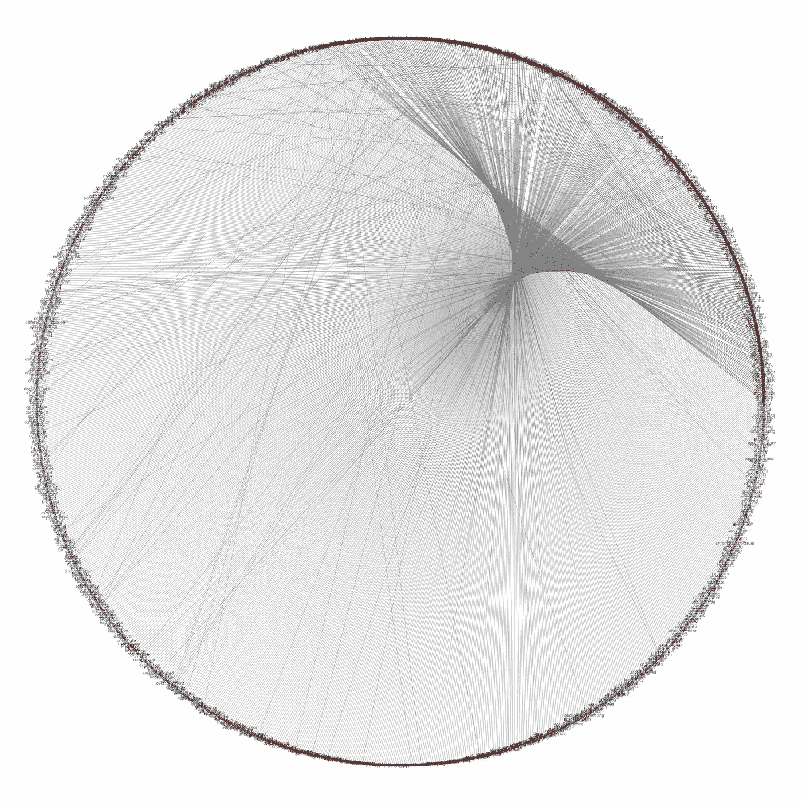
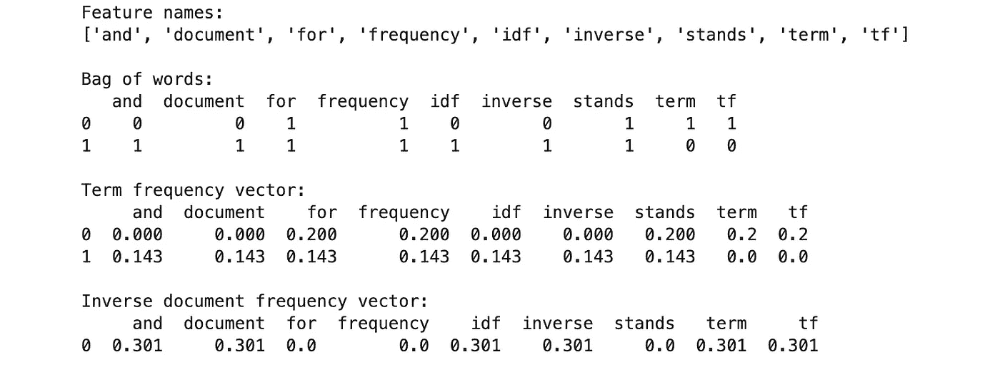
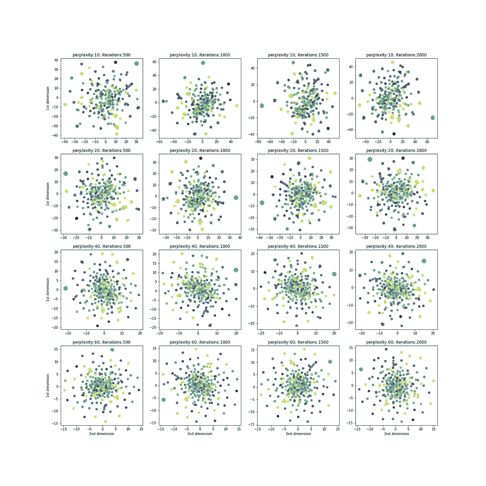

# 我如何使用机器学习来制定 GRE 备考策略。

> 原文：<https://towardsdatascience.com/how-i-used-machine-learning-to-strategize-my-gre-preparation-75e904a63fd8?source=collection_archive---------10----------------------->

## **GRE 备考最具挑战性的部分是词汇部分。至少对我来说是这样，直到我的机器学习模型帮我解决了这个问题。**



巴伦的 333 个单词(红色)及其同义词的图表。

当我开始准备 GRE 时，在浏览了许多资源(词汇部分)后，我发现有些单词在考试中经常出现，Barron 的高频单词表是解决这个问题的著名资源之一。首先，我选择了 Barron 的 333，这是一个包含 333 个在 GRE 中出现频率最高的单词的单词列表。下一个挑战是学习这些单词，所以我想出了一个计划。如果我能以某种方式把相似的单词组合在一起，学习过程就会容易得多。但是怎么做呢？手动将这些单词分组比简单地按原样学习单词更具挑战性。思考了一段时间后，我想到为什么不让机器做所有的艰苦工作！我认为*每秒超过一百万次浮点运算的能力*比我更适合这些类型的任务，所以让我们开始，看看如何从头开始构建一个模型，将相似的单词聚集在一起。

我将涵盖几个机器学习概念，如自然语言处理( **NLP** )、词频-逆文档频率( **TF-IDF** )、奇异值分解( **SVD** )、 **K-Means** 、t-分布式随机邻居嵌入( **t** - **SNE** )以及许多其他数据搜集、特征工程和数据可视化技术，以展示我们如何从零开始对数据进行聚类。

> **注意:我将在这个项目中使用 python 3.7。**

博客将分为以下几个部分-

*   数据收集:抓取网站来收集数据。
*   数据清理
*   特征工程
*   建模
*   可视化结果

现在我们知道了问题陈述和数据流，让我们开始吧。

> **抓取数据**

第一项任务是收集数据，即巴伦的 333 个高频词。这可以通过手动键入单词并创建列表来完成，也可以通过自动化过程来完成。我使用 BeaulifulSoup 和 request 创建了一个从不同网站自动抓取数据的功能，让我们简单了解一下这些库以及如何使用它们。

*   ***Numpy:*** 一个库，增加了对大型多维数组和矩阵的支持，以及对这些数组进行操作的大量高级数学函数。
*   ***Pandas:*** 一个为数据操作和分析而编写的库。特别是，它提供了操纵数值表的数据结构和操作。
*   ***BeautifulSoup:*** 一个解析 HTML 和 XML 文档的库。它为解析过的页面创建了一个解析树，可以用来从 HTML 中提取数据，这对 web 抓取很有用。
*   ***请求:*** 请求模块允许您使用 Python 发送 HTTP 请求。HTTP 请求返回一个包含所有响应数据(内容、编码、状态等)的响应对象。

代码将使用**请求**从目标网站获得响应，然后使用 **BeautifulSoup** 解析 html 响应，从页面中提取所需信息，并使用 **pandas 以表格格式存储信息。** 要了解一个 html 页面的格式，可以查看[本教程](https://www.w3schools.com/html/)。

```
# importing necessary librariesimport requests
from bs4 import BeautifulSoup
import re
from functools import reduce
import numpy as np
import pandas as pd
```

让我们从[这个网站](https://quizlet.com/2832581/barrons-333-high-frequency-words-flash-cards/)上刮下巴伦的 333 个单词及其含义

# chrome 中网页的 HTML 代码可以在 mac 上使用 **⌘+shift+c** 或者在 windows/Linux 上使用 c **trl+shift+c** 来访问。

这里我使用“span”作为标记，class _ = ' term text not translate lang-en ',因为包含单词和含义的元素具有相同的标记和类，并且在每个行元素中只有两个这样的元素，第一个对应于单词，第二个对应于含义。


需要废弃的元素的 HTML 结构的屏幕截图。

这是以表格形式收集的数据。


废弃单词和意义的数据框架。

这些数据是不够的，所以让我们通过从这个网站收集每个单词的同义词来增加更多的数据


这里有一个同义词的元素。


包含单词和同义词的数据帧

现在让我们连接两个数据框(含义和同义词):

```
result = pd.merge(df.word, data, on='word')
result.fillna('', inplace=True)
print(result)
```


我们可以看到，数据需要一些清理，因为它包含停用词，如和，或，和其他元素，如标点符号。此外，我们必须注意不能、不会、不这些必须分别转换为不能、不愿意、不做的缩写。

现在，既然数据已经被清理，让我们做一些特征工程。

> **特色工程**

我注意到的一件事是，其中一些单词的同义词也属于 Barron 的 333 列表。如果我能以某种方式连接这些单词的同义词，它可以提高我们的模型的性能。


*   例如对于*，同义词有*迂回、迂回、迂回、迂回。**
*   *在这 3 个同义词中，**错综复杂**出现在巴伦的 333 个单词列表中，它的同义词*错综复杂，错综复杂。**
*   *所以，**曲折的**最后的同义词应该是*迂回的、迂回的、间接的、错综的、迷宫般的、令人费解的*。*

*在这一步之后，对于 Barron 的 333 个单词列表中的每个单词，我们都有直接同义词、间接同义词(在上面的例子中，**错综复杂**的同义词是**曲折复杂**的间接同义词)和含义。在这篇博客中，我将对这些数据使用符号 **set** 。*

> ***集合:**关于一个词的数据(这里这个词来自 barron 的 333)比如它的直接同义词、间接同义词和意义。词的集合包括词本身。*

*我们已经获得了需要聚类的干净的单词集，但是记住我们首先需要将这些集合转换成某种数字数据，因为我们的模型需要数字来处理。*

*我将使用 **TF-IDF** 对数据进行矢量化。在开始之前，让我们先了解一下什么是 tf-idf*

***TF-IDF** 术语频率的缩写-逆文档频率是一种数字统计，旨在反映一个词对语料库中的文档有多重要。让我们用**单词袋**来理解这一点。*

*单词袋模型是在自然语言处理和信息检索中使用的简化表示。在这个模型中，文本被表示为它的单词包。
简单来说，单词包只不过是文档的基本数字表示，它是通过首先创建包含所有文档中所有不同单词的单词的**词汇表**来完成的。现在，每个文档都用一个有“n”个元素的向量来表示(这里，n 是词汇表中的单词数，所以每个元素对应于词汇表中的一个单词)，每个元素都有一个数值，告诉我们这个单词在文档中出现了多少次。让我们考虑一个例子:*

**

*   *列**字**代表词汇。*
*   *在该表中，列文档 1 和文档 2 分别表示文档 1 和文档 2 的弓。*
*   *数字表示相应的单词在文档中出现的次数。*
*   *现在来了 TF-IDF，简直就是词频和逆文档频的乘积。*

****词频*** *:* 表示一个词在文档中出现的频率的数字。*

**

****逆文档频率*** *:* 它是找到包含该单词的文档的概率的倒数。*

**

*请这样想:如果这个词在所有文档中广泛使用，那么它在特定文档中的存在将无法提供关于该文档本身的同样多的特定信息。因此，第二个词可以被看作是一个惩罚词，用来惩罚常见的词，如“a”、“the”、“and”等。因此，tf-idf 可以被视为特定文档中单词相关性的加权方案。*

*我们来看看两个文档的 TF-IDF:
文档 1:“TF 代表词频”，terms: 5
文档 2:“and IDF 代表逆文档频”，terms: 7*

**

*一袋单词、TF 和 IDF 值。*

**

*TF-IDF 值。*

****二元模型:*** 二元模型是一串记号中两个相邻元素的序列，这些记号是典型的字母、音节或单词。下面是一个从文档中生成的单词和双词的例子。
***doc:***【TF 代表词频】
*单字:* ['tf '，'代表'，'代表'，'词频']
*[' TF 代表'，'代表'，'代表词频']**

**n 元语法的优点是它们增加了关于文档中单词序列的信息。**

**我写了一个计算 TF-IDF 的函数，这个函数同时使用了一元和二元。**

**现在，我们已经有了每个集合的 TF-IDF 嵌入，我们可以继续建模了。**

**注意:我们目前拥有的数据是一个表格，包含 m 行和 n 列，其中‘**m’是 Barron 的 333 个单词列表中的单词数，而‘n’是单词词汇表的大小。**这个表格数据也可以表示为一个维度数组(**m×n)。在博客的后面，我将使用数组来表示数据。****

**在建模之前，我想分享一些我觉得非常有用的东西。与其直接使用 TF-IDF 值进行建模，不如降低数据的维度？这意味着，我们有对应于每个集合的 TF-IDF 值，并且因为这些 TF-IDF 值被表示为 n 个元素的向量，其中‘n’也对应于我们所有集合中不同单词的数量。如果两个集合具有几乎相同的单词，则 n 维超平面中对应点之间的距离将会非常小，反之亦然。类似地，如果 2 个集合有非常少的共同单词，则 n-超平面中对应点之间的距离将会大得多，反之亦然。现在，我不再使用 n-超平面来表示这些点，而是将这些点的维度降低到 32 维(为什么是 32 维？稍后将在博客中讨论)。可以通过挑选 32 个随机维度并忽略其他维度来降低维度，但这太愚蠢了，所以我尝试使用不同的维度降低技术，并发现截断的 SVD 可以为给定的数据创造奇迹。**

> **我使用降维的方法给数据添加某种形式的[正则化](https://en.wikipedia.org/wiki/Regularization_(mathematics))。**

****让我们理解截断奇异值分解-****

**SVD 是奇异值分解的缩写，它是一种矩阵分解技术，将任何给定的矩阵分解为三个矩阵 U、S 和 v。
它遵循以下等式-**

****

**这里，A 是包含 m 行和 n 列的输入矩阵。**

**让我解释一下什么是 U，S，V。
***U(又名左奇异):*** 是一个正交矩阵，其列是 **AᵀA** *的特征向量。* ***S(单数):*** 为对角矩阵，其对角元素为按降序排列的 **AᵀA** 或 **AAᵀ** (两者具有相同的特征值)的特征值的平方根即**

****

*****V(又名右奇异):*** 是一个正交矩阵，其列是 **AAᵀ** *的特征向量。***

****

****特征向量:**特征向量是当对其进行线性变换时，其方向保持不变的向量。考虑下图，其中显示了三个向量。绘制绿色方块只是为了说明应用于这三个向量的线性变换。
注意，这些特征向量的方向不变，但它们的长度变了，而**特征值**是它们长度变化的因子。
来源:[https://www . vision dummy . com/2014/03/特征值-特征向量/](https://www.visiondummy.com/2014/03/eigenvalues-eigenvectors/)**

****

**对特征向量(红色)应用线性变换(例如缩放)时，它们不会改变方向。其他载体(黄色)有。**

**现在我们知道了如何分解矩阵，我们可以使用截断奇异值分解来降低矩阵的维数，截断奇异值分解是奇异值分解的简单扩展。**

****截断奇异值分解:**假设我们有一个维数为(m x n)的输入矩阵，我们希望将它简化为(m x r)其中 r < n.
我们简单地计算 **AᵀA** 的第一个**‘r’**特征向量并将其存储为 u 的列，然后我们计算 **AAᵀ** 的第一个**‘r’**特征向量并将其存储为 v 的列，最后存储为的根**

****

**简而言之，截断 SVD 是一种聪明的技术，它通过保留尽可能多的信息(方差)以一种聪明的方式降低了给定数据的维数。**

**如果你想更深入地研究奇异值分解，可以看看 W. Gilbert Strang 教授的讲座和关于奇异值分解的博客。**

**Scikit-learn 带有内置的[截断 SVD](https://scikit-learn.org/stable/modules/generated/sklearn.decomposition.TruncatedSVD.html) ，可以直接导入和使用。**

> ****建模****

****

**[http://graph alchem . github . io/Alchemy/images/features/cluster _ team . png](http://graphalchemist.github.io/Alchemy/images/features/cluster_team.png)**

**现在我们已经完成了数据预处理和特征工程部分，让我们看看如何使用聚类算法将相似的词分组在一起。**

# **k 均值**

****K** - **的意思是**聚类是一种无监督学习，当你有未标记的数据(即没有定义类别或组的数据)时使用。该算法的目标是在数据中寻找组，组的数量由变量 **K** 表示。**

**让我们看看 K-means 是如何工作的。
假设在一个二维平面上有一些点，我们想把这些点聚集成 **K** 簇。**

**内容来源:[https://www.youtube.com/watch?v=5I3Ei69I40s&feature = youtu . be](https://www.youtube.com/watch?v=5I3Ei69I40s&feature=youtu.be)**

**步骤很简单-**

*   **在平面上随机定义 **K 个**点。让我们称这些点为群集**质心**。**
*   **迭代数据中的每个点，检查最近的质心，并将该点分配给其最近的质心。**
*   **经过上述步骤，每个质心必须有一些最接近它的点，让我们称这些点集为**簇**。**
*   **通过计算每个聚类中所有点的 x 和 y 坐标的平均值来更新该聚类的质心。计算的平均值(x，y)是该聚类的更新质心的坐标。**
*   **重复最后 3 个步骤，直到质心的坐标没有更新太多。**

****但是如何决定 K(聚类数)的正确值呢？****

****

**[http://www . SEM spirit . com/artificial-intelligence/machine-learning/clustering/k-means-clustering/k-means-clustering-in-python/](http://www.semspirit.com/artificial-intelligence/machine-learning/clustering/k-means-clustering/k-means-clustering-in-python/)**

**失真可以用来检查对于给定的 **K** 值，聚类算法的效率如何。
K 的最佳值可以通过计算不同 K 值的失真值，然后绘制它们来确定。
该图被称为**弯头图**。只需查看肘形图，我们就可以确定最佳“K ”,即失真停止快速下降的值。**

****

**这是一个肘形图，通过观察，我们可以说最佳超参数是 k=3。**

**它被称为肘图，因为它看起来像一只手臂(也许是棍子人的手臂)，这只手臂的肘部代表最佳 k。**

**还有一件事，我将使用余弦距离作为度量来计算点之间的距离(包括质心)。让我们快速了解什么是**余弦距离**利用*余弦相似度。***

****

****余弦相似度**是计算 2 个向量平行程度的度量。它是使用两个向量之间的角度的余弦来计算的。很容易计算出来，用-**

****

**所以如果 2 个向量 a 和 b 平行，那么它们之间的角度将为 0，余弦相似度将为 cos(0) = 1。类似地，如果两个向量 a 和 b 指向相反的方向，它们之间的角度将是𝛑，余弦相似度将是 cos(𝛑) = -1。
简而言之，余弦相似性告诉我们两个向量在多大程度上指向相似的方向。接近 1 的值告诉我们，向量指向非常相似的方向，而接近-1 的值对应于指向相反的方向。**

****

**现在 2 点之间的**余弦距离**无非是
***1 -(多维空间中代表它们的向量的余弦相似度)*** 。
所以范围从(0 到 2)，其中 0 对应非常相似的点，2 对应非常不相似的点。
你猜两点间的余弦距离什么时候会是 1？**

**要了解更多信息，请查看这个博客。**

**我将从头开始实现 K-means，因为 Scikit 知道 K-Means 不支持余弦距离。**

**是时候对预处理数据运行算法并检查正确的超参数了。
超参数调整是一个确定正确的超参数的过程，使模型对给定数据非常有效。在这种情况下，有两个超参数-**

*   **1 来自截断 SVD: n_components(降维)**
*   **1 from K-表示:‘K’(聚类数)。**

**我已经画出了不同 n_component 值的肘图。**

****

**通过观察这些图，我们可以说最佳的超参数是-
- n_components: 32
- K(聚类数):50**

**最后，使用最佳超参数初始化截断的 SVD 和 K-Means，并对数据进行聚类。**

```
**from sklearn.decomposition import TruncatedSVD> trans = TruncatedSVD(n_components=32)
> data_updated = trans.fit_transform(words_tfidf.toarray())
> model = custom_KMeans(n_clusters=50)
> model.train(data_updated)**
```

> ****可视化结果****

**这些是对数据进行聚类后得到的结果。**

****

**让我们来看看一些集群:
我将使用 [networkx 库](https://networkx.github.io/documentation/stable/)来创建集群。
在每个聚类中，红色节点对应于 Barron 的 333 个单词列表中的单词，以及它们之间的联系和它们的同义词。
你可以在这里查看 networkx [的文档。另外，我将在最后用一个例子来演示它有多棒。](https://networkx.github.io/documentation/stable/)**

****

**最后，让我们用 t-SNE 三维可视化数据，但首先，**

****我们来说说 t-SNE:****

****

**[https://www.youtube.com/watch?v=wvsE8jm1GzE](https://www.youtube.com/watch?v=wvsE8jm1GzE)**

****t-SNE**(t-分布式随机邻居嵌入)是一种用于探索高维数据的非线性降维算法。它将多维数据映射到两个或更多维，使得在较低维中的每个嵌入表示较高维中的值。此外，这些嵌入以保持邻域点之间的距离的方式放置在较低的维度中。所以，t-SNE 也保留了数据的本地结构。
我会试着解释它是如何工作的。
对于 n 维超空间中的给定点，它计算该点与所有其他点的距离，并将这些距离分布转换为[学生的 t 分布](https://en.wikipedia.org/wiki/Student%27s_t-distribution)。对所有点都这样做，最终，每个点到所有其他点的距离都有自己的 t 分布。
现在，这些点被随机分散在低维空间中，每个点被移位一定距离，使得在完成所有点的移位之后，如果我们重新计算每个点到剩余点的距离的 t 分布(这次是在低维空间中完成的)，该分布将与我们在 n 维超空间中获得的分布相同。
在 t-SNE 中有 2 个主要的超参数-
***困惑:*** 不用计算到所有其他点的距离，我们可以只使用‘k’个最近的点。这个“k”值被称为困惑值。
***迭代:*** 我们希望 t-SNE 更新低维空间中的点的迭代次数。
由于随机性，算法可能会因不同的困惑值而表现不同，因此作为一种良好的实践，最好针对不同的困惑值和不同的迭代次数运行 t-SNE。
想了解更多关于霸王龙 SNE 的信息，请查看[这个很棒的博客](https://distill.pub/2016/misread-tsne/)，它用互动可视化很好地解释了霸王龙 SNE。**

**下面是使用 t-SNE 表示 3d 空间中的点的代码。**

**在上图中，每个气泡代表 3d 空间中的一个单词。我们可以看到一些紫色和橙色的点很好地聚集在一起。我们还可以在橙色中看到一个太远的点，这意味着它在语义上不同于大多数单词。这种表示可能不是很好，因为聚类是使用余弦距离计算的，而 t-SNE 使用一些不同的距离度量，并且因为 t-SNE 是随机的，所以它需要一些超参数调整，所以如果您想使用另一个数据集或使用欧几里德距离的较少数量的聚类进行实验，希望它会工作。**

**这是另一个使用 t-SNE 的图，只使用不同困惑和迭代值的二维。我们可以看到 t-SNE 与困惑 20 和 2000 迭代工作得很好。**

****

**最后，这里是使用 networkx 的所有单词及其同义词的完整图表(我为每个单词使用了 4 个同义词)。**

****

> ****最终注释****

**感谢您阅读博客。我希望它对那些有志于从事 NLP、无监督机器学习、数据处理、数据可视化项目的人有用。**

**如果你对这个项目有任何疑问，请在这个项目的回复部分或 GitHub repo 中留下评论。**

**我的 Github 上有完整的项目:
[https://Github . com/SarthakV7/Clustering-Barron-s-333-word-list-using-unsupervised-machine-learning](https://github.com/SarthakV7/Clustering-Barron-s-333-word-list-using-unsupervised-machine-learning)**

**在 LinkedIn 上找到我:[www.linkedin.com/in/sarthak-vajpayee](http://www.linkedin.com/in/sarthak-vajpayee)**

**和平！☮**