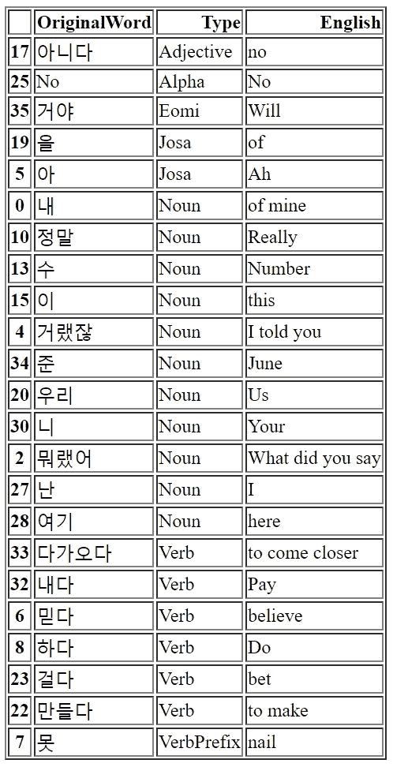

# 我如何使用 Python 代码来提高我的韩语水平

> 原文：<https://towardsdatascience.com/how-i-used-python-code-to-improve-my-korean-2f3ae09a9773?source=collection_archive---------33----------------------->

## “你好世界！”/ "안녕하세요 세계!"


Valery Rabchenyuk 在 [Unsplash](https://unsplash.com/s/photos/seoul?utm_source=unsplash&utm_medium=referral&utm_content=creditCopyText) 上拍摄的照片

对我来说，两件重要的事情是高效和有效。

2020 年初，我决定要自学韩语。我对这种文化很感兴趣，并被学习一门非欧洲语言的挑战所吸引。我不想成为通常的陷阱的受害者，这感觉像是一件苦差事，所以我开始使用各种各样的资源，包括 Duolingo、LingoDeer、Talktomeinkorean.com、闪存卡、韩剧和**显然还有**——几千小时的 BTS 专辑。

朝鲜语(韩文)很有逻辑性，很有趣，在许多关键方面与英语有很大不同。花了几个月的时间来掌握话题标记、敬语和不同的对话水平，但最终我对语言的结构有了足够的熟悉，并专注于学习更多的词汇。

然而——正如许多学习者可能同意的那样——我发现用谷歌翻译并不总是*有用，因为不仅翻译经常有点偏离主题，而且因为韩语句子是由主语-宾语-动词(而不是 S-V-O)构成的，使用助词标记，并以不同的方式部署描述符，所以翻译的文章不容易告诉我哪些词是动词、名词、形容词。*

## 进入파이썬！(…在韩语中是‘python’的意思)

我最近一直在学习几门不同的课程，所有课程都涉及到大量使用 python。因此，我想“一定有办法让这两个伟大的爱人走到一起”，经过大量的研究，下面的计划诞生了:

基本想法是，我希望能够通过 python 传递一段韩语文本(例如，新闻文章、菜谱、歌词)，并让它清楚地告诉我哪些部分是名词、动词等。然后，我会翻译每一部分，并使用一个数据帧来打印一个词汇表。**剧透预警:我做到了。**

好消息是，和往常一样，几乎所有的艰苦工作都已经被一些伟大的开发者完成了。我决定使用 **KoNLPy** 模块和 **Google Translate API** 来保持相对简单。【KoNLPy 是韩语自然语言处理的 python 包，而且*认真酷炫。* ]

## 设置 KoNLPy

关于设置模块的所有细节，可以在[这里](/korean-natural-language-processing-in-python-cc3109cbbed8)找到一个非常清晰的演示。在导入到我的 python 环境之前，我所需要做的就是在命令行安装 [Java 开发工具包](https://www.oracle.com/java/technologies/javase-jdk14-downloads.html)、一个正确版本的 [JPype wheel](https://www.lfd.uci.edu/~gohlke/pythonlibs/#jpype) 和 [KoNLPy](https://konlpy.org/en/latest/) 。有几个可用的类，但我使用的是 OKT，它是“打开朝鲜语文本”的包装器:

```
from konlpy.tag import Okt
from konlpy.utils import pprint
```

## 测试模块

在调用 *pprint* utils 类之前，我将我的“文本”设置为句子“我正在吃蛋糕”，并将该类初始化为一个对象。我加入了一些参数，这些参数将使句子规范化，并将单词简化为词根形式:

```
text = '나는 케이크를 먹고있다'
okt = Okt()
pprint(okt.pos(text, norm=True, stem=True, join=True))
```

输出正是我想要的，向我显示了名词“我”和“蛋糕”，两个助词(主语和话题)和动词“吃”的词干“吃”。

```
['나/Noun', '는/Josa', '케이크/Noun', '를/Josa', '먹다/Verb']
```

现在开始有趣的部分。

## 构建原型

最终的脚本只使用了三个库:

*   孔尔比
*   谷歌翻译
*   熊猫

将所有这些放在一起相当简单。这次我取了一段文字，用如上使用 KoNLPy 后的结果做了一个数据框:

```
from konlpy.tag import Okt
from googletrans import Translator
from pandas import DataFrame

text = '내가 뭐랬어 이길 거랬잖아 믿지 못했어 (정말) 이길 수 있을까 이 기적 아닌 기적을 우리가 만든 걸까 (No) 난 여기 있었고 니가 내게 다가와준 거야'
okt = Okt()

# use the okt.pos function and make a dataframe
ttrans = (okt.pos(text, norm=True, stem=True, join=True))
koreanlist = DataFrame(ttrans, columns=['Korean'])
```

接下来，我将结果分成两列，删除任何重复的行或标点符号，并对值进行排序:

```
# remove punctuation and sort based on word type
koreanlist.drop(koreanlist[koreanlist.Type == "Punctuation"].index, inplace=True)
koreanlist.drop_duplicates(subset="OriginalWord", keep = False, inplace = True)
koreanlist = koreanlist.sort_values(by="Type")
```

然后，我设置了翻译器，并添加了一个列来将结果附加到数据帧中。我放弃了原来的专栏，把数据框打印成了减价商品:

```
# set up translate
translator = Translator()

# translate by adding a column
koreanlist['English'] = koreanlist['OriginalWord'].apply(translator.translate).apply(getattr, args=('text',))

# format
del koreanlist['Korean']
print(koreanlist.to_markdown())
```

最后，我设置了两个选项:要么导出到 _csv 作为. txt 文件，要么保存到 _html 作为。html:

```
# optional save as a text file
koreanlist.to_csv('songtranslation.txt', sep='\t', index=False)

# optional save as html
koreanlist.to_html('koreanlist.html')
```

现在我们有了。你可以在这里看到 html 文件看起来像一个适当的词汇图表，我认为这是非常有效的！



用 python 制作的 HTML 词汇图表

如果你能走到这一步——非常感谢！我很想知道你的想法。这只是一个不起眼的起点，具有很大的潜力，但一旦 K-pop twitter 掌握了它，我相信它会取得巨大的成功:-)。

*查看 KoNPLy:*[*https://konlpy.org/en/latest/*](https://konlpy.org/en/latest/)*朴恩贞，宋祖镇。“KoNLPy:Python 中的韩语自然语言处理”，第 26 届人类&认知语言技术年会会议录，韩国春川，2014 年 10 月。*