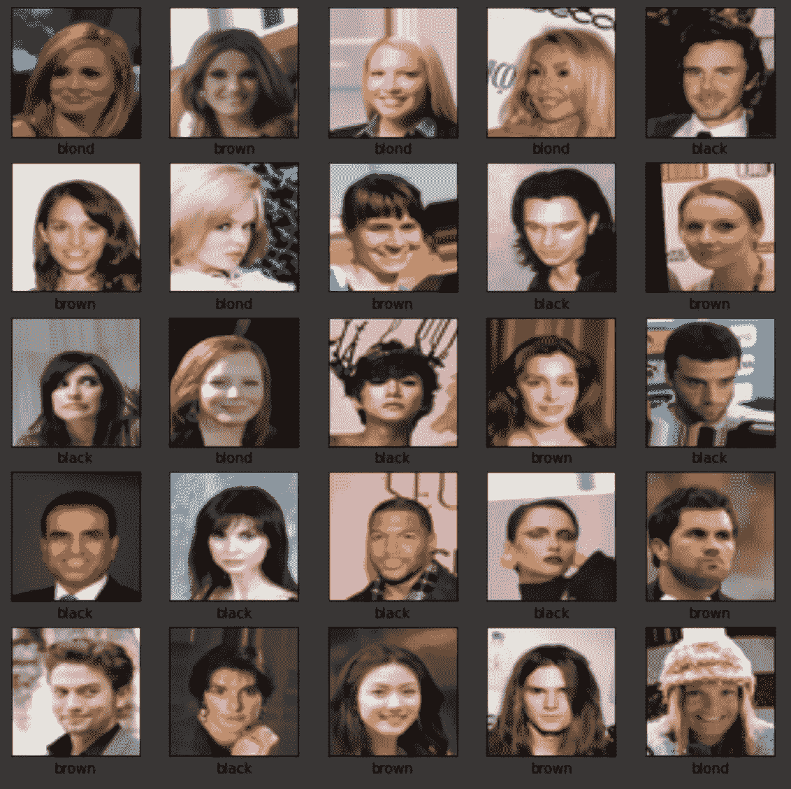
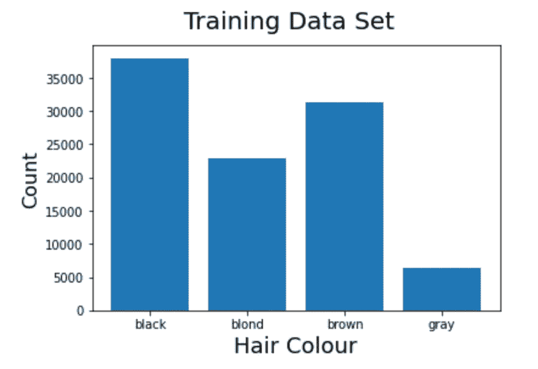
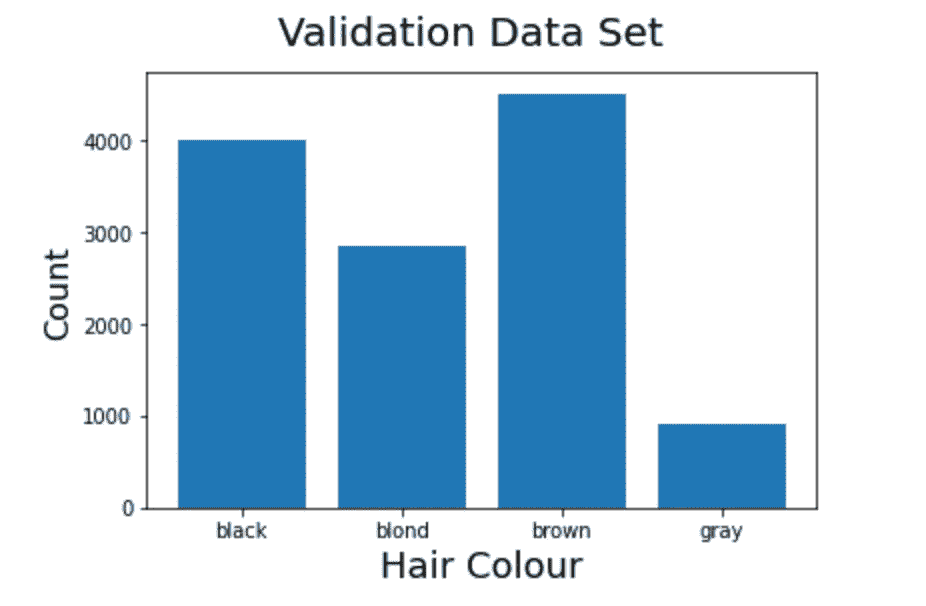
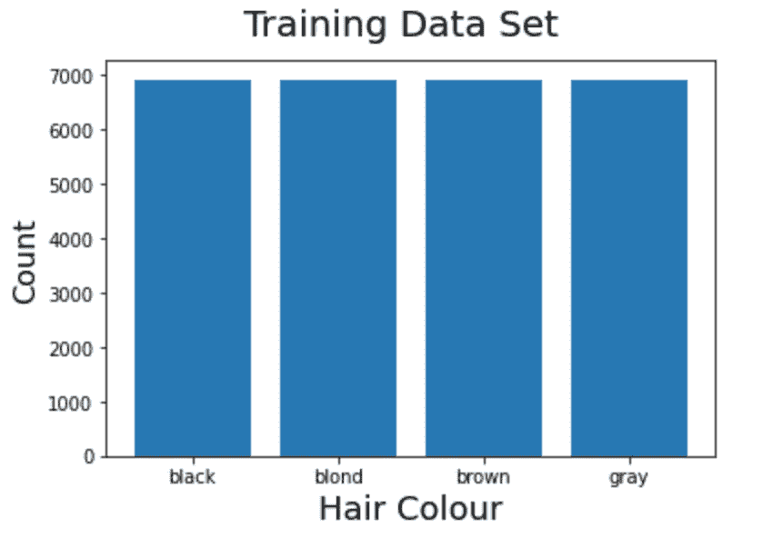
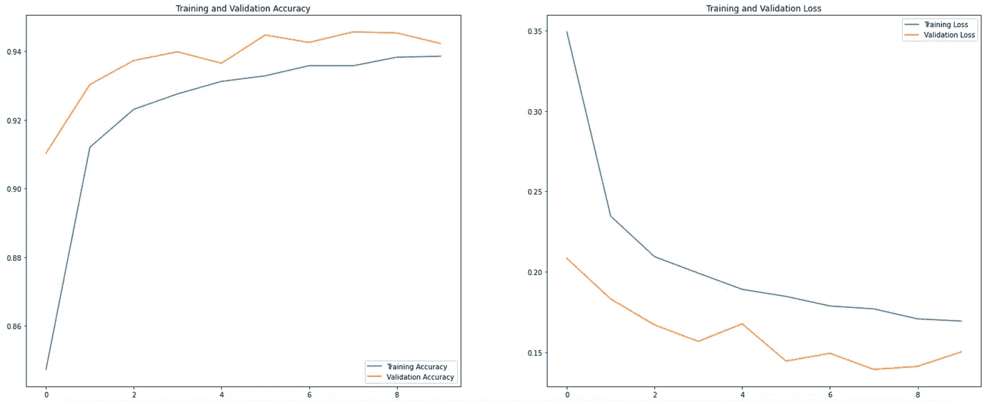
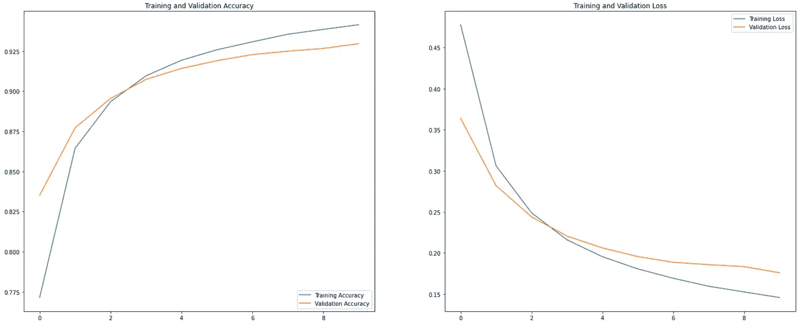
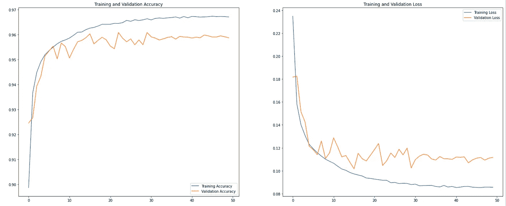
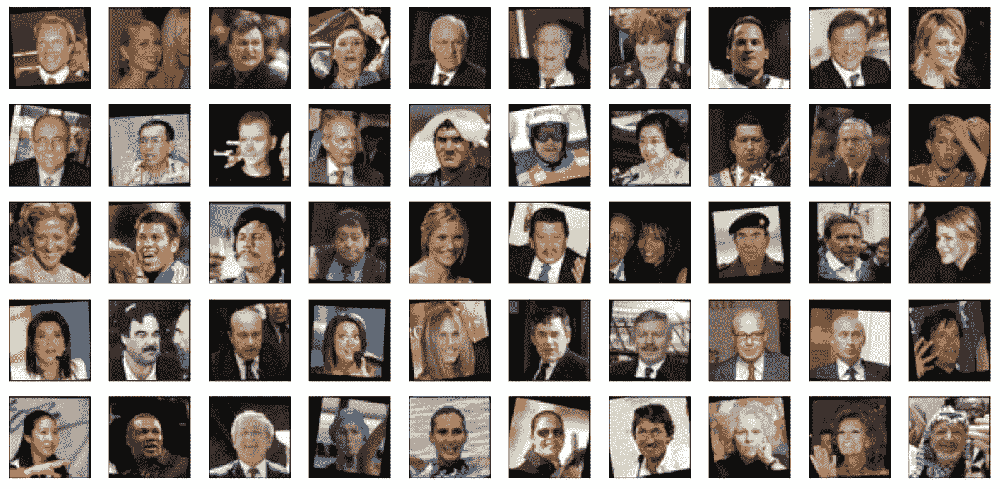
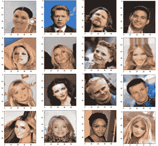

# 我是如何在我的第一次 Kaggle 比赛中从第一名升至第 18 名的

> 原文：<https://towardsdatascience.com/how-i-went-from-1st-position-to-18th-in-my-first-kaggle-competition-df7b13de6ec8?source=collection_archive---------32----------------------->

我最近参加了我的第一次 Kaggle 比赛，这是一次课堂比赛，是我硕士学位机器学习课程的一部分。我将分享我如何在公开测试数据中排名第一，后来在私人测试数据中排名第 18 的经历。

我是悉尼麦考瑞大学的数据科学硕士。在我的第三个学期，我参加了机器学习课程，40%的课程权重是一场 Kaggle inclass 竞赛，我们必须开发一个深度学习模型，从名人的照片中预测头发的颜色。这里有一个[比赛](https://www.kaggle.com/c/celeba-guess-hair/)的链接。

为此，我们与[名人数据集](http://mmlab.ie.cuhk.edu.hk/projects/CelebA.html)合作，这是一个广泛使用的名人面孔数据集。这项任务是预测名人的头发颜色，可能是黑色、棕色、金色或灰色。提供给我们的数据集在几个方面对原始数据集进行了预处理:

*   标签已经为任务设定好了。
*   它包含了原始图像的子集。
*   图像的尺寸缩小了，为 48x48，但仍有 3 种颜色(48x48x3)。

预处理过的数据集被分割成 train、val 和 public_test 数据，这与 CelebA 使用的标准分割一致。

我所有的模型都是在一个 python 笔记本中的 Google Colab 中构建的，第一步是将数据下载到 Colab 笔记本中，并为我的模型做好准备。

我随机画了几张图，看看数据是什么样的。



来自训练集的图像样本

我检查了我的训练和验证集中的目标类分布。我绘制了两组中每个目标类的频率，以查看在训练数据中是否有任何一个类对另一个类有更大的影响。



训练数据的目标类分布



每个目标类在两个数据集中的分布非常相似，但 gray 在训练集中的图像数量最少，这可能使 gray 的类特定精度低于其他类。由于这些数据已经被分成了训练集和测试集，所以我决定创建另一对训练集和验证集，在这个新集中有相等的类分布。我这样做是为了看看这种不均匀的分布是否对模型的整体准确性有任何显著的影响。

在创建了一个平衡的训练集之后，这就是类分布的样子。



# 基线模型

我的第一个模型是一个简单的卷积神经网络，这里没有什么花哨的，这是用来设置一个基线性能，然后创建更多的模型来改善这种性能。

```
model_basic = Sequential()
model_basic.add(keras.layers.Conv2D(64, 7, activation="relu", padding="same",input_shape=[48, 48, 3]))
model_basic.add(keras.layers.MaxPooling2D(2))
model_basic.add(keras.layers.Flatten())
model_basic.add(keras.layers.Dense(128, activation="relu"))
model_basic.add(keras.layers.Dense(4, activation="softmax"))model_basic.summary()model_basic.compile(optimizer='adam', loss='binary_crossentropy', metrics=['accuracy'])
model_basic.fit(images_train, train_labels, epochs=10, validation_data=(images_val, val_labels), batch_size=128)
```

输入层的形状为 48x48x3，因为我们的图像是 48x48 像素，每个像素有 3 个 RGB 值，有 64 个 Conv2D 滤镜。使用的激活函数是 relu，除了使用 softmax 的最后一层，损失函数是二元交叉熵，adam 作为优化器。该模型在默认数据分割上进行训练，在验证数据集上的准确率为 86.17%。

# 深度模型

接下来是第一个多层深度学习模型。它有 3 对 Conv2D 和 MaxPooling2D 层，然后是一个 flatten 层，接着是 5 个密集层，中间有 dropout 层。这是我第一次深入 CNN。损失函数和优化器与上面模型中的相同。

```
model_deep = Sequential()model_deep.add(Conv2D(filters=16, kernel_size=(5, 5), activation="relu", input_shape=(48,48,3)))model_deep.add(MaxPooling2D(pool_size=(2, 2)))model_deep.add(Dropout(0.25))model_deep.add(Conv2D(filters=32, kernel_size=(5, 5), activation='relu'))model_deep.add(MaxPooling2D(pool_size=(2, 2)))model_deep.add(Dropout(0.25))model_deep.add(Conv2D(filters=64, kernel_size=(5, 5), activation="relu"))model_deep.add(MaxPooling2D(pool_size=(2, 2)))model_deep.add(Dropout(0.25))model_deep.add(Flatten())model_deep.add(Dense(128, activation='relu'))model_deep.add(Dropout(0.5))model_deep.add(Dense(128, activation='relu'))model_deep.add(Dropout(0.5))model_deep.add(Dense(64, activation='relu'))model_deep.add(Dropout(0.5))model_deep.add(Dense(64, activation='relu'))model_deep.add(Dropout(0.5))model_deep.add(Dense(4, activation='sigmoid'))model_deep.summary()model_deep.compile(optimizer='adam', loss='binary_crossentropy', metrics=['accuracy'])model_deep.fit(images_train, train_labels, epochs=10, validation_data=(images_val, val_labels), batch_size=128)
```



深度 CNN 模型的训练历史

该模型给出了 88.31%的验证准确度，这与以前的模型相比不是很高，但是查看其损失和准确度图可以看出，训练集和验证集的准确度都在不断提高，而损失在不断降低，这表明该模型比以前的模型好得多。这是 Kaggle 上第一次提交时使用的模型，但它被训练了大约 50 个时代，以使它稍微好一点。该算法在公开测试数据集上的准确率为 91.309%。这大约是排行榜上的第 13 位。

# 迁移学习

提高整体准确性的下一个方法是使用迁移学习，即利用 keras 库中可用的预训练模型。使用的第一个型号是 resnet50。在使用预训练模型之前，我根据我的数据集修改了输入和输出层。模型是在不包括顶部的情况下使用的，根据我的数据，输入层被更改为 48x48x3 大小。

在输出中，使用了大小为 4 的致密层和 sigmoid 激活函数，因为我们有 4 个目标类。使用的优化器是 SGD，学习率很小，动量为 0.9。这个模型花了很长时间来训练。

```
img_rows, img_cols, img_channel = 48, 48, 3base_model = keras.applications.ResNet50V2(weights='imagenet', include_top=False, input_shape=(img_rows, img_cols, img_channel))add_model = Sequential()add_model.add(Flatten(input_shape=base_model.output_shape[1:]))add_model.add(Dense(4, activation='sigmoid'))model_ResNet50V2 = Model(inputs=base_model.input, outputs=add_model(base_model.output))model_ResNet50V2.compile(loss='binary_crossentropy', optimizer=optimizers.SGD(lr=1e-4, momentum=0.9),metrics=['accuracy'])model_ResNet50V2.summary()model_ResNet50V2.fit(images_train, train_labels, epochs=10, validation_data=(images_val, val_labels), batch_size=128)
```



resnet50 的型号摘要

由于该模型中有大量的可训练参数，大约有 2350 万个可训练参数，所以训练花费了很长时间，但最终的性能与我们的第一个基本模型相似，在验证数据集上有大约 86.05%的可训练参数。虽然精度的提高和损耗的降低也很平稳。这个模型没有在公开测试中使用，因为其准确性与我们的第一个模型相似。

# VGG16

接下来，我决定使用 VGG16 进行迁移学习，此外还使用了数据扩充和学习速率调度程序。

在数据扩充中，使用了旋转、宽度移动、高度移动、水平翻转。学习率计划在第 10 个纪元后开始降低学习率。

```
base_model = keras.applications.VGG16(weights='imagenet', include_top=False, input_shape=(img_rows, img_cols, img_channel))add_model = Sequential()add_model.add(Flatten(input_shape=base_model.output_shape[1:]))add_model.add(Dense(4, activation='sigmoid'))modelVGG_raw = Model(inputs=base_model.input, outputs=add_model(base_model.output))modelVGG_raw.compile(loss='binary_crossentropy', optimizer=optimizers.SGD(lr=1e-4, momentum=0.9),metrics=['accuracy'])modelVGG_raw.summary()batch_size = 128epochs = 50 # data augmentationtrain_datagen = ImageDataGenerator(rotation_range=30,width_shift_range=0.1,height_shift_range=0.1,horizontal_flip=True) train_datagen.fit(images_train) #Learning Rate schedulerdef scheduler(epoch): if epoch < 10: return 0.001 else: return 0.001 * tf.math.exp(0.1 * (10 - epoch))callback = tf.keras.callbacks.LearningRateScheduler(scheduler)history = modelVGG_raw.fit_generator( train_datagen.flow(images_train, train_labels, batch_size=batch_size), steps_per_epoch=images_train.shape[0] // batch_size, epochs=epochs, validation_data=(images_val, val_labels), callbacks=[callback] )
```



VGG16 车型培训总结

该模型给出了迄今为止最好的结果，在验证数据集中具有好得多的准确度，约为 92.50%。它用学习率时间表训练 50 个时期，在第 10 个时期之后，在每个时期开始降低学习率。该模型用于 kaggle 上的公共数据集，在公共测试数据集上给出了 0.92752 的准确率，这与我们在验证集上得到的结果一致。我注意到，在训练这个模型 50 个时期后，验证精度从 0.9075 增加到 0.9250，这表明学习率调度程序确实有助于提高精度。

# 其他型号

我测试了一些不同的模型，我尝试冻结 VGG16 模型的前几层，只训练其余的层，看看预训练的模型是否有助于提高精度，我尝试在 VGG16 模型中添加我自己的几层，然后测试它。

我还通过对数据集的默认分割和平衡分割进行训练来比较一些模型，但这种差异没有显著影响，我仍然不确定为什么会这样。

# 集成学习

提高性能的下一步是对迄今为止最好的 3 个模型使用集成学习。机器学习中的集成模型结合了来自多个模型的决策，以提高整体性能。我使用了目前为止我拥有的 3 个最好的模型，并综合了它们的结果

有各种方法可以完成集合，我们可以从每个模型中获取预测模式，并将其用作最终预测，例如，如果 2 个模型预测头发颜色为棕色，1 个模型预测头发颜色为黑色，则最终预测将是棕色。

另一种方法是对每个模型的每个目标类的概率求和，并使用最大概率作为最终预测。例如

模型 1 给出了棕色、黑色、金色和灰色分别为 0.85、0.20、0.50、0.15 的概率，模型 2 给出了目标类别为 0.75、0.35、0.40、0.10 的概率，棕色的总概率将是 0.85+0.75 = 1.6，这将是所有类别的最大值，并且将是最终预测。

在我的验证中，通过对概率求和并选择最大值来设置集合，比使用 mode 的方法给出了更好的准确性，所以我使用了这个方法。我在这个集合方法中使用的 3 个模型是

*   VGG16 和我自己的附加层
*   前几层冻结的 VGG16
*   VGG16 模型，所有层都经过训练，没有添加新层。

这个集合模型用于 kaggle 公开测试数据，给出了 93.935%的准确率，这使我在 kaggle 公开测试排行榜中排名第一。

# Kaggle 私有测试数据

私有测试数据在 12 小时内发布，有 2 次提交尝试。我对我的模型非常有信心，为了进一步改进我的模型，我在平衡数据集中训练了我的 3 个最佳模型，所以我有 2 对模型，一对在默认分割上训练，一对在平衡分割上训练。我对 6 个模型使用了相同的集成技术来对私有测试数据进行预测。我做的第一次提交的准确率只有 62.823%，我的排名在第 18 位左右，这对我来说是一个很大的冲击和现实检查，这个数据集的最高准确率约为 70%。我只有 1 次机会再提交一次，离截止日期还有几个小时，我做了一些修补，从我的整体方法中删除了几个低精度模型，但第二次提交并没有给我一个更好的结果。比赛结束了，我满脸愁容地坐在 62.8%的座位上。我不知道发生了什么，为什么我的模型失败了。

# 为什么私有测试数据的性能如此之差？

我决定调查为什么我的模型的性能在私人测试数据上下降了这么多。我从私人测试数据中随机绘制了一些图片，这就是结果。



来自私有测试数据的图像

几乎所有的图像都通过旋转得到了增强，背景是黑色的。

现在我确实在我的模型中使用了增强，使用了翻转和旋转，所以我决定看看我的增强与这个私人数据集中的有什么不同



我的模型增强了。

我的增强代码确实旋转了图像，但主要的区别是当它旋转时，它也放大了图像，所以在我旋转的任何图像中都没有黑色背景。我的直觉是，由于私人数据集的每个旋转图像中有许多额外的黑色像素，大多数图像都被预测为黑色头发，这降低了整体准确性。

在我的过程中，我可能还犯了很多其他的错误，因为这是我第一次使用深度学习模型，并且参加 kaggle 比赛，我想我在公共测试中取得了第一名，因为这个比赛仅限于我班上的学生，如果是全球比赛，我的排名会低很多。

如果你对我的方法有任何建议或意见，我很乐意倾听。

如果你想看的话，我所有的代码都可以在 github 上找到。