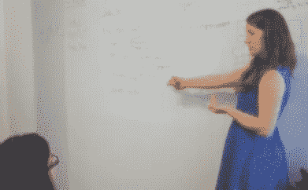

# 我如何在 6 个月内从零编码技能成为数据科学家

> 原文：<https://towardsdatascience.com/how-i-went-from-zero-coding-skills-to-data-scientist-in-6-months-c2207b65f2f3?source=collection_archive---------0----------------------->

## 我用来自学数据科学的 4 个工具没有花一美元

开启我的数据科学

我刚刚结束了 8 年的学习和努力工作，没有任何计划。你可能想知道为什么有人会这样做。我的老板粉碎了我的精神，知道我需要做出改变。

男朋友建议成为一名数据科学家。我说“你疯了！”我对编程一无所知。他肯定高估了我的能力。冒名顶替综合症又发作了。

大约两个星期后，我的朋友安娜提出了完全相同的建议，我想了想，开始考虑这个想法。为什么不呢？我决定再次成为一名初学者，将自己重塑为一名数据科学家。

我想按照自己的进度学习，所以我决定参加在线课程。我想，有了神经科学博士学位，我可能有足够的正式培训来获得一份数据科学的工作。我只是需要实用的技能。

这个故事将描述我参加的 4 门不同的课程，以及它们如何让我在硅谷的一家医疗保健初创公司获得一份数据科学工作。

当时，我接触到的大多数在线课程都是免费的。所以我挑战自己，在不花钱的情况下获得我需要的技能。我能说什么呢，我很吝啬😜

[https://imgs.xkcd.com/comics/correlation.png](https://imgs.xkcd.com/comics/correlation.png)

# 基本技能

当我辞去 UCSF 的博士后工作时，我没有任何编程经验。我在整个研究中使用了统计学，但只是在小范围内。我之前分析的所有数据集都是我自己在实验室中生成的。因此，观察到的数量非常少。我需要学习编码和分析更大规模的数据。

# 开始编码

当我决定成为一名数据科学家时，我想学的第一件事是如何编写计算机代码。因为我从来没有编码过，这是一个完全未知的领域。我发现如果我真的讨厌写代码，那么数据科学就不太适合我。所以这似乎是一个很好的开始。

我很幸运，我的搭档本在许多技术领域工作过，能够给我指出正确的方向。他建议说 Python 可能最适合我。Python 在数据分析方面表现出色，用途广泛，能够很好地处理大型数据集，所以这就是我开始的地方。

# 学习编码

## 1.代码集

为了开始学习编码，我使用了[代码学院](https://www.codecademy.com/)。我从 Python 入门开始，但我不确定我在 2014 年完成的课程是否仍然存在。如果我现在使用 Codecademy 开始学习 python，我可能会选择[用 Python 分析数据](https://www.codecademy.com/learn/paths/analyze-data-with-python)课程。

我发现 Codecademy 是一个很好的起点。对我来说，主要的优势是能够在我的浏览器中编写代码。在我的电脑上正确安装编程环境仍然是我的致命弱点。所以我很高兴一开始就避开它。令人欣慰的是，如果我的代码不能工作，那是因为[语法](https://en.wikipedia.org/wiki/Syntax)，而不是因为[环境](https://en.wikipedia.org/wiki/Integrated_development_environment)设置错误。

我也喜欢你用 Codecademy 一次做几分钟的工作。如果我有一些空闲时间，我会登录并做一些问题，因为它都在那里等着我。这种循序渐进的方式意味着我不会太害怕陷入其中。

在我完成这门课程的时候，只有少数几门 Codecademy 课程提供，而且这门是免费的。我对网上免费课程的质量感到非常惊讶。

一旦我学会了 Python 的基础，我需要开始提升我的统计经验，并学习在更大范围内分析数据。

# 学习数据分析

## 2.约翰霍普金斯大学的 Coursera 数据科学专业

第二，我获得了约翰霍普金斯大学的 [Coursera 数据科学专业学位](https://www.coursera.org/specializations/jhu-data-science)。当时，你可以免费做一个荣誉代码证书版本，只有当你想要验证证书时才需要付费。

对我来说，经过验证的证书似乎并不重要。相反，我需要能够在技术面试中展示课程中教授的技能。所以我选择了专业化的免费版本。

对我来说，一个缺点是这一系列课程是用 R 语言讲授的，R 是一种优秀的统计分析编程语言，受到学术界的青睐。然而，我想学习数据科学的 Python。我认为 Python 在我想工作的初创公司中会更有用。

我研究了一些 Python 中的数据分析课程，但它们似乎假设了相当多的知识，而这些知识是我还不具备的。我相信这些课程中的大部分是针对那些想要过渡到数据科学的软件工程师的。所以他们假设您有扎实的编程技能，并且已经知道如何设置 python 环境。

我喜欢 Coursera 数据科学专业化的主要方面是它从一开始就开始了。在第一个课程中，有关于如何安装 R and R 工作室的逐步说明。这使得在知道不会有任何技术问题的情况下处理随后的课程变得容易。

约翰霍普金斯数据科学专业适合我的另一个方面是，它是由公共卫生部门教授的。我在健康科学领域的专业知识让我很容易就能理解他们列举的例子。他们有使用空气质量对哮喘的影响和其他与医疗保健相关的数据集的例子。因此，我可以专注于课程内容，而不是找出数据分析的场景。

这一系列课程让我对数据科学工作的主要方面有了基本的了解。它涉及到 R 编程、基本数据清理、分析、回归和机器学习。我真的很喜欢学习编码以及如何使用代码来分析数据，这鼓励了我继续学习。

# 信息访谈

在我接受再培训的这个阶段，我开始询问我的网络中的人，他们是否可以把我介绍给在旧金山从学术界转向数据科学的其他人。一些人能够联系到我，所以我尽可能多地安排了信息面试。

一个朋友向我介绍了一位来自 Modcloth 的数据科学家，他和我走了一条相似的路。她曾经是一名神经科学家，我发现她的建议特别有帮助。

她的主要建议是学习 SQL。

# 学习查询数据库

## 3.DB5 SQL 斯坦福在线

约翰霍普金斯大学的 Coursera 数据科学专业根本没有涉及 SQL。她说她大部分的日常工作是查询数据库。她必须为业务开发和营销团队提供见解。她只有一小部分时间花在了统计分析和机器学习上。

我接受了她的建议，在斯坦福大学网上开设了一门自定进度的 SQL 课程。在我学过的所有课程中，这是我最喜欢的。我很喜欢，因为老师很优秀，用简单的例子解释概念。她还用多种不同的方式解释了每个概念。

此后，我向许多人推荐了这门课程，因为我认为良好的 SQL 基础对于任何数据科学家都是必不可少的。我接触过的数据科学课程并不包括如何使用 SQL 从数据库中获取数据。我认为这是一个巨大的疏忽。大多数课程都准备了 CSV 格式的数据供学生使用，但根据我的经验，在行业数据科学工作中很少出现这种情况。

一旦我完成了斯坦福 SQL 课程，我就开始申请数据科学的职位。那时，我已经回到澳大利亚，开始用 Skype 采访旧金山湾区的初创公司。面试时，我想继续发展我的技能。

# 固化概念

## 4.edX 数据分析基础

然后，我参加了使用 R by edX 的[数据分析基础](https://www.edx.org/course/foundations-of-data-analysis-part-1-statistics-usi)课程。这对于修改我在 Coursera 课程中学到的很多概念非常有帮助。

我坚信从不同的老师那里学习概念可以提供新的见解。第二次学习统计和机器学习概念要容易得多。我觉得通过这门课我有了更深的理解。

当我结束课程时，我成功地参加了旧金山医疗保健初创公司 Amino 的一次面试，并获得了工作签证，搬到了美国。

# 获得数据科学工作

我认为我在最后的面试中是成功的，因为我有过得去的编码技能和不错的统计学理解，但更重要的是我有医疗保健领域的知识、实验设计和科学方法的专业知识。

在我看来，正是这些额外的方面让我的申请脱颖而出，并让这家初创公司给了我一次机会。我资历很浅，需要更多的工作培训。我认为我所学的所有课程足以让招聘团队考虑我，我在医疗保健领域的经验让我过关了。

因此，如果你想将职业道路转向数据科学，我建议你寻找一家你现有领域知识有价值的公司。

# 我希望我学到了什么

我希望在开始新的数据科学工作之前，我已经填补了知识上的主要空白，那就是从命令行使用 git。我以前从未使用过终端或命令行，也不知道如何使用 git 将我的代码提交给公司的 Github 库。

几个工程师花了很长时间才让我跟上进度。我希望在开始之前至少知道如何使用它，这样我就不会浪费他们宝贵的时间。我的同事们很棒，他们似乎并不介意教我，但在最初的几天里，我确实觉得有点累赘。

我最终赶上并发现[艰难地学习代码命令行](http://cglab.ca/~morin/teaching/1405/clcc/book/cli-crash-course.html)非常有用。

如果你正在考虑走类似的道路进入数据科学，我会鼓励你去做！对我来说，这绝对是正确的选择。不同的人以不同的方式学习，但如果你有学习和完成你开始的自律，通过在线课程自学数据科学肯定是可行的。如果这是你的目标，我祝你好运，如果可以的话，我很乐意回答任何问题。

 [## 通过我的推荐链接加入 Medium-Kate Marie Lewis

### 想了解更多关于数据科学的知识吗？今天就成为会员吧&不要错过凯特的帖子，直接交会员费…

medium.com](https://medium.com/@katemarielewis/membership) 

## 如果你想了解更多关于我为什么转行的信息:

 [## 让我获得第一份数据科学工作的面试策略

### 我是如何展示自己得到这份工作的

towardsdatascience.com](/interview-strategy-that-landed-me-my-first-data-science-job-bdd5e77bfb49)  [## 愤怒退出癌症研究

### 为什么我从神经科学家变成了数据科学家

towardsdatascience.com](/rage-quitting-cancer-research-5e79cb04801)