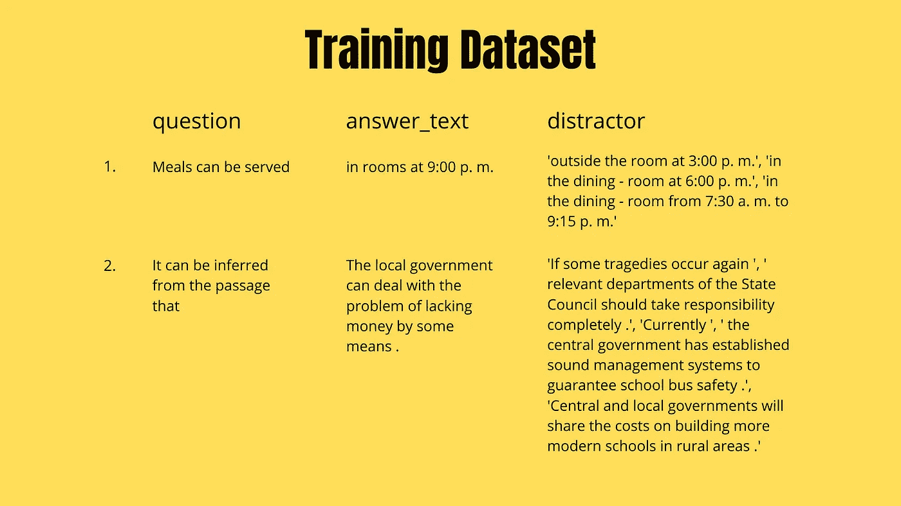
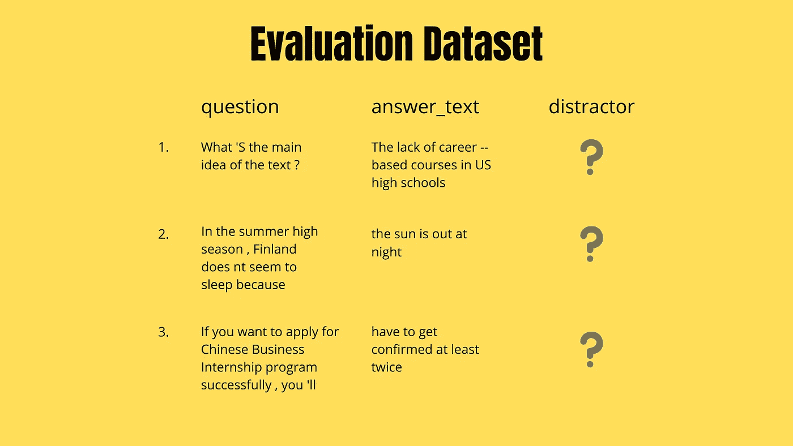
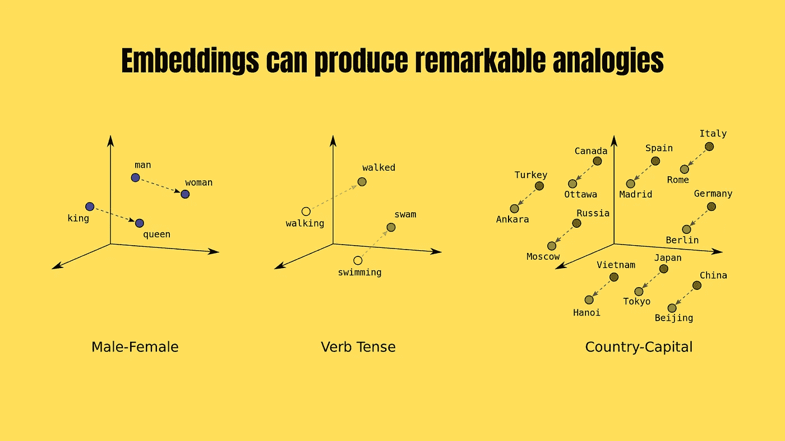
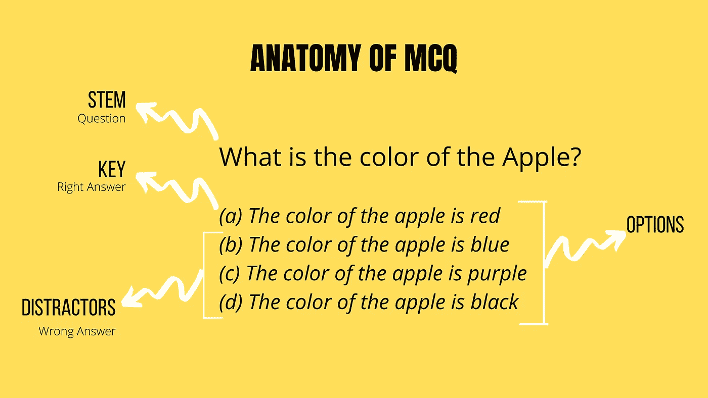
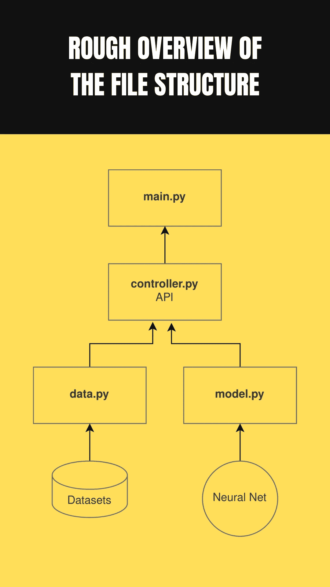

# 我是如何用我独特的“非正式方法”赢得国家级 ML 比赛的

> 原文：<https://towardsdatascience.com/how-i-won-a-national-level-ml-competition-with-my-unique-informal-approach-e86fd95532fd?source=collection_archive---------14----------------------->

## 深度学习

## 像数据科学黑客一样思考——你不需要遵守规则就能获胜

来源:图片由作者提供(使用 Canva 制作)

L 去年(2019 年)，一家公司 **(** *不能透露他们的名字！* **)** ，进行了一场国家级机器学习竞赛**用于招聘**。比赛本身是在[hackere earth](https://www.hackerearth.com/)举办的。

页面上写着:

> **【我们在】**寻找有热情的**具有**机器学习实践技能和分析技能**的 ML 开发人员**加入他们在**海德拉巴**的动态团队。
> 
> **资格标准:**
> 
> 工作经验: **0 至 2 年**
> 
> 技能:**机器学习和分析技能**

由于对机器学习和深度学习领域的浓厚兴趣，我对这场为期 13 天的比赛感到非常兴奋。^_^!

所以，让我们深入细节，看看我是如何解决这个问题并赢得比赛的。

# 问题——“任务”

来自挑战页面的片段:

> mcq 是一种广泛使用的问题格式，用于对候选人的领域知识进行总体评估。大多数 mcq 都是以段落为基础的问题。
> 
> 一个段落或代码片段构成了此类问题的基础。这些问题是根据三个或四个选项创建的，其中一个选项是正确答案。其余的选项被称为干扰项，这意味着这些选项最接近正确答案，但并不正确。
> 
> 为您提供了一个包含问题、答案和干扰项的训练数据集，用于构建和训练 NLP 模型。测试数据集包含问题和答案。你需要使用你的 NLP 模型为测试数据中提供的每个问答组合创建最多三个干扰项。
> 
> 类型:自然语言
> 
> **问题类型:**上下文语义相似度，自动生成基于文本的答案

起初，这个问题似乎很简单。输入清晰，输出清晰，我所要做的就是建立模型。对吗？

嗯嗯嗯……不

以下是训练数据集的结构:

来源:图片由作者提供(使用 Canva 制作)

以及评估数据集的结构:

来源:图片由作者提供(使用 Canva 制作)

如你所见，在开始之前，我必须做大量的预处理和重组工作。

根据问题的公式化来重构给定的训练和测试数据是很重要的。

由于我能想到的每种方法都需要不同的数据集公式，所以我有多种方法可以选择？

你可以在这里 **找到 [**问题解决方案的完整源代码。**](https://github.com/weeping-angel/ValueLabs-ML-Hiring-Challenge-2019)**

所以让我们跳到有趣的部分。我们走吧。

# 数据预处理——一切从这里开始

俗话说，

> 垃圾进，垃圾出

在像这样的深度学习和机器学习任务中，这一点再正确不过了。对于 NLP 领域， **NLTK** (自然语言工具包)是我选择的武器。

我用它来删除不需要的符号、标点符号和停用词，以便进行分析和训练。此外，可以使用 NLTK 完成标记化、词性标注、计算编辑距离和 Jaccard 相似性计算。

在所有的清理之后，数据预处理的下一步是为给定的问题、答案和干扰项创建向量。为此，我不得不选择嵌入这个词。

## 单词嵌入困境

传统上，在文本生成任务中，人们倾向于对较小的数据集使用一键向量。但是对于中大型数据集，使用固定维数的嵌入来节省内存和有效训练网络是绝对必要的。

我使用 GloVe(全局向量)和 Word2Vec，两者都是*dimension _ size = 300****，*** 来转换我的令牌向量，它将通过神经架构中的*嵌入层*到嵌入向量。

这些向量也将捕捉句子和上下文的语义，不像一个热点向量。

资料来源:developers.google.com(使用 Canva 重新设计)

这里唯一的问题是，正确计算损失和更新梯度。

这可以通过使用 ***稀疏分类交叉熵*** 代替*分类交叉熵*作为损失函数，并使用 ***稀疏分类准确度*** 作为度量函数来实现。

## 酸洗和保存嵌入物，以加速该过程

因为每次程序运行时创建完整的单词嵌入矩阵非常昂贵，所以我必须将单词集包含在训练和测试数据集中，并开发一个嵌入矩阵，一劳永逸。

在使用 *pickle* 创建了 *embedding_matrix* 文件之后，我可以检查它在本地是否存在，并在相对较短的时间内将其加载到内存中。

因此，加快了程序。

## 生成序列

在输入我们的神经网络之前，我们需要数据以序列的形式存在。

考虑一个函数 *f* 。为了产生输出 *y* ，需要 *n* 个输入。让输入用 *x* 表示。所以数学上，我们可以这样写

> y = f ( x1，x2，x3，.。。，xn)

这里，[x1，x2，x3，…，xn]是长度为 n 的输入序列，y 是长度为 1 的输出序列。而 *f* 是神经网络确定的函数。

在我的 python 序列实现中，这是使用 Numpy 数组实现的。Numpy 是一个强大的数学运算工具包。Numpy 数组直接进入神经网络 。

这里，我使用的序列长度是 n = 5。

简而言之，一个由 5 个单词组成的序列，当输入到网络中时，预测第 6 个单词。

# 我的正式方法

在理解了给定问题的独特性后，我尝试了几种不同的方法来寻找最高质量的干扰物。我对完美干扰物的定义是，

> 干扰词:*与答案/答案高度相似但不完全相同的问题/短语/词干的延续句。*

来源:图片由作者提供(使用 Canva 制作)

**我最喜欢的五种方法是:**

**方法-1:**

**思路:**使用一个 ***2 层 RNN-LSTM 网络*** 与 ***word2vec 嵌入*** 在给定数据集(未预训练)上使用固定长度的令牌向量进行训练，然后从它们中生成序列(固定长度)，以馈入神经网络。

`Embedding Layer >> LSTM >> Dropout >> LSTM >> Dropout >> Dense`

**缺陷:**这种方法的唯一缺陷是， ***word2vec 嵌入向量由于其半结构化的性质而无法在给定的数据集上进行训练*** 。主成分分析(PCA)和 2D 散点图绘图显示了语料库中不相关/所有单词的聚类形成。

因此，我转向了方法 2。

**精度**:在评估标准的 12%到 17%之间

> **注:**问题的评价标准基于余弦相似度。所以这个 12-17%的准确度并不算太差。

**方法-2** :

**思路:**使用一个 ***2 层 RNN-LSTM 网络*** 与 ***手套预训练嵌入向量*** 。使用可变长度令牌向量来生成较小的固定长度序列，并将其馈送给网络。

`Embedding Layer >> LSTM >> Dropout >> LSTM >> Dropout >> Dense`

**缺陷:**这种方法更好，但是当 ***陷入局部极小值*** 并且在获取上下文时更慢时遇到了障碍。

因此，我转向了方法-3。

**准确度:**在评估标准的 16%到 20%之间

**方法-3** :

**思路:**使用一个 ***2 层双向 LSTM 层*** 与 ***手套预训练嵌入向量*** 。使用可变长度令牌向量来生成较小的固定长度序列，并将其馈送给网络。

`Embedding Layer >> Bi-LSTM >> Dropout >> Bi-LSTM >> Dropout >> Dense`

**缺陷:**这种方法表现最好，但是对于预测来说，最佳**温度*值*很难找到。**

**准确度:**高于评估标准的 17%

**方法-4** :

**思路:**使用 ***逻辑回归和随机森林分类器(LR-RF)*** 级联模型对干扰项池中最高质量的干扰项进行排序。从训练数据集中产生一个干扰物池。

这种方法的灵感来自于陈亮、肖扬、Neisarg Dave、Drew Wham、Bart Pursel 和 C. Lee Giles 的研究论文*“利用学习排序为多项选择题生成干扰物”*。

**准确率:**在 15%到 18%之间的评价标准

**接近-5** :

**思路:**使用 ***编译码器*** 与 ***Luong 注意，*** 以前用于神经机器翻译(NMT)，用于从单独输入的答案键中生成干扰物。

这种方法受到了谷歌大脑团队等人的论文*“注意力是你所需要的一切】*的启发。

`Encoder(Embedding >> LSTM)`

`LuongAttention`

`Decoder(Embedding Layer >> LSTM >> LuongAttention)`

方法 5 的神经架构由于其非顺序的性质，在这里更难描述。虽然，你可以在 [*model.py*](https://github.com/weeping-angel/ValueLabs-ML-Hiring-Challenge-2019) 文件中看到，其中编码器、解码器、LuongAttention 是作为类实现的。它们中的每一个都包含了 *call( )* 函数中的层，在每个类中定义。

## 注意:

> **化解渐变爆炸**
> 
> 这是我搬到 LSTM 和双向 LSTM 网络时遇到的一个小问题。为了成功地 ***防止梯度爆炸，*** 我将批量大小减少了一半， **128** ，将学习速率降低到 **0.0001** ，使用剪辑归一化= **1.0，**并在通过 *Adam* 优化器更新梯度值时执行剪辑= **0.5** 。

我根据从数据集中收集的见解进行了几次非正式试验。

上传的结果是得分最高的方法的组合(3、4 和 5)。

# 采用高度模块化的程序结构

规划至关重要。在写一行代码之前，你必须从头到尾制定策略。

在这次竞赛中，我遵循了一种介于面向对象和过程之间的中间方法。我试图以类似于 API 的形式开发整个软件，以增加它们的可重用性。

规划开发在开始时会花费更多的时间，但从长远来看是值得的。

> 给我六个小时去砍树，我会用前四个小时去磨斧子

由于这种模块化的方法，我的工作流程快了很多，我可以尝试更多的东西和方法来解决这个问题，因为我不必从头再来开发某些东西。

> **注**:本设计方案仅在方案一、方案二、方案三中实施。对于方法 4 和 5，由于缺少时间和快速开发的需要，选择了更紧凑的设计方案。

## 细节

我的软件由**四个主文件**组成，加上一些用于重组和预处理数据以及建立语料库的小脚本。

1.  层次结构顶部的一个文件，它导入 API 并根据需要使用它们。
2.  包含工作流流程(如培训、测试、比较和数据加载任务)的高级抽象的文件。(API)
3.  包含与数据操作、文件创建和删除相关的任务的文件，例如数据预处理、嵌入矩阵创建、用于进行不同预测的采样以及许多其他帮助功能。
4.  一个包含模型的文件，所有神奇的事情都发生在这里。该文件包含 Keras 中的神经网络架构实现和单个函数形式的所有超参数。

来源:图片由作者提供(使用 Canva 制作)

在上述所有文件中， *API 文件*是集成所有组件的文件。

尽管如此，所有的文件都被设计成可以彼此独立使用，非常容易。

同样，如果你想要每个文件用法的更详细的解释，去我的[库](https://github.com/weeping-angel/ValueLabs-ML-Hiring-Challenge-2019)。在那里你还可以找到整个项目的蓝图(针对每一种方法)。

我在试着删掉这里无聊的部分！

> **注意:**我使用了支持 GPU 的设备，因为在只有 CPU 的设备上训练和预测会花费太长时间。为了利用 GPU，请使用 Nvidia 为 nVidia 显卡提供的 CUDA 软件。

# 非正式方法——制胜技巧

在我看来——无意冒犯这个挑战的创造者——这个问题的评估标准不太适合这个特殊的任务。 ***那是我利用而不是正面攻击的问题。***

自己看评价标准…

## 评定标准

> 对于每个问题-答案组合，干扰项被转换成单词的反向量，并且计算预测值和实际值之间的余弦相似度:
> 
> 得分= 100 *均值([余弦 _ 相似度(文本 _ 至 _ 向量(实际值)，文本 _ 至 _ 向量(预测值))])

因为计数向量的余弦相似度不包含句子试图传达的语义思想，所以更好的方法是使用手套向量或任何其他单词嵌入。

一个能真正捕捉语义含义然后计算余弦相似度之类的嵌入。

## 漏洞

在这个过程中，我发现了一些数学漏洞，并利用它们来测试我的假设(正如我前面所说，我从数据库中收集了见解)。

让我告诉你赢得比赛的(令人捧腹的)结果:

1.  ***32.13%(整场比赛得分准确率最高)*** 在抄同一个正确答案加上出现频率最高的前 6 个词——“the，of，to，a，is，in”。你能相信吗？**我用这个赢了比赛！**
2.  ***28.49%*** 正确率仅在复制与干扰物相同的正确答案 3 次上。
3.  ***20.01%*** 准确率通过打印语料库中前 8 个最频繁出现的单词，3 次作为干扰项。
4.  ***16.63%*** 准确率通过打印最频繁的单词，在一个字符串中‘the’出现 6 次，3 次作为干扰项。

这些方法清楚地描述了这样一个事实，即上述干扰物绝对没有机会干扰正在进行 MCQ 测试的人。

但尽管如此，根据所谓的“评估标准”，它们具有更高的准确度分数。然而，更有可能使人困惑的选项在评估量表上得分较低。

简单来说，

> *对于像*“苹果是什么颜色的？”*，一串*【The The The The】*比*【苹果的颜色是蓝色】，*根据评价量表更让人分心/信服。*

总之， ***评价标准在这一点上失去了它的可信性。***

## 一个不太成功的非正式方法…

*“马尔可夫链句子生成*”技术也给出了相当好的结果。但不幸的是，没有得到足够高的分数来作为正式的方法。它所做的出色工作值得肯定和进一步发展。所以值得一提。

*本办法的代码也包含在* [*回购*](https://github.com/weeping-angel/ValueLabs-ML-Hiring-Challenge-2019) *中。*

# 我得到那份工作了吗？—后果

***没有*** *。*

虽然**我以 32.13%的最高准确率赢得了**比赛，但在全国层面上，公司告诉我，我 ***没有得到这份工作的【经验】*** (我是大一新生，2020 及格)。

所以我在这里，写下我的经历，比赛的经历。

我希望你也能从这个故事中学到一些东西。

# 结束语

根据评估标准，我的“非正式”方法做得最好，然而，在问题的真实世界应用中，我的正式方法(3、4 和 5)共同赢得了比赛。

如前所述，**评价标准偏向词频。**它无法正确计算上下文相似性，因此，我在方法-(1，2，3 和 5)中的深度学习模型(在学习方面是可扩展的)仍未确定。

虽然，在我自己阅读了许多生成的干扰物后，我得出结论，结果是合格的。

总而言之，我非常享受这个挑战，并且在这个过程中学到了很多新东西。我将期待未来一些更具挑战性的任务。

*感谢阅读&祝你有美好的一天！*

如果你喜欢阅读这些故事，那么我相信你会喜欢成为一名中等付费会员。每月只需 5 美元，你就可以无限制地接触成千上万的故事和作家。你可以通过 [***注册使用此链接***](https://nishu-jain.medium.com/membership) ，*来支持我，我将赚取一点佣金，这将帮助我成长并出版更多像这样的故事。*

**您可能喜欢的其他文章—**

 [## 中等 API —文档

### 中型 API 入门

medium.com](https://medium.com/geekculture/medium-api-documentation-90a01549d8db)  [## 值得了解的 10 个改变游戏规则的人工智能突破

### 过去几十年中引人入胜的想法和概念

medium.com](https://medium.com/towards-artificial-intelligence/10-game-changing-ai-breakthroughs-worth-knowing-about-b2076afc4930)  [## 为什么做一个 ML 研究员或者开发者超级难？

### 这一认识彻底改变了我的生活

medium.com](https://medium.com/towards-artificial-intelligence/why-its-super-hard-to-be-an-ml-researcher-or-developer-67fa62fc1971)  [## 音乐数学 Python 语言]

### 让我们用 Numpy 演奏一些“旋律”

towardsdatascience.com](/mathematics-of-music-in-python-b7d838c84f72)