# 如何使用 Picterra 的地理空间平台分析卫星图像

> 原文：<https://towardsdatascience.com/how-i-won-sentinel-hub-covid-19-custom-script-hackathon-be882ed05186?source=collection_archive---------55----------------------->

## ..赢得 Sentinel-Hub 定制剧本比赛！

从 2020 年 4 月到 5 月，Sentinel-Hub 组织了第三届[定制剧本比赛](https://www.sentinel-hub.com/contest/)。这场比赛是与[哥白尼欧盟地球观测计划](http://www.copernicus.eu/en)、[欧洲航天局](http://www.esa.int/ESA)和 [AI4EO 联盟](https://twitter.com/Ai4Eo)合作举办的。

 [## 在 LinkedIn 上发布的 Picterra

### 我们很高兴地宣布新冠肺炎自定义脚本竞赛的两位获奖者之一，Aakash Gupta，他使用了…

www.linkedin.com](https://www.linkedin.com/feed/update/urn:li:activity:6676830513002491904/) 

**比赛动机:**

寻找新的、创新的脚本，使用户能够理解地球观测数据。它旨在为新的“正常的”*中的巨大挑战寻找解决方案*

***我们提交的目的是什么**:*

*新冠肺炎已经导致许多国家政府实施紧急隔离措施。这些政策对环境有什么影响？我们能测量污染水平的变化吗？与经济活动有关联吗？我们能否建立领先指标来衡量全球范围内的经济活动。通过我们的项目，我们试图分析卫星图像来找出答案。*

*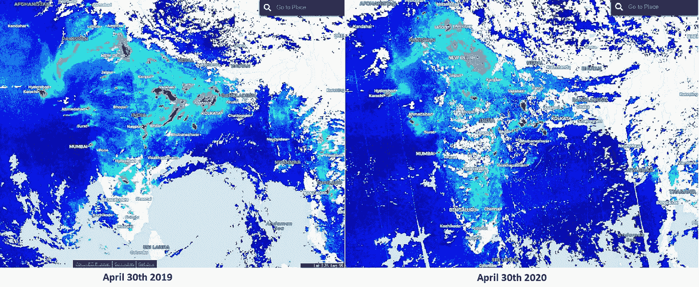*

*印度马赛克显示二氧化氮水平的变化。来源:修改后的哨兵中心 EO 浏览器图像*

***使用的工具:***

*工具造就人，或者他们是这么说的！*

*我总是告诉我的团队首先从研究可用的工具开始。因为合适的工具可以成就或毁掉一个项目！*

*该项目可用的工具有:*

1.  *[哨兵枢纽 EO 浏览器](https://apps.sentinel-hub.com/eo-browser/)*
2.  *[Sentinel-Hub API 访问](https://www.sentinel-hub.com/)*
3.  *[Picterra 的 AI 平台](https://picterra.ch/)*
4.  *[欧洲数据立方体](https://eurodatacube.com/)*

*我们首先使用 Sentinel-5P 数据来绘制 NO2 水平。这样做是为了识别数据中的任何异常(突然变化)。然后与 VHR 图像(非常高分辨率的图像)合作*

*该数据的统计分析用于显示德国(严格实施封锁)等国家与意大利等国家之间的显著差异。*

*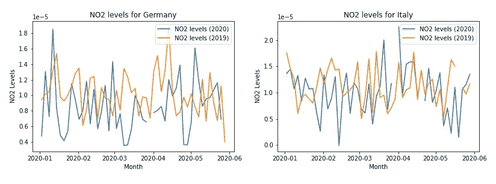*

*德国和意大利的 NO2 水平图(注意缺失值的存在)来源:Sentinel-5P 处理的数据*

*我已经在 euroData Cube 的投稿页面上传了用于绘制上述图的笔记本。您可以通过下面的链接查看:*

*[https://eurodatacube . com/market place/notebooks/contributions/NO2 _ Analysis _ covid 19 _ lock downs . ipynb](https://eurodatacube.com/marketplace/notebooks/contributions/NO2_Analysis_Covid19_Lockdowns.ipynb)*

*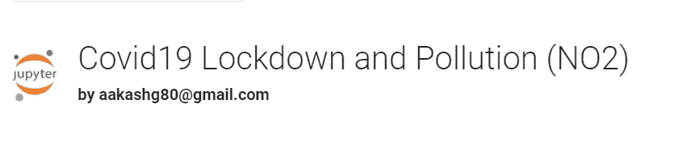*

*二氧化氮是由车辆交通和化学过程中未燃烧的残留物产生的。这可以通过从高分辨率卫星图像中计数汽车来实现。*

*我们现在将使用 Picterra 的机器学习平台来识别 VHR 图像中的车辆。*

* [## Picterra -地理空间图像分析变得简单

### 训练你自己的人工智能来探测卫星和航空图像上的物体和图案。分析并分享可行的…

picterra.ch](https://picterra.ch/) 

我们需要首先登录 Picterra 的地理空间图像平台。他们有一个免费的试用版，你可以不用提供任何信用卡就可以使用(*)。*)

一旦进入主页，你就可以*创建一个新项目*

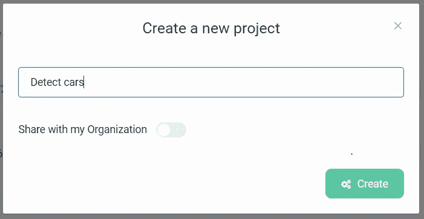

现在您可以从本地驱动器 ***上传图片*** (其他选项有 ***在线地图影像*** 或 ***购买卫星图片*** )。一旦上传，你就可以用它来训练探测器。

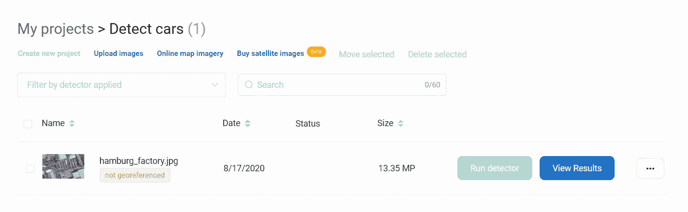

一旦图片上传，我们就进入培训部分。在这里，我们可以使用这个平台来训练一个探测器。然而，你可以使用预先构建的检测器。但是对于这个演示，我们将训练一个新的

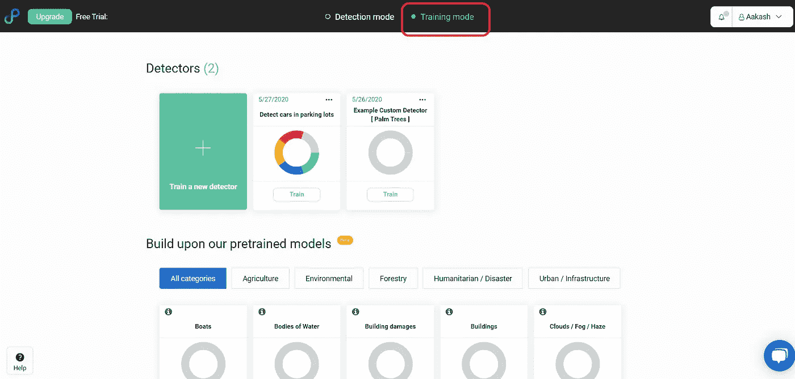

训练模式！

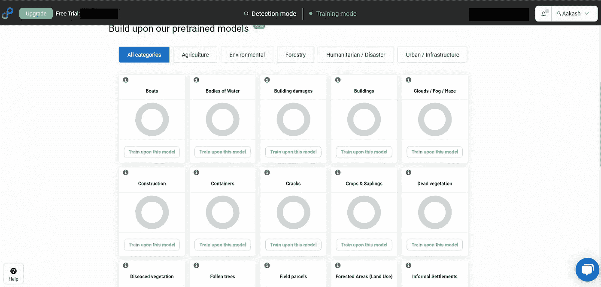

可用的预训练模型

点击 ***培养一个新的探测器***

有一些定制的基础模型。我们选择了 ***车辆*** 选项

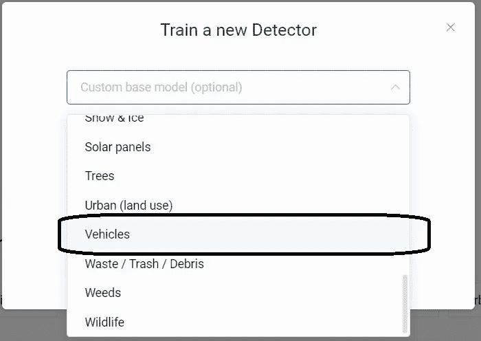

我们要检测 ***汽车***

有两种可用检测类型:I)计数和 ii)分割

我们选择默认的 ***计数选项。*** 然后按下 ***创建*** 按钮

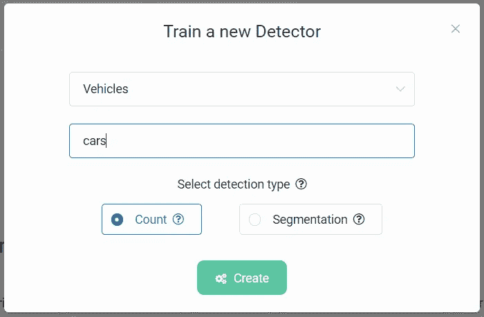

然后将*添加到项目中。并按下 ***开始训练*** 按钮*

*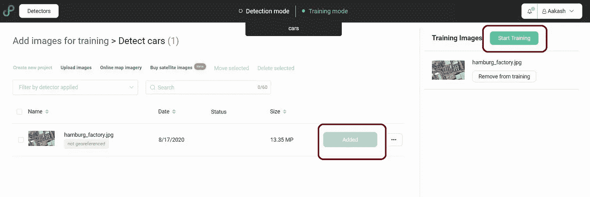*

*当你第一次这样做时，Picterra 会给你一个很好的视频教程，带你完成训练过程。*

*界面非常直观，一旦你理解了控件，导航就变得容易了。*

*首先选择左边的 ***训练*** 按钮。之后，您可以选择感兴趣的区域，如*黄色方块*所示。点击选中的 AOI，会放大图像*

*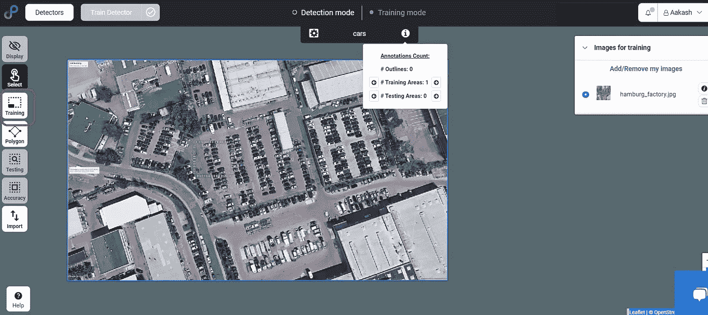*

*现在点击 ***多边形*** 按钮并选择 ***圆形*** 选项*

*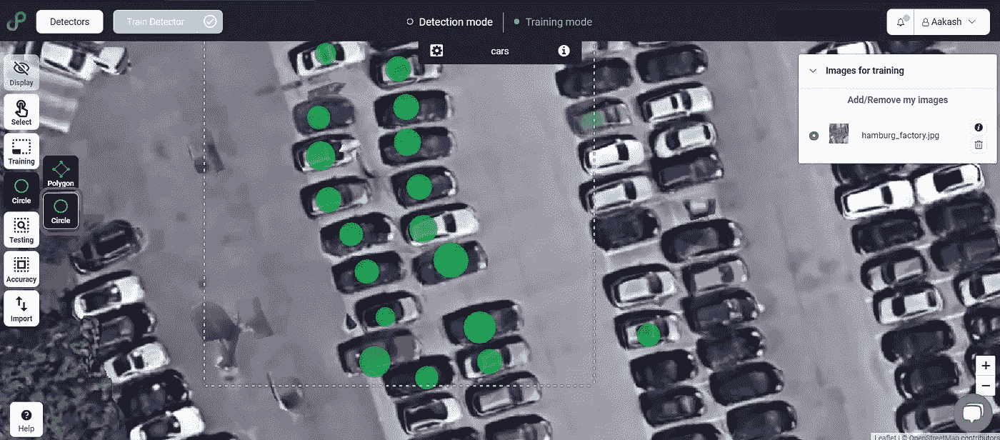*

*现在，您可以点击感兴趣区域内的每辆停放的汽车，并在顶部画一个圆圈。这就是你的带注释的训练数据集。你可以选择多边形选项，在汽车轮廓上画一个方框，但是我太懒了！*

*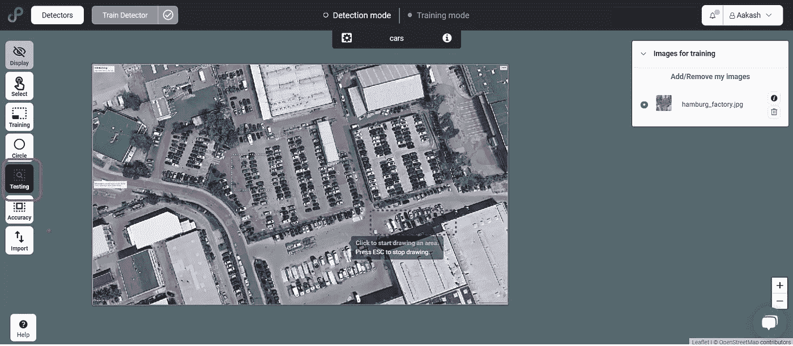*

*现在选择左侧菜单中的 ***测试*** 按钮，点击并标记图像上的测试区域。您可以注释测试数据集。但是这里我将跳过这一步— *只是为了检查发生了什么！**

*现在点击仪表板顶部的 ***列车探测器*** 按钮。*

*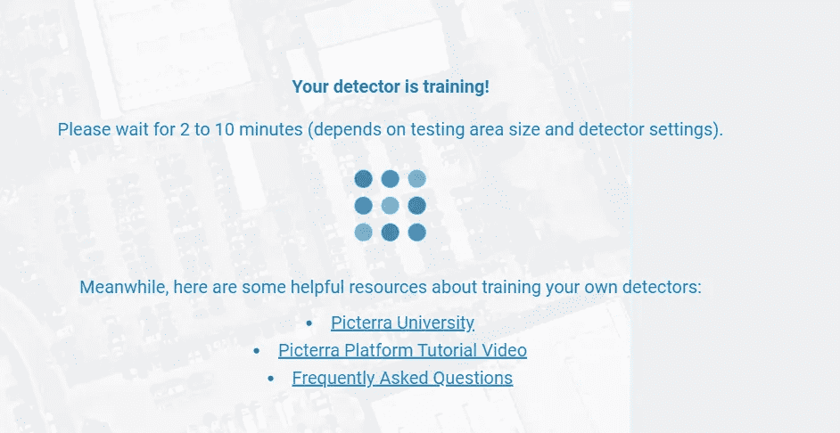*

*现在你可以去喝杯咖啡了。我更喜欢我的玛莎拉茶！*

**

*来源:维基媒体(开源许可)[https://en . Wikipedia . org/wiki/Masala _ Chai #/media/File:Masala _ Chai。JPG](https://en.wikipedia.org/wiki/Masala_chai#/media/File:Masala_Chai.JPG)*

*或/和*

*可以查看提供的教育资源。一定要查一下 Picterra 大学。在地理空间图像的端到端机器学习方面，它有一些很好的资源。*

*既然现在训练结束了，我们去检查一下探测器的性能吧。*

*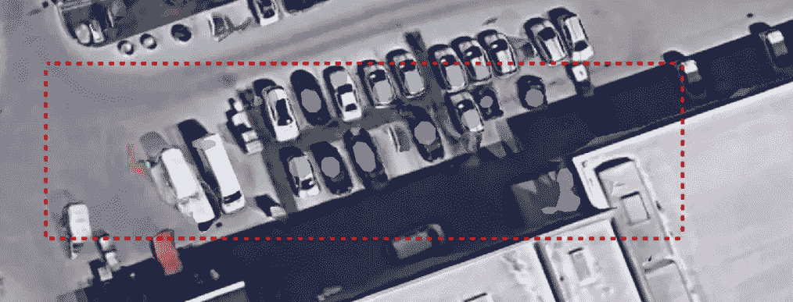*

*测试输出*

*表演很好…但不是很棒！在右下角，它把仓库的屋顶误认为是一辆汽车。*

*对于探测器来说，重要的是要知道什么不应该被认为是物体。用机器学习的术语来说——误报应该很低。*

*因此，我们将为我们的训练集注释更多的车辆。我们在先前的训练集附近选择了一个更大的区域。*

*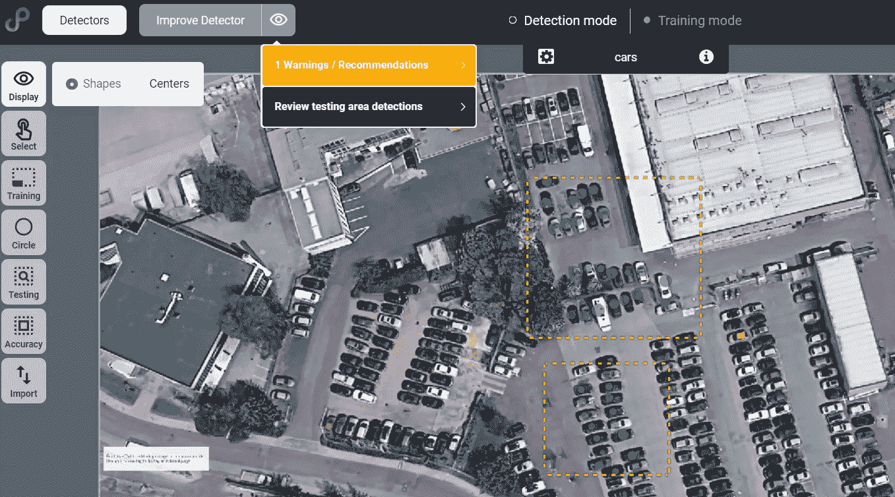*

*训练后，我得到一个警告:似乎我在训练集中有一些重叠的注释。这是真的。这可能会在运行推理作业时导致合并，并给出不正确的计数。*

*所以让我们纠正一下-*

*使用左侧的选择按钮选择任何注释并修改标记(*绿色圆圈*)。*

*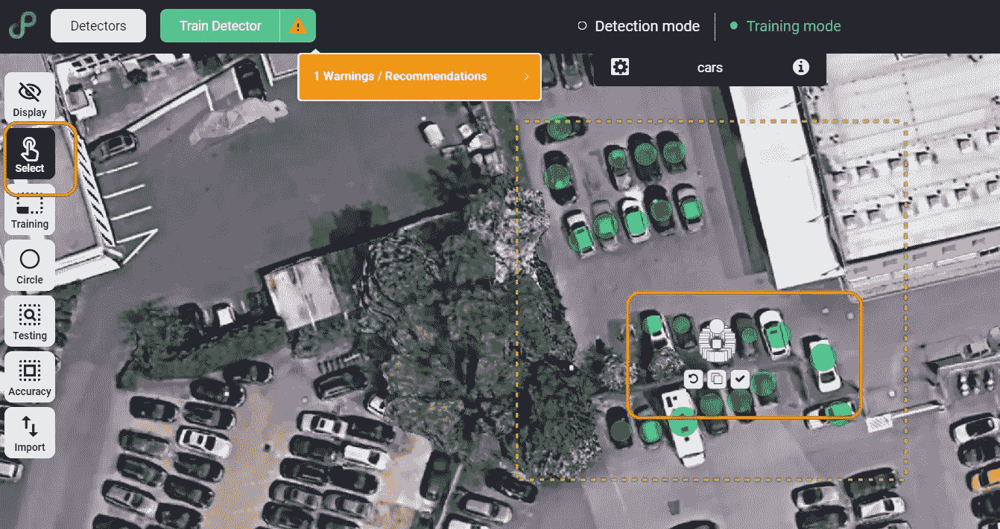*

*修改训练数据以避免合并注释*

*重新训练检测器，我们得到以下输出。*

*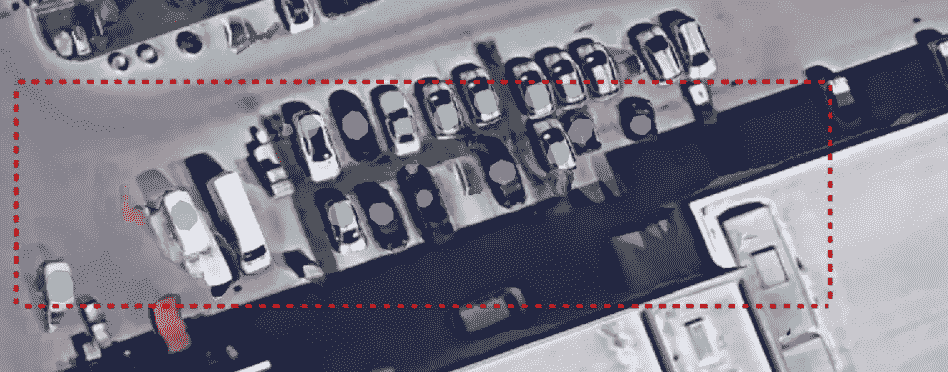*

*重新培训后的测试区域*

*似乎不错。我们已经错过了左侧的一辆大型白色车辆，但现在车顶的错误分类也不见了。它把车开到最左边的角落。*

*可以用更多的数据来训练检测器。现在让我们在整个图像上运行检测器，以查看评估性能。我们还将在新图像上对其进行评估。*

*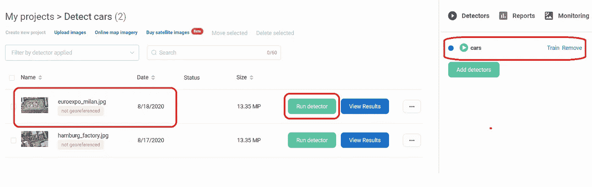*

*增加了新的未见过的图像和训练过的探测器*

*按下图像前的 ***运行探测器*** 按钮。一个提示会通知您运行数据所需的处理配额数量。由于我们是在一个自由配额上运行，我们按 ***开始检测。****

*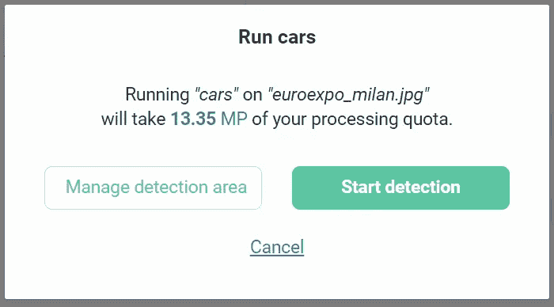*

*提示输入检测器的处理配额*

*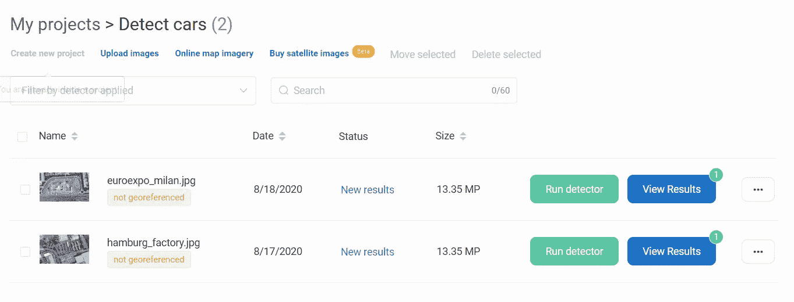*

*查看结果显示了检测器的输出*

*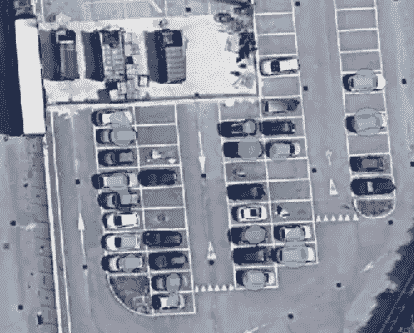*

*来自看不见的图像的检测器输出*

*我们还可以使用这个强大的平台，进行其他物体探测活动，如太阳能电池阵列、船只、垃圾、军用车辆等。！*

*请查看 Picterra 的博客，了解他们最近的成功案例:*

*   *[物体探测故事](https://picterra.ch/blog/bring-ai-powered-object-detection-to-arcgis-with-our-new-plugin/)*
*   *[将人工智能支持的对象检测引入 ArcGIS](https://picterra.ch/blog/bring-ai-powered-object-detection-to-arcgis-with-our-new-plugin/)** 

****关于图像授权厂商的说明:****

***除非另有说明，否则作者拥有图像的许可。***

***Indian mosiac (NO2 水平)由作者使用 Sentinel-Hub 平台创建***

***德国&意大利 No2 水平的时间序列图由作者使用上述*规定的代码创建**

***截图来自 Picterra 的地理空间平台***