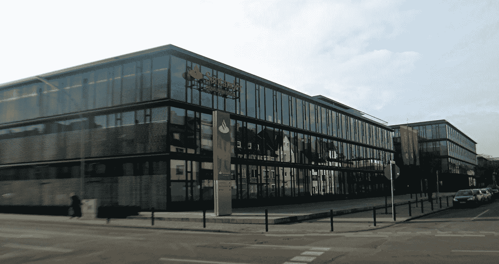
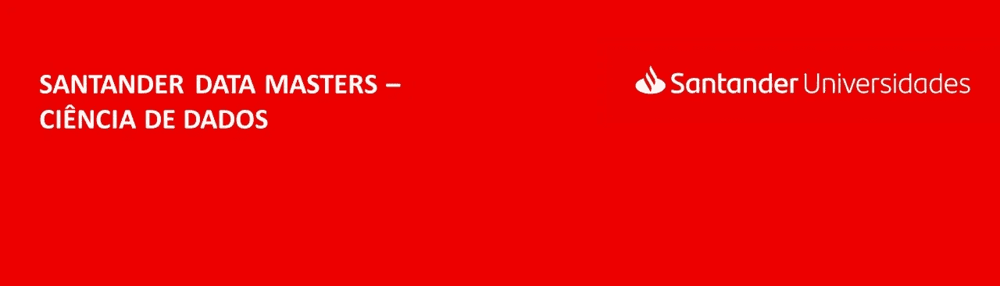
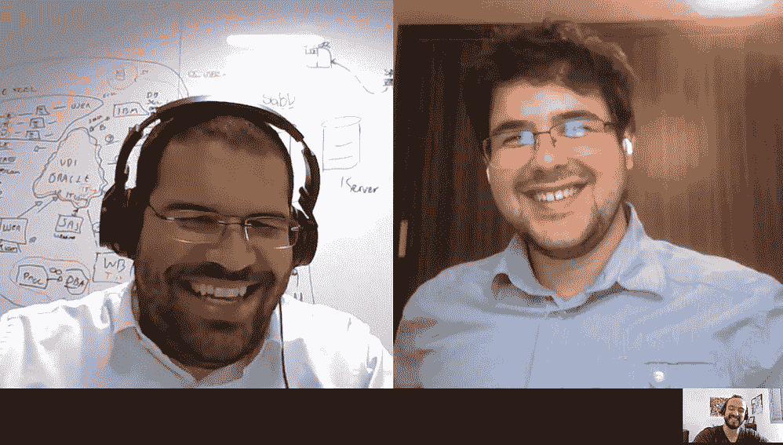
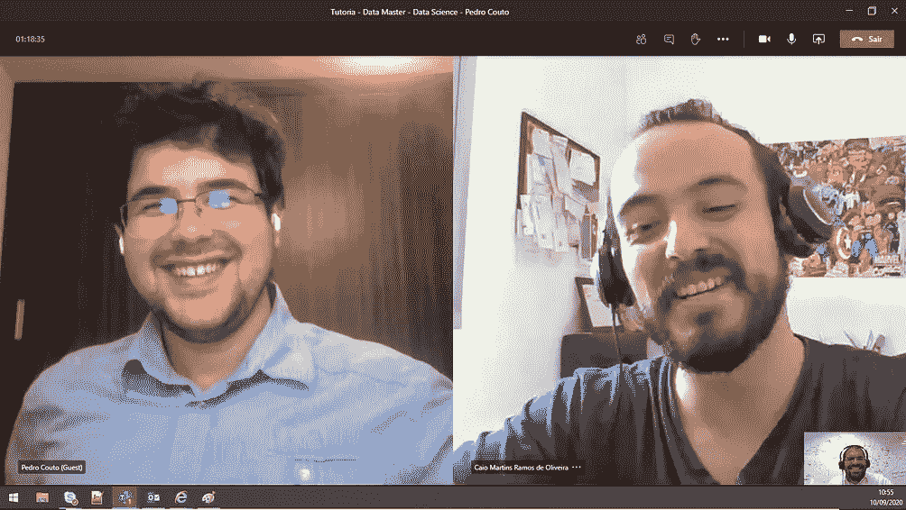

# 我是如何赢得桑坦德数据大师赛的

> 原文：<https://towardsdatascience.com/how-i-won-the-santander-data-master-competition-3-central-soft-skills-i-used-and-the-hard-skills-7f989012e0e2?source=collection_archive---------36----------------------->

桑坦德银行部门—来源:[https://upload . wikimedia . org/Wikipedia/commons/f/F8/M % C3 % B6 nchengladbach _ Santander Bank _ 1 . jpg](https://upload.wikimedia.org/wikipedia/commons/f/f8/M%C3%B6nchengladbach_Santanderbank_1.jpg)(免费使用)

## ***3 我用过的中枢软技能和我学过的硬技能。***

# 重要的事情先来

桑坦德银行在由尼发布了 2020 年版的数据硕士项目。使它成为一个优秀计划的想法和概念是将竞争和学习结合在一起，以帮助所有类型的数据科学学生或专业人员自我提高，成为更好的专业人员。

稍后我会告诉你更多关于这个神奇的程序。首先，让我展示一下我在这个旅程开始时的位置，这样你就有了一个基线。

我是一名有数学建模背景的化学工程师。在疫情隔离之前，我是一个平庸的程序员。虽然我在学习化学工程的几年中学到了很多统计和概率，但是随着时间的推移，我的知识一点也不可靠了！那就是我。基本上，就像几乎所有数据科学爱好者一样，我有一个有用的背景，但我的技能组合中也有一些需要改进的地方。

桑坦德数据大师横幅—来源:[https://www . becas-Santander . com/pt/program/Santander Data Masters-scienciadedados 2020](https://www.becas-santander.com/pt/program/santanderdatamasters-cienciadedados2020)(免费使用)

# 银行和项目

桑坦德集团是一家全球性银行集团，由欧元区最大的银行桑坦德银行领导。它起源于西班牙坎塔布里亚的桑坦德。数据主计划是作为他们授权文化的一部分而创建的。

桑坦德数据硕士——数据科学之路是由桑坦德大学(Academia Santander)提供的一项学习和认证计划。该计划由培训和比赛组成，桑坦德大学提供内容并挑选最佳参与者。

# 竞争

该计划有 3 个评估阶段，分别是:

*   第一阶段:候选人必须参加文化契合度、常识和逻辑推理评估。在这一阶段，大约有 3200 名候选人，只有 100 人被选中。
*   第二阶段:候选人有 33 天的时间学习桑坦德学院选择的所有材料。最后，有一个技术评估，需要超过 50%的性能才能获得认证。
*   **第 3 阶段:前 3 名参与者将有机会开发桑坦德银行提供的项目，并参加桑坦德银行员工的指导会议。**

所以你可以想象，从一开始每个人都想赢，以便获得指导和在现实世界项目中工作的机会。我也是！

# 学习和硬技能

这部分是这个节目的特别之处。数据大师不仅仅是保持旧的竞赛形式，即设置一个问题，每个人都试图拿出一个过度拟合的解决方案，而是关注你能在多大程度上学习最重要的硬技能，以成为一名非常优秀的数据科学家！

在选出 100 名参与者后，他们提供了一份结构化的学习材料，涵盖了数据科学家应该具备的最重要的知识和技能。**所有参与者都有 40 天的时间来尽可能多地学习以下*硬技能* :**

*   概率与统计:从基础到高级概念；
*   SQL 和 NoSQL；
*   大数据概念和应用；
*   编程；
*   回归:线性、多重、脊和套索、变量选择
*   分类:逻辑回归、决策树、随机森林和朴素贝叶斯；
*   聚类:K-means，层次聚类(分裂的和凝聚的)，潜在的狄利克雷分配；
*   绩效指标。

# 取胜的 3 个关键软技能

*正如你所想，要战胜 3200 名竞争对手并赢得这场比赛，需要一些创新。这正是我想和想分享的！所以我们走吧。*

# 1.协同作用

史蒂夫·乔布斯称之为“将点点滴滴连接起来”。

在这个项目期间，我还参加了 Udacity 的另外两个奖学金竞赛——[AWS 机器学习](https://www.udacity.com/scholarships/aws-machine-learning-scholarship-program)和[微软 Azure 的机器学习奖学金项目](https://www.udacity.com/scholarships/machine-learning-scholarship-microsoft-azure)。你可以想象，每场比赛(桑坦德、AWS 和 Azure)都有成千上万的东西要学。我最好的机会是以最协同的方式将这些点连接起来，这样我就可以在每场比赛中取得优异的表现。这就是这种软技能如此强大的原因:

*   **同时学习或做相关的事情，使得业绩空前暴涨。在我的情况下，我从每门课程中同时学到了关于算法的一切，并且我可以正确回答所有问题。**
*   你学习能力将会提高和加快！当我一遍又一遍地看到相关的东西时，这种重复过程确保了所有的信息都会从短期记忆进入长期记忆。
*   你开始跳出框框思考。通过从不同角度面对同一主题，我们开始看到新的应用和使用我们所学或所做的方法。

我坐下来，想出了一个在同一时间学习所有高度相关的科目的方法——垃圾邮件。这大大加快了我的学习速度，我可以涵盖所有的科目，并适当地学习它们。效果非常好，是最重要的软技能让我在 3200 个竞争对手中名列前茅。

# 2.时间管理

因为我有 40 天的时间来报道所有这些话题，同时还有另外两场比赛在进行，所以时间管理非常重要。我是这样做的:

*   **把问题分解成小部分**，这样我们就能更精确地知道完成每项任务需要多长时间。
*   **向他人展示你的计划**并向他们解释你为什么要这样安排事情。我和我的女朋友和一个朋友一起做的。为了获得有价值的见解，我收到的反馈非常重要。
*   **迭代以上各点。**

# 3.沟通

我们常常认为交流只是做一些演示或分享结果，但我们可以利用它来更好地学习或解决问题。

当我在某个时候陷入困境或没有找到解决我面临的问题的方法时，我试图写下来并向我的朋友解释或在论坛上讨论。它之所以有帮助，主要是因为我需要先传达一些东西，让我的头脑变得有条理。事情是这样的，当我准备一个问题要问的时候，我经常能找到答案，只是因为我需要以一种有序的方式组织一切。

# 奖品

应用和提高我的协同作用、时间管理和沟通技能，以及学习如此多的数据科学家角色的关键硬技能，已经是一个巨大的回报！除此之外，我还获得了两个惊人的奖品！

第一个是解决一个由三部分组成的问题，任务是通过构建工具来了解每个客户的满意度，从而使利润最大化。在这个项目中，我学习并实践了分类、聚类、净推介值(NPS)、特征选择和贝叶斯优化等概念。**访问我的**[**GitHub**](https://github.com/PedroHCouto/Santander-Case)**了解更多关于这个项目的信息，并查看我为解决这个案例而开发的所有代码！**

其次，在解决这个问题后，我与桑坦德银行巴西分行的数据科学和大数据经理费利佩·西莫斯和桑坦德银行巴西分行的高级数据科学家卡伊奥·马丁斯进行了约两个小时的交谈。师徒关系简直太棒了，非常有趣！我得到了关于这个项目的反馈，对我的职业和学习道路的重要见解，以及对我职业生涯下一步的建议。这里有一些我们一起讨论数据科学的美好时光的照片！

菲利普(左)和卡伊奥(右)的导师。

我的最后一句话是:如果你有机会参加这种类型和形式的比赛，100%争取！好处是惊人的，你也将提高你的软硬技能！哦，别忘了一路上玩得开心点！

感谢阅读，

—佩德罗