# 我如何在深度学习竞赛中赢得前五名

> 原文：<https://towardsdatascience.com/how-i-won-top-five-in-a-deep-learning-competition-753c788cade1?source=collection_archive---------29----------------------->

## PyTorch 中如何有效使用 CNN 的迁移学习(带 GitHub repo)

本文中的所有代码都在我的 [GitHub 库](https://github.com/bck1990/Identify-Characters-from-Product-Images)中。数据集已经在适当的文件夹中，代码准备运行(在安装 PyTorch 之后)。

[](https://github.com/bck1990/Identify-Characters-from-Product-Images) [## bck 1990/从产品图像中识别字符

### 这是为 CrowdANALYTIX 提交的竞赛(获得第四名)…

github.com](https://github.com/bck1990/Identify-Characters-from-Product-Images) 

去年，我参加了由 [CrowdANALYTIX](https://www.crowdanalytix.com/community) 组织的深度学习竞赛，获得了第四名。我通过使用 PyTorch 中的[迁移学习](https://blogs.nvidia.com/blog/2019/02/07/what-is-transfer-learning/)做到了这一点。虽然许多读者可能已经熟悉这种技术，但我将分享更多我认为对模型成功至关重要的*。老实说，我不是深度学习方面的专家，我只是依靠大量的试错法(和直觉)。*

*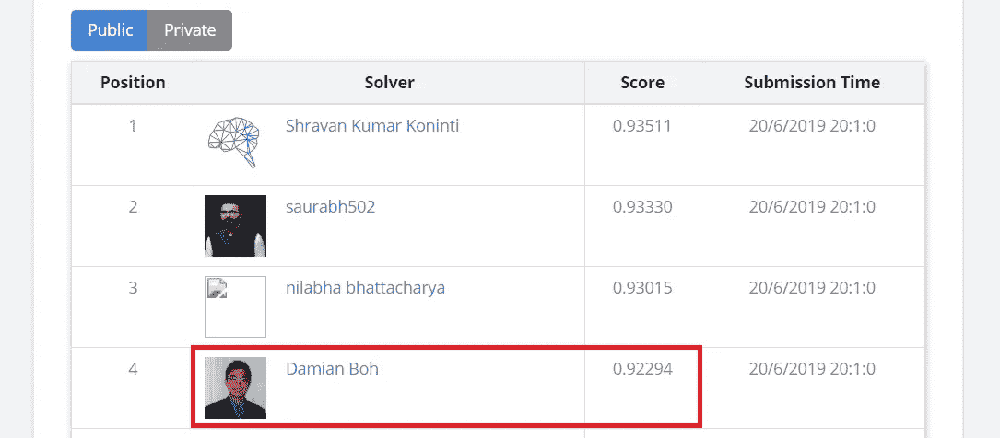*

*排行榜(在[竞赛页面](https://www.crowdanalytix.com/contests/identify-characters-from-product-images)的“排行榜”标签下)*

**

*有关挑战赛和 CrowdANALYTIX 的具体细节和规则，请访问下面的链接。*

> *CrowdANALYTIX 社区:数据专家在这里合作和竞争，以构建和优化人工智能、ML、NLP 和深度学习算法*

*[](https://www.crowdanalytix.com/contests/identify-characters-from-product-images) [## 从产品图像中识别角色

### 从 42 个可能值的列表中识别产品图像中的字符

www.crowdanalytix.com](https://www.crowdanalytix.com/contests/identify-characters-from-product-images) 

# **挑战—从产品图像中识别角色**

来自 CrowdANALYTIX 的数据集由产品的**图像组成，如 t 恤、包、钥匙链、手机套等。与**相关的 42 个不同的人物**。这些角色范围很广——从卡通人物*愤怒的小鸟*和*皮卡丘*到动漫人物*火影忍者*和*卡卡西*甚至电影人物*达斯·维德*和*哈利·波特*。还有约翰·塞纳(lol)。任务是根据这些特征对图像进行分类。**

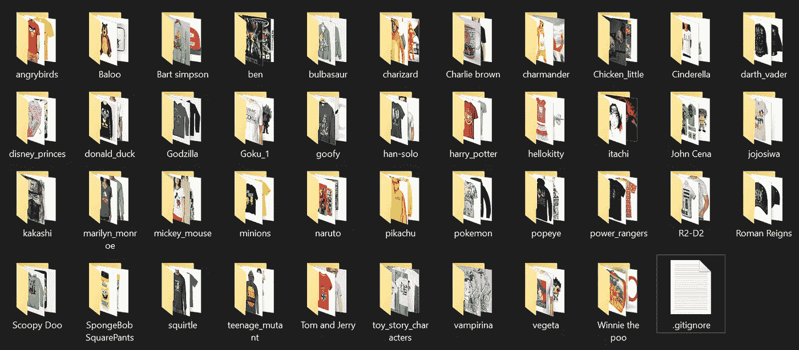

训练集由 6694 幅图像组成，这些图像按照上面的文件夹中所示的类别进行分类

训练和测试数据集之间的数据分布如下:

*   训练:42 个类别的 6694 张图片(点击[获取](https://storage.googleapis.com/cax-contests/propensity-modeling/CAX_Characters_Train.zip)
*   测试:3727 张图片(此处获取

下面给出了训练集中的一些例子(愤怒的小鸟、小火龙、达斯·维达和小黄人)。

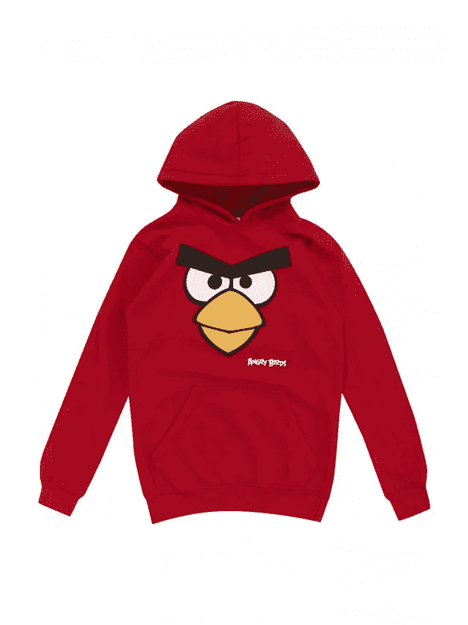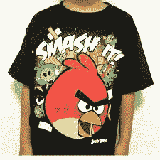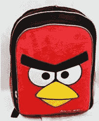

愤怒的小鸟


查尔曼德

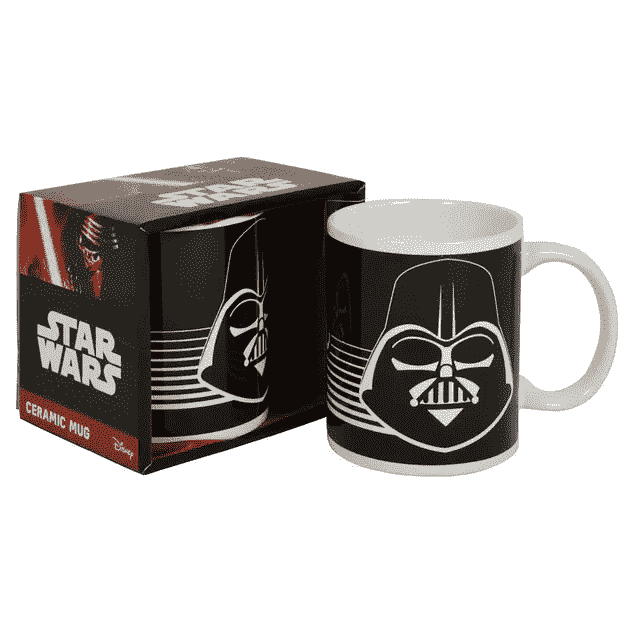

达斯·瓦德斯

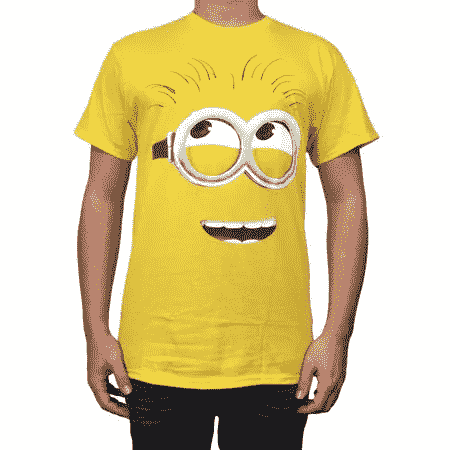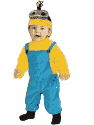

奴才


等等什么？

这项任务并不简单，设计师们已经采取了许多创造性的方法将这些角色融入到产品中。你，一个人类，能识别左边裤子上印的字符吗？

# 计划概述

*   采用 PyTorch 框架
*   深思熟虑的数据扩充
*   应用预训练卷积神经网络进行迁移学习
*   模型拟合是在 Google Colab 和我的电脑上完成的(带 GPU)
*   抓取更多的训练图像，并删除不相关的图像

# 进口

这些是我用过的库。采用 [PyTorch 框架](https://pytorch.org/get-started/locally/)是因为我最熟悉它用于深度学习，我觉得它比 Keras 更灵活，特别是当我通过试错法调整很多参数时。

下面给出了更多关于如何安装 PyTorch 的信息。

[](https://pytorch.org/get-started/locally/) [## PyTorch

### 选择您的首选项并运行安装命令。稳定代表了当前测试和支持最多的版本…

pytorch.org](https://pytorch.org/get-started/locally/) 

## 文件夹结构

随意浏览我的 [GitHub 库](https://github.com/bck1990/Identify-Characters-from-Product-Images)来看看文件夹结构。你需要**训练**、**测试**和**有效** (ation)文件夹。在每一个文件夹中，您必须使用图像的**标签作为文件夹名称**对图像进行进一步分类(如之前的截图所示)，PyTorch 会自动分配它们的标签。我编写了一个简单的程序，从每个类别中随机选取大约 20%的图像，并将它们传输到验证文件夹中。

*注意:测试文件夹中的图像当然没有标注。但是 PyTorch 需要将测试文件夹中的* ***图像进一步放入另一个文件夹*** *。否则，PyTorch 会说它在测试文件夹中找不到文件夹。我通过在测试文件夹中创建一个“test2”文件夹来解决这个问题，并将我所有的测试图像都放在那里。*


我电脑上的文件夹结构

不要担心“扩展”文件夹名称。我将在最后详述这一点。

# (至关重要)在数据扩充中需要考虑什么

数据扩充与其说是一门科学，不如说是一门艺术。 ***做错了就伤了精准度。*** 在训练过程中，我们随机裁剪、改变颜色、亮度、对比度、旋转或翻转图像，以便每次通过数据集时，神经网络都能看到同一图像的不同变化。因此，这些变化*增加了*并为数据集“添加了更多”。这有助于允许模型推广到图像的不同变化。重要的是，没有一种适合所有人的数据扩充方法。

> 关键点:有些人可能认为*我们包含的数据增强类型越多，模型就越好。* **这不是真的，因语境而异。**

因此，通过仔细查看数据集(可在 [CrowdANALYTIX](https://storage.googleapis.com/cax-contests/propensity-modeling/CAX_Characters_Train.zip) 和我的 [GitHub repo](https://github.com/bck1990/Identify-Characters-from-Product-Images) 上获得)来确定哪些方面需要增强**以及哪些方面*不需要增强***至关重要。

## 顺化(越南城市)

在这种情况下，生成不同色调的随机图像以增加训练数据会对准确性产生负面影响**，这一点已得到证实。这并不令人惊讶，也证实了颜色是一个重要的特征(例如，没有蓝色迷人者*等。)所以这种扩增方法失败了。***

## **水平翻转**

**随机水平翻转图像以增加训练数据也**负面地**影响了准确性。这大概是因为**字**像“口袋妖怪”、“韩 Solo”等。在火车上，图像本身在不应该翻转的时候翻转了。**

## **随机旋转**

**这种增加的方法同样**负面地**影响了精确度，无论旋转多少度都是如此。查看训练集和测试集，我们可以看到几乎所有的图像都是垂直的。因此，没有必要旋转列车图像，甚至会降低精度。**

**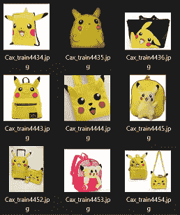****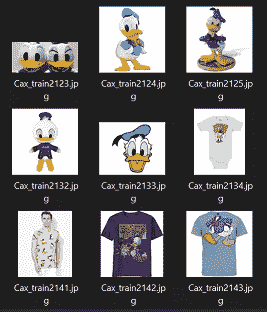******

**皮卡丘永远是黄色的(请不要随意的色调)。图像(即使在测试集中)大多是垂直的(请不要随意旋转)。图片上的文字很重要(请不要水平翻转)。**

## **随机作物**

**这种增强方法也是**不理想的**，因为图像中的主要特征在预处理期间可能不会被裁剪(例如，在许多图像(如 t 恤)中，我们可能会裁剪随机的部分，如袖子和衣领，**，它们不包括角色本身**，从而使该训练图像无用)。**

## **饱和度和对比度**

**这很难通过观察图像来直观地判断，但是这种增强的方法并没有提高精确度。**

## **聪明**

**如图片所示，产品是在**不同的光照条件**下拍摄的，具有不同的亮度(虽然颜色相同，但一些图片明显比其他图片暗)。随机生成不同亮度(上限为 0.05)的图像允许该模型推广到不同的照明条件，并将最佳模型的准确性提高到 92%以上。**

**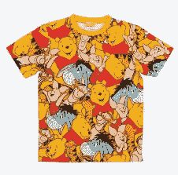****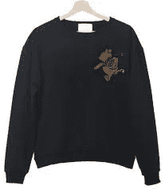****

小熊维尼在 3 个原始火车图像上的不同亮度阴影。我们希望模型能推广到不同的亮度。** 

**与扩充列车数据相关的最后一部分代码如下所示，它利用了 PyTorch 中的[转换包](https://pytorch.org/docs/stable/torchvision/transforms.html)。我们意识到**只需要增加亮度**！我希望这能为您未来的数据扩充方法提供有用的指导。**

```
transforms.ColorJitter(brightness=.05, saturation=0, contrast=0)
```

***如果你不确定上面要增加什么，就去做* ***试错*** *！***

# **应用转换和加载数据集**

**除了增强之外，必须对所有图像应用固定(非随机)变换，因为 PyTorch 中的[预训练模型期望图像尺寸为 3 x 224 x 224 (3 是 RGB 像素，224 是宽度和高度)。我们应用调整大小和中心裁剪来达到这个标准尺寸。](https://pytorch.org/docs/stable/torchvision/models.html)**

**转换的完整代码附后。注意，我们**没有增加**(对其应用随机亮度变换)验证数据集**。这是为了确保在验证我们的模型时使用完全相同的图像的公平性。****

****从我们的文件夹中加载训练和验证数据集的代码(如下)几乎完全是从文档中提取的，不要太担心。加载数据集后，程序会进行一些计算，以批量对训练和验证数据集进行采样。使用 50 的普通批量。****

# ****卷积神经网络****

****CNN 是深度学习网络，在图像识别任务中非常成功。如果你不熟悉 CNN，下面给你一个很好的介绍。****

****[](https://adeshpande3.github.io/A-Beginner%27s-Guide-To-Understanding-Convolutional-Neural-Networks/) [## 理解卷积神经网络的初学者指南

### 卷积神经网络。听起来像是生物学和数学的奇怪结合，还有点 CS 的成分，但是…

adeshpande3.github.io](https://adeshpande3.github.io/A-Beginner%27s-Guide-To-Understanding-Convolutional-Neural-Networks/) 

卷积神经网络的结构(图片来自文章上方的

## 卷积层

总而言之，卷积神经网络由卷积层组成(参见上文),图像首先通过这些卷积层。在经过训练的 CNN 模型中，前几层将提取图像的更多**低级**特征，如边缘和笔画。接下来的几层接着选择**更高层次的**特征，例如圆形或笔画组合。随着我们的进一步发展，最后几个卷积层将获得**甚至更高层次的**特征，例如狗头。最后几层中的这些特征变得越来越特定于网络试图分类的内容。在卷积层的中间是用于缩减数据采样的池层或用于减少过拟合的丢弃层，以及您可以在上面的文章中了解更多信息的其他层。

## 完全连接的层

卷积层的输出将通过完全连接的层(有时只是一层)的最终网络，该网络**将其映射到与我们想要分类的图像的期望类别**相对应的精确数量的输出。由于这个原因，这个网络也被称为分类器。例如，如果最后一个卷积层的输出是 2048，我们希望训练网络来区分狗、猫和仓鼠，则来自卷积层的全连接层的*输入*将是 2048，输出将是 3(对应于提到的 3 种动物)。

## 训练 CNN 权重

经过训练的 CNN 可以通过调整每一层的权重来提取特征并对图像进行分类。这些**权重**只是负责在每层中执行计算的数字。每次一批图像通过模型，模型的预测和图像的实际类别之间的误差由 [**损失函数**](https://medium.com/udacity-pytorch-challengers/understanding-loss-function-and-error-in-neural-network-676a81cc776c) 计算。然后权重被更新(通过模型的 [**反向传播**](https://en.wikipedia.org/wiki/Backpropagation) )以最小化损失函数，因此模型在分类图像时变得更准确——因为它在下一次图像通过它时使用这些新的权重进行计算。

# (至关重要)迁移学习和选择模型

我的迁移学习方法包括应用[卷积神经网络(CNN)](https://adeshpande3.github.io/A-Beginner%27s-Guide-To-Understanding-Convolutional-Neural-Networks/)，其权重**已经在 ImageNet** 上的 [**数百万张图片上进行了预训练。这个想法是，虽然我只有 6000 多张图片来训练，但我可以利用一个 CNN 模型，它已经从数百万张图片中学习了，然后对它进行一些修改以适应我的数据。你可以在下面阅读更多关于迁移学习的内容。**](http://www.image-net.org/)

[](https://ruder.io/transfer-learning/) [## 迁移学习——机器学习的下一个前沿

### 深度学习模型擅长从大量有标签的例子中学习，但通常不会推广到…

ruder.io](https://ruder.io/transfer-learning/) 

来自 PyTorch 网站的 CNN 模型列表及其在 ImageNet 数据集上的表现可在此处获得[。](https://pytorch.org/docs/stable/torchvision/models.html)

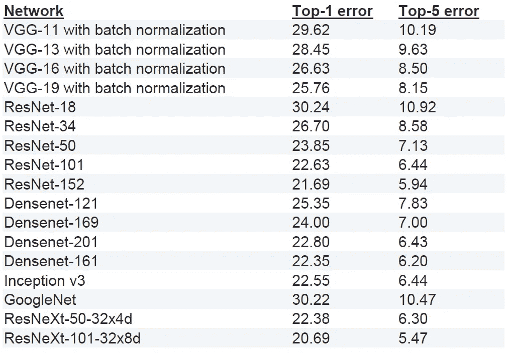

**首先对每个模型进行初步测试。**经过一些试错，不出所料 **'resnext101_32x8d'** 表现最好，在 ImageNet 上的错误最低(在其他问题中应用深度学习时可能不总是这样，因此需要试错)。ResNeXt 是由加州大学圣地亚哥分校和脸书人工智能研究所(FAIR)开发的一个模型，构建于 ResNet 之上。我不会深入这个网络的架构细节，你可以在 ResNet [这里](/review-resnet-winner-of-ilsvrc-2015-image-classification-localization-detection-e39402bfa5d8)和 ResNeXt [这里](/review-resnext-1st-runner-up-of-ilsvrc-2016-image-classification-15d7f17b42ac)阅读更多内容。

按照惯例，图像经过的模型的**前几个**层也被称为**底部**层，而**最后几个**层是**顶部**层。

## **冻结和解冻图层**

回想一下，模型的底层获得了更多的一般和低级特征，这些特征**不是针对我们的具体任务的，而是针对所有图像识别任务的**。因此，诀窍是**冻结**(而不是训练权重)这些**底层**，同时在我们的角色数据集上训练网络。这是因为 ImageNet 中的数百万幅图像已经很好地训练了这些底层，足以拾取像笔画和边缘这样的东西。

同时，我们希望**解冻顶层**，这样它们的权重可以用我们自己的数据集来训练。随着顶层获得**特定于任务的高级功能**，我们希望这些层**适应我们特定的任务**。例如，不是让这些特征拾取飞机的尾部，而是让它拾取皮卡丘的头部或燃烧的东西🔥小火龙的尾巴。这些与我们当前的任务更相关。

许多关于迁移学习的教程会告诉你只解冻完全连接的层。这可能是因为训练一些卷积层(更新其权重)的计算量要大得多。然而，精度可以通过训练一些卷积层来进一步提高，所以请注意！

让我们看看代码。

首先，我们选择模型并将**设置为真**。如果设置为 False，模型将使用随机(未经训练的)权重进行初始化。如果这是你第一次选择模型，PyTorch 会自动下载。

“model”命令打印出模型的完整架构，这个命令太长了，无法在这里显示。你可以在我的 GitHub 库的这个 [**pdf 文件**中查看。](https://github.com/bck1990/Identify-Characters-from-Product-Images/blob/master/model_architecture.pdf)

除了…你猜对了…试错法之外，没有办法知道有多少顶层应该被冻结。

我已经通过**将 *requires_grad* 参数设置为 *False*** 冻结了**下面代码中的层组(从 conv1 到 layer2)，因为我们在训练时不需要在反向传播期间使用梯度来更新它们的权重。**

在 model.layer3 中，我冻结了第 1 层到第 18 层，如下图所示。澄清一下， *model.layer3 实际上是一组名为‘layer 3’的图层*。这只是 PyTorch 表示这些 ResNeXt 层的方式。通过反复试验，冻结这些层可以获得最佳的模型精度。

model.layer3 中的剩余层以及所有其他剩余层(包括完全连接的层)未被冻结，因此被训练。如果你不确定我的意思，看看 PyTorch 中 ResNeXt 101 的**完整架构在我的 GitHub 库中的这个 [**pdf 文件**中，图层中高亮显示的图层就是训练过的图层。](https://github.com/bck1990/Identify-Characters-from-Product-Images/blob/master/model_architecture.pdf)**

# **更换全连接层**

滚动到模型的最后几层，我们看到以下内容:

```
(2): Bottleneck(
      (conv1): Conv2d(2048, 2048, kernel_size=(1, 1), stride=(1, 1), bias=False)
      (bn1): BatchNorm2d(2048, eps=1e-05, momentum=0.1, affine=True, track_running_stats=True)
      (conv2): Conv2d(2048, 2048, kernel_size=(3, 3), stride=(1, 1), padding=(1, 1), groups=32, bias=False)
      (bn2): BatchNorm2d(2048, eps=1e-05, momentum=0.1, affine=True, track_running_stats=True)
      (conv3): Conv2d(2048, 2048, kernel_size=(1, 1), stride=(1, 1), bias=False)
      (bn3): BatchNorm2d(2048, eps=1e-05, momentum=0.1, affine=True, track_running_stats=True)
      (relu): ReLU(inplace=True)
    )
  )
  (avgpool): AdaptiveAvgPool2d(output_size=(1, 1))
  (fc): Linear(in_features=2048, out_features=1000, bias=True)
```

注意最后一行，它显示了前面提到的**全连接(fc)层**。回想一下，它将卷积层的输出映射到模型试图分类的图像类别的数量。*输入* (in_features)是 2048，因此，我们可以将它上面的卷积/池层的*输出*解释为 2048。这个 fc 层的输出(out_features)是 1000，对应于 ImageNet 数据集中的 1000 个类。

下面的代码将层的输出修改为 42，对应于我们拥有的 42 个不同的字符。

> 简单有时最有效。

此外，在尝试了几个带有 [dropout](https://en.wikipedia.org/wiki/Dropout_(neural_networks)) 和 [ReLU](https://machinelearningmastery.com/rectified-linear-activation-function-for-deep-learning-neural-networks/) 的奇特层之后，我发现我**只需要一个*单*全连接层**就能获得最佳效果。

## 耗时？Google Colab 拯救世界

这无疑是最耗时的过程。我用越来越多的解冻层来训练每个模型，看看精度如何变化。 ***有时解冻一些图层后精度下降，但当我再次解冻时精度又上升，有时会出现相反的情况*** *。我承认我无法建立任何直觉来解释为什么会这样(如果你知道，请在评论中启发我！).我在这部分花了几个星期。*

> 在试错过程中，同时运行几个谷歌实验室会议。

然而，通过同时在几个 Google Colab 笔记本上运行我的代码，这个过程还是被加速了。**Colab***笔记本在谷歌的云服务器上执行代码，意味着你可以利用谷歌硬件的能力，包括 GPU 和 TPU，而不管你机器的能力如何。即使我有一台配备了 GPU 的电脑，我也需要几次 Google Colab 会话来同时测试多个模型。注意不要超过内存限制，因为每个会话都会占用一些内存。***

**[](https://colab.research.google.com/notebooks/welcome.ipynb) [## 谷歌联合实验室

### Google Colab 笔记本示例

colab.research.google.com](https://colab.research.google.com/notebooks/welcome.ipynb) 

## 定义优化器

[优化器](https://algorithmia.com/blog/introduction-to-optimizers)是用于更新神经网络的权重的算法，以便最小化损失函数并增加模型的准确性。选择了[**【亚当】优化器**](/adam-latest-trends-in-deep-learning-optimization-6be9a291375c) 而不是其他流行的算法，[随机梯度下降(SGD)](https://ruder.io/optimizing-gradient-descent/index.html) ，因为 SGD 的训练速度太慢，精度没有任何显著提高。一个好的 [**学习速率(LR)**](https://en.wikipedia.org/wiki/Learning_rate) ，又名**步长**是通过试错选择的。步长太大可能导致算法错过最小值点并“跨越”它，而步长太小可能导致算法花费很长时间来训练或陷入局部最小值而不是达到真正的全局最小值。点击阅读更多[。LR 为 0.00005 被证明是一个很好的开始速率。](https://machinelearningmastery.com/learning-rate-for-deep-learning-neural-networks/)

使用了这种任务最常见的损失函数[交叉熵损失](https://ml-cheatsheet.readthedocs.io/en/latest/loss_functions.html)。请注意，在下面的代码中，我已经为不同神经网络的三个不同部分初始化了三个独立的优化器。

> 为前几个时段的全连接(FC)层设置较高的权重。

通过为 FC 层设置更高的权重，我们训练 FC 层的速度比训练卷积层的速度快得多。FC 层用完全随机的权重初始化，而卷积层已经用 ImageNet 数据集训练了权重。您希望在微调卷积层之前，快速粗略地计算将卷积层的输出映射到图像类别的 FC 层权重。有些人可能**在最初几个时期** 不训练卷积层，因为他们认为当 FC 层仍然没有完成将卷积层的输出映射到图像类别的工作时，对卷积层的训练是“浪费的”。请注意，在这几个时期之后，您仍然必须最终训练卷积层，因为这样做的准确性会大大提高。

我选择了前一种方法，因为我发现它在这种情况下更有效。请注意，我在优化器中为 FC 层设置了更高的学习速率(LR 参数),如下所示。

下面下一节中的代码训练模型的 4 个时期，并在每个时期输出结果，它几乎完全是从文档中摘录的。注意，您必须为训练阶段设置 **model.train()** ，为评估阶段设置 **model.eval()** 。

## 培训与验证

使用前面提到的验证文件夹中的文件夹在**验证数据集**上进行每个时期的评估。验证集用于在未对其进行训练的数据集上评估模型，以便我们知道模型何时过度适合训练集。**防止过度拟合**很重要，因为我们希望模型能够很好地推广到看不见的数据，而不仅仅是训练集。模型在训练集上的准确性将总是增加，但是如果在看不见的验证集上的准确性开始降低，我们知道模型过度拟合。因此，我们应该**在验证精度开始下降的点**停止。

还要注意，在代码中，我们必须在对每批新数据进行训练时使用 optimizer.zero_grad()手动将优化器的梯度设置为零，并使用 optimizer.step()更新权重。用于评估的代码是相似的，除了不涉及优化器(我们不在验证图像上调整模型的权重，因为不涉及训练)。

> **几个时期后降低学习率**

一个好的策略是在几个时期之后降低学习率，因为我们接近最小值。我们不想“穿越”而错过这个最低点。在上述 4 个时期之后，在训练另一个 4 个时期之前，我将学习率设置为 0.00001，然后在验证准确度开始降低之前，将最后 4 个时期的学习率设置为 0.000001。请参考我的 GitHub 资源库中的“final code.ipynb”笔记本来查看流程。

注意，在改变它们之前，花了很多时间来微调学习速率和时期数。你必须**有耐心**(并且打开几个 Google Colab 会话，每个会话运行在不同的参数上)！

## 提交前对验证集进行培训

别忘了这个！在提交前对模型进行最后一轮训练之前，将所有验证图像传输回训练文件夹！我必须将虚拟图像放入验证文件夹，否则我会在训练时遇到错误。

# (至关重要)在培训图像上扩展的网页抓取

挑战的[规则](https://www.crowdanalytix.com/contests/identify-characters-from-product-images)声明:*作为一个现实世界的应用问题，我们希望解决者使用图像数据/特征，如颜色、形状、SIFT 等。或者用于图像建模的深度学习方法。对硬件或 GPU 的使用没有限制，扩充、* ***增加额外的训练数据*** *等。*

这并不奇怪，因为在现实世界中解决这样的问题时，我们总是建立自己的训练数据集，使其更加丰富。

> 只需谷歌更多的图片来补充你的训练数据！

在尝试了许多选择之后，我发现**在谷歌上使用图片的类别**(即皮卡丘、小火龙等名字)进行搜索。)**其次是‘衬衫娃娃’**给出了最好的结果！相信我，我已经尝试过添加很多单词，比如“产品”、“杯子”、“包”等等。而且有的还胡说八道。

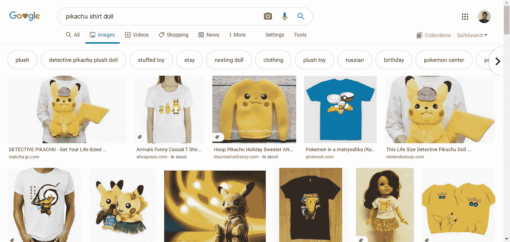

这对这款车型的成功至关重要。在训练我的模型时的某个时间点，我意识到我应该扩展我的训练数据，并且必须再次重新开始整个过程。这一步应该在模型训练之前完成，但我想在详细阐述这一独立部分之前给出整个模型的总体视图。在我的 GitHub 存储库中，**‘expand _ train _ set _ character’文件夹**包含我从谷歌获取的图像，而**‘train _ expanded _ character’文件夹**包含来自 CrowdANALYTIX 和谷歌的训练数据。

在这个过程中遇到了一些困难:

*   有许多损坏的文件必须通过代码识别并删除(例如，不要以结尾。jpg，无法打开等。).
*   其中一个角色是“本”。当我自己在谷歌上搜索“本”时，出现了很多叫“本”的人，这简直是一场灾难。因此“本”的训练数据根本没有增加。

实现这一点的脚本的完整代码在下面给出，也在我的 [GiHub 库](https://github.com/bck1990/Identify-Characters-from-Product-Images)的‘来自 google.ipynb 的碎片图像’文件中。基本上，它列出了火车目录中的所有文件夹名称，这是图像类别，然后谷歌搜索每个词+“衬衫娃娃”并解析结果，然后将图片分类到“expand_train_set_character”文件夹中。关于如何使用 BeautifulSoup 从网上收集数据的教程，请访问本页面。

# 概括起来

本文涵盖了以下内容:

*   PyTorch 中选择的 ResNeXt-101-32x8d 型号。
*   在训练期间，从 model.layer3 解冻第 18 层及其上面的所有层。
*   图像增强的亮度随机变换上限为 0.05，因此模型可以推广到不同光照条件下的图像。
*   网络抓取更多产品图片(来自谷歌)添加到数据集。
*   为全连接层的前几个时期设置较低的学习速率。在几个时期之后小心地降低学习速率(对于 FC 和卷积层)。
*   试错法！很多时间都花在了反复试验和开发数据集的直观感受上。

这是我第一次尝试深度学习竞赛中的一次。我很高兴最终获得了第四名，准确率为 92.294%，如本文开头的排行榜所示。我希望这篇文章对你有用，并且你已经获得了一些应用于未来深度学习项目的技巧和诀窍！同样，本文中的所有代码都在我的 [GitHub 库](https://github.com/bck1990/Identify-Characters-from-Product-Images)中。数据集已经在适当的文件夹中，代码准备运行(在安装 PyTorch 之后)。

[](https://github.com/bck1990/Identify-Characters-from-Product-Images) [## bck 1990/从产品图像中识别字符

### 这是为 CrowdANALYTIX 提交的竞赛(获得第四名)…

github.com](https://github.com/bck1990/Identify-Characters-from-Product-Images)*******