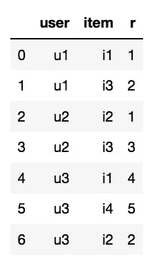
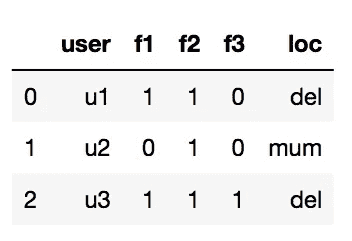
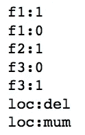
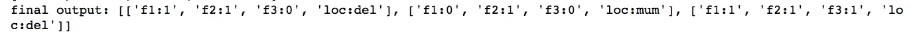
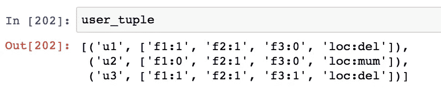
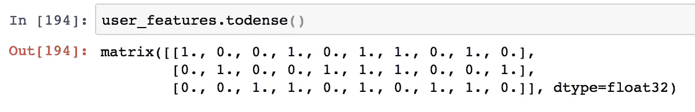
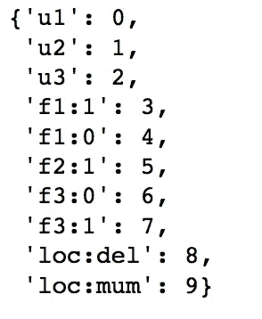
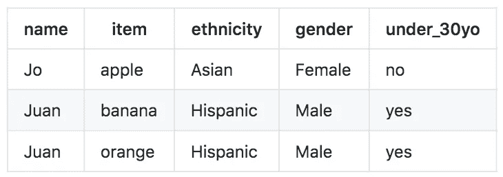

# 我将如何向一个 5 岁的孩子解释构建“LightFM 混合推荐器”!

> 原文：<https://towardsdatascience.com/how-i-would-explain-building-lightfm-hybrid-recommenders-to-a-5-year-old-b6ee18571309?source=collection_archive---------4----------------------->

## 构建用户/项目功能以解决冷启动问题并预测新用户评级的示例。

*注意:5 岁的孩子必须掌握 Python 的工作知识！*


来源:作者在 [imgflip](https://imgflip.com/i/47bj0b) 上创建

# 为什么对冷启动问题大惊小怪？

在推荐系统中，**冷启动问题**指的是将项目推荐给一个完全**新* *用户*的问题，即一个没有与你的数据库中的任何现有项目进行过交互的用户。换句话说，如果您从初始训练数据创建用户-项目矩阵，您将找不到这个新用户的行。类似的类比可用于解释在*全新项目*的情况下的冷启动问题。*

*作为应用程序开发人员，这可能会给你带来很大的不便，例如，当听众试图寻找新的播客建议来听时，你得到的是——zip，zilch，nada，什么都没有。这正是我们播客应用程序 [Podurama](https://podurama.com/) 最初开发阶段的问题。让我们看看 LightFM 是如何帮助我们解决这个问题的…*

# *LightFM 如何帮助解决冷启动问题？*

*LightFM 的一个优点是，该模型不会遭受冷启动问题，无论是用户还是项目冷启动。原因是 LightFM 允许构建一个**混合推荐系统**。*

> *混合推荐器是一种特殊的推荐器，它使用协同过滤和基于内容的过滤来进行推荐。*

*简而言之，LightFM 可以使用普通的用户-项目交互来为已知的**用户做出预测。*在 n 个*电子战用户的情况下，*如果它知道关于这些新用户的一些*附加信息*，它可以做出预测。这些附加信息可以是性别、年龄、种族等特征，并且在训练期间必须将**输入到算法中。****

# **让我们直接进入编码**

**我将使用(非常)小的虚拟评级数据和特征数据，因为我希望能够显示每个阶段的中间输出。如果你想跟着去，这里有一本 [Jupyter 笔记本](https://github.com/V-Sher/LightFm_HybridRecommenderSystem/blob/master/LightFM%20Worked%20Example.ipynb)。**

## **评级数据框架**

**它包含来自三个用户(u1、u2、u3)和四个项目(i1、i2、i3、i4)的数据。**

```
**# create dummy dataset
data = {'user': ['u1','u1','u2','u2', 'u3', 'u3', 'u3'], 
        'item': ['i1', 'i3', 'i2', 'i3', 'i1', 'i4', 'i2'], 
        'r': [1,2,1,3,4,5,2]
       }
df = pd.DataFrame(data,  columns = ['user', 'item', 'r'])**
```

****

## **用户特征数据框架**

**我们有关于每个用户的四条附加信息——三个布尔特征——f1、f2、f3，以及一个位置特征——loc，现在可以取两个值——德里或孟买。**

```
***#dummy user features*
data = {'user': ['u1','u2','u3', 'loc'], 
        'f1': [1, 0, 1, 'del'], 
        'f2': [1, 1, 1, 'mum'],
        'f3': [0, 0, 1, 'del']
       }
features = pd.DataFrame(data,  columns = ['user', 'f1', 'f2', 'f3', 'loc'])**
```

****

## **创建符合 LightFM 的数据集**

**如果您浏览过 LightFM 文档，就会知道它喜欢特定格式的输入数据。因此，我们必须服从。**

```
**from lightfm.data import Dataset
dataset1 = Dataset()**
```

## **调用 fit 方法**

**我们需要调用 fit 方法来告诉 LightFM 用户是谁，我们正在处理什么项目，以及任何用户/项目特性。**

**我们将向 fit 方法传递三个输入:**

*   **`users`:所有用户列表**
*   **`items`:列出所有项目**
*   **`user_features`:附加用户功能列表**

**传递用户和项目列表非常简单——只需使用`df`中的“用户”和“项目”列。**

**当谈到传递`user_features`时，我会**强烈**推荐传递一个列表，其中每个元素都是类似于`'feature_name:feature_value'`的格式(我保证我会解释为什么我更喜欢这样做，以及是否有其他选择，但是现在，请耐心等待)。**

**这意味着我们的`user_features`应该是这样的:
`['f1:1', 'f1:0', 'f2:1', 'f3:0', 'f3:1', 'loc:mum', 'loc:del']`。**

**正如你所猜测的，这个列表是通过考虑在训练集中可能遇到的所有可能的对来生成的。例如，对于等于`loc`的`feature_name`，可以有两个`feature_values`，即`mum`和`del`。**

**我写了一小段代码，让我生成这样一个列表(我称之为`uf`):**

```
**uf = []
col = ['f1']*len(features.f1.unique()) + ['f2']*len(features.f2.unique()) + ['f3']*len(features.f3.unique()) + ['loc']*len(features['loc'].unique())
unique_f1 = list(features.f1.unique()) + list(features.f2.unique()) + list(features.f3.unique()) + list(features['loc'].unique())
#print('f1:', unique_f1)
for x,y in zip(col, unique_f1):
    res = str(x)+ ":" +str(y)
    uf.append(res)
    print(res)**
```

****

**最后，有了所有可用的部分，让我们对数据集调用 fit 方法:**

```
***# we call fit to supply userid, item id and user/item features*
dataset1.fit(
        df['user'].unique(), *# all the users*
        df['item'].unique(), *# all the items*
        user_features = uf *# additional user features*
)**
```

**既然我们已经准备好了框架数据集，我们就可以将实际的交互和评级插入其中了。**

## **建立互动**

**`build_interactions`方法的输入是交互的 iterable，其中每个交互是一个包含三个元素的元组:**

*   **用户**
*   **项目**
*   **交互权重(可选)**

**交互权重仅仅意味着如果用户‘u’与项目‘I’交互，那么这个交互*有多重要。从我们示例的角度来看，权重是我们对每个(用户、商品)对的评级。***

**插入权重可能有用的另一个例子是，如果我们正在处理(用户、歌曲)交互数据。在这种情况下，我可以给那些用户听了超过 3/4 歌曲的交互分配一个较高的权重。**

```
***# plugging in the interactions and their weights*
(interactions, weights) = dataset1.build_interactions([(x[0], x[1], x[2]) for x in df.values ])**
```

> **总之，`interactions`矩阵告诉我们用户是否与某个项目进行了交互，而`weights`矩阵量化了特定的交互。**

**我们可以看看这两个输出矩阵是什么样的。由于这些是稀疏矩阵，我们可以使用`.todense()`方法。在这两个矩阵中，行是用户，列是项目。**

****

**如果你现在还和我在一起，我向你致敬。理解下一部分非常重要，这样你也可以为你自己的推荐系统实现它。(有趣的事实:LightFM Github 页面上的许多公开问题都与构建用户/物品特性主题有关)。**

## **构建用户特征**

**`build_user_features`方法需要以下格式的输入:
[
(用户 1，[特征 1，特征 2，特征 3，…。])，
(用户 2，[功能 1，功能 2，功能 3，…。])，
(用户 3，[功能 1，功能 2，功能 3，…。])，
。
。** 

> **这里需要记住的一件超级重要的事情是，`feature1`、`feature2`、`feature3`等应该是我们一开始传递给`fit`方法的`user_features`列表中的项目之一。**

**只是重申一下，这是我们的`user_features`列表目前的样子:
`['f1:1', 'f1:0', 'f2:1', 'f3:0', 'f3:1', 'loc:mum', 'loc:del']`。**

**因此，对于我们特定的虚拟数据，`build_user_features`的输入应该是这样的:**

```
**[
     ('u1', ['f1:1', 'f2:1', 'f3:0', 'loc:del']),
     ('u2', ['f1:0', 'f2:1', 'f3:0', 'loc:mum']),
     ('u3', ['f1:1', 'f2:1', 'f3:1', 'loc:del'])
 ]**
```

**同样，我已经编写了一个(不那么小的)代码片段，让我生成这样一个列表:**

```
*****# Helper function that takes the user features and converts them into the proper "feature:value" format***
def feature_colon_value(my_list):
    """
    Takes as input a list and prepends the columns names to respective values in the list.
    For example: if my_list = [1,1,0,'del'],
    resultant output = ['f1:1', 'f2:1', 'f3:0', 'loc:del']

    """
    result = []
    ll = ['f1:','f2:', 'f3:', 'loc:']
    aa = my_list
    for x,y in zip(ll,aa):
        res = str(x) +""+ str(y)
        result.append(res)
    return result***# Using the helper function to generate user features in proper format for ALL users*** ad_subset = features[["f1", 'f2','f3', 'loc']] 
ad_list = [list(x) for x in ad_subset.values]
feature_list = []
for item in ad_list:
    feature_list.append(feature_colon_value(item))
print(f'Final output: {feature_list}')**
```

****

**最后，我们必须将`feature_list`的每个元素与相应的用户 id 相关联。**

```
**user_tuple = list(zip(features.user, feature_list))**
```

****

**瞧，我们有了`build_user_features`方法所需的输入。让我们继续称之为:**

```
**user_features = dataset1.build_user_features(user_tuple, normalize= False)**
```

****

**图 1**

**在上面的`user_features`矩阵中，行是用户，列是用户特征。每当用户在训练数据中具有该特定用户特征时，就存在 1。**

**我们可以看到总共有 10 列，这意味着存在 10 个用户特性。但是为什么你问，让我们看看！**

```
**user_id_map, user_feature_map, item_id_map, item_feature_map = dataset1.mapping()
user_feature_map**
```

****

**如果你看看上面的输出，就会明白为什么我们有 10 个用户特性。默认情况下，用户 id 本身也是一个特性，所以我们有三个。剩下的七个一定很熟悉，因为我们在一开始就创建了它们。**

## **是时候建立模型了**

**这一步非常简单，也非常通用。当然，您可以遵循[文档](https://making.lyst.com/lightfm/docs/index.html)并尝试不同的`loss`值或`learning_schedule`选项。**

```
**model = LightFM(loss='warp')
model.fit(interactions,
      user_features= user_features,
      sample_weight= weights,
      epochs=10)**
```

## **打印 AUC 分数**

```
**from lightfm.evaluation import auc_score
train_auc = auc_score(model,
                      interactions,
                      user_features=user_features
                     ).mean()
print('Hybrid training set AUC: %s' % train_auc)**Output: Hybrid training set AUC: 0.9166667****
```

**我再说一遍，不要对高 AUC 过于兴奋。记住这只是虚拟数据。**

## **为已知用户做预测**

**`predict`方法有两个输入:**

*   **用户 id 映射(例如:要获得对“u1”的预测，必须传递 0；对于‘U2’，传递 1，以此类推。).这些映射可从`user_id_map` 字典中访问。**
*   **条目 id 的列表(同样不是 i1、i2，而是映射；可从`item_id_map`获得您想要的推荐。**

```
***# predict for existing user*
user_x = user_id_map['u3']
n_users, n_items = interactions.shape *# no of users * no of items*
model.predict(user_x, np.arange(n_items)) *# means predict for all* **Output: array([-0.18600112, -0.91691172, -0.295421  , -0.06632421])****
```

## **为未知用户做预测**

**这就是我们最初构建混合推荐器的原因。**

**对于一个新用户，这是我们所知道的- (s)他有 f1，f2，f3 的值，分别为 1，1 和 0。此外，他们的位置是德里。**

```
**user_feature_list = ['f1:1', 'f2:1', 'f3:0', 'loc:del']**
```

**现在，我们不能将它直接提供给`predict`方法。我们必须将这种输入转换成 lightFM 模型可以理解的形式。**

**理想情况下，输入应该类似于`user_features`矩阵中的一行(见上面的图 1)。**

**我在 [Stackoverflow](https://stackoverflow.com/questions/46924119/lightfm-handling-user-and-item-cold-start) 上找到了一段代码，它就是这样做的——将`user_feature_list`转换成所需的格式(在我们的例子中是一个有 10 列的稀疏矩阵)。我只是稍微修改了原始代码，并将其封装在一个可重用的函数`format_newuser_input`中，如下所示:**

```
**from scipy import sparsedef format_newuser_input(user_feature_map, user_feature_list):
  num_features = len(user_feature_list)
  normalised_val = 1.0 
  target_indices = []
  for feature in user_feature_list:
    try:
        target_indices.append(user_feature_map[feature])
    except KeyError:
        print("new user feature encountered '{}'".format(feature))
        pass

  new_user_features = np.zeros(len(user_feature_map.keys()))
  for i in target_indices:
    new_user_features[i] = normalised_val
  new_user_features = sparse.csr_matrix(new_user_features)
  return(new_user_features)**
```

**最后，我们可以开始预测新用户:**

```
**new_user_features = format_newuser_input(user_feature_map, user_feature_list)
model.predict(0, np.arange(n_items), user_features=new_user_features)**
```

**这里，第一个参数(即 0)不再指用户 u1 的映射 id。相反，它的意思是——选择`new_user_features`稀疏矩阵的第一行。传递除 0 以外的任何值都会引发一个错误，这是理所当然的，因为在`new_user_features`中没有超过 row0 的行。**

## **万岁！！我们做到了。我们的虚拟混合推荐系统已经准备好了。**

## **创建用户/项目特征的其它方式**

**回到我在开始时所做的承诺，除了构建`user_features`矩阵，还有其他选择，**假设** **你的数据是一种特定的格式**。**

**例如，考虑如下所示的用户特征数据帧:**

****

**来源:[https://github.com/lyst/lightfm/issues/372](https://github.com/lyst/lightfm/issues/372)**

**如果你仔细观察，这三个特征——种族、性别、30 岁以下，每一个都有不重叠的值。换句话说，*种族列中的可能值不同于性别列中的可能值，性别列中的可能值又不同于 under_30yo 列中的可能值*。**

**如果是这种情况，我们可以简单地将表单`[Asian, Hispanic, Female, Male, no, yes]`的`user_features`列表传递给`fit`。随后，我们**必须**也更新我们构建用户特性的方式，因此`.build_user_features()`的输入应该是这样的:**

```
**[
     ('u1', ['Asian', 'Female', 'No']),
     ('u2', ['Hispanic', 'Male', 'Yes']),
     ('u3', ['Hispanic', 'Male', 'No'])
 ]**
```

**这看起来很棒。但是现在回答这个？**

**当我有一个关于每个用户的额外信息时，比如一个新列“height_under_5ft”可以取值 yes 或 no，会发生什么？**

**在这种情况下，可能很难从年龄和身高来区分是/否。因此，为了避免歧义，最好使用我们在开始时谈到的`feature:value`格式，并将`user_features = ['eth:Asian', 'eth:Hispanic', 'gender:Male', 'gender:Female', 'age:yes', 'age:no', 'height:yes', 'height:no]`传递给`fit`，并将以下输入传递给`.build_usear_features()`**

```
**[
     ('u1', ['eth:Asian', 'gender:Female', 'age:No', 'height:yes']),
     ('u2', ['eth:Hispanic', 'gender:Male', 'age:No', 'height:no'])
     ('u3', ['eth:Asian', 'gender:Female', 'age:No', 'height:yes'])
 ]**
```

# **结尾注释**

**有很多不同的方法可以推进这个教程。首先，尝试插入真实数据集而不是虚拟数据，看看你的推荐系统表现如何。您甚至可以尝试使用我们在本教程中讨论的类似方法来创建`item_features`。**

**我没有过多地讨论过模型调优、模型评估、交叉验证等等，但那是以后的事了。我希望你喜欢阅读，并随时在 Github 上分享我的代码，以满足你的需求。一如既往，我很想知道是否有更好的方法来做我提到的一些事情。**

**直到下次:)**

**哦，我差点忘了，“*如果你喜欢这篇文章，你可能也会喜欢*”😜)**

**我喜欢写循序渐进的初学者指南、操作指南、面试问题、ML/AI 中使用的解码术语等。如果你想完全访问我的所有文章(以及其他文章)，那么你可以注册使用 [***我的链接***](https://varshitasher.medium.com/membership)**这里* ***。******

**[](/how-to-make-most-of-your-python-debugger-in-vscode-9e05dfce533f) [## 如何在 VSCode 中充分利用你的 python 调试器？

### 观察变量，使用条件断点，调用堆栈，异常断点等——当在大型项目中工作时

towardsdatascience.com](/how-to-make-most-of-your-python-debugger-in-vscode-9e05dfce533f) [](/understanding-python-imports-init-py-and-pythonpath-once-and-for-all-4c5249ab6355) [## 了解 Python 导入，__init__。py 和 pythonpath —一劳永逸

### 了解如何导入包和模块(以及两者之间的区别)

towardsdatascience.com](/understanding-python-imports-init-py-and-pythonpath-once-and-for-all-4c5249ab6355) [](/time-series-analysis-using-pandas-in-python-f726d87a97d8) [## 使用 Python 中的 Pandas 进行时间序列分析

### 对季节性、趋势、自相关等关键词的额外介绍。

towardsdatascience.com](/time-series-analysis-using-pandas-in-python-f726d87a97d8) [](/deploying-h2o-models-as-apis-using-flask-42065a4fa567) [## 使用 FLASK 将 H2o 模型部署为 API

### 模型训练、调优和创建简单 API 的端到端示例(没有技术术语)。

towardsdatascience.com](/deploying-h2o-models-as-apis-using-flask-42065a4fa567)**