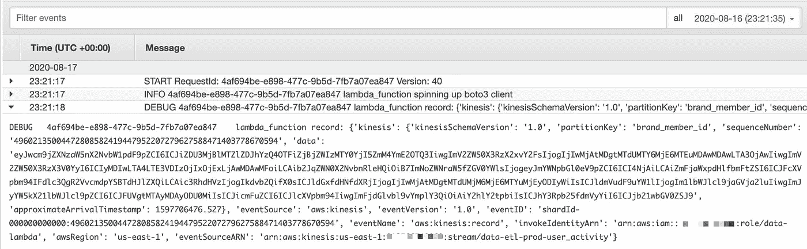

# 我如何为 AWS Lambda 函数编写有意义的测试

> 原文：<https://towardsdatascience.com/how-i-write-meaningful-tests-for-aws-lambda-functions-f009f0a9c587?source=collection_archive---------0----------------------->

## 让世界永远摆脱“断言真=真”的尝试。


作者图片

## **残酷的事实**

如果你要编写无意义的单元测试，更有可能掩盖错误而不是暴露错误，你最好干脆跳过这个练习。

好了，我说了。

您的时间是宝贵的，可以用在比实现空洞的覆盖率更好的事情上。

有效的代码测试一直是编程中的一个挑战性问题，AWS Lambda 等新工具似乎让开发人员在编写测试时表现最差。

我认为这主要是因为在本地镜像 Lambda 生产环境更加困难(或者至少不太直观)。结果，一些开发人员完全放弃了测试。

我知道是因为我自己做过，甚至是生产中的项目。相反，只有在代码已经部署到云中之后，测试才以集成的方式进行。

这是极其手工的，并且从长远来看浪费时间。

我在测试中看到的另一种方法的结果如下:

这是一个有测试覆盖需求但缺乏责任感的工程团队的明显标志。不需要解释以上是不允许的。

那么，我们如何着手将上面这个悲伤的文件转化成有意义的东西呢？

在我们开始测试 Lambda 代码之前，还有几个障碍。我们将逐一讨论这些问题，并确定如何最好地处理它们。一旦处理完毕，我们就可以随心所欲地测试 Lambdas 了！

*注意:为了清晰起见，我将在整篇文章中加入一些代码片段。但最后会有一个完整的工作代码示例可供参考。*

# 障碍# 1:Lambda 触发事件

每个 Lambda 函数都被调用以响应一个预定义的触发器，该触发器将特定的`event`数据传递给默认的`lambda_handler()`方法。有效测试 Lambda 函数的首要任务是创建一个真实的输入事件进行测试。

此事件的格式取决于触发器的类型。截至撰写本文时，有 16 种不同的 AWS 服务可以充当 Lambda 的调用触发器。

下面是我最常用的几个输入示例的代码片段:

将 test_sqs_event 传递给 lambda_handler。

样本输入事件的完整列表可在 [AWS 文档](https://docs.aws.amazon.com/lambda/latest/dg/lambda-services.html)中找到。或者，您也可以在部署后在 lambda_handler 代码中打印事件变量，并在 CloudWatch 日志中查看有效负载:



CloudWatch 日志中由 Kinesis 触发的 Lambda 事件示例|图片由作者提供

一旦你有了这个例子，简单地把它硬编码到你的测试文件中，如上所示，我们就有了一个奇妙的开始！

接下来…

# 障碍#2: AWS 服务交互

Lambda 函数几乎不可避免地会与其他 AWS 服务交互。也许您正在将数据写入 DynamoDB 表。或者向 SNS 主题发布消息。或者只是向 CloudWatch 发送一个指标。或者三者结合！

测试时，发送数据或改变生产中使用的实际 AWS 资源并不是一个好主意。为了解决这个问题，一种方法是建立并在以后拆除单独的测试资源。

一个更干净的方法是[模仿](https://devopedia.org/mock-testing#:~:text=Mock%20testing%20is%20an%20approach,behaviour%20of%20the%20real%20ones.)与 AWS 服务的交互。因为这是一个常见的问题，所以开发了一个包来解决这个特定的问题。更好的是，它以一种超级优雅的方式做到了这一点。

它的名字叫 [moto](https://github.com/spulec/moto) (模仿& boto 的组合词)，它的优雅源自两个主要特征:

1.  它在测试中自动修补和模仿 boto 客户端。
2.  它维护伪 AWS 资源的状态。

这看起来像什么？所有需要的是一些装饰魔术和一点设置！

假设我们从 S3 的 Lambda 中读取数据。我们可以不用在 S3 创建和填充一个测试桶，而是使用 moto 创建一个假的 S3 桶——一个看起来和行为完全像真桶的桶——而不用实际接触 AWS。

最棒的是，我们可以使用标准的 boto3 语法来做到这一点，如下面的示例所示，调用`create_bucket`和`put_object`方法:

使用@mock_s3 装饰器来修补 boto s3 客户端。

类似地，如果我们将数据写入 DynamoDB，我们可以通过首先创建一个假的 Dynamo 表来设置我们的测试:

使用@mock_dynamodb2 decorator 来修补 boto dynamo 资源。

这需要一点信任，但是如果测试通过，您可以确信您的代码也将在生产中工作。

## 好吧，但不是所有的都由 moto 负责…

没错，moto 并不是每一个 AWS API 都和*保持平价。例如，如果你的 Lambda 函数与 AWS Glue 交互，[moto](https://github.com/spulec/moto/blob/master/IMPLEMENTATION_COVERAGE.md)很可能会让你陷入困境，因为 Glue 服务只实现了 5%。*

这就是我们需要卷起袖子，通过[恶作剧](https://stackoverflow.com/questions/5626193/what-is-monkey-patching)来嘲笑我们自己的肮脏工作的地方。无论我们谈论的是与 AWS 相关的调用，还是你的 Lambda 可能触及的任何外部服务，比如向 Slack 发布消息，都是如此。

不可否认，这方面的术语和概念非常密集，所以最好通过一个例子来解释。让我们坚持使用 AWS Glue，并说我们迫切希望用以下代码列出我们帐户的 Glue 爬虫:

```
session = boto3.session.Session()
glue_client = session.client("glue", region_name='us-east-1')
glue_client.list_crawlers()['CrawlerNames']
# {“CrawlerNames”: [“crawler1”, "crawler2",...]}
```

如果我们不想让我们出色的测试的成功或失败依赖于`list_crawlers()`响应，我们可以像这样硬编码一个返回值:

monkey 修补 boto3 会话

通过利用 pytest[monkey patch](https://docs.pytest.org/en/stable/monkeypatch.html)fixture 的`setattr`方法，我们允许`lambda_handler`中的胶合客户端代码在运行时动态访问来自`MockBotoSession`类的硬编码`list_clusters`响应。

这个解决方案的好处在于它足够灵活，可以为任何 boto 客户端工作。

## 用固定装置整理

我们已经讨论了如何在 Lambda 测试中处理事件输入和外部依赖。我想分享的另一个技巧是使用 pytest [fixtures](https://docs.pytest.org/en/stable/fixture.html) 来维护一个有组织的测试文件。

到目前为止，代码示例已经显示了直接在`test_lambda_handler`方法本身中设置代码。然而，更好的模式是创建一个单独的`set_up`函数作为 pytest fixture，传递给任何需要使用它的测试方法。

对于最后的代码片段，让我们展示一个使用`@pytest.fixture`装饰器的 fixture 结构的例子，并结合所有内容:

用 fixtures、moto 和 monkeypatching 测试 Lambda 文件！

我们已经从文章开头的空测试文件走了很长一段路，不是吗？

提醒一下，这段代码测试了一个 Lambda 函数:

1.  触发 sqs 消息事件
2.  将消息写入发电机表
3.  列出可用的胶水爬虫
4.  最后读回写入 Dynamo 的数据，并断言最终值与输入匹配。

通过采用这些策略，你应该对测试一个从任何事件类型触发的 Lambda，以及一个与任何 T21 AWS 服务交互的 Lambda 充满信心。

# 最后的想法

如果你一直在努力测试你的 Lambda 函数，我希望这篇文章向你展示了一些有用的技巧来帮助你这样做。

虽然我们花了很多时间讨论常见问题以及如何*不应该*测试 Lambda，但我们没有机会讨论这个主题的相反但同样重要的方面——即*应该*测试什么，以及如何构建 Lambda 函数的代码以使其更容易测试。

我期待收到您的来信，并讨论您如何测试 Lambda 函数！

*感谢 Vamshi Rapolu 对本文的启发和反馈。*

## 其他参考文献

 [## 用于更好的 Python 测试的 Pytest 技巧

### Pytest 是我选择的 Python 测试框架。非常容易使用，并使测试看起来更好。在本文中…

阿尔瓦雷斯.我](https://aalvarez.me/posts/pytest-tricks-for-better-python-tests/) [](https://www.fernandomc.com/posts/serverless-testing-with-moto/) [## 使用 Moto 进行无服务器单元测试

### 无服务器开发通过将基础设施的责任转移给…

www.fernandomc.com](https://www.fernandomc.com/posts/serverless-testing-with-moto/) [](https://semaphoreci.com/community/tutorials/mocks-and-monkeypatching-in-python) [## Python - Semaphore 教程中的模仿和恶作剧

### 在这篇文章中，我将研究测试的基本部分——模拟。首先，我想在这里完成的是…

semaphoreci.com](https://semaphoreci.com/community/tutorials/mocks-and-monkeypatching-in-python) [](https://github.com/pytest-dev/pytest/issues/4576#issuecomment-449864333) [## 建议请求:monkey patch vs . mock . patch 问题#4576 pytest-dev/pytest

### 解散 GitHub 是超过 5000 万开发者的家园，他们一起工作来托管和审查代码，管理项目，以及…

github.com](https://github.com/pytest-dev/pytest/issues/4576#issuecomment-449864333)