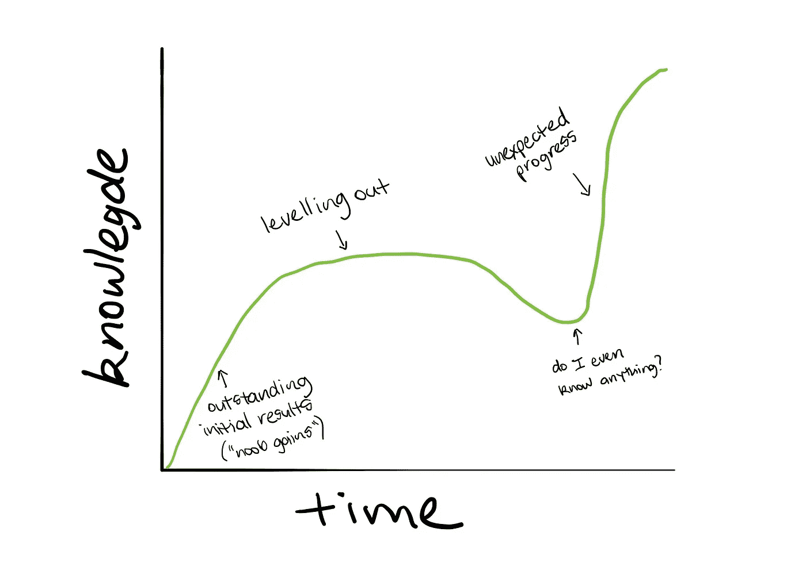
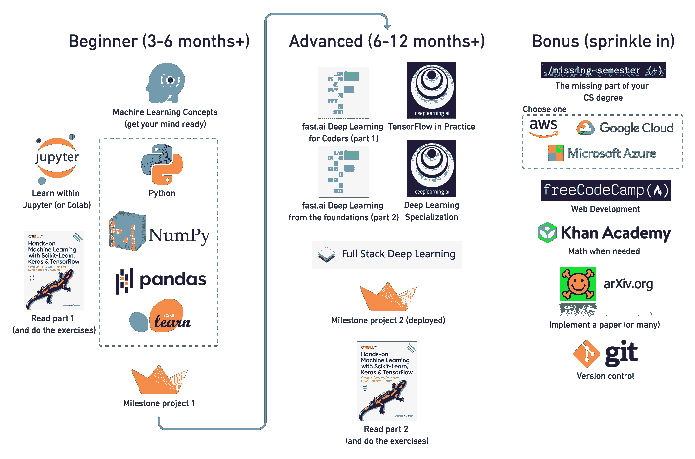

# 我如何重新开始学习机器学习(3 年后)

> 原文：<https://towardsdatascience.com/how-id-start-learning-machine-learning-again-3-years-in-55c52aaee52a?source=collection_archive---------2----------------------->

## 将工程师放回机器学习工程师

未管理的电缆，未修剪的颈毛——经典的“必须是工程师”给出。是的，这是一个 Colab 笔记本，屏幕中间有一张牛排的图片(即将到来的项目的一部分)。感谢山姆·伯克的照片。

我在地下，回到一切开始的地方。坐在我第一次遇见迈克的隐蔽咖啡馆里。在过去的 9 个月里，我一直在我的卧室里[学习，并决定走出洞穴。我一半担心早餐要付 19 美元(除非是圣诞节，周末开车去优步不是很赚钱)，另一半担心我在网上做的这项研究是否有意义。](https://youtu.be/eoLUlsBhjHo)

2017 年，我离开了苹果，试图建立一家网络创业公司，失败了，发现了机器学习，恋爱了，报名参加了一个零编码经验的深度学习课程，[给支持团队发邮件询问退款政策是什么](/how-im-learning-deep-learning-in-2017-part-1-632f4187ce4c)，没有获得退款，接下来的 3 个月，晚交了 4 到 6 天的作业，不知何故通过了，决定继续前进，并创建了自己的 [AI 硕士学位](https://dbourke.link/aimastersdegree)。

获得人工智能硕士学位 9 个月后，我遇到了迈克，我们一起喝咖啡，我告诉他我的宏伟计划；使用人工智能来帮助世界移动更多，吃得更好，他告诉我我应该见见 Cam，我见了 Cam，我告诉 Cam 我要去美国，他说为什么不留在这里，周四来，好的，周四去实习一周一天，两周后在 [Max Kelsen](https://maxkelsen.com/) 获得初级机器学习工程师的职位。

在担任机器学习工程师 14 个月后，我决定离开，自己尝试一下。我写了一篇关于我所学的[的文章](https://www.mrdbourke.com/12-things-i-learned-during-my-first-year-as-a-machine-learning-engineer/)，Andrei 找到了它，发邮件给我问我是否想建立一个[初学者友好的机器学习课程](https://dbourke.link/mlcourse)，我说是的，我们建立了这个课程，在 6 个月的时间里，我们有幸教授了 150 多个国家的 27，177 名学生。

把它加起来，你会得到大约 3 年。大约是我最初的本科学位应该花的时间(由于几次失败，我花了 5 年时间完成了 3 年的学位)。

所以就目前的情况来看，我感觉我已经完成了机器学习本科学位。

一些局外人可能会认为我对机器学习有相当多的了解，我确实知道，我知道的比我开始时多得多，但我也知道有多少我不知道。这就是有知识的东西。

*   ***1 年中:*** ***蜜月期，也称为 noob 收获期。你比初学者强多了，甚至可能有点过于自信(尽管这不是一件坏事)。***
*   ***2-年:哦，也许我并不像我想象中的那样好相。你的初学者技能开始成熟，但现在你意识到要变得更好需要一些努力。***
*   ***3 年期:哇，还有很多要学的阶段。不再是初学者，但现在你知道的足够多，意识到你有多少不知道的(我在这里)。***

学习是非线性的(不是一条直线)。你可能学习了整整一个月，却感觉毫无进步。然后不知从哪里，一个发现出现了。如果你想要一个我们如何愚弄自己的例子，你发现错误了吗？我好像还是忘了怎么拼写。

关于我已经说得够多了。这就是我的故事。你的可能是相似的，或者你可能从今天开始。

如果你正在开始，这篇文章是给你的。如果你是一个老手，你可以提供你的建议或者批评我的想法。

我们开始吧，好吗？

# 如果你是来要课程清单的，那你来错地方了

我上过很多在线课程。我甚至创造了我自己的。

你猜怎么着？

它们都是同一事物的混搭。

与其担心哪个课程比另一个好，不如找一个让你兴奋的老师。

学习任何东西，10%是物质，90%是对学习的兴奋。

你记得多少你学校的老师？

我的猜测是，不管他们教了什么，你记得老师本身比材料多。如果你记得这些材料，那是因为它们在你心中点燃了足够的火焰，足以将它烧进你的记忆。

然后呢？

涉猎一些资源，你足够聪明可以找到最好的。看看哪些能激发你的兴趣，让你坚持下去。

如果老师让你对一项技能感兴趣，学习这项技能并不是一件不愉快的事情。

# 工程师(和技术呆子)的诅咒

给我看一个宣称她使用最新最好的工具的工程师，我会给你看一个业余的。

我会坦白。我有罪。每一个新的闪亮的框架出来，每一个新的艺术模型，我都在上面。

我经常会发现自己试图发明一个问题来使用市场上的任何新工具。一个经典的本末倒置场景。

一个厨师的全部工作围绕着两个工具，火和刀的控制使用。

这体现在我收到的最好的编程建议中:学习语言，而不是框架。

如果你刚刚开始，一只手数不清你正在学习的工具的数量，那么你正在尝试使用太多的工具。

# “我想建造东西”

如果你想构建一些东西，比如 web 应用程序或移动应用程序，先学习软件工程，然后再学习机器学习。

太多的模型在 Jupyter 笔记本中生存和死亡。

为什么？

因为机器学习是一个基础设施问题(基础设施意味着围绕你的模型的所有东西，所以其他人可以使用它，你想要查找的热门新术语是 [MLOps](https://huyenchip.com/2020/06/22/mlops.html) )。

部署，就像把你的模型交到别人手里一样，是很困难的。

但这正是我应该在那里多呆些时间的原因。

如果我今天重新开始，我会找到一种方法来部署我建立的每一个半体面的模型(除了导致一个值得分享的实验的几十个实验)。

怎么会？

不要害怕让事情变得简单。人们可以与之交互的基本前端远比 GitHub repo 中的笔记本有趣。

不，真的，怎么会？

训练一个模型，用 [Streamlit](https://www.streamlit.io/) 围绕它构建一个前端应用程序，让应用程序在本地(在你的计算机上)工作，一旦工作，用 Docker 包装应用程序，然后将 Docker 容器部署到 Heroku 或另一个云提供商。

当然，我们在这里违反了使用一些过多工具的规则，但是完成几次会让你思考将你的机器学习模型放到人们手中是什么感觉。

部署您的模型将会提出当您的机器学习模型在 Jupyter 笔记本中生活时您不会提出的问题，例如:

*   推断需要多长时间(你的模型做出预测的时间)？
*   人们如何与它交互(也许他们发送给你的图像分类器的数据与你的测试集不同，现实世界中的数据经常变化)？
*   有人真的会用这个吗？

# “我想做研究”

建造东西变成了研究。您会希望您的模型工作得更快、更好。为了实现这一点，你需要研究做事情的替代方法。你会发现自己在阅读研究论文，复制它们并加以改进。

经常有人问我:“在开始机器学习之前，我应该了解多少数学？”

对此我通常会回答，“在我去跑步之前，我应该知道走多远？”

我并不真的这么说，我通常会更友好一些，说一些类似这样的话，“你能解决你目前正在处理的问题吗？”，如果有，你知道的够多了，如果没有，多学学。

顺便提一下，我刚刚订购了[机器学习的数学书籍](https://mml-book.github.io/)。接下来的一两个月，我会从头到尾读一遍。阅读了网上的免费文本后，它足以涵盖基础知识。

# 先技能后证书

我已经拿到了在线课程证书。

我发现越多的证书就意味着越多的技能。

我会以 1.75 倍的速度快速浏览讲座，直到结束，通过自动化考试，并在网上分享我的进步。

我为完成课程而优化，而不是创造技能。因为看别人解释比自己学习更容易。

傻逼。

事情是这样的。我为考试学的所有东西，我都忘了。我记得通过实验学到的一切。

现在，这并不是说在线认证和课程不值得你花费时间。课程有助于培养基本技能。但是做自己的项目有助于积累特定的知识(无法教授的知识)。

*   不要堆积证书，要堆积技能(通过分享你的工作来证明你的技能，稍后会有更多的介绍)。
*   不要做更多的课程，重复你已经做过的课程。
*   不要去寻找最新的工具，而是提高你对历史最悠久的工具的使用。
*   与其寻找更多的资源，不如重读你书架上最好的书。

学习(任何事情)都不是线性的，读两遍同一本书(只要它有一些内容)比增加更多内容要好。

我经常告诉我的学生，尽管当我看到有人分享毕业证书时我感到无比自豪，但我更希望他们*而不是*完成我的课程，取而代之的是获得他们需要的部分，并将其用于自己的工作。

在你*添加*东西之前，问问你自己，“我已经从我已经覆盖的内容中吸取汁液了吗？”

# 我将如何重新开始

首先，比任何资源都重要的是，要摆脱“我学不会”的心态。胡说八道。你有互联网。你可以学到任何东西。

互联网催生了一种新型的狩猎采集者。如果你决定接受挑战，你可以收集资源来创造你自己的道路。

下面的路径也没有设置。它被设计成指南针，而不是地图。你猜怎么着？这些都可以在网上找到。

先打些基础吧。

[2020 机器学习路线图](https://youtu.be/pHiMN_gy9mk)摘录。**注意:**本课程主要关注代码优先，尤其是 Python 代码。它还忽略了移动或嵌入式设备的开发。然而，它包含了足够多的资源来获得一个突出的领域的基础。

## 初学者之路(6-12 个月以上)

如果我重新开始，我会学习更多与机器学习交织在一起的软件工程实践。

我的主要目标是创造更多人们可以互动的东西。

机器学习的特定部分将是:

*   **机器学习概念** —了解机器学习可以并且应该用于什么样的问题。[的元素 AI](https://www.elementsofai.com/) 就是为此而来的。
*   **Python** —语言本身，以及机器学习特定框架，NumPy，pandas，matplotlib，Scikit-Learn。查看 [pythonlikeyoumeanit](https://www.pythonlikeyoumeanit.com/) 或其中每一个的官方文档。
*   **机器学习工具** —主要是 [Jupyter 笔记本](https://jupyter.org/)。
*   **机器学习数学**——[来自 3Blue1Brown](https://www.3blue1brown.com/essence-of-linear-algebra-page/) 或[可汗学院](https://www.khanacademy.org/)的线性代数，来自可汗学院的矩阵操纵和微积分或者只是看[机器学习用的数学书](https://mml-book.github.io/)。

除了这些，我还会经历:

*   [**freeCodeCamp**](https://www.freecodecamp.org/)—针对 web 开发技能。
*   [**CS50**](https://cs50.harvard.edu/college/2020/fall/)**+**[**CS50 人工智能**](https://youtu.be/_Kv4OFblJBU)——针对基础计算机科学和人工智能技能。

*   [**使用 Scikit-Learn 和 TensorFlow 进行机器实践学习第 1 部分**](https://www.amazon.com/gp/product/1492032646/) —涵盖了绝大多数最有用且经过时间考验的机器学习技术。

这里有很多。因此，为了巩固我的知识，我会使用 Streamlit 或我从 freeCodeCamp 学到的 web 开发技巧来构建 1-2 个里程碑项目。当然，这些会在 GitHub 上分享。

## 高级路径(6–12 个月以上/持续)

一旦我掌握了一些基本的机器学习技能，我会在它们的基础上做如下的事情。

*   [**fast . ai 的全部课程**](https://www.fast.ai/)——众多深度学习和机器学习技术的实际使用案例。观看一个 fast.ai 讲座变成了我们为一个客户构建的解决方案。
*   [**任意一个 deeplearning.ai 的课程**](https://deeplearning.ai/)——选一个最能激发你兴趣的。称赞 fast.ai 的实践方法与理论。
*   [**全栈深度学习课程**](https://course.fullstackdeeplearning.com/)——这是你要把你已经掌握的机器学习知识和你一直在学习的 web 开发知识捆绑在一起的地方。
*   复制一篇(或多篇)研究论文。
*   **包含 Scikit-Learn 和 TensorFlow 的机器学习实践书第 2 部分** — TensorFlow 侧重于概念，但概念可以连接到许多不同的应用。

同样，在经历了这些之后，我会通过建立一个人们可以互动的项目来巩固我的知识。

一个例子是由机器学习模型驱动的 web 应用程序。

## 示例课程

你为大学学位付出的最大的两样东西是责任感和组织结构。

好消息是，你可以自己得到这两个。

我创建了自己的人工智能硕士学位，作为一种责任和结构的形式。你可以做类似的事情。

事实上，如果我重新开始，我会遵循与 Jason Benn 的 [*更相似的东西，即我如何学习 web 开发、软件工程& ML*](https://jasonbenn.com/post/how-i-learned-to-code) 。它和我的类似，但是包含了更多的软件工程实践。

如果你能找到一个(小的)社区和其他人一起学习，那是一个很大的奖励。我还是不太清楚该怎么做。

一个十亿美元的想法是开发一个平台，人们可以创建自己的自我驱动课程，并与其他有类似经历的人互动。我在这里说自我驱动是因为所有的知识很大程度上都是自学的。讲师的角色更多的是激发、引导和挑战，而不是传授知识。

有人想建这个吗？

# 分享你的作品

学习读书就是吸气。建设和创造就是呼气。不要屏住呼吸。

平衡你对材料的消费和你自己的创作。

例如，你可能花 6 周的时间学习，然后用 6 周的时间将你的知识以一种共享工作的形式整合在一起。

你的分享作品就是你的新简历。

在哪里？

GitHub 和你自己的博客。需要时使用其他平台。对于机器学习项目，一台可运行的 Colab 笔记本是你的最低要求。

# 少了什么？

这里的一切都是以我自己的经历为依据的，我从营养学学位毕业，花了 9 个月的时间在我的卧室里学习机器学习，同时在周末开车去优步支付课程费用，找到一份机器学习工作，离开工作，建立一个机器学习课程。

我没有去编码训练营或大学学习技术技能的经历，因此无法比较两者的区别。

不过，既然我们在谈论代码和数学，它要么有效，要么无效。知道了这一点，你选择的材料的内容并不重要，重要的是你如何学习它。

# 本文的视频版本

我把过去三年的一些片段放在一起，并重复了几个要点，以配合这篇文章。并非所有的观点都是一样的，但它们都紧扣主题。

在 1000 天里，我设法长出了一些头发和胡须，并发展了编码技能。