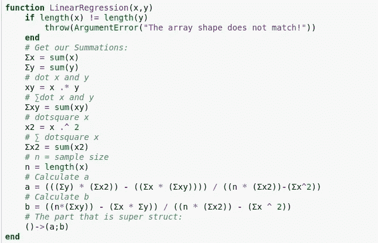
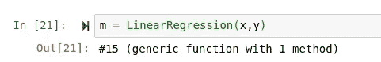
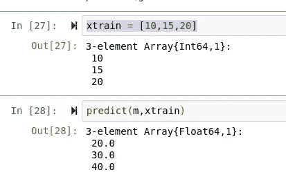
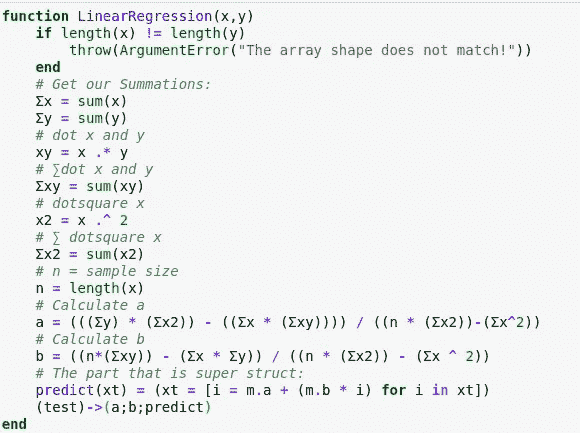
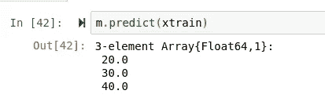
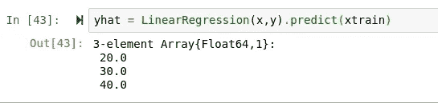

# 我如何使用面向对象的函数来进行机器学习

> 原文：<https://towardsdatascience.com/how-im-using-functional-oop-for-machine-learning-533c1d764628?source=collection_archive---------25----------------------->

## 我如何以及为什么将面向对象的范例应用于 Julia 机器学习。


> 这可能是你没有预料到的。

当我面对一些真正的第一世界函数式程序员的问题时，我经常发现自己错过了我最喜欢的面向对象编程语言的一些关键特性，主要是 C++和 Python。这应该是有意义的，因为我真的没有像在面向对象的保护伞下那样长时间呆在功能的保护伞下。不管我错过了哪些功能，我仍然热爱函数式编程范例，这是我一生中唯一的真爱，

> 朱莉娅


(src = http://julialang.org)

如果你还没听说过朱莉娅，首先，

> 我很抱歉

其次，Julia 是一种多范例统计编程语言。Julia 结合了 Python 等脚本语言的简单性和 C 或 Lisp 等编译语言的速度和多功能性。Julia 属于函数范式，尽管它支持各种类型的泛型，而且语言本身非常多变，这使得它非常通用。尽管 Julia 多才多艺，我还是要说，它肯定是面向统计程序员的。我这样推断是因为 Julia 不能被编译成可执行文件，事实上它是有功能的，而且典型的 Julia 用户都是某个领域的科学家。

通常，当一种语言被命名为“多范例”时，它仅仅意味着有一些通用的编程概念可能不与特定的范例相关联，但仍然可以以某种方式融入其中。然而，在这种特殊情况下，情况完全不同，因为

> 我基本上是在茱莉亚写类。

# 我为什么这么做

Be 在我解释我是如何做到的，或者用这种方式做事的好处之前，我应该先解释一下我为什么想做这样的事情。对于那些不熟悉的人，我是 Julia 的机器学习库的维护者，这个库叫做 Lathe。车床是一个包容性的包，旨在填补朱莉娅的 sklean-like 机器学习的空白，以及实现一些超级酷的神经元链和变压器。Lathe 的主要目标是成为一门伟大语言中如此高水平的最快和最容易的解决方案，许多对机器学习感兴趣的人都注意到了这一点。对于目前为止的模块来说，情况确实如此，而且只会越来越好。

## 车床:

[](http://lathe.ai/) [## 车床

### 车床使用更快的方法和简单的方法。使得包装快速、简单且轻便。许多工具和模型…

车床. ai](http://lathe.ai/) 

## 车床如何工作


我讨厌编程的一点是有多少包是令人费解的。对于车床，有一个通用的预测方法，它使用朱莉娅的真棒调度来指导传入的使用。这样做好处是速度快，更重要的是:

> 可量测性

当显式导入时，可以扩展和操作 Lathe 的功能，将扩展的潜力提高到前所未有的高度。任何最终用户都可以从车床导入某些方法，并使用车床预测方法来预测他们的答案，如果他们愿意，甚至可以修改车床功能。车床是模块化的，零件可以增加和减少。最重要的是，Lathe 提供了不断扩展的统计和预处理库，可以一站式满足您所有的 ML 需求，同时只需要两个依赖项:

*   Random.jl
*   DataFrames.jl

## 这些问题

鉴于 Julia 的速度和效率，Lathe 能够在计算单个函数中的每个值(包括权重和变量)时，比 Sklearn 等替代方法的性能高出八倍。这很好，因为这意味着使用车床，您可以跳过拟合，并在一行中进行预测，如下例所示:

```
using Lathe.models: predict, LinearRegression
using Lathe.preprocess: StandardScalar
yhat = predict(LinearRegression(StandardScalar(Xtrain),ytrain),xtest)
```

> 很酷，对吧？

它很酷，但也存在一些问题。每次调用 predict 方法时，都需要再次计算权重。这不仅牺牲了模型在每次加载时的准确性，而且还可能是密集的，特别是当车床模型需要部署到 Genie web 应用程序中时，就像本教程中一样:

[](/building-pipelines-with-lathe-0-0-7-unstable-in-julia-f7ba1850bde3) [## 在 Julia 中用车床 0.0.7 构建管道(不稳定)

### 数据科学的很大一部分是数据科学的一个子集，称为数据工程。数据工程(DE)包括…

towardsdatascience.com](/building-pipelines-with-lathe-0-0-7-unstable-in-julia-f7ba1850bde3) 

所以我的目标就是:保留车床所熟知的一行预测，同时找到一种方法在构建模型时进行计算。这是额外的挑战，试图想出一个伟大的方式来实现我在车床上工作的新的神经网络。让一个神经网络在每次被预测时都重新训练自己肯定不是最佳的。我大脑中被忽视的面向对象部分立即尖叫起来

> “初始化功能！”

但是当然，Julia 是一种函数式编程语言，所以没有类，也没有初始化函数，我们可以在任何时候创建类型…

> 还是有…？

# 我是如何做到的

## 笔记本:

[](https://github.com/emmettgb/Emmetts-DS-NoteBooks/blob/master/Julia/SUPER%20STRUCT.ipynb) [## emmett GB/Emmetts-DS-笔记本电脑

### permalink dissolve GitHub 是 4000 多万开发人员的家园，他们一起工作来托管和审查代码，管理…

github.com](https://github.com/emmettgb/Emmetts-DS-NoteBooks/blob/master/Julia/SUPER%20STRUCT.ipynb) 

当我在网上搜索并翻到了我可信赖的 Jupyter 笔记本上试图找到一个解决方案时，我在 Julia discourse 上发现了一个有趣的线索。这个线程是关于结构内部的函数的，这是一个很酷的特性，实际上你可以在 Julia 中使用正确的语法。它对我来说可能没什么作用，但它确实让我思考…如果我采用那个确切的概念，通过在函数内部创建一个类型并使用函数的开头作为初始化函数来改变它，会怎么样？以下是我跳到笔记本上测试的内容:

```
function Emmett(age)
    Age = age
    addAge() = (Age+=1)
    ()->(Age;addAge)
end
```

这个想法是，如果这可行，我们将在返回中得到一个保存数据“年龄”的类型。这不是很特别，但特别的是增加了构造类型 addAge 的属性，它实际上是一个方法。所以本质上，Python 中的等价内容应该是:

```
class Age:
    def __init__(self,age):
        self.age = age
    def addAge(self):
        self.Age = self.Age + 1
```

为了测试这一点，我首先构建了自己:

```
emmett = Emmett(20)
```

然后试着打印出我的年龄:

```
println(emmett.Age)
```

谢天谢地，它回来了:

```
20
```

接下来，我测试了这个功能:

```
emmett.addAge()
println(emmett.Age)
```

返回了:

```
21
```

> 太好了！

所以现在它工作了！像往常一样，我的第一反应是试图将同样的概念应用于简单的线性回归。我从 Lathe 中复制并粘贴了类型和预测函数，并删除了所有类型断言，结果如下:

## 功能

```
function pred(m,xt)
    # a = ((∑y)(∑x^2)-(∑x)(∑xy)) / (n(∑x^2) - (∑x)^2)
    # b = (x(∑xy) - (∑x)(∑y)) / n(∑x^2) - (∑x)^2
    if length(m.x) != length(m.y)
        throw(ArgumentError("The array shape does not match!"))
    end
    # Get our x and y as easier variables
    x = m.x
    y = m.y
    # Get our Summations:
    Σx = sum(x)
    Σy = sum(y)
    # dot x and y
    xy = x .* y
    # ∑dot x and y
    Σxy = sum(xy)
    # dotsquare x
    x2 = x .^ 2
    # ∑ dotsquare x
    Σx2 = sum(x2)
    # n = sample size
    n = length(x)
    # Calculate a
    a = (((Σy) * (Σx2)) - ((Σx * (Σxy)))) / ((n * (Σx2))-(Σx^2))
    # Calculate b
    b = ((n*(Σxy)) - (Σx * Σy)) / ((n * (Σx2)) - (Σx ^ 2))
    xt = [i = a + (b * i) for i in xt]
    return(xt)
end
```

## 类型

```
mutable struct LinReg
    x
    y
end
# (Our Normal type (mutable so we don't tear our hair out))
```

## 做线性回归

首先，我必须修改预测函数，以在最后切断 for 循环，并且只在从简单的线性回归公式返回包含 a 和 b 的数据的类型之前进行计算。



显然，正是在这一点上，我，一个 20 岁的男人，决定称之为超级结构。不确定名字是从哪里来的，但是我喜欢！幸运的是，这是一个非常简单的修改，只删除了一行，添加了一行。这很棒，因为这意味着在我老得不能用键盘打字之前，改变车床的每一个功能都不会花时间。接下来，我决定继续尝试构造类型，而不是创建预测函数。



> 这就是问题所在。

这种非常非传统的方法使得函数能够保存方法和数据，而不是结构(是的，这是一个很大的漏洞。)我将谈到为什么这是一个问题，而且是一个相当大的问题，这个问题可以被取消，但需要对车床进行大的更改，但只有在我们从这个东西中得到一个预测之后！


埃米特在他的笔记本上，2020 年(彩色)

最终有了一个保存我们需要插入斜率公式的值的“类型”后，我做了一个快速的完整性检查，非常快速地检查了 a 和 b 的值:

```
println(m.a)
println(m.b)
```

正如所料，它返回一个数字，所以我继续使用预测函数:

```
function predict(m,xt)
    xt = [i = m.a + (m.b * i) for i in xt]
    return(xt)
end
```

然后编造了一些数据，我可以用简单的比率来跟踪这些数据，以便很容易看出模型是否正常工作。

```
x = [5,10,15,20,25,30]
y = [10,20,30,40,50,60]
xtrain = [10,15,20]
```

看数据，一个准确预测的输出应该是[20，30，40]，果然…



> 有用！

# 好处

不用说，避免每次模型调用的再培训应该是优先考虑的事情。我认为写一个单独的完全可选的 fit 函数可能更好，但是这将需要更多的类型，并为所有类型分派，并且肯定会使整个系统变得不必要的复杂。此外，使用这种方法实际上会节省大量内存，因为数据不一定需要复制到这些新类型中(因为我们只是使用了权重，或者在本例中是 a 和 b)

# (大)反面

这种方法会破坏车床使用朱莉娅调度。为了使用分派，我们需要知道通过方法传递的结构的类型。假设这不是一个 struct，并且被赋予了一个随机的名字(至少据我所知是这样的)，那么在这个方法中使用 Julia 的 dispatch 是完全不可能的。不过，隧道的尽头有一线光明，因为这使得 predict 方法成为函数的一个属性成为可能，反过来，我们将能够做 Model.predict(parameters)。

因此，带着这个新发现的想法，我决定返回并修改函数，以包含预测方法:



果然，成功了！



> 但是一行程序呢？



> 美味的肉汁，让我兴奋不已！

# 结论

你真的每天都在学习新的东西，实验是编程世界的一半乐趣。我很想得到一些反馈，您更喜欢使用哪个版本，是带有可选 fit 的 dispatch，还是 hacky 面向对象的版本？我非常惊讶和兴奋，朱莉娅能够这样做，以满足我的需求，我希望这种发展是一个陡峭的优势超过以前的方式，如果它实际上是车床的未来！