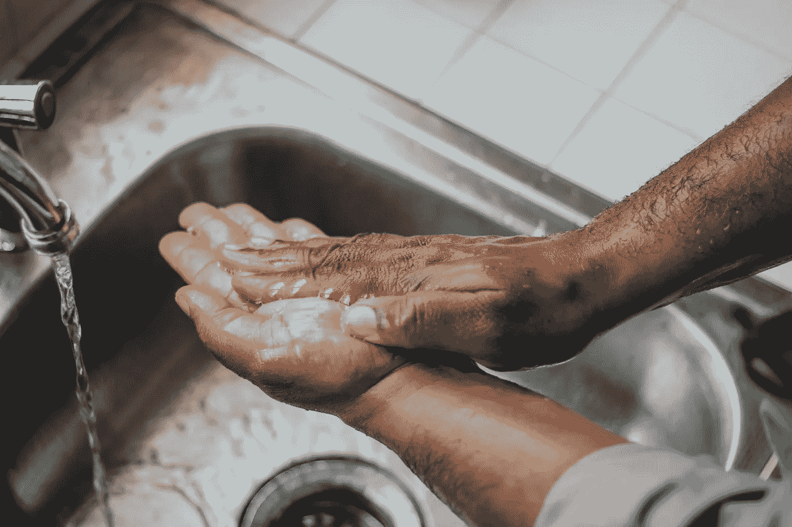
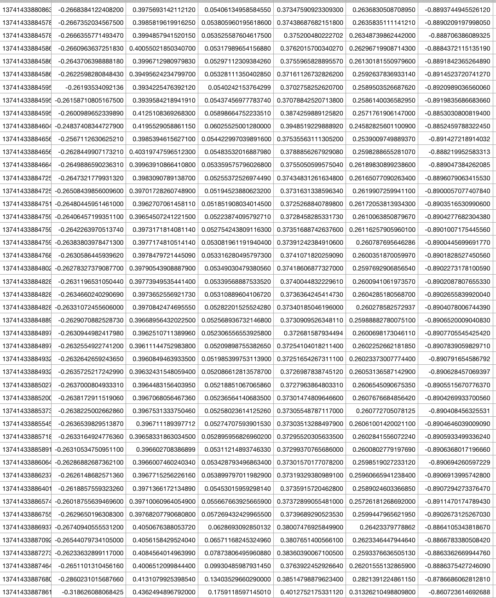
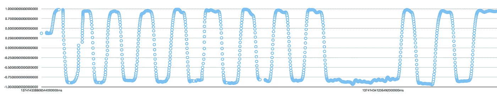
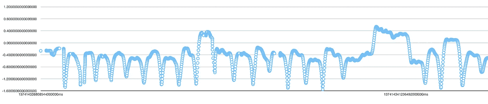
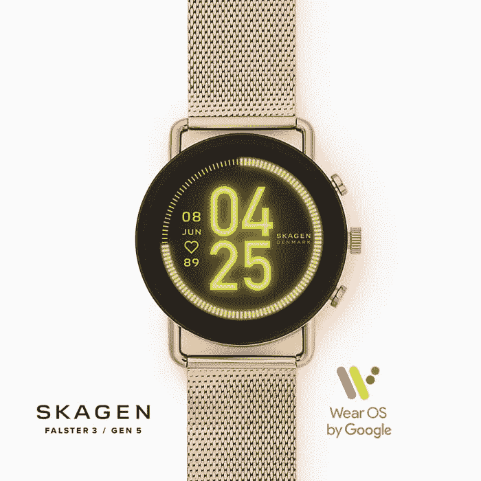
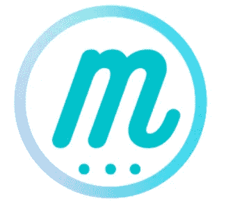

# 我如何使用智能手表传感器来防止面部触摸

> 原文：<https://towardsdatascience.com/how-im-using-smartwatch-sensors-to-limit-covid-19-infection-51abe04f81f9?source=collection_archive---------43----------------------->

卢克·切瑟在 [Unsplash](https://unsplash.com/s/photos/black-hand-watch?utm_source=unsplash&utm_medium=referral&utm_content=creditCopyText) 上的照片

## 一个值得追求的想法？

如果自 2020 年 2 月以来，你每天洗手的次数翻了两番，请举手。

我不能代表你在世界的哪个地方，但是在英国，人们非常重视洗手的频率。

已经有政府支持的关于洗手功效和一般手部清洁的教育活动。

消毒站在伦敦几个中心交通枢纽很常见。然而，公众仍不愿回归常态，这是可以理解的。

交通机构甚至正在考虑免费交通倡议，以鼓励公众冒险返回城市并使用交通设施。

照片由[梅丽莎·让蒂](https://unsplash.com/@meljeanty?utm_source=unsplash&utm_medium=referral&utm_content=creditCopyText)在 [Unsplash](https://unsplash.com/s/photos/hand-washing?utm_source=unsplash&utm_medium=referral&utm_content=creditCopyText) 上拍摄

但似乎不管我怎么洗手、消毒和擦洗；当我步入公共环境时，我仍然会小心翼翼地把手放在嘴巴、眼睛和鼻子附近。

自二月以来，有大量文章建议人们如何避免触摸自己的脸；见[此处](https://www.health.com/condition/infectious-diseases/coronavirus/tips-for-not-touching-your-face)，见[此处](https://health.clevelandclinic.org/how-to-actually-comply-with-the-dont-touch-your-face-advice-from-health-experts/)，见[此处](https://www.bbc.com/future/article/20200317-how-to-stop-touching-your-face)。

来自健康组织和专家的建议是有益的，值得纳入你的日常生活中，以形成一种习惯。社交距离、手肘问候和良好的手部卫生现在已经根植于我们的日常生活中。

但是如果你像我一样是人类，有时你会忘记。

我们忘记了要谨慎。

# 提醒我一下

在 [Unsplash](https://unsplash.com/s/photos/alarm?utm_source=unsplash&utm_medium=referral&utm_content=creditCopyText) 上由[尹新荣](https://unsplash.com/@insungyoon?utm_source=unsplash&utm_medium=referral&utm_content=creditCopyText)拍摄的照片

白天，我是一名计算机视觉工程师，晚上，我修补各种形式的技术。

我晚上的大部分时间不是写关于人工智能的话题，就是*埋头做兼职项目。*

不管什么时候，我的智能手表都会振动。消息、事件、通知和警报都会在我的智能手表设备上触发轻微的轻推，仿佛在尖叫"*注意！*”。

在与我的一些聪明的朋友讨论过 over Zoom 之后，我建议修改一些代码，创建一个智能手表应用程序，它可以提醒我停止触摸我的脸，或者至少提醒我小心面对面的接触。

**[**想法**](https://play.google.com/store/apps/details?id=com.moretion.myapplication) **相当简单。如果我的手表臂靠近或接触到我的脸，我的智能手表设备会发出轻微的震动。****

**我的目标是有一种提醒的形式，它不依赖于我不断保持警惕和谨慎的能力。**

# ****技术****

****

**照片由[克莱门特 H](https://unsplash.com/@clemhlrdt?utm_source=unsplash&utm_medium=referral&utm_content=creditCopyText) 在 [Unsplash](https://unsplash.com/s/photos/code?utm_source=unsplash&utm_medium=referral&utm_content=creditCopyText) 拍摄**

**智能手表挤满了传感器、加速度计、陀螺仪、气压计、GPS 等。**

**这些传感器接收的数据提供了关于你的身体状态、环境和运动的数字信息。**

**智能手表检测运动的能力对大多数读者来说并不奇怪，尤其是当智能手表通常会告诉你一些信息，如心率、步数、睡眠时间、水合程度等。**

**使用一些软件魔法和我生疏的应用程序开发知识，我设法组装了一个实际的智能手表应用程序，当我触摸我的脸或正要触摸时，它可以给你一个轻推。**

***我称之为* [*Moretion*](http://moretion.app/) *(婚姻之间的话多而动)。***

**让我解释一下它是如何工作的。**

## **使用启发式**

**智能手表传感器不断喷出数字数据。**

**下面是来自传感器的数字数据的一个子部分的图像。**

****

**只是一堆数字。(图片由作者提供)**

**上图中的数字可能对你来说没有多大意义，但是当我们从这些数字中绘制一些图表时，我们得到的图像似乎提供了更多的意义。**

****

**绘制加速度计数据**

****

**陀螺仪数据绘制**

**你可能会在上面的图表中注意到一些重复的模式——请随意再看一遍。**

**你所观察到的是我将手移向和移离我的脸很多次。**

****为了检测我的手何时将要或已经触摸到我的脸，我只需选择一个阈值，并让智能手表在达到或超过阈值时振动。****

**这个简单的想法非常有效，我将很快讨论更多的发现，但让我与你分享这个项目的另一个有趣的方面。**

## **使用机器学习**

**如果我不使用一点我的机器学习知识，我就不会公正地做这个实验项目。**

**大多数机器学习应用程序或“AI”都是由神经网络驱动的。一群聪明的研究人员在某种程度上用一些巧妙编写的算法复制了我们大脑中神经元之间的相互作用。**

**神经网络是很好的识别模式，人类也擅长于此；这就是为什么你会很快注意到上面图片中图表的振荡模式。**

**递归神经网络(RNN)用于检测和预测时态数据中的模式，就像前面显示的图像中的数字一样。**

**时态数据通常是按顺序构造的，这使得 rnn 可以很容易地从数据中提取特征——还有更多的内容，但超出了本文的范围。**

****未来版本的 Moretion 应用程序将实现这些神经网络。Moretion 将基本上能够预测手臂到面部的移动，并在你完全完成移动之前给你发送一个轻推。****

# **结果**

****

**[Skagen 的 Falster 3](https://www.skagen.com/en-us/falster3-learn-more)**

**我一直在谷歌[搭载 Wear OS 的 Falster 3 智能手表](https://www.skagen.com/en-us/falster3-learn-more)上试验性地使用 Moretion。当我在伦敦地铁、火车、公园等公共场所时，我通常会打开这个应用程序。**

**毫无疑问，我的智能手表提醒了我，我应该限制摸脸的次数。有时我甚至会忘记我已经打开了 Moretion，当我的智能手表发出' *bzzz bzzz'* 的轻推时，我会大吃一惊。**

**如果你有一个支持 Wear OS 的智能手表，那么如果你好奇的话，你可以试试 Moretion。该应用程序仍处于试验阶段，我将很快对其进行大量更新。在这个时间点上，它是没有形状或形式的依赖方法，你应该始终保持良好的手部清洁。**

**你可能已经注意到了 Moretion 的一个问题。**

**Moretion 只轻推佩戴智能手表的腕臂。当你用另一只手臂触摸你的脸时，你没有受到轻推或振动。**

**如果有足够多的人对这个项目感兴趣，我将很快探索如何解决这个问题。我已经有一些想法了。**

# **未来的发展**

**在这方面还有很多工作要做。**

**以下是我将探索的几个工作和研究领域:**

*   ****电池优化:**从多个传感器读取数据对电池来说非常昂贵。我已经将 Moretion 的运行时间限制在几个小时，并使应用程序能够作为后台进程运行。我可以利用很多电池优化技术来降低电池消耗。**
*   ****苹果，Fitbit:** 我也在开发苹果版的 Moretion，通过一些额外的工作，Fitbit 版本肯定可以开发出来。我开发了一个能在苹果和 Fitbit 智能手表上运行的 Moretion 版本。**
*   **NHS(国民健康服务)批准:在经历了一些广泛的研究工作和调查后，如果使用 Moretion 来限制面对面接触的数量有好处，那么我将探索使它成为官方批准的 NHS 应用程序的可能性。这完全取决于研究工作和更多的使用结果。**
*   ****研究/调查**:检验 Moretion 智能手表应用的有效性需要付出相当大的努力。这项工作将涉及用户在使用智能手表应用程序时的测试和监控。**

# **信息和联系方式**

****

**[更多标志](https://moretion.herokuapp.com/)**

## **如果你有一个带 Wear OS 的智能手表，请随意试用 [Moretion](https://play.google.com/store/apps/details?id=com.moretion.myapplication) 。**

**[**联系我**](mailto:richmond@moretion.app) **讨论其他询问或您的体验。****

**在 [LinkedIn](https://www.linkedin.com/in/richmondalake/) 上与我联系。**