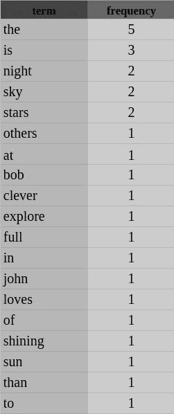
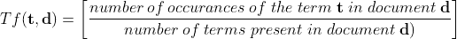
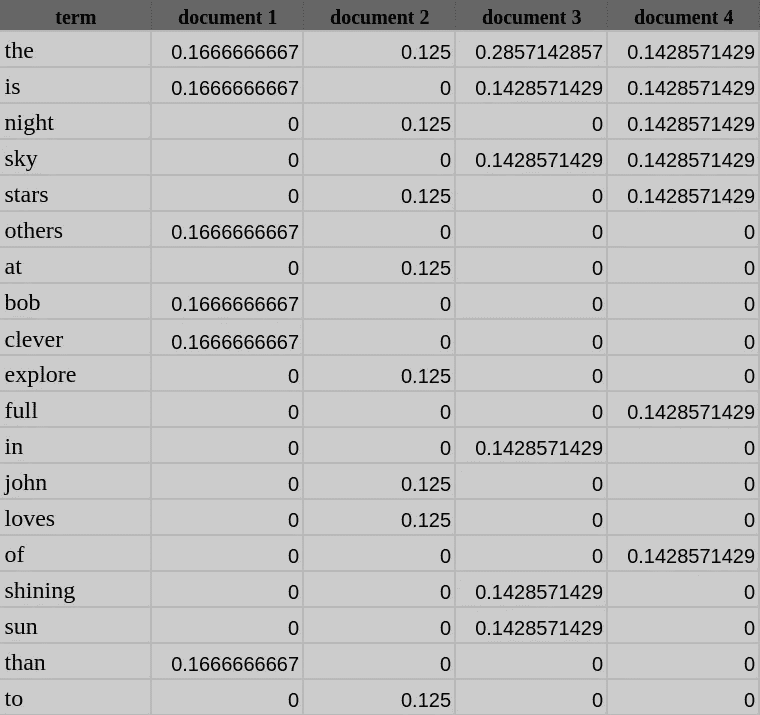
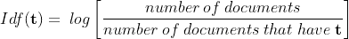
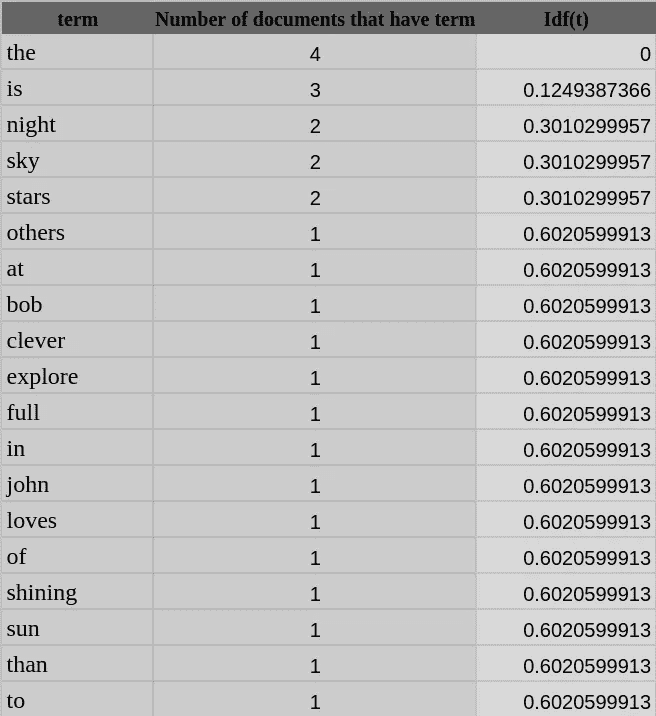
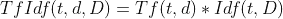
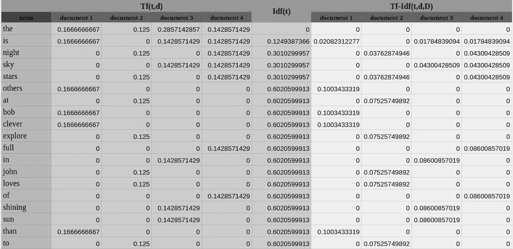
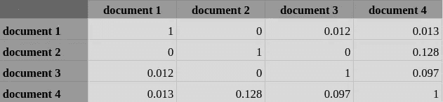

# 你的文本数据中的单词有多重要？Tf-Idf 答案…

> 原文：<https://towardsdatascience.com/how-important-are-the-words-in-your-text-data-tf-idf-answers-6fdc733bb066?source=collection_archive---------15----------------------->

作者图片

我们人类经常处理文本数据。文本数据主要来源于语言。语言技能是我们在婴儿时期就开始练习的👶。口语大多被转换成音频形式的数据🔉，文本📃或者很少作为图像🔡。从技术角度来看，文本数据可能以不同的形式出现，如新闻文章📰，书籍📚，网页🌐，评论💬、软件代码🖥、计算机系统日志等等。不管是什么形式，这些文本数据都有自己的结构特征，这些特征是由语言(或语法)定义的。此外，在文本数据中存在语义特征(含义),这可以导致识别甚至跨语言的文本片段的相似性。随着科学领域中自然语言处理(**N**L 语言处理( **NLP** )和信息处理(**I**R**R**IR)的发展，文本表示和文本相似性成为潜在的研究领域。文本表示主要用于，

1.  机器翻译—自动将文本从一种语言翻译成另一种语言。
2.  文档聚类——基于结构和/或语义相似性对文本文档进行分组。
3.  主题检测——识别大型文本语料库的主题。
4.  文本摘要。
5.  问题回答。

以及更广泛的领域，如信息检索和文档排序。

# 代表权问题…

即使一些与文本数据相关的用例如文档聚类可以通过考虑数据的文本相似性(通过使用[编辑距离](https://en.wikipedia.org/wiki/Edit_distance#:~:text=In%20computational%20linguistics%20and%20computer,one%20string%20into%20the%20other.)、 [Jaccard 距离](https://en.wikipedia.org/wiki/Jaccard_index)等)来实现。)，对于自然语言处理( **NLP** )和信息检索(IR)中最复杂的用例，文本数据使用向量表示。这是因为大多数机器学习算法都很聪明，可以处理数字数据🧮.例如，尽管图像被视为平面中颜色组合的集合，但默认情况下，它们被表示为包含所有图像信息的数字矩阵，这些信息很容易被计算机处理。但是，在文本数据的情况下，识别有意义的表示并不那么简单。

过去引入了几种文本表示技术。其中有[一键编码](https://en.wikipedia.org/wiki/One-hot)、 [n-gram 模型](https://en.wikipedia.org/wiki/N-gram)、[词袋模型](https://en.wikipedia.org/wiki/Bag-of-words_model)和[神经词嵌入](https://en.wikipedia.org/wiki/Word_embedding)。这些技术各有优缺点。更好的做法是挖掘您的用例，并选择最佳选项。重要的是要理解，表示是您将文本数据呈现给算法的方式。因此，您必须注意选择最合适的数据表示技术，以便您的模型看到它应该看到的数据。

# 词汇袋👜模型

一种流行的文本表示技术是**B**ag-**o**f-**W**ords(**BoW**)模型。在单词包中，模型文本或文档通过对单词的*包*(无序集合)进行建模来表示。这个*单词包*不算单词在文中的位置、语法或者结构。它只是统计单词在目标文本中的出现频率，并将这些单词放入一个*包中。*词在文本(句子或文档)中出现的频率是用于词袋模型的特征。

让我们看看如何为文本语料库创建一个单词包模型。

考虑以下文档集( **D** )(这里，我们将句子作为文档)。我们的目标是生成一个数字表示📊对于这些文档中的每一个。

> 鲍勃比其他人都聪明
> 
> 约翰喜欢在晚上探索星星
> 
> 文件三:天空中阳光灿烂
> 
> **文件四**:夜空布满了星星

## 第一步:清理✂️，预处理数据

在进行表示建模之前，我们应该明白**原始数据**总是**脏的**，我们必须在使用之前清理它们。

首先，我们将所有的单词都小写，以避免将不同大小写的相同单词识别为不同的单词。例如，语料库中的单词“sky”和“Sky”应该被理解为一个单词。

**注意**:我们可以使用一些其他的文本前置技术，比如词汇化(将单词转换成它们的基本形式(" shine "、" shining ' "、" shined "-">" shine ")，去除停用词，比如" is "、" the "和" in "，等等。但是为了简单起见，为了强调 **Tf-Idf** 中 **Idf** (稍后将详细讨论)组件的威力，我们只坚持使用小写字母。

## 第二步:创建单词包

完成前面提到的预处理步骤后，我们的四个文档将是:

> 鲍勃比其他人都聪明
> 
> 约翰喜欢在晚上探索星星
> 
> **文件 3** :天空中阳光灿烂
> 
> **文件四**:夜空布满星星

现在，我们可以创建我们的 ***包*** 👜单词如下。

所选语料库的单词包

# 文本表示的 Tf-Idf

**Tf-Idf**(**T**erm**f**frequency—**I**nverse**d**document**f**frequency)是一个词袋模型，它在捕捉文本中最重要的词方面非常强大。 **Tf-Idf** 背后的概念可以通过术语频率( **Tf** )和逆文档频率( **Idf** )来理解。从 **Tf** 和 **Idf** 表示生成的集合表示被称为 **Tf-Idf** ，它是一种强大的表示文本数据的方式。让我们进入 **Tf-Idf** 背后的理论。

## 术语频率(Tf)

顾名思义，术语频率给出了文档中出现的与 BoW 相关的术语的计数。术语频率是术语 **t** 和文档**d**的函数

我们现在可以为每个文档生成一个 **Tf** 向量。每个 **Tf** 向量是**弓**的尺寸(在我们的例子中是 19 的尺寸)。如果目标文档在包中没有术语，则该维度将变为零，因为上述等式的分子变为零。下表中的文档列表示每个文档的 Tf 向量。

关于单词包中的术语(t)的文档(d)的 Tf 表示。

我们可以看到，这个 **Tf** 表示给出了术语在文档中相对于给定的 **BoW** 的出现程度。但是这足以决定两个文档之间的相似性吗？让我们看看…考虑一下**文件 1** 和**文件 2** 的 **Tf** 表示。我们可以看到，只有术语**和**在这两个文档中是通用的。因此，我们的向量空间的“**”-维度将显示**文档 1** 和**文档 2** 具有相似度(即使所有其他维度将显示这两个文档不相似)。这是真的吗？实际上不是。它们有完全不同的意思。这是作为文本文档的数字表示的术语频率的缺点。词频并不强调文字在文本中的重要性。这就是 Idf 发挥作用的地方。**

## **反向文档频率(Idf)**

**逆文档频率( **Idf** )是一个术语相对于文档语料库的唯一性的度量。这里的想法是，出现在语料库的大多数文档中的术语不会向目标文档添加特殊信息。逆文档频率是为您的 **BoW** 中的每个术语定义的。**

****

****Idf** 能够在 **BoW** 中强调术语的独特性或重要性。如果一个术语出现在大多数文档中，它就不是唯一的，并且 **Idf** 等式的分母会更大。因此，分数的对数将更小，Idf 值也将更小。一个独特的或罕见的单词将出现在较少数量的文档中，并且其 **Idf** 值将较大。让我们看看我们的**弓**的 Idf 值是多少。**

****

**BoW 中术语的 Idf 值**

**我们可以看到，*项的 Idf 变为 0。这是因为它出现在所有文档中，并且没有给目标文档添加独特的含义。同样，术语 ***与*** 的 Idf 权重也很低。我们可以看到，像 ***bob、explore*** 这样在语料库中只出现在一个文档中的单词，由于其唯一性，具有更高的 **Idf** 值。***

***请记住，像 ***、【of】、*、**这样的术语并没有给文件**增加特定的含义。**尽管我们在这里发现它们是独一无二的，但它们并不存在于现实世界中。为了简单起见，我们选择将这些术语( ***the，in，of，to*** 和 ***是*** )保留在 **BoW** 中。但是在实际用例中，我们在前置阶段省略了这种*停止字*，正如我前面提到的。***

# ***天哪…！那么什么是 Tf-Idf 呢…***

***对…我们已经了解了 Tf-Idf 背后的理论。Tf-Idf 无非是 **Tf(t，d)** 和 **Idf(t，D)** 的乘积。***

******

***我们可以通过上面的等式为每个文档生成 **Tf-Idf** 矢量表示，如下表所示。***

******

***使用 Tf 和 Idf 计算的 Tf-Idf 表示。***

***所以，实际上， **Tf-Idf 可以通过对所选语料库**的词唯一性加权的词频率来理解。在目标文档中几乎随处可见而在语料库中的其他文档中找不到的术语在目标文档中具有高度的唯一性，因此在该文档中具有高 Tf-Idf 权重。***

# ***有点文字相似…***

***为了理解 Tf-Idf 作为文本表示的用法，让我们检查一下语料库中文档之间的相似性。这里，我们要考虑[余弦相似度](https://en.wikipedia.org/wiki/Cosine_similarity\)。下表显示了每个文档对之间的余弦相似性。***

******

***文档间的余弦相似度。***

***通过观察余弦相似性，我们可以观察到**文档 1** 和**文档 2** 不再相似，因为 Idf 处理了在每个文档中出现术语*的问题。但是我们可以看到**文档 1** 和**文档 3** 有 0.012 的相似度。这是因为它们有一个共同的术语 ***就是*** 。尽管这些文档之间存在相似性，但 Tf-Idf 已设法通过 **Idf** 加权来降低相似度。**文件 1** 和**文件 4** 的相似性表现相同。**文档 3** 和**文档 4** 都是关于 ***天空*** 的，因此相似度稍高(0.097)。**文件 2** 和**文件 4** 是关于 ***星星*** 和*夜晚* 的。这种相似性反映为 0.1288，这是所有相似性中最高的。****

****我们可以清楚地看到，Tf-Idf 在将文本数据表示为向量方面非常有用，它有可能强调单词的重要性，并相应地对独特和信息丰富的单词进行加权。****

****Tf-Idf 有几种变体，可以在各个方面对其进行改进。你可以通过跟踪[这个](https://en.wikipedia.org/wiki/Tf%E2%80%93idf)找到它们。****

****我希望你通过阅读这篇文章了解了 **Tf-Idf** 的基本结构和用途。****

# ****Tf-Idf 的缺点****

****尽管 Tf-Idf 是如此强大的表示文本数据的技术，它仍然是一个 **BoW** 模型。因此，Tf-Idf 不计算文档中单词的位置。这可能会导致 Tf-Idf 对您的文本数据给出错误的解释。****

****举个例子，****

> *******文献 1*** :鲍勃比爱丽丝聪明****
> 
> *******文件二*** :爱丽丝比鲍勃聪明****

****具有相同词频的相同单词集({ 'bob ' '，' is '，' clever ' '，' than ' '，' alice'' })，但它们给出不同的含义。但是，Tf-Idf 作为 BoW 文本表示模型，将为两个文档提供相同的表示。在 Tf-Idf 模型中可以看到的另一个主要缺点是它消耗了大量的内存和处理能力。****

****有一些文本表示技术，如神经嵌入，在生成向量表示时计算单词的位置。我们将在另一篇文章中讨论它们。****

****在那之前，祝你阅读愉快...😀****