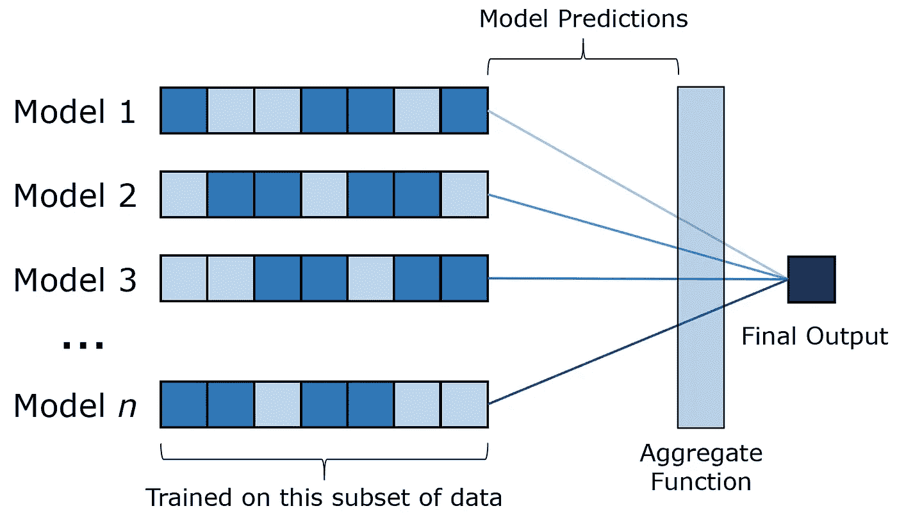
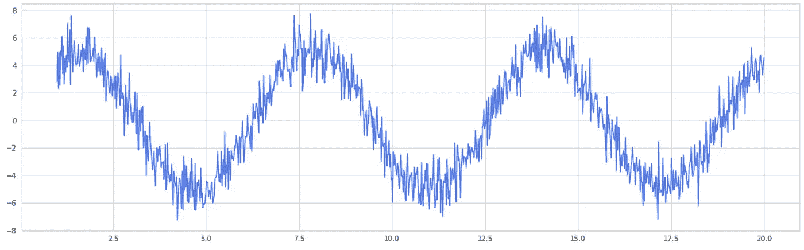
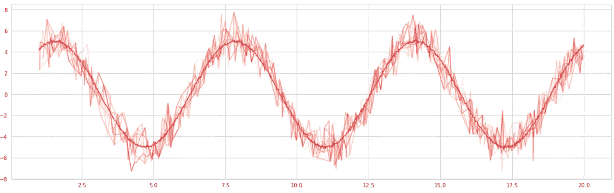
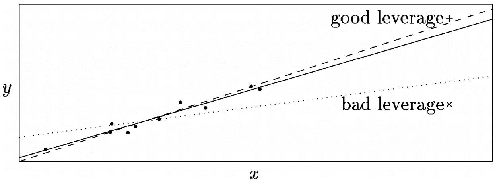

# 注入随机性如何提高模型精度

> 原文：<https://towardsdatascience.com/how-injecting-randomness-can-improve-model-accuracy-11cdc04b3eeb?source=collection_archive---------49----------------------->

[来源](https://unsplash.com/photos/m4sGYaHYN5o)。图片免费分享。

## 自举聚合的魔力

装袋，或者说 **b** ootstrap **ag** 种族隔离，是机器学习中的一个独特想法。这个概念假设，在不增加任何新数据或知识的情况下，人们仍然可以简单地通过增加随机因素来提高模型的准确性。这个想法是训练一个模型集合，其中每个模型都根据数据的子集进行训练，然后汇总每个模型的预测。

因为每个模型都是在随机选择的大多数数据子集(通常在 60%到 75%之间)上训练的，所以数据中显然会有明显的重叠。然而，根据这个简单的想法，像 Random Forest 这样的 bagging 模型几乎普遍比它们的非 bagging 模型表现得更好，在这种情况下就是决策树。然而，没有添加数据——现有数据只是简单地结合了随机性——那么简单的装袋概念怎么会导致模型性能如此之高呢？

作者创建的图像。

首先，重要的是要对装袋减少方差这一事实有一个直观的理解。虽然在少数情况下这不是真的，但一般来说这是真的。作为一个例子，看看从 *x* 的正弦波-值 0 到 20，随机噪声来自正态分布。显然，这是非常嘈杂的数据，像决策树这样的高方差算法可能会陷入高度的随机性中，因此泛化能力很差。

作者创建的图像。

另一方面，考虑一个袋装模型。为了产生这种可视化，绘制了十条独立的曲线，每条曲线包含随机选择的百分之二十的原始数据。然后将这些点相对于其周围点的值进行平均，以形成“袋装”曲线，这大大降低了方差和噪声。

作者创建的图像。

显而易见的是，由于随机性，自举人为地“消除”了巨大的差异。当随机性加入到系统中时，正随机性和负随机性相互抵消。通过数据的重复重叠，高方差被剔除，更清晰的关系被支持和揭示。

由于模型的均方误差(MSE)等于 *v* + *b* ，其中 *v* 代表方差， *b* 代表偏差，自然，如果方差降低，MSE 也会降低。在某些情况下，当方差降低时，偏差会增加。由于 MSE 权重的计算是偏差的平方，而方差只是偏差本身，在这种情况下，装袋实际上会降低性能。

然而，在大多数情况下，减少方差而不相应增加偏差是可能的。这可以用正弦波的例子来说明，其中方差减小了，但是关系只是变得更清楚，而不是变得更有偏差。

尽管对装袋成功的方差减少的解释是直观的并且被广泛相信，但是它还没有被经验证明是尽可能准确的。bootstrap aggregating 成功的另一个解释是，打包等于影响力。这个想法的中心概念围绕着*杠杆*的想法，这是一个点对模型有多大影响的度量。因此，高杠杆点的存在会显著影响模型，例如，异常值对线性回归系数的影响。

[来源](http://citeseerx.ist.psu.edu/viewdoc/summary?doi=10.1.1.40.1298)。图片免费分享。

如虚线回归所示，不良的杠杆会使模型发生负向倾斜，而良好的杠杆可以稳定该线。不良杠杆的问题是，即使一条线不适合大多数点，指标也会因为不良杠杆的影响而改善。

在大多数情况下，杠杆有一个坏的影响，衰减杠杆可能会减少模型中不必要的方差。一个不稳定的估计值可以被定义为一个预测值，其中有许多非常有影响力的点，而自举具有降低整体杠杆的效果。当大多数杠杆点都有负面影响时，这是积极的。在某些情况下，已经表明装袋可以提高性能，即使在数学上方差没有减少的情况下，当大多数杠杆点对性能为正时也是如此。

因此，差异只是降低杠杆的下游效应。Bagging 工作得如此之好，是因为它通常通过增加随机性来减少影响，这是用正弦波观察到的。这也是为什么在杠杆点普遍影响不大的情况下，装袋表现不佳的原因。这是一个强大的概念，主要应用于基于树的方法，因为它们往往有许多 bagging 试图减少的高影响力的杠杆点。在许多方面，bagging 解决了树方法的记忆和过拟合问题，同时保留了它的许多优点。

# 如果你喜欢，

你可能会喜欢我的其他一些机器学习文章。

 [## 真正的人工智能:理解外推 vs 概括

### 机器学习模型不需要智能，它们的大多数应用都需要执行任务，如…

medium.com](https://medium.com/swlh/real-artificial-intelligence-understanding-extrapolation-vs-generalization-b8e8dcf5fd4b)  [## 每个人的 GANs

### 革命性人工智能概念的直观解释

medium.com](https://medium.com/analytics-vidhya/gans-for-everyone-an-intuitive-explanation-of-the-revolutionary-concept-2f962c858b95)  [## 批量规范化:深度学习的最大突破

### 它是如何工作的——又是如何如此有效的？

medium.com](https://medium.com/analytics-vidhya/batch-normalization-the-greatest-breakthrough-in-deep-learning-77e64909d81d)