# Instacart 如何利用数据科学解决复杂的商业问题

> 原文：<https://towardsdatascience.com/how-instacart-uses-data-science-to-tackle-complex-business-problems-774a826b6ed5?source=collection_archive---------6----------------------->

斯科特·沃曼在 [Unsplash](https://unsplash.com?utm_source=medium&utm_medium=referral) 上的照片

## 买杂货从来没有这么复杂

Instacart 是一半美国家庭用来从他们最喜欢的杂货店如 Costco，Wegman's，Whole Foods，Petco 等购买食品的公司，甚至不用离开房子。

其独特的商业模式使其成为一个迷人的案例研究，研究如何在行业中使用数据科学来解决棘手的商业问题。

作为一名数据科学家，您已经学习了算法和技术，但是您如何将它们应用到企业界呢？在企业界，它们可能会带来或损失数百万美元。在本文中，我们将了解 Instacart 如何使用数据科学方法来解决其极其复杂的后端系统背后的进口业务问题。

# Instacart 的商业模式

首先，介绍一下 Instacart 是如何运作的。

Instacart 做了很多工作来确保客户的用户体验是流畅的。很简单。

1.  下载 Instacart 应用程序。
2.  选择一家商店。有很多商店——全食超市、好市多超市、Petco 超市、威格曼超市等。
3.  从商店的库存中，选择要添加到购物车中的商品。
4.  选择一个一小时的时间窗口，在此期间，您希望您的杂货可以在下一个小时内送达。

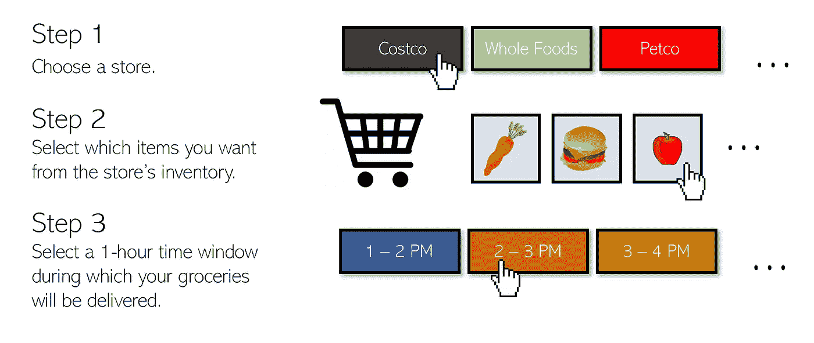

由 Andre Ye 创作的图形。

不到一小时，你的杂货就送到了你家门口。UX 非常简单，也很容易导航。

购物者的体验稍微复杂一点。

1.  在 Instacart 应用程序中，购物者正在轮班，当订单进入系统时，他们有机会确认订单。
2.  他们开车到该订单的商店，并出示了您想要购买的商品列表。
3.  当他们找到商品时，他们拿起商品，并扫描条形码以确保它是你想要的产品的准确版本。
4.  他们会结帐后开车到你的地址给你送货。

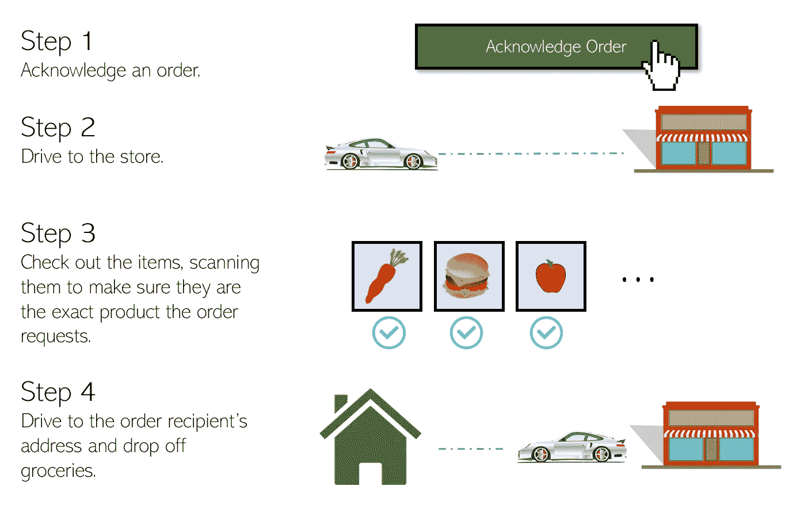

由 Andre Ye 创作的图形。

这个市场有两个明显的方面——购物者和客户。然而，Instacart 实际上是一个*四边*市场(你能说出另外两个吗？).

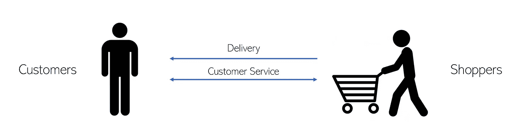

双边市场？由 Andre Ye 创作的图形。

Instacart 还与产品广告商和商店合作。四方中的每一方都以某种方式与其他三方互动。每一个箭头都是数据科学加强它的机会。

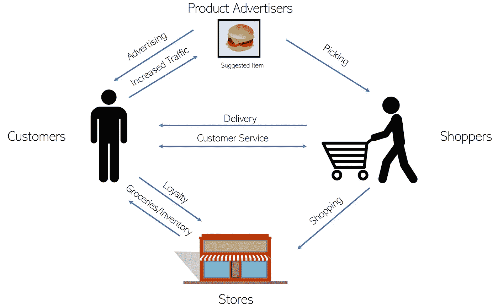

见解:杰里米·斯坦

Instacart 通过送货费赚钱——例如，支付几美元获得送货，或者购买快递会员资格(每年 150 美元，不限次数)。小费和服务费归购物者所有，这有助于支付劳动力成本，但这还不够。Instacart 也通过与宝洁(Procter and Gamble)等公司和广告商的合作关系赚钱——insta cart 上约 30%的购买都是广告产品。这是数据科学的丰富脉络。

该公司还从商店获得相当大一部分收入——如果 Instacart 能够大幅提高某家商店的流量，该商店可能会愿意为此付费。

然而，Instacart 有很多成本，如交易、信用卡处理和保险。然而，最大的成本是购物者购买食品杂货和开车所花费的时间——所以 Instacart 的主要目标是让系统更有效、更快地运行，以便获得更多利润。

*   Instacart 表示，他们的效率比开始专注于优化后端效率之前提高了约 40%。
*   快递客户平均每月花费约 500 美元——经常使用这项服务的人。
*   90%的客户都是回头客。

Instacart 独特的商业模式让数据科学成为关注的焦点，有助于提高利润，并让其四边市场中的四方都更开心——让我们来看看 Instacart 面临的一些数据科学问题和挑战。

# 方差螺旋与预测。

Instacart 在路上运行——所以当旧金山或纽约这样的大城市出现道路堵塞时，购物者就会受阻。当食品迟到时，顾客会更不高兴。

安德烈·叶制图。

天气变化非常大，当天气寒冷时，客户不想出去买杂货，所以他们可能会更多地使用 Instacart(更高的需求)。然而，作为一个购物者，你不会想在天冷的时候出去，所以很少购物者会去上班(需求减少)。天气好的时候，情况正好相反——更多的人可能想自己去购物(需求减少，供应增加)。

Instacart 和全国 50%的食品杂货都被天气推来推去，他们对此无能为力。

不仅仅是天气——特殊事件和名人或皇室人物的来访会堵塞道路，降低 Instacart 的效率。这些不能仅仅作为离群值而被忽略，因为它们已经发生了，并且将来还会再次发生——它们需要被考虑进去。然而，这意味着数据中的巨大差异，这使得数据预测变得困难。

结帐队伍中的可变队列长度和交货地点的可用停车位是另外两个变量，这两个变量在几个可分因素的组合上有很大不同，如日期、温度、给定商店的库存等。

在许多数据科学应用中，均值是最重要的，但在 Instacart 的情况下，方差和均值一样重要。方差会干扰预测，使估计时间难以置信。(你会如何解决这个问题？)

由此，Instacart 面临两个主要挑战。首先是你如何平衡供需？正如之前的天气所显示的那样，供给和需求经常是相互矛盾的，而不是朝着一个有利的平衡发展。过多的需求和不足的供给会降低顾客的满意度和忠诚度，过多的供给和过少的需求对于依靠紧迫感和效率来获得利润的公司来说意味着没有生产力。

第二个挑战是，一个供给和需求已经达到平衡，如何将购物者路由到尽可能高效？哪些购物者应该去哪些地方，以什么顺序，以最大限度地提高他们的效率，但仍然确保交货准时到达？

# 衡量需求是困难的。

对任何企业来说，衡量需求对于评估他们的表现是至关重要的。然而，在 Instacart 的情况下，做到这一点相当困难。

当访问者使用 Instacart 时，他们会指定希望他们的杂货到达的交付窗口。因为在某些时间段(如高峰时段)订单会累积，购物者不可能处理所有订单，所以 Instacart 实施了“繁忙定价”，这提高了送货价格。

Instacart 使用机器学习模型来预测时隙何时会填满，以在实际时隙完全填满之前实施繁忙定价。当该时段完全填满时，Instacart 会从可用交付时间列表中删除该时段。该公司还利用销售定价来填补空的时间段。

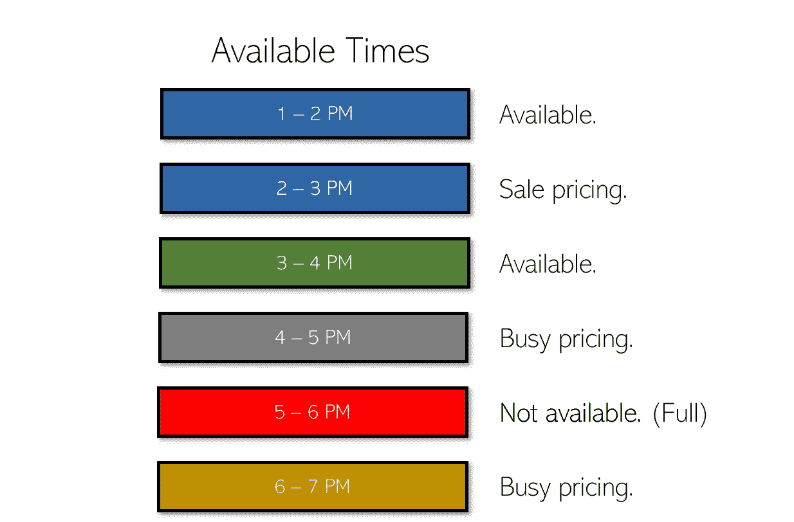

由 Andre Ye 创作的图形。

每个 Instacart 访问者都有三种结果:

*   他们可以去结帐。
*   他们想结账，但因为没有他们想要的送货选项而走开了。
*   他们只是想探索应用程序，从来没有打算购买任何东西，或为未来构建一个篮子。

在所有这些场景中，访问者都会访问这个页面。你如何区分购买/结账的真实需求和为未来构建篮子的需求，或者只是想探索 Instacart 的需求？

注:“统计需求”是指统计的或已知的需求数量。继续购物的顾客的交易会被记录下来。然而，想要购买食品杂货(需求存在)但没有留下任何购买记录(没有购买任何东西)的客户被视为“未计算的需求”。

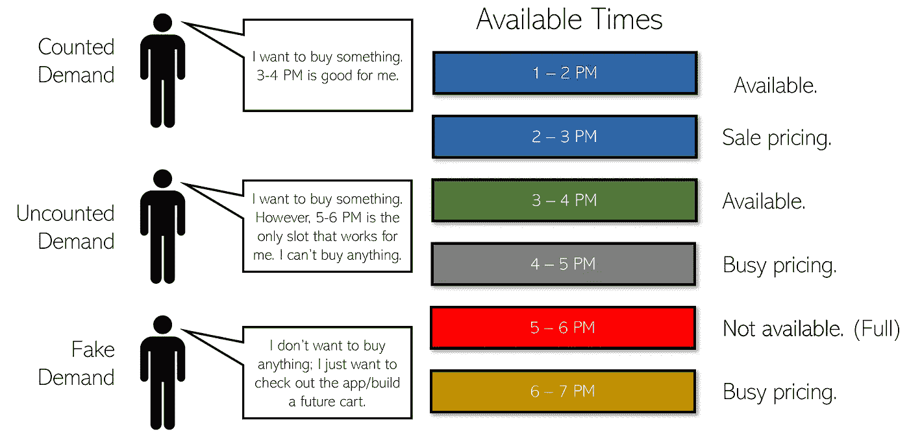

由 Andre Ye 创作的图形。

Instacart 建立了一个概率模型来预测访问者在可用情况下进行购买的机会。它考虑了市场和用户的特征，以及他们看到的可用性——哪些窗口是开着的，他们是忙价还是特价，等等。

通过预测每个人都有 100%的可用性，该模型可以估计需求-如果每个人都有 100%的可用性，会有多少次交付？已统计和未统计的需求都会被考虑，但虚假需求不会——这是一个聪明的过滤器。

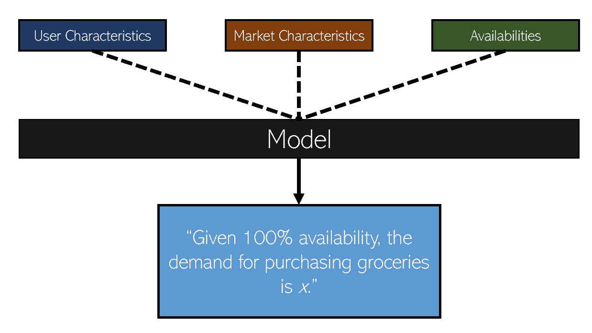

Andre 创作的图形

使用这种方法，Instacart 能够估计 orange 的需求，以及“丢失交付”的数量(需求-成功购买的数量)。

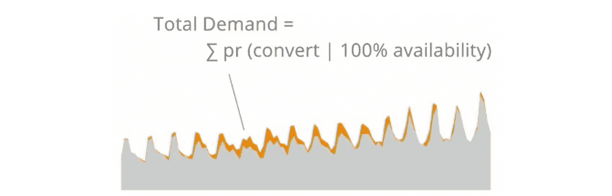

图片:杰里米·斯坦，Instacart

如果 Instacart 要做任何调度、人员配备或预测，他们希望在正确的需求下完成。现在，他们不仅可以计算，还可以估计丢失的快递数量。

# 预测交货履行时间

给定一个小时的时间框架，Instacart 的工作是在这段时间内交付食品杂货。否则，顾客的幸福感会下降——事实上，早一点去买菜会让顾客有更高的幸福感。

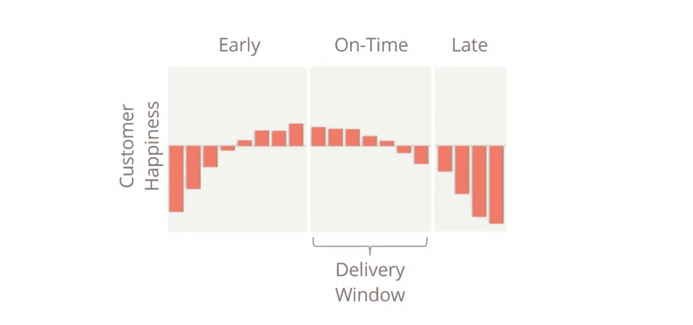

图片:杰里米·斯坦，Instacart

考虑到顾客满意度的重要性，能够估计给定购物者的履行时间，从而为他们提供最有效的路线是必不可少的。

你可能会认为 Instacart 可以使用谷歌地图的旅行时间，但 Instacart 建立了自己的模型，其性能优于谷歌地图的旅行时间。该公司需要建立自己的旅行时间估计器，因为他们的购物者不是传统的司机——他们经常重复前往同一家商店，需要放下杂货店，进入商店等等，谷歌地图没有纳入这些组件，但 Instacart 的模型可以。

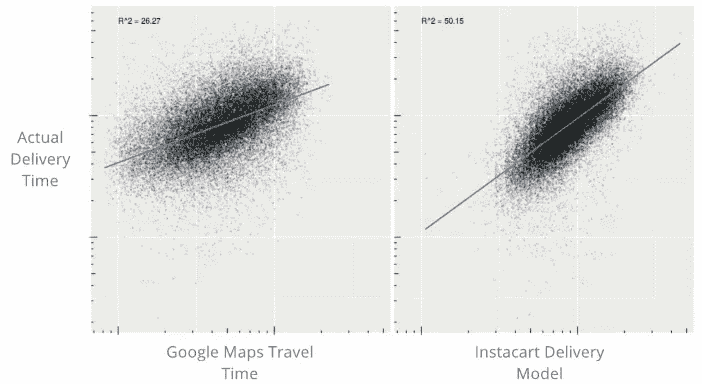

来源:杰里米·斯坦，Instacart

谷歌地图 API 不适合 Instacart 还有一个原因——他们必须为 Instacart 为其购物者考虑的所有路线组合做出预测。有一组候选路线，需要在一个自己进行优化的系统中进行。当你在估计数万亿条路线的完成时间时，等待 100 毫秒用 Google API 检查是不可行的。

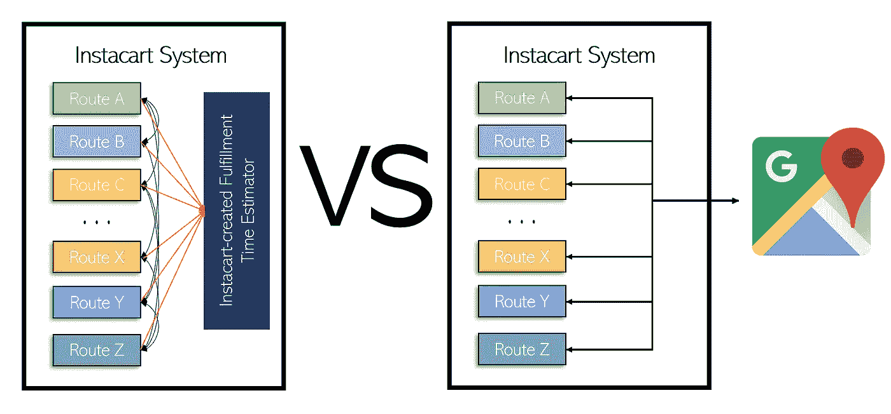

一个内部组件可以相互通信、估算器可以根据 Instacart 的特定数据类型进行调整的系统，还是一个需要缓慢的外部 API 的系统？由 Andre Ye 创作的图形。

Instacart 使用分位数回归进行预测。除了寻找平均时间，第 95 百分位的可能时间是多少？或者，第五百分位可能时间？Instacart 的系统考虑了所有步骤中方差的相关性，以便在未来累积方差。

对于模型，Instacart 使用梯度推进决策树——它们有过度拟合的趋势(偏向偏差-方差尺度上的方差)，这对于 Instacart 的高方差需求来说是完美的。

> 他们*【梯度推进决策树】*可以或多或少地记忆数据，这本质上是我们希望在这里发生的许多事情。当我们计划所有不同的组合时，我们可以将它们扩展到每分钟数百万次预测。
> -杰里米·斯坦，Instacart

Instacart 有一个很好的方法来估计履行时间——现在它如何为所有的购物者绘制路线呢？

# 为购物者绘制路线

假设你要处理 300 份订单和 100 名顾客。尽管每次旅行只有三个订单，但有 4.45 亿个送货组合和 100 个不同购物者的 3 个组合。Instacart 每分钟都在处理这些问题——这只是一个小例子。

直觉上，你知道 Instacart 不会搜索所有 4.45 亿个组合，并挑选最重要的一个。

Instacart 的目标是最大化找到的商品数量。

在许多大城市，有很多相同的商店，只是位置不同。如果他们都有相同的产品，购物者可以选择最接近的一个。

由 Andre Ye 创作的图形

然而，库存并不总是最新的。这意味着，在评估客户清单上的产品出现在几家商店库存中的可能性后，Instacart 可能会牺牲额外的距离来换取客户满意度，这是因为客户想要的确切产品出现在库存中的可能性更高。

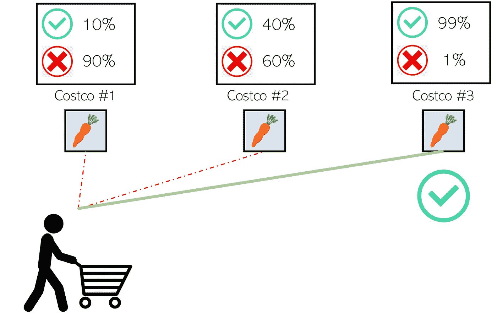

由 Andre Ye 创作的图形。

然而，如果事实证明好市多#1 确实有顾客寻找的产品，那么 Instacart 只是浪费了额外的时间去更远的商店——随之而来的是，顾客对产品准时到达的宝贵快乐。

对于 Instacart 来说，一秒钟就是金钱。

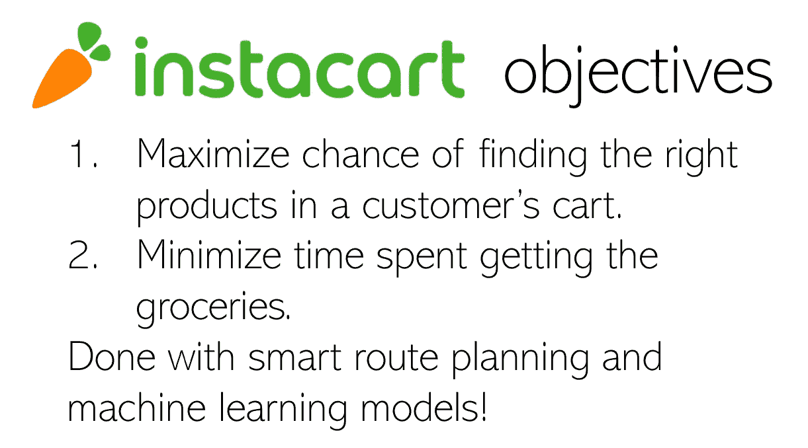

由 Andre Ye 创作的图形。

Instacart 使用贪婪试探法，这是一种聚合可能的交付并对聚合进行优先级排序的简单方法。事实上，Instacart 的第一个算法甚至更简单。它基于一个问题:

> 接下来什么快递最有可能迟到？

不管答案是什么，算法都会派一个购物者去处理。如果在第一次递送仍然及时的情况下，还有另一次递送可以添加到列表中，那么它将被添加——并且算法将继续这样沿着列表向下。

从那以后，Instacart 通过使用高效的机器学习方法，对他们的算法进行了巨大的改进——延迟交付减少了 20%，丢失交付稳定，购物速度提高了，忙碌时间百分比增加了 20%。

很复杂。Instacart 每秒钟运行无数次模拟，在计算可行的情况下找到最佳路线。

# 结论

后端有很多事情在进行。用户体验简单、干净、可靠——如果用户熟悉 Instacart 应用程序，他们可以在不到一分钟的时间内订购杂货。然而，在简洁易用的用户界面背后是一个庞大的系统，由智能机器学习和数据科学决策和应用程序驱动，它把你的杂货送到你面前，让你高兴，也让购物者、商店和广告商高兴。

本文是前 Instacart 的杰里米·斯坦(Jeremy Stan)40 分钟演讲的总结。如果你有兴趣听完整个演讲，可以点击这里进入。所有来自“Jeremy Stan，Instacart”的图片都来自他的幻灯片。

我希望这篇文章能够让您了解看似简单的 ui 背后的复杂系统，并探索和理解如何智能地应用数据科学和机器学习方法来解决实际的业务问题，使用 Instacart 的独特业务模型作为案例研究。

(想知道我是如何为本文制作图表的吗？看看这个[故事](https://medium.com/swlh/powerpoint-the-most-underrated-diagram-tool-3de534108858?source=your_stories_page---------------------------)吧。软件可能会让你大吃一惊:)