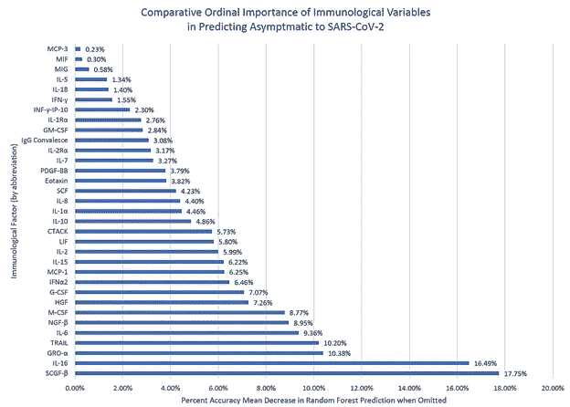

# 数据科学如何帮助新冠肺炎疫情？

> 原文：<https://towardsdatascience.com/how-is-data-science-helping-with-the-covid-19-pandemic-ecb524df6a19?source=collection_archive---------34----------------------->

## 建立关系模型以加速对疾病动态的理解

作者图片

2011 年，在胰腺癌过早死亡的阴影下，[苹果](https://www.apple.com/)创始人史蒂夫·乔布斯顿悟了。“我认为 21 世纪最大的创新将是生物学和技术的交叉。一个新的时代正在开始。”(艾萨克森，2011 年)他非常感激他的疾病激发了他上大学的儿子里德研究基因组学的热情。

今天，人类正面临——至少十个月以来——自 1917 年西班牙疫情流感以来，在发病率和死亡率的速度和潜力方面最重大的公共卫生挑战之一。但与 1917 年不同，科学现在对生物学、基因组学和疾病动力学有了指数级的更先进的理解。自 2010 年左右以来，我们有了强大的能力，可以使用算法来发现和收集远远超出人类认知能力甚至速度更快的模式和见解。所有这些都回避了一个问题——在机器学习时代以来的第一次全球疫情中，它如何帮助我们？

在[谷歌学术](https://scholar.google.com/)上快速搜索可以发现 2020 年 19700 篇预印或发表在同行评审期刊上的论文，这些论文都与人工智能或机器学习以及新冠肺炎相关。本月发表在爱思唯尔杂志*混沌、孤立子、&分形*上的一篇元综述发现，人工智能和人工智能在新冠肺炎的应用可以归类为筛选、预测、预报、接触追踪和药物开发等功能(Lalmuanawma，2020)。美国国家卫生研究院(NIH)、 *PLOS* 、*医学互联网研究期刊家族* (JMIR)和[MedRxiv](http://www.medrxiv.org/)——BMC、耶鲁和冷泉港实验室的出版物——一直是领先的出版商，公众和科学家之间的大多数传播可以说是通过 [Twitter](http://www.twitter.com/) 进行的。

虽然我有偏见，但一个很好的例子是“[对新型冠状病毒(新冠肺炎)的病原体-免疫关系的机器学习解释，以及预测免疫和治疗机会的模型:比较有效性研究](https://xmed.jmir.org/2020/1/e23582/)，”上周发表在 *JMIRx Med* 上。除了其潜在的重要性，它还举例说明了数据科学如何能够更准确地聚焦，从而提高公共卫生干预措施和政策的效力(Luellen，2020)。

这项研究的关键是，大约 80%的新冠肺炎感染者是无症状的，或者是免疫的，这些有害的症状会导致疾病和死亡，但仍然可以感染其他人。迄今为止，没有人知道为什么或如何识别这些“沉默的携带者”。如果有一种可靠的方法来提前将他们从 20%的患病人群中分类或区分出来，那么免疫者就可以去工作、上学、购物和旅行，而不会给自己带来风险。与此同时，20%的风险人群可以得到保护。此外，如果有不同的生物化学、基因组或分子生物标志物来区分免疫者和患病者，这将提高我们对疾病动力学的理解，并为那些不能接种疫苗的人提出新的可能的治疗方法。最后，它可以帮助决策者优先考虑大规模疫苗接种，从 20%的最大风险开始。

总之，该研究通过机器学习找到了两种途径来准确分类或预测谁可能对新冠肺炎免疫，谁在 20%的风险群体中。在一个由 37 名无症状和 37 名有症状的新冠肺炎患者组成的研究组中，100%的无症状患者的干细胞生长因子β(SCGF-B)——一种免疫蛋白——大于 127，637。或者，94.8%的新冠肺炎免疫患者具有两种其他免疫特征:白细胞介素-16 (IL-16)大于 45，巨噬细胞集落刺激因子(M-CSF)大于 57。

在宏观层面上，数据科学如何被用于协助新冠肺炎疫情的有趣之处还在于研究结果是如何传播的以及在哪里传播的。MedRxiv 于 2020 年 8 月 16 日出版了预印本——经过专业质量审查，但未经同行审查。今天，1，453 人阅读了该摘要，另有 328 人全文下载了该论文。它被 108 个人转发了约 332 次，Altmetric 影响力得分为 58。与此同时，2020 年 10 月 19 日出版的同行评审出版物[被五个人发了大约七次推文，被一家新闻媒体转载和播放，并在头五天内在 LinkedIn 上被观看了 191 次，到目前为止，Altmetric 影响力得分为 10。](https://xmed.jmir.org/2020/1/e23582/)

这个有趣的经历证实了元问题仍然没有改变:科学发现的速度快于人类意识到和应用它们的速度。即使使用社交媒体工具，如在互联网上实时发布结果以便立即免费传播，Twitter，LinkedIn 等。有意义地利用大量科学发现的挑战依然存在。下一代有影响力的工具将是那些能够通过精英管理来识别最重要的研究发现并将其加速付诸实践的工具。

# 参考

艾萨克森，W. (2011 年)。史蒂夫·乔布斯。纽约:西蒙&舒斯特。

拉穆阿那瓦马，s .，侯赛因，j ...(2020).机器学习和人工智能在新冠肺炎(新型冠状病毒)疫情的应用:综述。*混沌，孤子&分形*，139: 110059。

卢埃勒(2020)。新型冠状病毒(新冠肺炎)的病原体-免疫关系的机器学习解释，以及预测免疫和治疗机会的模型:一项比较有效性研究。 *JMIRx Med* ，1(1):e23582。