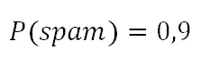
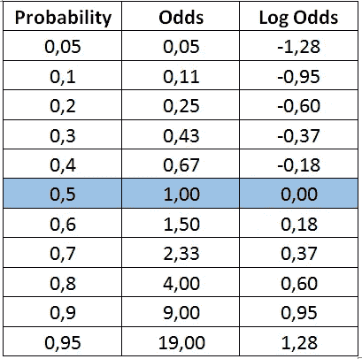
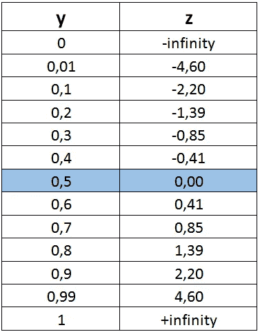
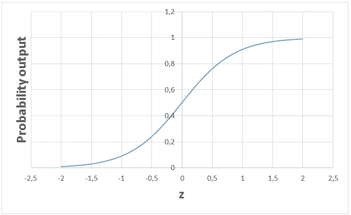

# 逻辑回归作为分类算法是如何使用的？

> 原文：<https://towardsdatascience.com/how-is-logistic-regression-used-as-a-classification-algorithm-51eaf0d01a78?source=collection_archive---------16----------------------->

## 回归和分类矛盾吗？

[斯凯工作室](https://unsplash.com/@skyestudios?utm_source=unsplash&utm_medium=referral&utm_content=creditCopyText)在 [Unsplash](https://unsplash.com/s/photos/light-bulb?utm_source=unsplash&utm_medium=referral&utm_content=creditCopyText) 拍摄的照片

监督学习算法可以分为两大类:

*   回归:预测连续的目标变量。例如，预测房子的价格是一项回归任务。
*   分类:预测离散目标变量。例如，预测电子邮件是否是垃圾邮件是一项分类任务。

逻辑回归是一种监督学习算法，主要用于解决二元“**分类”**任务，尽管它包含单词“**回归**”。“回归”与“分类”相矛盾，但逻辑回归的重点是“逻辑”一词，指的是在算法中实际执行分类任务的逻辑函数**。逻辑回归是一种简单但非常有效的分类算法，因此它通常用于许多二元分类任务。客户流失、垃圾邮件、网站或广告点击预测是逻辑回归提供强大解决方案的一些领域的例子。它甚至被用作神经网络层的激活函数。**

逻辑回归的基础是逻辑函数，也称为 **sigmoid 函数**，它接受任何实数值并将其映射到 0 到 1 之间的值。

逻辑回归模型将线性方程作为输入，并使用逻辑函数和对数比值来执行二元分类任务。在详细讨论逻辑回归之前，最好先回顾一下概率范围内的一些概念。

# **概率**

概率衡量事件发生的可能性。例如，如果我们说“此电子邮件有 90%的可能性是垃圾邮件”:

**Odds** 是肯定类别(电子邮件是垃圾邮件)和否定类别(电子邮件不是垃圾邮件)的概率之比。

**对数赔率**是赔率的对数。

所有这些概念本质上代表相同的度量，但方式不同。在逻辑回归的情况下，使用对数优势。我们将看到为什么对数概率在逻辑回归算法中是首选的原因。

> 对数比值是比值的对数，比值是正类与负类的概率之比。

概率为 0.5 意味着该电子邮件是垃圾邮件还是非垃圾邮件的几率相等。请注意，概率为 0.5 的**对数赔率为 0** 。我们将利用这一点。

让我们回到 sigmoid 函数，用不同的方式展示它:

取两侧的自然对数:

在等式(1)中，代替 x，我们可以使用线性等式 **z** :

那么等式(1)变成:

假设 y 是正类的概率。如果 z 是 0，那么 y 是 0，5。对于 z 的正值，y 大于 0.5，对于 z 的负值，y 小于 0.5。如果正类的概率大于 0，5(即大于 50%的几率)，我们可以预测结果为正类(1)。否则，结果是一个负类(0)。

由[法兰克诉](https://unsplash.com/@franckinjapan?utm_source=unsplash&utm_medium=referral&utm_content=creditCopyText)在 [Unsplash](https://unsplash.com/s/photos/double?utm_source=unsplash&utm_medium=referral&utm_content=creditCopyText) 上拍摄的照片

> **注**:在二元分类中，有正/负、1/0、真/假等多种方式来表示两类。

下表显示了一些 z 值和相应的 y(概率)值。所有实数都映射在 0 和 1 之间。

如果我们画出这个函数，我们将得到著名的逻辑回归 s 形图:

分类问题归结为求解一个线性方程:

这似乎就像解决一个线性回归问题。函数的参数在训练阶段用最大似然估计算法确定。然后，对于任意给定的自变量(x1，… xn)的值，可以计算出正类的概率。

我们可以“原样”使用计算出的概率。例如，输出可以是电子邮件是垃圾邮件的概率是 95%,或者客户将点击该广告的概率是 70%。然而，在大多数情况下，概率被用来分类数据点。如果概率大于 50%，则预测为正类(1)。否则，预测为负类(0)。并且，我们刚刚将线性回归问题的解决方案转换为二元分类任务。

逻辑回归是一个简单但非常强大的算法来解决二元分类问题。逻辑函数(即 sigmoid 函数)也通常在非常复杂的神经网络中用作输出层的激活函数。

感谢您的阅读。如果您有任何反馈，请告诉我。