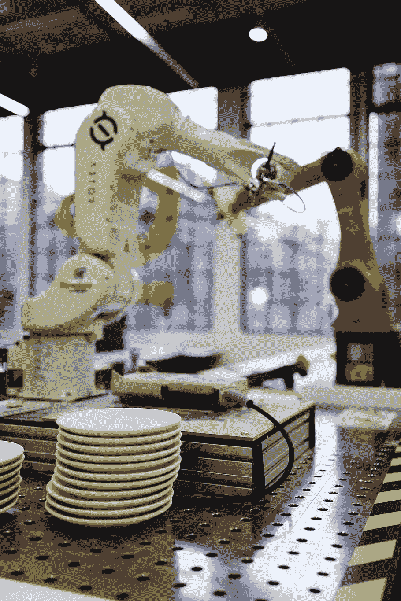

# 强化学习在商业中是如何运用的？

> 原文：<https://towardsdatascience.com/how-is-reinforcement-learning-used-in-business-71592558c93f?source=collection_archive---------40----------------------->

## 近年来，强化学习已经证明它可以在不同的游戏中取得比人类更好的结果。但是 RL 也可以用在现实世界的业务中吗？

h2RL 目前被用于几个行业以增加利润。]

强化学习(RL)第一次被如此命名[是在半个多世纪前的 20 世纪 60 年代](http://incompleteideas.net/book/first/ebook/node12.html)。不久之后，一些研究人员的兴趣从 RL 转移到监督学习，这导致了这两者之间近二十年的混淆。事实上，在 Rosenblatt (1962)和 Widrow 和 Hoff (1960)的著作中，可以看到 RL 和监督学习之间的界限是如何模糊的，在这些著作中，他们使用奖励和惩罚来描述监督学习技术。最后，在 20 世纪 80 年代末，Watkins 向世界介绍了 [Q-learning (1989)](https://link.springer.com/content/pdf/10.1007/BF00992698.pdf) ，融合了时间差和最优控制研究思路，创造了我们今天使用的现代 RL。

RL 已经走过了漫长的道路，如今，由于在几场视频游戏中取得了超人的表现，如 [Pong、Enduro](https://venturebeat.com/2018/11/16/openai-and-deepmind-ai-system-achieves-superhuman-performance-in-pong-and-enduro/) 、 [Montezuma 的复仇](https://venturebeat.com/2018/11/01/openai-made-a-system-thats-better-at-montezumas-revenge-than-humans/)、[其他雅达利游戏](https://www.cs.toronto.edu/~vmnih/docs/dqn.pdf)和[，甚至击败了围棋世界冠军](https://artsandculture.google.com/exhibit/the-story-of-alphago-barbican-centre/0wLCk0X1qEe5KA?hl=en)，RL 已经闻名世界。但是，RL 的所有这些用例都是基于(视频)游戏的，许多人甚至称之为营销噱头。尽管许多当前的研究工作已经改进了 RL，使其更有效、更智能和更安全，但 RL 仍然面临着阻碍其在现实世界任务中使用的挑战。

然而，这并没有阻止工程师在许多业务中使用 RL 取得巨大成功，并在此过程中赚了很多钱。小型和大型企业不应该忽视 RL，因为如果使用得当，它可以带来巨大的好处(和利润)。为了给你一些启发，让我们看看世界上一些最大的公司目前是如何使用 RL 来改善他们的业务的。

# 推荐系统

RL 在商业中最受欢迎的应用可能是在推荐系统中。网飞已经公开宣布，它正在使用 RL 向其用户推荐系列和电影，以及其他机器学习算法，网飞的研究人员正在定期使用 RL 发表论文。 [Spotify 也承认使用多臂强盗](https://labs.spotify.com/2020/01/16/for-your-ears-only-personalizing-spotify-home-with-machine-learning/)，一种 RL 算法，用于管理歌曲和艺术家推荐的开发和探索之间的权衡。在 exploitation 中，推荐器推荐与用户正在听的内容高度相关的元素，而 exploration 则推荐不同但用户可能喜欢的内容，为用户带来新的发现。

Spotify 和网飞已经公开承认使用 RL 作为其推荐系统[图片来自 [Pexels](https://www.pexels.com/de-de/foto/spotify-netflix-mockup-364676/) 。]

亚马逊、易贝、MercadoLibre 和许多其他大型在线零售商也在使用推荐系统，甚至 Medium 也在赞助 [2020 RecSys(推荐系统会议)](https://recsys.acm.org/recsys20/)。很容易看出原因:[麦肯锡估计，亚马逊上 35%的消费者购买来自其网站的推荐](https://martechtoday.com/roi-recommendation-engines-marketing-205787)。基于 RL 的推荐系统越来越受欢迎，很可能许多大公司都在使用它们，尽管我们对此一无所知。推荐算法给了公司如此大的商业优势，以至于实际的算法从来没有公开过。也许将来会看到它们中的一些被保存在一个金库里，就在[可口可乐秘密配方](https://www.youtube.com/watch?v=gtuJx__HdpI)旁边。

# 贸易

股票交易机器学习算法有许多实现方式，特别是 RL 算法。然而，这些实施大多被视为机器学习如何用于交易的例子，该领域的大公司直到去年才开始接触它们。

摩根大通也在交易中使用 RL。]

2019 年 4 月，摩根大通宣布开始利用深度神经网络算法执行(DNA)来提升其外汇交易算法。关于精确算法的细节没有公布，但根据[在其网站](https://www.jpmorgan.com/global/markets/machine-learning-fx)上的简要描述，这些算法似乎可以分析和解释信息，以实时选择最佳的订单安排和执行方式。此外，DNA 使用 RL 来评估个人下单选择的绩效。该公司尚未宣布他们新方法的结果，但已经表示[将“加倍”使用机器学习进行外汇交易](https://www.thetradenews.com/jp-morgan-doubles-machine-learning-fx-algorithms/)，暗示有希望的结果。

# 机器人学

RL 的使用在机器人行业得到了很好的传播【图片来自 [pxfuel](https://www.pxfuel.com/en/free-photo-xvgqz) 。]

几家公司正在使用 RL 来控制制造业中的机器人。事实上，研究中引用的最常见的 RL 用例之一是控制机器人或机器人部件，如机器人手；RL 在机器人学中的应用一直激励着科学家，也为 RL 算法提供了一个很好的验证场景。机器人塑造了制造业，降低了成本，同时减少了生产时间，RL 承诺将这一点进一步推进:RL 提供了一种以高精度控制机器人部件的方法，这些部件具有非常难以编程的复杂行为。

RL 在机器人领域的使用越来越多，涌现了许多初创公司:最近一家知名的公司是 Covariant，其研究人员和工程师来自加州大学伯克利分校和 OpenAI。他们最近[筹集了 4000 万美元的资金](https://aidaily.co.uk/articles/covariant-the-ai-robotics-company-that-just-raised-40m)，所以我们可能会在未来看到更多的共变机器人。

# 冷却谷歌的数据中心

你可能从来没有想过，但是你能想象运行谷歌的数据中心需要多少能量吗？据估计，行业内[数据中心每平方英尺](https://business.directenergy.com/blog/2017/november/powering-a-google-search)消耗的能源是任何其他商业建筑的 10 至 50 倍，难怪会是这样:数据中心需要能源来运行服务器，数据必须定期备份，服务器需要冷却到 20 至 24°C(68 至 75°F)的恒温。仅冷却数据中心就消耗了大约五分之一的总能源，因此这方面的任何改进都可以转化为数据中心的巨大利润。事实上，据估计，到 2024 年，数据中心冷却市场的价值可能达到 200 亿美元。

计算机服务器需要保持 20-24 摄氏度的恒温[图片来自[维基媒体](https://commons.wikimedia.org/wiki/File:BalticServers_data_center.jpg)。]

[谷歌正在使用 AlphaGo](https://techwireasia.com/2020/05/has-google-cracked-the-data-centre-cooling-problem-with-ai/) ，也就是击败围棋世界冠军的 AlphaGo，来找出冷却基础设施的最佳框架，如风扇和通风，这将最有效地降低能耗。AlphaGo 被用作推荐系统，向基础设施运营商建议提高能效的选项。这导致冷却数据中心所需的能源减少了 40%,可以想象，这意味着总体成本的巨大节约。

# 接下来会发生什么？

虽然监督和非监督学习已经在几乎所有行业中取得了进展，但 RL 直到现在一直处于次要地位。这可能是因为 RL 提出了几个挑战，例如样本低效、安全学习和定义良好的奖励函数，这些都是在为现实世界问题实现 RL 解决方案之前必须解决的。如果你想了解更多在现实世界中应用 RL 的挑战，我推荐[《现实世界强化学习的挑战》(Dulac-Arnold et al. 2019)](https://arxiv.org/pdf/1904.12901.pdf) 。

研究人员已经开发了几种方法来处理这些问题，我们现在看到一些方法在不同的解决方案中实施，如[系统和服务配置](https://arxiv.org/abs/1904.12676)、[自动驾驶](https://aws.amazon.com/deepracer/)和其他一些解决方案。如果我们认为这只是 RL 能为我们做的所有事情的冰山一角，毫无疑问，未来看起来非常光明！

你知道企业中 RL 的其他实现吗？如果是这样，我很想听听他们的故事！感谢您的阅读！