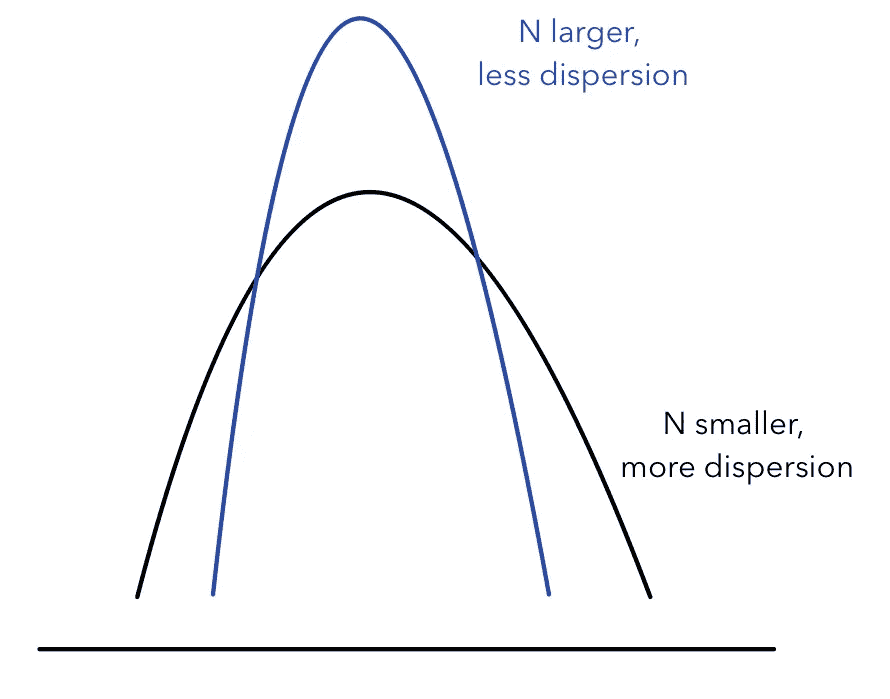
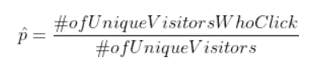
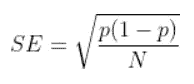
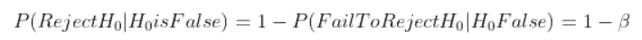
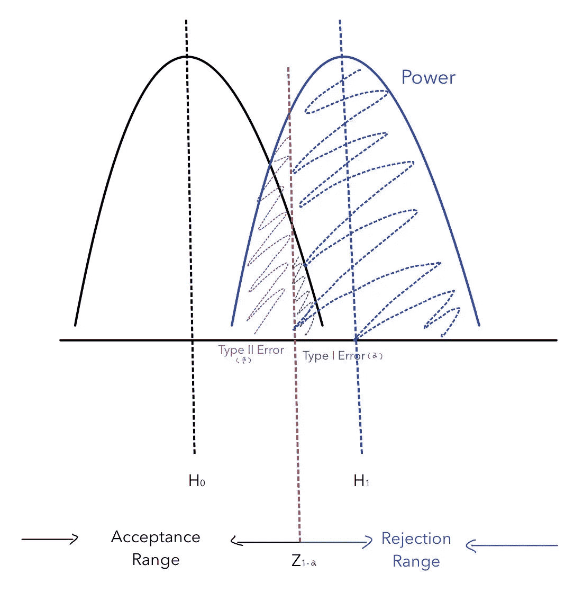
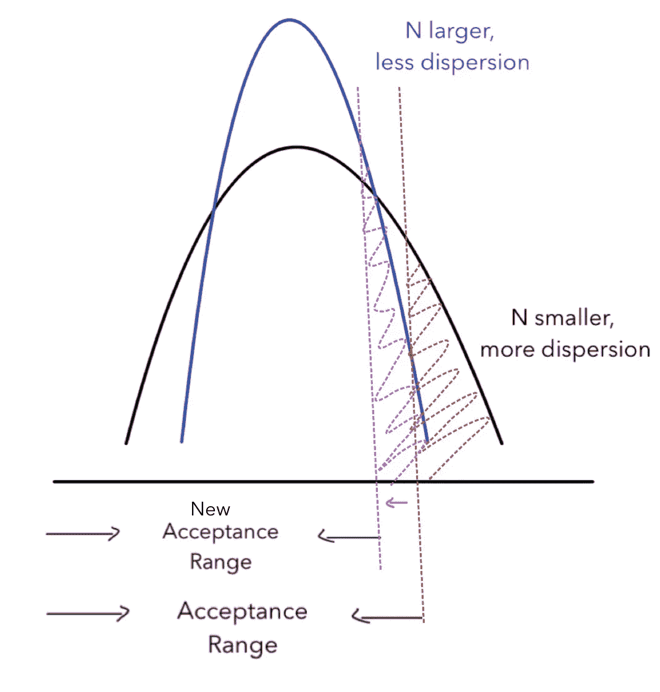
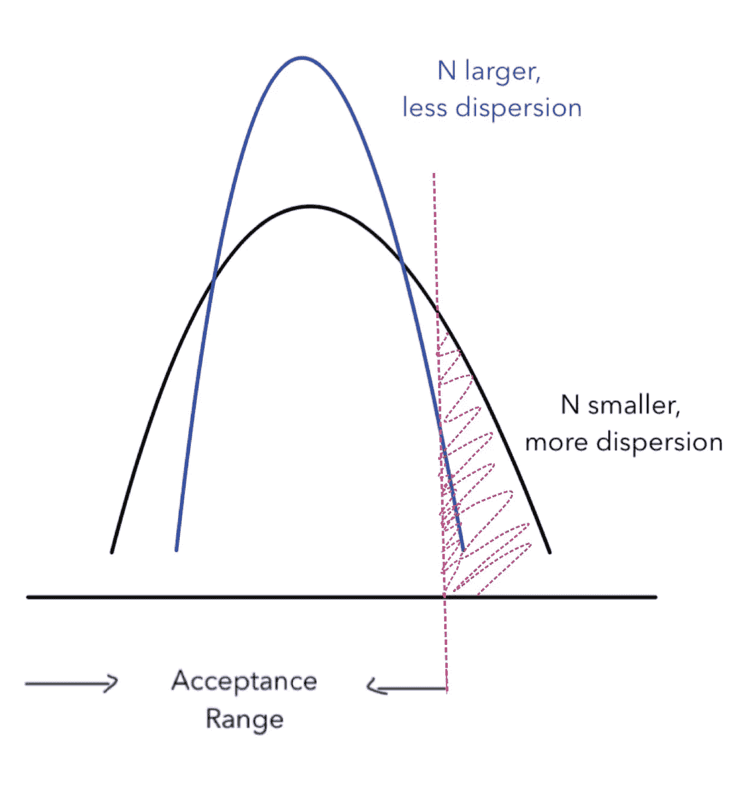
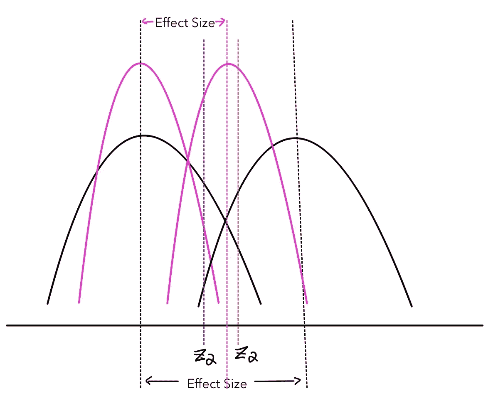
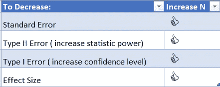

# 样本大小与标准误差、功效、置信水平和效应大小有什么关系？

> 原文：<https://towardsdatascience.com/how-is-sample-size-related-to-standard-error-power-confidence-level-and-effect-size-c8ee8d904d9c?source=collection_archive---------4----------------------->

查尔斯·德鲁维奥在 [Unsplash](https://unsplash.com/s/photos/size?utm_source=unsplash&utm_medium=referral&utm_content=creditCopyText) 上拍摄的照片

## 使用图表来展示相关性

在进行统计分析时，尤其是在实验设计期间，一个不可避免的实际问题是确定实验的样本量。例如，在设计网页的布局时，我们想知道增加点击按钮的大小是否会增加点击率。在这种情况下，AB 测试是一种常用于解决这一问题的实验方法。

转到这个实验的细节，您将首先决定我需要给实验组分配多少用户，以及我们需要给控制组分配多少用户。样本大小与四个变量密切相关，即样本的标准误差、统计功效、置信水平和本实验的效果大小。

在本文中，我们将通过图表展示它们与样本量的关系。具体来说，我们将讨论单尾假设检验的不同情况。

**标准误差和样本量**

统计的[标准误差](https://en.wikipedia.org/wiki/Standard_error)对应于参数的标准偏差。由于在大多数情况下几乎不可能知道总体分布，我们可以通过计算抽样分布的标准误差来估计参数的标准偏差。标准误差衡量分布的离差。样本量越大，离差越小，分布的均值越接近总体均值([中心极限理论](https://en.wikipedia.org/wiki/Central_limit_theorem))。因此，样本大小与样本的标准误差负相关。下图显示了不同样本量下分布的不同形状:

随着样本量变大，采样分布的离差越来越小，分布的平均值越来越集中，而较平的曲线表示离差较大的分布，因为数据点分散在所有值中。

了解样本量和标准误差之间的负相关有助于进行实验。在实验设计中，有必要不断监测标准误差，看看我们是否需要增加样本量。例如，在我们之前的例子中，我们想看看增加底部的大小是否会增加点击率。我们需要在对照组和实验组中测量的目标值是点击率，它是一个计算如下的比例:

比例统计的标准误差为:

当比例为 0.5 时，标准误差最高。在进行实验时，如果观察到 p 接近 0.5(或 1-p 接近 0.5)，则标准误差在增加。为了保持相同的标准误差，我们需要增加样本量 N，以将标准误差降低到原始水平。

**统计功效和样本量**

统计功效也称为敏感度。它由 1- β计算，其中β为 II 型误差。更高的能力意味着你不太可能犯第二类错误，即当零假设为假时，不能拒绝零假设。如这里所述:

换句话说，当拒绝区域增大(接受范围减小)时，就有可能拒绝。因此，第一类误差增加，而第二类误差减少。下图描绘了单尾假设检验的统计功效、I 型误差(α)和 II 型误差(β)之间的关系。选择置信水平(1-α)后，蓝色阴影区域是该特定分析的功效大小。

从图中可以明显看出，统计功效(1- β)与第二类误差(β)密切相关。当β减小时，统计功效(1- β)增加。统计功效也受 I 型误差(α)的影响，当α增加时，β减少，统计功效(1- β)增加。

中间的红线决定了接受范围和拒绝范围的权衡，决定了统计功效。样本量如何影响统计功效？要回答这个问题，我们需要改变样本量，看看统计功效是如何变化的。由于第一类误差也随着样本量的变化而变化，我们需要保持它不变，以揭示样本量和统计功效之间的关系。下图说明了它们之间的关系:

当样本量增加时，分布将更加集中在平均值附近。为了保持 I 型误差不变，我们需要降低临界值(由红色和粉色垂直线表示)。因此，新的接受范围更小。如上所述，当它不太可能接受时，它更有可能拒绝，因此增加了统计能力。该图说明了统计功效和样本大小彼此正相关。当实验需要更高的统计功效时，就需要增加样本量。

**置信水平和样本量**

如上所述，置信水平(1- α)也与样本大小密切相关，如下图所示:

由于蓝色和黑色分布的接受范围保持不变，统计功效保持不变。随着样本量变大(从黑色到蓝色)，I 型误差(从红色到粉色)变小。对于单尾假设检验，当 I 型误差减小时，置信水平(1-α)增加。因此，样本量和置信水平也是正相关的。

**效果大小和样本大小**

效应大小是实验的实际显著水平。由实验设计者根据实际情况设定。例如，当我们想检查增加网页底部的尺寸是否会增加点击率时，我们需要定义我们测量的实验组和对照组之间的差异有多大实际意义。0.1 的差异是否足以吸引新客户或产生可观的经济利润？这是实验设计者不得不考虑的问题。一旦设置了效果大小，我们就可以用它来决定样本大小，它们之间的关系如下图所示:

随着样本大小的增加，分布变得更尖(黑色曲线到粉红色曲线。为了保持置信水平不变，我们需要将临界值向左移动(从红色垂直线移动到紫色垂直线)。如果我们不移动替代假设分布，统计功效将会降低。为了保持功效不变，我们需要将备择假设分布向左移动，因此有效效果会随着样本量的增加而降低。它们的相关性是负的。

**如何解释上面讨论的相关性？**

总之，我们在样本大小和其他变量之间有以下相关性:

为了解释，或者更好地记忆这种关系，我们可以看到，当我们需要减少错误时，对于第一类和第二类错误，我们需要增加样本量。较大的样本量使样本更能代表总体，也是用于统计分析的较好样本。随着样本量的变大，更容易检测出实验组和对照组之间的差异，尽管差异更小。

**给定其他变量，如何计算样本量？**

计算样本大小的方法有很多，很多编程语言都有计算样本大小的软件包。例如，R 中的 *pwr()* 包可以完成这项工作。比起知道确切的公式，更重要的是理解公式背后的关系。希望这篇文章能帮助你理解这些关系。感谢您的阅读！

这是我所有博客帖子的列表。如果你感兴趣的话，可以去看看！

 [## 我的博客文章库

### 我快乐的地方

zzhu17.medium.com](https://zzhu17.medium.com/my-blog-posts-gallery-ac6e01fe5cc3)  [## 阅读朱(以及媒体上成千上万的其他作家)的每一个故事

### 作为一个媒体会员，你的会员费的一部分会给你阅读的作家，你可以完全接触到每一个故事…

zzhu17.medium.com](https://zzhu17.medium.com/membership)