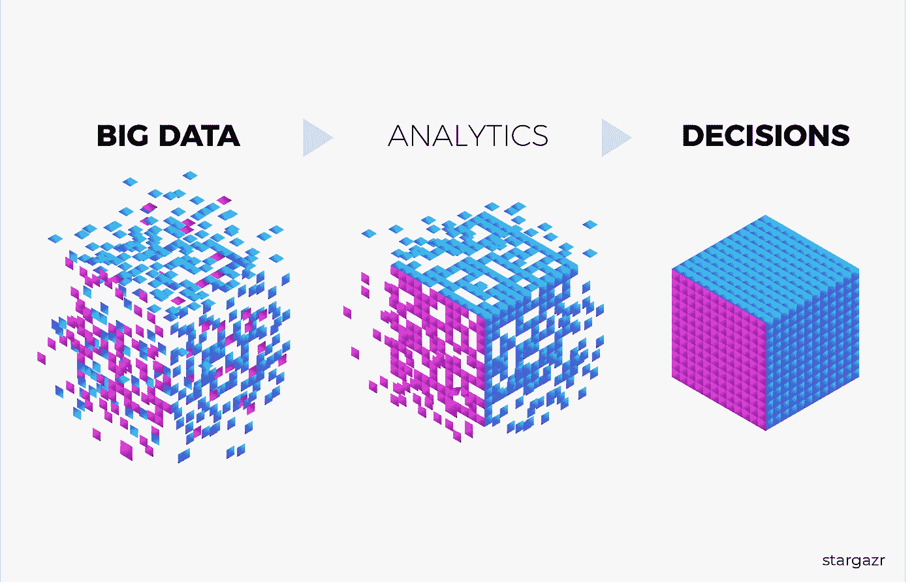
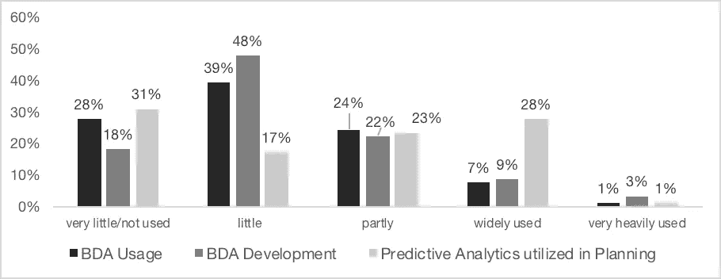

# 大数据分析在控制方面的现状如何？

> 原文：<https://towardsdatascience.com/how-is-the-current-state-of-big-data-analytics-in-controlling-1273c725ac6a?source=collection_archive---------17----------------------->

## [现实世界中的数据科学](https://medium.com/towards-data-science/data-science-in-the-real-world/home)

## 控制中的使用和发展

T 对使用数据的兴趣导致采用大数据分析来改善决策过程的趋势日益增长。大数据分析被定义为“高级分析技术在大数据集上运行的地方”。由于数据驱动市场的竞争日益激烈，企业正在采用最先进的信息技术来获得竞争优势。

控制或**管理会计**部门的**的角色直接受到大数据分析工具的影响，因为在使用信息支持管理方面，控制者是公司的核心单位。挑战之一是从这些无处不在的信息量中获得洞察力。然后，收到的见解将用于制定决策和调整组织流程以产生价值。**

> 管理会计师或财务总监支持并建议组织的管理层实现其经济、公共和/或财务目标。支持是指管理控制和会计信息系统的设计和维护，以及信息的获取和分发。”

因此，一个公司的决策是基于来自**分析结果**的证据，而不仅仅是他们经理的直觉。还必须考虑商业文化方面和技术方面，例如合适的基础设施和用户友好的界面，以获得大数据分析的竞争优势。

**大数据分析对控制的影响**

虽然“审计员”一词在德语国家很常见，但“管理会计师”在美国和英国等英语国家是一个公认的术语。在比较这两种职业时，审计员的任务通常被认为是一个扩展的范围，不仅集中在会计问题上，也集中在管理问题上。

在我们的博客中，术语“控制者”和“管理会计”的意思是一样的，在控制和管理会计文献中很常见。

大数据分析的功能有助于高级分析从分散在不同数据库中的琐碎信息构建事件、场景或感兴趣对象的图片。

公司，特别是其控制单位，可以应用他们从大数据分析中获得的洞察力来增强他们的决策流程，以成功实现他们的业务目标。大数据分析的总体重点是提取基本见解，它基于**数据挖掘和统计技术**。以前基于直觉的高管行动现在可以通过数据驱动的数学模型来实现。

现在，管制员还可以利用大数据分析场景，并考虑季节性波动。预测的准确性会影响公司规划过程的效率、目标实现的程度、总成本以及满足客户需求的程度。

**大数据分析的当前使用和发展**

在国际管制员协会(ICV)的“管制员大会”期间，我们通过调查收集了数据。这次会议于 2019 年 5 月在慕尼黑举行，口号是“为你的未来做好准备——想法。学习。网络”。它被认为是欧洲最大的控制会议。

为了衡量分析在使用方面的最近状态，参与者对感知的支持和发展进行了评级(“到目前为止，贵公司在控制领域使用大数据分析工具的程度如何？”).这项研究中的结构通常使用五点李克特量表进行测量，范围从“强烈不同意”(1)到“强烈同意”(5)。

如下图所示，28%的受访控制者回答不使用或很少使用大数据分析。39%的受访者表示，他们的控制部门很少使用大数据分析。关于使用大数据分析的发展，可以说大多数人(48%)认为发展很少。关于在规划阶段使用预测分析的结果显示了一个不典型的过程。大多数人(31%)没有使用这些方法，但仍有 28%的人提到在规划过程中广泛使用预测分析。

我们的调查结果

在德国，大数据分析在控制方面的成熟程度可以归类为处于初级阶段。将大数据分析纳入控制仍然面临**众多障碍和阻碍，**这可能是一些受访者对没有使用大数据分析且仍然没有自动化流程的控制者评价很低的原因。

近年来，大数据分析在控制中的使用**遇到了瓶颈**，该领域已经停滞。但是公司使用这些工具需要克服哪些障碍呢？只有技术上的？甚至是文化？

在我们的下一篇博客文章中，我们将回答这些问题，并看看回答者的结果。我们将分享我们关于如何消除大数据分析在控制方面的潜在障碍的发现。

*如果您喜欢我们的发现并希望支持*[*stargazr . ai*](http://www.stargazr.ai)****请分享或关注我们的***[***Linkedin***](https://www.linkedin.com/company/stargazr/)***或***[***Twitter***](https://twitter.com/stargazr_ai)***！****