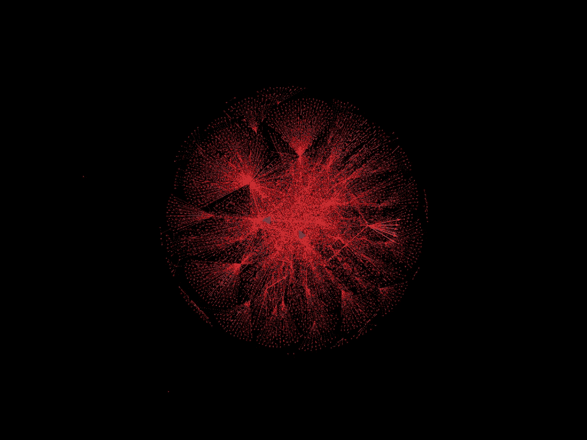
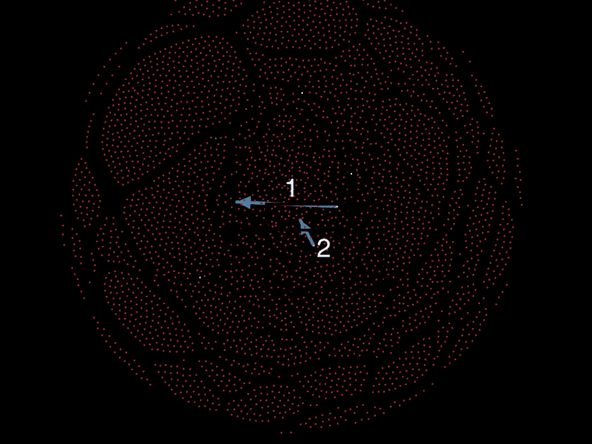
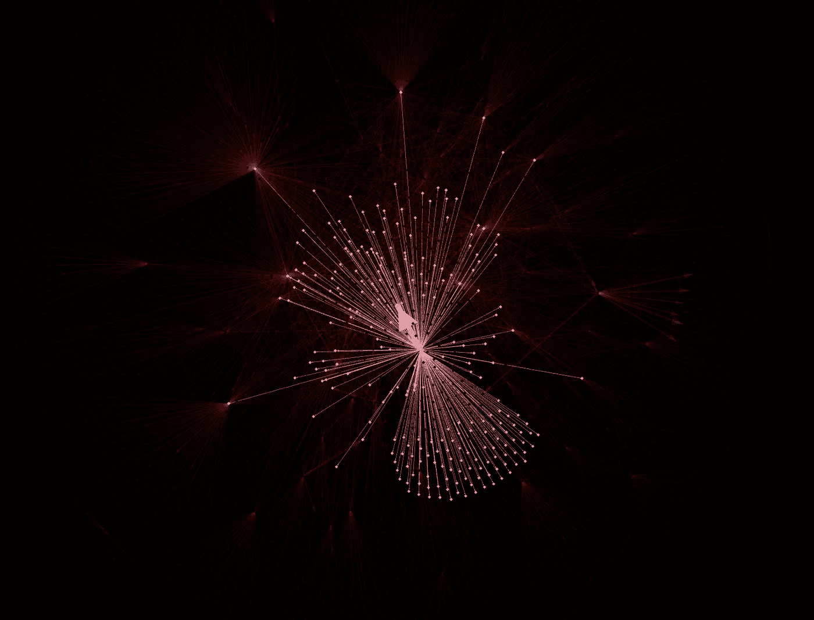
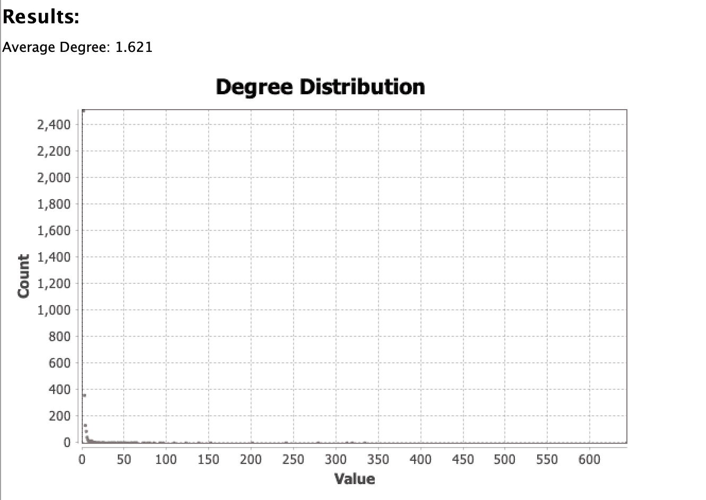
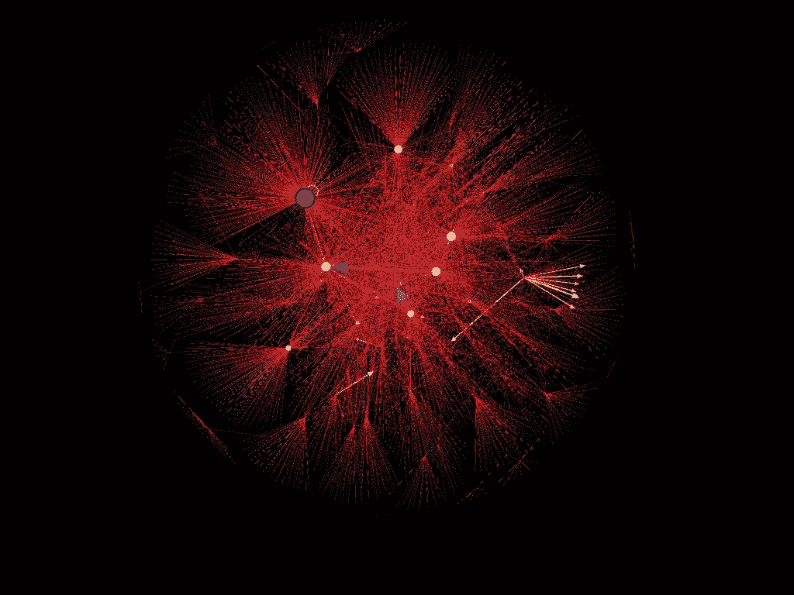
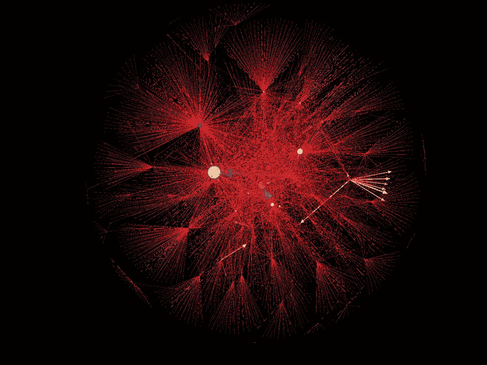
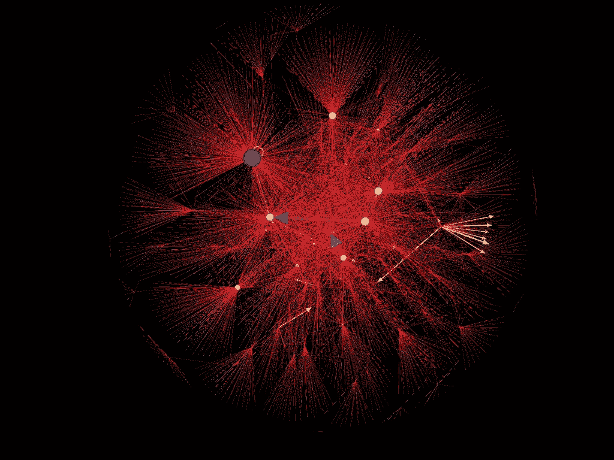

# ISIS 如何使用推特

> 原文：<https://towardsdatascience.com/how-isis-uses-twitter-10065790354a?source=collection_archive---------37----------------------->

## 利用社交网络分析了解伊斯兰国的推特网络

亲 ISIS 推特账户的社交网络图

# 介绍

伊拉克和黎凡特伊斯兰国(ISIL)，又称伊拉克和叙利亚伊斯兰国，是一个信奉逊尼派伊斯兰圣战主义的团体。2014 年，ISIS 在占领伊拉克主要城市后声名鹊起。自那以来，监控和防止 ISIS 的影响一直是美国和其他国家的一个关键目标。

多年来，ISIS 一直在利用社交网络传播其信息，并为其事业招募倡导者。从亲伊拉克和大叙利亚伊斯兰国的内容到处决等图像材料，互联网的使用一直是该恐怖组织的主要工具。这些社交网络甚至被用来招募来自美国、英国和加拿大等西方国家的成员。

了解支持 ISIS 的推特账户网络有助于发现谁是主要参与者，内容如何通过网络传播，并改善对 ISIS 活动的监控。

# 数据

用于这项分析的数据由数据社会网站 data.world 提供。该数据集收集于 2015 年至 2017 年，包含 100 多个亲 ISIS 账户的 1.7 万条推文。收集的功能包括:

**姓名、用户名、描述、位置、下载推文时的关注者数量、下载推文时用户的状态数量、推文的日期和时间戳以及推文本身**

数据集可以在[这里](https://data.world/data-society/how-isis-uses-twitter)找到。

为了构建 Twitter 账户的网络图，必须创建节点列表和边列表。该图表将通过提及来直观显示客户之间的联系。使用@符号后跟用户的用户名，将 Twitter 提及嵌入到推文的文本中。为了生成节点和边列表，使用 Python 脚本从 tweet 中提取提及，并在发布 tweet 的用户和被提及的用户之间创建边。然后将节点和边列表输入网络绘图程序 Gephi 进行分析。

# **分析**

节点和边列表被输入 Gephi 以生成一个图。图形节点按度数(与其他节点的连接数量)用红色->黄色->蓝色色标进行颜色编码。边缘按重量用红色->黄色->蓝色色标进行颜色编码。Fruchterman Reingold 布局函数用于组织图表的节点。结果图如下所示。

亲 ISIS 推特账户的社交网络图

从上图可以看出，节点和边的数量很大，很难提取有用的信息。然而，即使在这个尺度上，某些结构和关系也是可见的。可以用黄色和蓝色箭头看到几个高权重关系，表示 twitter 用户经常提到另一个特定用户。还可以看到几个 hub(指向许多其他节点的节点)和 authorities(从许多其他节点指向的节点)。让我们更仔细地看一下图表，以便获得更好的见解。

## 重量级关系

网络中存在几个高权重关系。其中，有两个非常高(用蓝色箭头表示)。这些关系在下面表示为关系 1 和关系 2。

高权重关系的网络图

关系 1 是从用户“mo********”到用户“Ra********”的定向关系。这种关系的权重为 195，是网络中最大的。

关系 2 是从用户“wa******”到用户“Ni********”的定向关系。这个关系的权重为 184，是网络中的第二大。

虽然这些关系示出了从一个特定用户到另一个特定用户的频繁提及，但这并不一定意味着所提及的用户对图表有很大影响。让我们仔细看看图表中的这些用户及其网络。

下图显示了用户“Ra********”的关系。

用户网络图' Ra******** '

如上图所示，用户“Ra********”似乎连接到了网络。由于许多关系指向节点的内部和外部，看起来“Ra********”充当网络中的中枢和权威。

下图显示了用户“mo********”的关系。

用户网络图' mo******* '

如上图所示，用户“mo********”看起来也很好地连接到了网络，并且在网络中充当集线器和权威。

下图显示了用户“wa******”的关系。

用户网络图' wa****** '

像前两个用户一样，用户“wa******”看起来很好地连接到网络，并且充当网络中的中枢和权威。

下图显示了用户“Ni********”的关系。

用户' Ni******** '网络图

与前面的三个用户不同，这个图显示了一个稍微不同的画面。虽然用户“Ni********”在网络中表现出相对良好的连接，但是其他三个用户表现出高得多的程度。

然而，如果没有基线来比较，这些用户的重要性就无法确立。为了获得网络中节点度数的基线，运行了度数统计报告。发现少量节点具有高度数，而许多节点具有低度数(如在无标度网络中所预期的)。结果如下所示。

节点度报告

网络中为数不多的几个中心和机构可能是关键成员，对于监测工作来说很重要。为了更好地可视化这些节点，它们的大小已经被缩放到它们的程度。该图如下所示。

节点大小按度数缩放的网络图

从上图中可以看出，图中有几个中心和机构(由大节点表示)。我们上面看到的四个节点中的三个也被发现了。

虽然这些节点既是中心又是权威，但这并不表示哪些节点是哪些节点。为了识别哪些节点是中心和机构，制作了两个图表，一个是根据出站关系缩放的节点大小，另一个是根据入站关系缩放的节点大小。这些图表如下所示。

节点大小按度数缩放的网络图(权威)

节点大小扩展到外部程度的网络图(集线器)

从上图中可以看出，通过入站和出站连接分离节点伸缩可以提供有用的信息。虽然枢纽和当局都有很高的地位，但它们在网络中的作用不同。高级别节点(权威)很可能是亲 ISIS 网络的关键成员，他们在网络内部拥有一定的权威。这些成员是主要的安全监控候选人。

另一方面，高出度节点(集线器)是在网络中传播信息的关键。这些成员在网络中联系紧密，在他们的推文中提到了许多人。

此外，其中一些中心似乎是帐户组与更大网络的少数几个连接之一。这些节点被称为桥。从网络中移除这些节点可以显著减小其大小，从而使这些关键帐户关闭。

**更新:现在有一篇“第二部分”文章使用社区检测******扩展了这一分析。****

# **讨论**

**亲 ISIS 推特账户的社交网络分析可以为改善安全监控和预防措施提供有价值的见解。确定网络中的关键权威使得监测工作能够更好地针对网络中最有影响力的人。此外，识别集线器可以为删除提供关键帐户，从而限制信息在网络中传播的有效性。**

**虽然该分析着眼于关系权重和节点度，但仍有进一步分析该社交网络的空间。可以分析额外的中心性度量，例如中间性、接近度和 PageRank。**

**本次分析使用的数据集是 2017 年编制的。由于 ISIS 等组织的快速移动性质，还可以收集新的数据集，以提供更适用于当前形势的见解。**