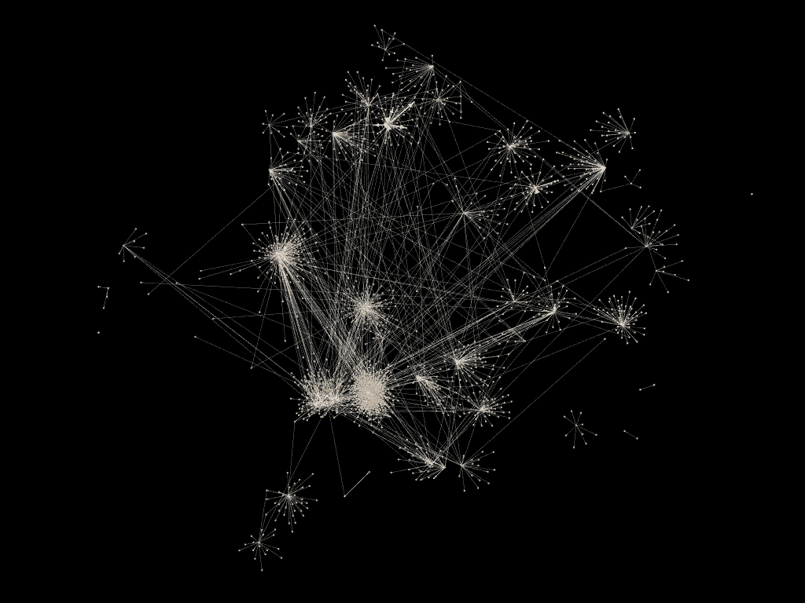

# ISIS 推特账户的社区检测

> 原文：<https://towardsdatascience.com/how-isis-uses-twitter-598c2eb188a2?source=collection_archive---------58----------------------->

## 使用社会网络分析和社区检测来理解亲 ISIS 的推特

亲 ISIS 的推特社区网络图

# 背景

这篇文章是上一篇文章的延续，使用社交网络分析技术探索亲 ISIS 的 twitter 账户。那篇文章可以在[这里](/how-isis-uses-twitter-10065790354a)找到。

伊拉克和黎凡特伊斯兰国(ISIL)，又称伊拉克和叙利亚伊斯兰国，是一个信奉逊尼派伊斯兰圣战主义的团体。2014 年，ISIS 在占领伊拉克主要城市后声名鹊起。自那以来，监控和防止 ISIS 的影响一直是美国和其他国家的一个关键目标。

多年来，ISIS 一直在利用社交网络传播其信息，并为其事业招募倡导者。从支持伊斯兰国的内容到处决等图像材料，互联网的使用一直是该恐怖组织的主要工具。这些社交网络甚至被用来招募来自美国、英国和加拿大等西方国家的成员。

了解支持 ISIS 的推特账户网络有助于发现谁是主要参与者，内容如何通过网络传播，并改善对 ISIS 活动的监控。

# 数据

使用的数据集和数据预处理措施与之前使用的相同。下面再次概述了这一过程。

用于这项分析的数据由数据社会网站 data.world 提供。该数据集收集于 2015 年至 2017 年，包含 100 多个亲 ISIS 账户的 1.7 万条推文。收集的功能包括:

**姓名、用户名、描述、位置、下载推文时的关注者数量、下载推文时用户的状态数量、推文的日期和时间戳以及推文本身**

数据集可以在[这里](https://data.world/data-society/how-isis-uses-twitter)找到。

为了构建 Twitter 账户的网络图，必须创建节点列表和边列表。该图表将通过提及来直观显示客户之间的联系。使用@符号后跟用户的用户名，将 Twitter 提及嵌入到推文的文本中。为了生成节点和边列表，使用 Python 脚本从 tweet 中提取提及，并在发布 tweet 的用户和被提及的用户之间创建边。然后将节点和边列表输入网络绘图程序 Gephi 进行分析。

# 社区检测

为了识别亲 ISIS Twitter 社区中的不同子社区，使用了 Gephi 中的社区检测算法。该算法被设置为使用权重和随机化。此外，使用分辨率为 1，这决定了社区的数量。

社区检测算法将节点分类为十七个社区中的一个。为了可视化这些社区，节点根据其分类社区进行颜色编码。该图是使用 OpenOrd 布局函数组织的。生成的图表如下所示。

亲 ISIS 的推特社区网络图

从上图中可以看出，似乎有几个社区构成了网络的主要部分。让我们分别来看看这些社区。

社区 5 是网络中最大的社区，包含 43.15%的节点。这个群落用蓝绿色表示，可以在下面单独看到。

社区 5 的网络图(Teal)

社区 11 是网络中第二大社区，包含 14.68%的节点。该社区中包含的节点的百分比远小于最大的社区——社区 5。这意味着该网络由一个占主导地位的社区组成，其中包括许多与之相联系的较小社区。群落 11 用橙色表示，可以在下面单独看到。

社区 11 的图表(橙色)

移除网络中最大的社区(社区 5)可以更容易地分析较小的社区。下面可以看到这个图。

不包括社区 5 的社区图

即使去掉了社区 5，较小的社区看起来仍然联系得比较好。但是，有几个社区完全从图中分离出来，称为连通分量。这些是社区 15、8、13、10、17 和 16。下图仅显示了这些社区。

社区 15、8、13、10、17 和 16 的图表

# 讨论

了解网络中最有影响力的社区有助于限制信息通过网络传播的能力。例如，将属于小的连接组件的节点作为目标可能对整个网络没有什么影响。当与第一部分中的节点中心性分析相结合时，这变得更加强大，以便从重要的社区中识别出要从网络中移除的关键参与者。