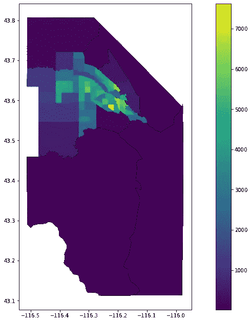
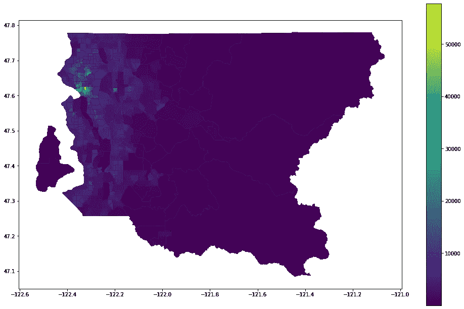
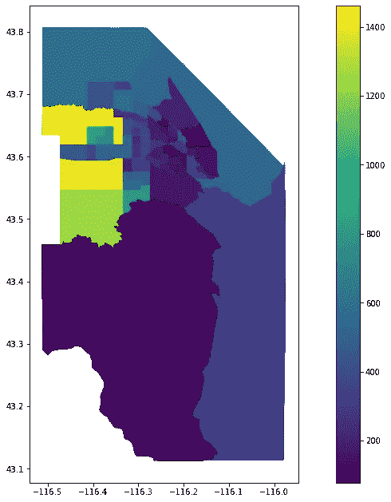
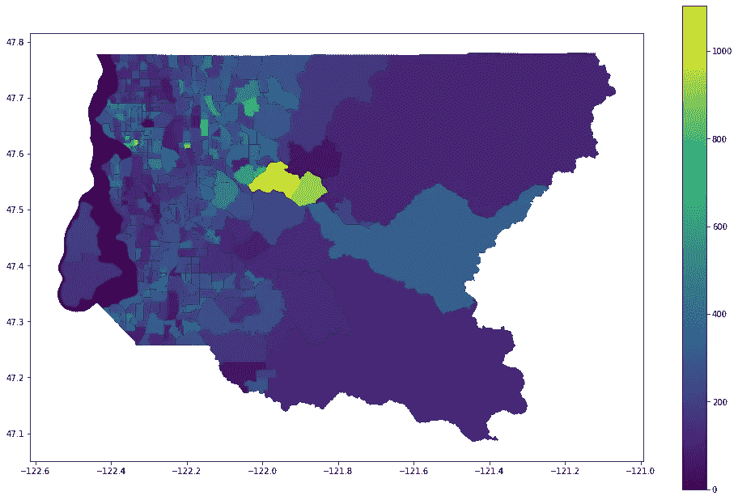
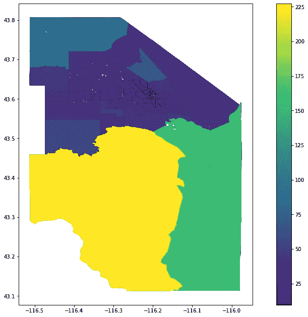
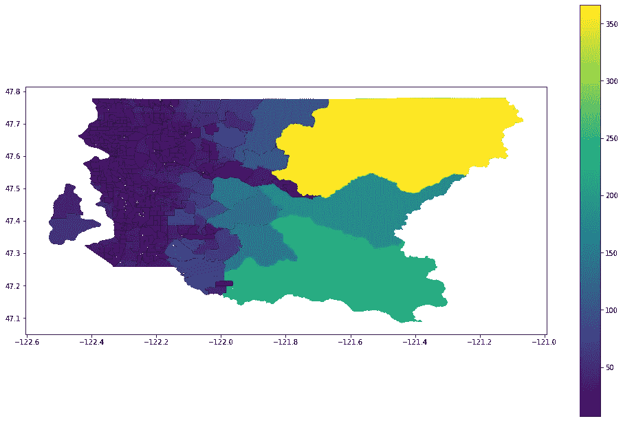
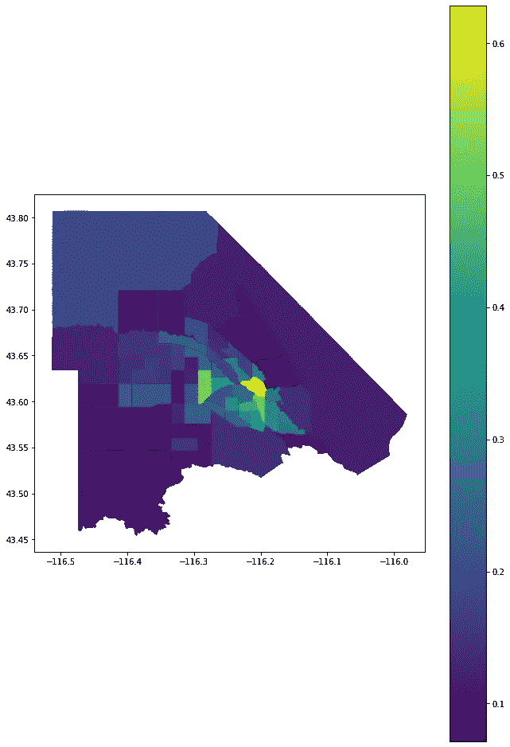
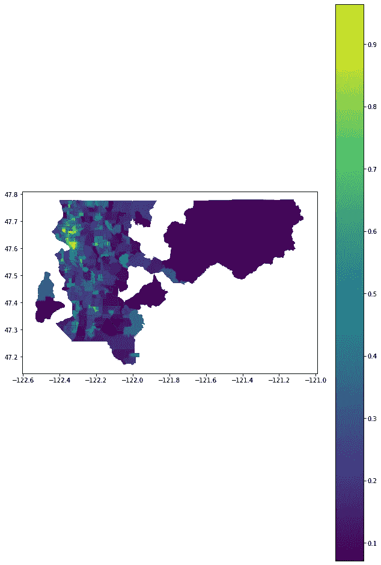
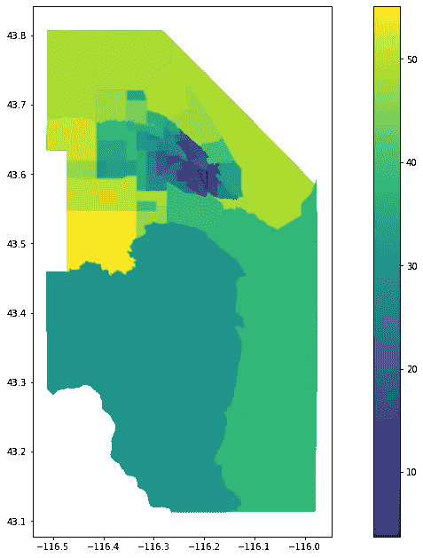
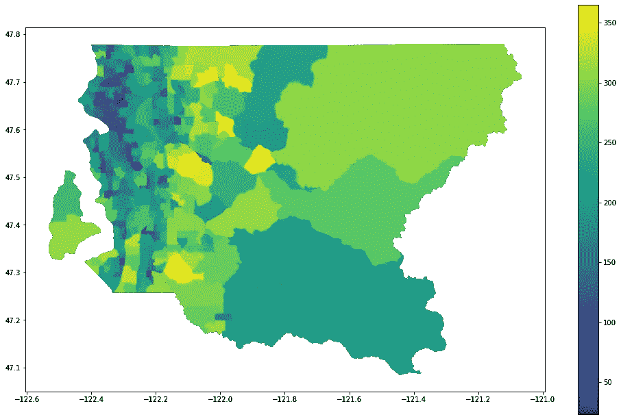

# 你的邻居简·雅各布斯怎么样？熊猫、开放街道地图和美国人口普查的分析——第一部分

> 原文：<https://towardsdatascience.com/how-jane-jacobs-y-is-your-neighborhood-65d678001c0d?source=collection_archive---------41----------------------->

## 基于熊猫、开放街道地图和美国人口普查的《美国大城市的死与生》的城市设计分析

在《美国大城市的生与死》中，伟大的简·雅各布斯展示了一个好社区的四个基本特征:

*   密度
*   多种用途的混合
*   建筑年代、类型和状况的混合
*   由短而相连的街区组成的街道网络

当然，她对所有这些进行了更详细的描述，但我不会涉及所有的街头见闻。相反，我要去寻找有合适的“骨骼”来建造伟大的都市生活的社区。与大多数地理空间规划工具一样，需要注意的是，不要盲目信任它。有很多细节需要实地关注。

在数据上。

# 工具

对于这个项目，我将使用下面的导入语句:

要用 Census API 启动一个会话，您需要给它一个密钥(在这里得到一个)。为了方便起见，我还将启动我的 OSM 工具，定义几个投影，并为我感兴趣的位置创建一些字典:

这两个国家很有意思，因为它们都经历了战后的显著增长，并拥有广泛的发展模式。作为一名前博伊西居民，我非常了解阿达县，并能提供实地的见解。King County 拥有一个强大的数据平台，可以在本分析的第二部分提供不同的见解。

## 密度

我们会从简单开始。美国人口普查局定期发布人口估计，所以我们只需将这些数据进行一些几何运算，就能知道有多少人生活在不同的地区。我要使用的所有数据可用的最小地理区域是区域，所以这就是我们要得到的。

现在我有了地理信息，我只需要得到人口来计算密度。显然，人口普查表是‘b 01003 _ 001 e’。下面是按县查询该表的函数:

既然我们有了包含人口的数据框架和包含区域的地理数据框架，我们只需将它们合并在一起:

这个函数更一般化一些，这样我们就可以将几何添加到人口以外的其他数据中，我们将在后面看到。

现在我们可以简单地调用我们的函数并绘制结果:

# 建筑年代的混合

下一个最复杂的搜索是在每个区域内找到不同的建筑年代。幸运的是，人口普查有一些足够接近的数据。他们通过十年的建造时间来追踪小区内的房龄。首先，我们将从这些表名中创建一个字典:

接下来，创建一个函数，将所有这些组合成一个数据帧。由于 Jane-Jacobsy-est 区域在每十年内最接近相等，因此最简单的度量标准是标准差，最低值为最佳值:

同样，我们只需调用我们的函数并绘制结果:

# 由短的相互连接的块组成的网络

现在我们开始变得复杂。幸运的是，由于有了 [osmnx](https://github.com/gboeing/osmnx) Python 包，我们可以领先一步。我们将使用 graph_from_polygon 函数获取每个人口普查区域内的街道网络，然后使用 basic_stats 包获取平均街道长度和每个交叉路口的平均街道数量，即网络分析术语中的“节点”。然而，在我们这样做之前，我们需要解决我们的网络的一个问题:OpenStreetMap 将停车场车道作为街道网络的一部分，这将扭曲我们的结果，因为这些往往相对较短，至少在地面停车场的内部连接。为了解决这个问题，我们将查询该县的所有停车场，然后将它们从我们的小册子中排除，以获得一些瑞士奶酪小册子。首先，函数查询 OSM 的东西，一般化，因为我们将在下一节大量使用它:

要获得免停车区域:

这不会是一个完美的解决方案，因为很多停车场并没有这样的标签，但它至少会排除很多这样的停车场。现在，我们可以创建一个函数来迭代每个区域，并获得一个“街道分数”，我将它定义为区域内街道的平均长度除以每个十字路口的街道数量:

这需要一段时间，所以我包括了一个进度条和地图输出，让我在等待时开心。还有一些区域没有街道(我假设是普吉特湾)，因此有了 try/except。现在我们调用这个函数:

## 多种用途的混合

现在是分析中最复杂的部分。以下是我的总体计划:

1.  在 OpenStreetMap 中查询“15 分钟街区”所需的所有组件:

*   办公室
*   公园
*   酒吧
*   餐馆
*   咖啡店
*   图书馆
*   学校
*   银行
*   医生办公室
*   药房
*   邮局
*   杂货店
*   五金店

2.获取每个普查区域内的点的样本

3.计算每个样本点步行距离内的所有邻域要素

4.获取该区域内所有点的步行距离内必需品的平均数量。

我们将从上面我用来查找停车场的 osm_query 函数开始，以获取给定地理区域内的所有社区要素。由于 OSM 是开放源代码和可编辑的，有一些数据需要解决。首先，有些人为某些事物放置点地理，而其他人放置建筑物的区域。这就是函数中有 poly_to_point 选项的原因，如果我们需要，可以将所有这些点标准化为点。天桥 API 几何图形的原始输出是一个坐标字典，因此我们需要将它们转换成形状良好的几何图形，以便输入 GeoPandas:

我们希望这些数据出现在一个单独的列中，因此我们合并了输出:

现在，我们终于准备好购买我们的邻里必需品了:

接下来，我们需要获得一组随机点进行搜索:

接下来，我们将通过我们的步行距离来缓冲我们的点，我将它设置为 1 公里。如果我们想变得更有趣，我们可以使用 walksheds，但是这种分析本身就需要大量的处理器，所以我将选择坚持使用欧几里德距离。然后，我们将获取缓冲区内的所有邻域要素，并计算步行距离内要素的百分比:

这让我们“接近”了一个区域。我们现在需要遍历该县的所有区域:

现在我们可以调用我们的函数来获得我们的分析:

## 把所有的放在一起

我们现在有了简·雅各布斯的每个优质社区因素的分数。我更感兴趣的是比较县内的区域，而不是比较县本身，因此我将简单地对每个区域的得分进行排名，并取平均值以获得“简·雅各布指数”(JJI):

为了查看我们做了什么，我们将使用之前制作的四个数据帧来调用函数:

最后，对于酷点，我们将使用叶创建一个交互式地图:

以下是两个新创建地图的链接:

[爱达县](https://bcparker21.github.io/jane_jacobs_index/ada_map.html)

[郡王](https://bcparker21.github.io/jane_jacobs_index/king_map.html)

这一切意味着什么？我们将在[第二部](https://medium.com/analytics-vidhya/the-jane-jacobs-index-part-ii-testing-610e2e963983)中深入探讨这个问题……